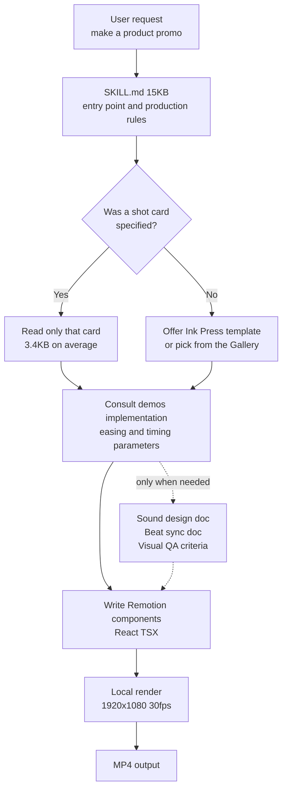

Can you hand a product promo video to an agent? This time we answer with numbers from a render we ran ourselves. A finished 1920x1080 promo running 36.17 seconds came out of a 12-core MacBook in 22.76 seconds. That is faster than the video plays back. The part worth studying, though, is not the render speed. It is how the skill that produces this result is packaged.

## Why read this

This post is for platform engineers who want to hand repeatable deliverables to an agent, and for anyone designing an internal skill catalog. If your goal is marketing video production itself, you will get less out of it than someone who wants to see what a well-built agent skill looks like and port that shape into their own. The core conclusion is this: video-shotcraft collected 1,387 stars in five days and passed 2,000 the following week not because the motion is pretty, but because it folds 1.33MB of cinematography knowledge behind a single 15KB entry point. That structure transfers to any domain skill, video or not.

## Overview

video-shotcraft is one of the fastest-growing repositories in the agent skill ecosystem right now. Per the GitHub API at the time we checked, the repository was created on 19 July 2026 and, eight days later on 27 July, showed 2,098 stars and 182 forks. It is Apache-2.0 licensed and written mainly in TypeScript. The last push landed the same day, so the project is still under active work.

What the skill does fits in one sentence. It turns an agent such as Claude Code or Codex into a motion design studio: point it at your product screens and it storyboards, animates, designs sound, and renders video through Remotion. Remotion is a framework that renders React components into video frames. In other words, the project reduces video production to the thing agents are good at, which is writing code.

Two reasons drew us to it. First, we already run hyperframes and video-producer style skills internally, so we needed a comparison baseline. Second, and this matters more, the fact that a local-render-only project drew this much attention without any GPU cloud says something about lightweight skill distribution strategy. So we cloned the repository into an isolated worktree and rendered the template all the way through.

## What the tool is

The backbone of video-shotcraft is the shot recipe card. Each card documents one motion technique: its purpose, energy level, suggested duration, parameters, implementation notes, and known pitfalls. The agent takes the user's description, picks suitable cards, consults the matching Remotion implementation, and writes the actual components.

Counting the files in our clone, there are 104 cards spread across 10 functional categories. The distribution is 15 transitions, 15 UI entrances, 14 typography, 11 interaction, 10 effects, 10 rhythm, 9 opening, 8 data, 7 camera, and 5 outro. Note that the repository description still says 106 cards, while both the README and the actual file count say 104. This looks like ordinary drift between docs, and the figures in this post come from counting the cloned files.

There is more than cards. Each card has a matching Remotion implementation, and the demos directory holds 153 TSX files carrying the real easing and timing parameters. Audio assets consist of 5 background tracks and 149 sound effects organized into 16 scene categories. The documentation explicitly instructs you to pick the sound category first and the timbre second, which keeps the agent from grabbing effects at random.

Here the structure gets interesting. The whole repository is 92MB. Reference documentation alone spans 111 files at 454,668 bytes, and the demo implementations add 905,392 bytes. Documentation plus implementation exceeds 1.3MB. Yet SKILL.md, the entry point the agent reads first, is 203 lines and 15,238 bytes. Roughly 1.1 percent of the total knowledge bundle is always exposed; the rest is reached by path when needed.

The document layout follows the same principle. The repository keeps the production pipeline, reusable video structures, visual QA criteria, background music analysis with beat-sync methodology, and sound design guidance in separate files. The agent reads the pipeline document when storyboarding, the sound document when scoring, and the QA criteria at final check. Compare that with piling everything into one file that gets read whole every time, and the context budget looks very different.



An average card is about 3.4KB. So instead of loading all 104 into context, the agent reads the three or four it needs. The principle we keep repeating internally, that capability belongs in thick skills rather than a thick harness while per-session cost stays minimal, is implemented directly in this repository layout.

## Installation and integration

There are three install paths. The most direct is to hand the repository link to your agent.

```text
Install this skill for me: https://github.com/Vincentwei1021/video-shotcraft
```

The agent clones it and links it into your skills directory. There is also a skills CLI.

```bash
npx skills add Vincentwei1021/video-shotcraft
```

Manual installation is a clone plus a symlink.

```bash
git clone https://github.com/Vincentwei1021/video-shotcraft.git
cd video-shotcraft
ln -s "$(pwd)" ~/.claude/skills/video-shotcraft   # Claude Code
ln -s "$(pwd)" ~/.codex/skills/video-shotcraft    # Codex
```

For reproducibility we worked inside an isolated worktree. The experiment ran in a temporary worktree that never touches the main working tree, and only the result logs were kept outside the repository.

```bash
bash scripts/blog/impl_sandbox.sh setup video-shotcraft-agent-video-skill
bash scripts/blog/impl_sandbox.sh run video-shotcraft-agent-video-skill -- \
  git clone --depth 1 https://github.com/Vincentwei1021/video-shotcraft.git vs
```

The template's dependencies are lean. Per package.json, remotion and @remotion/cli are at 4.0.484, react and react-dom at 19.2.7, and TypeScript is on the 6 line. There are only three scripts: run the studio, render the full video, extract a still.

```json
{
  "scripts": {
    "dev": "remotion studio src/index.ts",
    "render": "remotion render src/index.ts AiflPromo out/promo.mp4",
    "still": "remotion still src/index.ts AiflPromo"
  },
  "dependencies": {
    "@remotion/cli": "4.0.484",
    "react": "19.2.7",
    "react-dom": "19.2.7",
    "remotion": "4.0.484"
  }
}
```

## Measured results

The measurement environment was a 12-core Apple Silicon MacBook running Node v24.1.0. Every number comes from captured run logs.

We started by listing compositions. The AiflPromo composition the template exposes is 30fps at 1920x1080, 1085 frames total, which is 36.17 seconds. That matches the 36.2 seconds the README claims.

```text
The following compositions are available:
AiflPromo    30      1920x1080      1085 (36.17 sec)
```

Installing dependencies took 1.73 seconds for 230 packages. The npm cache was already warm, so a first-time install takes longer. Code bundling took 446 milliseconds.

Pulling a single still frame took 10.11 seconds. That figure includes cold bundling, so later renders reuse the cached bundle and run faster. The resulting PNG was 85,379 bytes.

```bash
npx remotion still src/index.ts AiflPromo out/frame.png --frame=60 --concurrency=1
# real  0m10.110s
```

With concurrency pinned to 1, a 90-frame clip took 5.68 seconds, which is 15.8 frames per second. Then we rendered all 1085 frames with no concurrency limit and it finished in 22.76 seconds, or 47.7 frames per second. For a 30fps video that is 1.59 times realtime. The final MP4 was 20.7MB.

```bash
npx remotion render src/index.ts AiflPromo out/promo.mp4
# Encoded 1085/1085
# + out/promo.mp4 20.7 MB
# real  0m22.758s
```


Measured wall-clock time per pipeline stage and render throughput. The red dashed line marks the 30fps realtime baseline.

The practical meaning is clear. The edit-and-re-render cycle for a 36-second product promo sits under 30 seconds. You can change one line of copy and see the result without walking away for coffee. No GPU is involved and no external video generation API is billed. Rendering is entirely CPU bound and stays local.

That said, the three headless pitfalls the repository documents remain real. On Linux servers with few cores the concurrency ceiling is 2, so you must pass `--concurrency=1`. Recent Chrome dropped old headless mode, so pointing Remotion at the system Chromium fails to launch and you need a chrome-headless-shell binary. And on networks where the remotion.media CDN is blocked, the automatic headless shell download is refused, so you must point at a browser with `--browser-executable`. Our measurements ran locally on a MacBook, so we hit none of these, which also means we did not verify reproduction on Linux CI.

## What this means for ThakiCloud

What we take from this experiment is not the video but the skill packaging. Paxis is ThakiCloud's Agent-Native Cloud, a control plane that treats Skills, Tools, Policies, and Audit Logs as first-class resources. It selects from more than 960 skills with BM25, executes them in isolated sandboxes, and passes every action through policy gates and audit logs. As the catalog grows, the cost of always exposing all of it becomes the problem, and video-shotcraft is a good reference for solving exactly that.

Three things are worth porting. First, the ratio between entry point and body. Folding 1.3MB behind a 15KB entry, about 1.1 percent, minimizes what the skill router pays while choosing candidates yet still delivers thick knowledge once a skill is selected. Second, card-level modularity. One file per technique, averaging 3.4KB, lets the agent pick up exactly what it needs. Third, making a validated finished template the default path. When the user specifies nothing, the skill first proposes an already-validated template, which is the same idea as our own discipline of demoting free design into filling in a validated skeleton to raise average quality.

There is an ai-platform angle too. This workload uses CPU, not GPU. If you need to batch out dozens of marketing videos, it parallelizes well as Kubernetes jobs and never occupies the GPU queue, so it does not contend with training and inference workloads. From the perspective of the multi-tenant cluster we operate, this is the kind of job that expensive accelerators can stay free of while idle CPU nodes absorb it.

A comparison with our own video skills remains homework. The hyperframes and video-producer line is stronger on pipeline orchestration and multilingual narration, but there is a real gap in the density of the shot technique catalog against 104 cards. Documenting techniques as cards is something we can borrow directly.

## Limits and counterarguments

First, this tool is not universal. Its scope targets web and desktop product promos. It does not fit editing live-action footage or videos with people in them, and its strength shows only in screen captures and UI motion.

License deserves attention. The repository itself is Apache-2.0, but Remotion, which does the rendering, carries its own license. It is free for individuals and small teams while companies may need a paid license. If you are evaluating internal adoption, do not judge from the repository license alone; check the Remotion terms first. The bundled audio assets follow their own license conditions too, and the repository tracks sources and terms in a separate document.

The product screenshots inside the template are demonstration assets. The repository documentation says to replace them with your target product's screens before publishing and to verify whether any product, customer, or personal data needs anonymizing. Skip that warning and someone else's demo screens end up in your promo video.

The provenance of the techniques is also worth noting. The repository states that the motion language in its cards was distilled by studying official product films from several companies. It also states clearly that what is documented is technique, meaning timing, easing, and choreography, and that no footage, artwork, or brand assets from those films are included. It notes that none of those companies are affiliated with the project. If you plan a similar technique catalog internally, that line between documenting technique and copying assets is worth copying as is.

Finally, the limits of our own experiment. We rendered an already-finished template. We did not measure the full path where the agent storyboards from scratch, selects cards, and composes a new video. Render speed is measured, but the quality of what an agent produces is outside what this post verified. Headless rendering on Linux CI is likewise only relayed from the documentation, not reproduced.

## Wrapping up

If we compress the practical lesson into one sentence: agent skills sell not because they have many features, but because they fold a lot of knowledge precisely behind a thin entry point. video-shotcraft holds 104 shot cards, 153 implementations, and 149 sound effects, yet shows the agent only 15KB first. And the result is a 36.17-second 1080p video produced locally in 22.76 seconds.

If you are growing an internal skill catalog, measure the size ratio between the entry file and the reference body the next time you write a skill. If that ratio is in the double-digit percentages, it will cause a cost problem as the catalog grows. Splitting one file per technique and making a validated finished template the default path solves much of it. That is the most useful conclusion from this measurement.

## Sources

- video-shotcraft repository on GitHub (<https://github.com/Vincentwei1021/video-shotcraft>)
- video-shotcraft README, as of 2026-07-27 (<https://raw.githubusercontent.com/Vincentwei1021/video-shotcraft/main/README.md>)
- Shot card and motion preview gallery (<https://vincentwei1021.github.io/video-shotcraft/>)
- Remotion official site and license (<https://www.remotion.dev/>)
- Experiment logs: `outputs/blog-impl/video-shotcraft-agent-video-skill/run-1.log` through `run-8.log`
