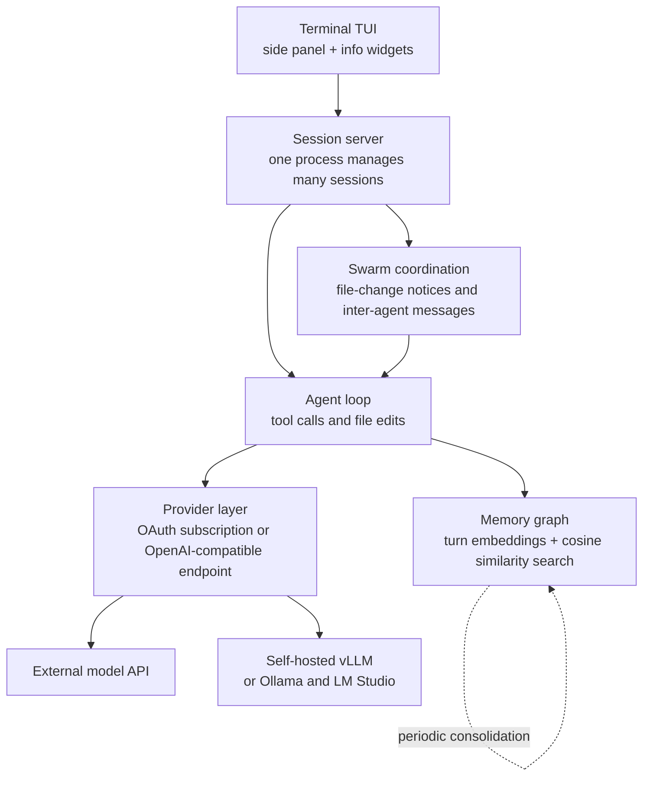

Reading that a coding agent boots 245 times faster than Claude Code triggers two reactions at once: curiosity and suspicion. So we downloaded the official release binary, verified its checksum, and measured it on one of our MacBooks. The short answer is that 245x is true and the 5.8x we measured is also true, because the two numbers measure different things.


## Why this matters

This post is for platform engineers who run several coding agents at once, or who are designing an agent harness themselves. It is less useful if you are simply picking a CLI, and more useful if you want to understand how a harness's resource profile decides how many sessions you can realistically run. The conclusion up front: the lesson from jcode is not the 245x speed figure, it is that the marginal cost of adding one more session has been pushed down to roughly 10MB. That number is what makes running many agents in parallel viable in practice.

## Overview

jcode is an open-source coding agent harness written in Rust. According to the GitHub API at the time we checked, the repository was created on 5 January 2026 and has 12,097 stars and 1,334 forks. It is MIT licensed, primarily Rust, and was last pushed on 27 July 2026. There are 136 open issues.

The release cadence stands out. Between v0.56.0 on 24 July and v0.61.0 on 27 July, five releases shipped in four days, passing through v0.57.0, v0.58.0 and v0.60.0. The repository description is a single line: "The most RAM efficient harness". That line tells you everything about what the project optimizes for.

We looked at this project less for the benchmark itself than for the question underneath it. Starting one agent is cheap enough now. Starting ten at the same time is still expensive. A harness that consumes more than 200MB per session will fill a laptop with nothing but agents. We wanted to see what numbers an implementation actually produces when it attacks that bottleneck head on.

## What this tool is

jcode does not build models. It is the execution shell, the harness, that sits in front of a model and handles tool calls, file edits and session management. You keep using the models you already subscribe to, and the housekeeping around them has been rewritten in Rust.

Simplified, the structure looks like this.



Three parts are distinctive.

The first is memory. jcode embeds every turn and response into a vector graph, then on each subsequent turn retrieves related memories by cosine similarity and folds them into the conversation. Relevant context arrives without the agent explicitly calling a memory tool. Extraction runs in a separate side agent when semantic drift is detected, after a set number of turns, or at session end, and the accumulated graph is periodically reorganized so that stale or conflicting entries get cleaned up. Explicit memory search and store tools are available as well.

The second is the swarm. Start two or more agents in the same repository and the server manages them together. If agent A edits a file that agent B has already read, the server tells B. B can ignore that if it is irrelevant, or inspect the diff to avoid a conflict. Agents can message a specific peer or broadcast to everyone, and an agent can spawn its own teammates to split work. When it does, the original agent becomes the coordinator and the spawned ones become workers.

The third is rendering. The side panel can hold a file that updates live or act as a diff viewer, and both the panel and the chat render mermaid diagrams inline. To make that possible the author wrote a separate mermaid rendering library with no browser or TypeScript dependency. Info widgets, which only occupy screen space that would otherwise go unused, come from the same design instinct.

Something else worth noting is how much of the stack the author built rather than imported. The mermaid renderer is one case, and the terminal is another. A custom scrollback implementation runs into a terminal-level limit on smooth partial-line scrolling, so the author is building a terminal with a native scroll API. That work is still in progress, and scrolling behaves normally on ordinary terminals in the meantime. These choices are consistent with keeping dependencies small and startup cheap, but they also concentrate a lot of maintenance surface on one person.

Provider support is broad. Subscription-backed OAuth logins are built in for Claude, OpenAI, Gemini, GitHub Copilot, Azure and the Alibaba coding plan, and services like OpenRouter, DeepSeek and Moonshot are available as named profiles. The local runtimes Ollama and LM Studio work the same way. For headless or SSH sessions there is a two-step flow that prints an auth URL instead of launching a browser, then completes later with a callback or code, which is handy when a script has to handle login.

MCP configuration lives in its own file, with a compatibility path that reads Claude Code's config directly. On first run it imports your existing setup, so migration cost is low. Note that only stdio MCP servers are supported today. HTTP and SSE entries are recognized, logged and skipped, so check that constraint first if your setup depends on remote MCP servers.

## Installing and integrating

The official path is an install script.

```bash
# macOS, Linux
curl -fsSL https://jcode.sh/install | bash

# Windows 11 (PowerShell 5.1+)
irm https://jcode.sh/install.ps1 | iex
```

For a reproducible measurement we downloaded the release binary directly instead and compared it against the published checksum.

```bash
BASE=https://github.com/1jehuang/jcode/releases/download/v0.61.0
curl -fsSLO $BASE/jcode-macos-aarch64.tar.gz
curl -fsSLO $BASE/SHA256SUMS
shasum -a 256 jcode-macos-aarch64.tar.gz
# b0c87b6aad07c27d40cadcc426665e3ed07fb924e3e632fb961568443029491b
tar xzf jcode-macos-aarch64.tar.gz
./jcode-macos-aarch64 --version
# jcode v0.61.0 (c5009da0)
```

The macOS arm64 tarball was 44,980,570 bytes, and the SHA256 we computed matched the published value.

The path to an in-house model server is worth knowing too. jcode treats any OpenAI-compatible endpoint as a single provider type, so an environment serving models with vLLM needs only one profile.

```bash
jcode provider add local-vllm \
  --base-url http://localhost:8000/v1 \
  --model Qwen/Qwen3-Coder-30B-A3B-Instruct \
  --no-api-key \
  --set-default
```

For an internal gateway that requires a key, pass it on standard input so it stays out of shell history.

```bash
printf '%s' "$MY_API_KEY" | jcode provider add my-api \
  --base-url https://llm.example.com/v1 \
  --model my-model-id \
  --api-key-stdin \
  --set-default --json

jcode --provider-profile my-api auth-test --prompt 'Reply exactly JCODE_PROVIDER_SETUP_OK'
```

Configuration accumulates in `~/.jcode/config.toml`. If your endpoint does not return a usable model list, write the context window into the profile explicitly. Leaving it blank makes the harness fall back to a generic default, which can diverge from your model's real limit.

## What we measured

The environment was Darwin 25.5.0, arm64, a 12-core MacBook. In an isolated worktree we fetched and verified the binary, then timed process start to `--version` output across 12 runs, discarding the first two as disk-cache warmup. Peak resident memory was measured separately for each process with `/usr/bin/time -l`, three runs each.


| Metric | jcode v0.61.0 | Claude Code CLI | Ratio |
|---|---:|---:|---:|
| Warm startup, median | 7.1 ms | 41.5 ms | 5.8x |
| Warm startup, min to max | 6.4 to 11.3 ms | 40.0 to 42.3 ms | |
| First run, cold | 25.4 ms | 41.3 ms | 1.6x |
| Peak resident memory | 16.9 MB | 217.0 MB | 12.8x |

No 245x here. That does not mean the project inflated anything. The published 245.5x figure comes from a Linux machine launching a pseudo-terminal ten times and timing until the TUI paints its first frame, where jcode took 14.0ms and Claude Code took 3,436.9ms. We measured the `--version` path of the same tools, which never brings up a TUI and simply prints a string. Different operating system, different measurement point.

Once you see that, the two numbers stop being contradictory. First-frame time includes terminal initialization, screen composition and initial state loading, and that is exactly the stretch where harnesses diverge. A `--version` call only exposes runtime boot cost. It also explains why Claude Code's `--version` was so stable in the low 40ms range, in contrast to its first-frame time in the repository's table swinging between 2,032.7ms and 8,927.2ms.

On memory, the repository's claims and our measurement point the same way. Our 16.9MB is in fact lower than the 27.8MB the repository reports with local embedding disabled. Our figure is the peak of a single `--version` run, though, which is not the same as an open session with an embedding model loaded. By the repository's table a single session with embedding on sits at 167.1MB, and each additional session costs about 10.4MB. In the same table Claude Code adds about 212.7MB per session.

That last value is the one that matters operationally. Running ten sessions at 10MB of marginal cost lands you around 100MB. At 210MB it passes 2GB. How many parallel agents a single laptop can hold is decided by that slope.

The repository's multi-session table makes the difference clearer. At one session, resident memory is 167.1MB for jcode and 386.6MB for Claude Code, a 2.3x gap. At ten sessions it becomes 260.8MB versus 2,300.6MB, and the gap widens to 8.8x. With local embedding off, ten sessions stay at 117.0MB. The difference in slope is far larger than the difference at the starting point, and that is what this project actually optimized.

We should be equally clear about what we did not measure. Input responsiveness after the first frame, file search speed in a large repository, steady-state memory with the embedding model loaded, and the quality of actual coding work all sit outside this measurement. The last one in particular is governed by the model you attach, not the harness, so no harness comparison can answer it. We set out to check one thing: whether the resource efficiency this project advertises is marketing copy or an implementation property. It is an implementation property.

## What this means for ThakiCloud

We read these results through two product lenses.

First, Paxis. Paxis is ThakiCloud's Agent-Native Cloud, which treats skills, tools, policies and audit logs as first-class resources. It selects from more than 960 skills with BM25, runs them in isolated sandboxes, and passes every action through a policy gate and an audit log. Two things jcode demonstrates connect directly to that design. One is keeping the marginal cost per session low. In an architecture that runs many agents in parallel, the slope of the added cost, not the absolute cost of a single session, sets the concurrency ceiling. The other is the swarm's file-change notification. When several agents work the same repository, telling an agent that a file it had read has changed is far cheaper than merging conflicts after the fact. There is room for the same signal in our DAG-based multi-agent execution.

One more thing about the swarm is that coordinator and worker roles are not fixed in advance. An agent spawns teammates when it decides it needs them and becomes the coordinator at that moment. That is the opposite direction from planning a DAG up front, and each approach wins in different situations. When the decomposition is clear beforehand, a DAG is safer and produces a cleaner audit trail. During exploration, branching at runtime is faster. In our environment, where actions pass a policy gate, the conclusion is that dynamic spawning can be allowed as long as the spawn itself is treated as an auditable action.

The memory design offers something too. jcode optionally has a side agent verify retrieved memories before they enter the conversation. Filtering for relevance rather than injecting whatever the search returns comes from the same motivation as our own hard character cap on the hot memory layer. Context is not free, and irrelevant memories burn tokens while clouding judgment.

Second, ai-platform. jcode's OpenAI-compatible provider path meshes immediately with in-house vLLM serving. ThakiCloud's ai-platform allocates GPUs on Kubernetes and Kueue and serves models with vLLM, and a client this light means the same GPU budget can absorb more developer sessions. The combination fits customers with on-premises or sovereignty requirements especially well, because model weights and inference endpoint both stay inside the customer boundary while developer machines only need a single binary of a few tens of megabytes. The short path to registering an internal gateway as a profile and setting it as the default helps on the deployment side too.

## Limits and counterarguments

Several things would stop us from recommending this project as-is.

The version is still 0.x. Five releases in four days is evidence of energy and also a sign that the surface keeps moving. The 136 open issues are natural at this stage, but it is early to freeze this as a standard internal tool.

The contribution path deserves a check. Repository settings restrict pull request creation to collaborators. The MIT license means forking and modifying are free, but the usual route for pushing an external fix upstream is not open. Plan for maintaining patches internally.

Default telemetry needs attention as well. Running `--version` alone prints a notice that anonymous usage statistics are collected. The stated scope is install count, version, operating system, session activity, tool call counts and exit reasons, and the notice says code, filenames and prompts are not included. Even so, review this behavior before adopting it in an air-gapped or regulated environment.

Our measurement has limits of its own. We timed the CLI startup path, while what shapes the actual development experience is responsiveness after the first frame and model latency. However fast the harness is, work dominated by token generation will not feel very different. Startup speed pays off when you restart agents frequently, call them repeatedly from scripts, or keep many sessions alive at once. Keep in mind as well that the tool versions in the benchmark table differ from those at our measurement time.

## Wrapping up

245x and 5.8x are both correct. The first timed a TUI's first frame on Linux, the second timed CLI startup on a MacBook. Before quoting any benchmark multiple, check what the number treats as the start and what it treats as the end.

If you take one thing from this post, watch the slope rather than the multiple. Whether adding one more session costs 10MB or 210MB decides whether running agents in parallel works on a laptop at all. If you are designing an in-house harness, try putting marginal cost per session on your dashboard next sprint instead of absolute memory. That is the same criterion we use to set the parallel execution ceiling in Paxis.

## Sources

- jcode repository: <https://github.com/1jehuang/jcode>
- jcode v0.61.0 release: <https://github.com/1jehuang/jcode/releases/tag/v0.61.0>
- jcode website and benchmarks: <https://jcode.sh>
- Repository metadata was retrieved from the GitHub REST API on 28 July 2026.
- Startup and memory figures are our own measurements in the environment described above.
