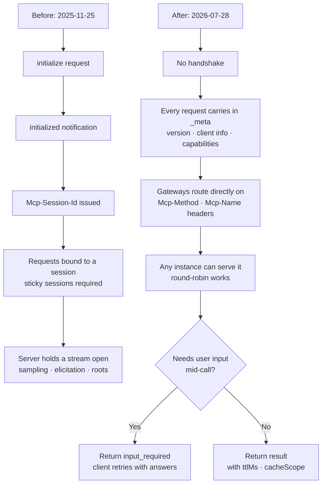

The 2026-07-28 revision of the MCP specification is out. The announcement calls it the largest change since launch, and the headline is that the protocol has become stateless. Rather than take that sentence at face value, we pulled both revisions of `schema.json` from the official repository and diffed them. RPC methods dropped from 27 to 20. Schema definitions lost 32 entries and gained 42. `InitializeRequest`, which appeared four times in the previous revision, appears zero times in this one.


## Why this matters

This post is for platform engineers already running an MCP server or about to deploy one, and for anyone designing the tool layer that in-house agents connect through. It will be more useful to someone estimating migration cost than to someone meeting MCP for the first time. The conclusion first: this revision is not a feature addition, it is **a change of deployment model**. With sessions gone, an MCP server can now sit behind a load balancer as several instances like any ordinary HTTP service, and the price is that anything you built on top of sessions needs rewriting. Both sides of that trade are clear enough that planning beats postponing.

## Overview

Over the past eighteen months MCP has become the standard path through which agents reach external data and tools. According to the announcement, Tier 1 SDKs see close to half a billion downloads a month, and the TypeScript and Python SDKs have each crossed a billion total.

At that scale, the same complaint kept surfacing in operations. MCP was originally a bidirectional stateful protocol. A client sent `initialize`, the server responded, a session opened, and its identifier rode along in the `Mcp-Session-Id` header on every subsequent request. For a single locally spawned process that design is fine. The moment you run several remote instances it is not. Requests in one session must reach the same instance, so you need sticky sessions; if an instance dies the session dies with it; and serverless was simply off the table.

The 2026-07-28 revision solves this at the protocol layer. Every request now describes itself. Protocol version, client identity, and client capabilities travel in `_meta` on each request. As a result, any request can land on any instance behind a plain round-robin load balancer.

## What this revision changes

The overall shape first:



Change by change:

**Handshake and sessions removed.** The `initialize` and `initialized` exchange is formally retired, and the `Mcp-Session-Id` header goes with it. A new `server/discover` RPC exists for clients that want to learn server capabilities up front, but it is not required. The announcement adds that this does not force your application to be stateless. If you need state, have a tool mint an explicit handle and let the model pass it back as an argument; the maintainers found that having the model see the handle and thread it between tools works better than hiding state in the transport.

**Multi Round-Trip Requests.** Previously, when a tool needed user confirmation mid-execution, the server sent a request to the client, which required a stream held open. Now the server returns `resultType: "input_required"` along with the questions it needs answered, and the client retries the original call with the answers in `inputResponses`. The direction was not reversed so much as unrolled into round trips.

**Header-based routing.** Streamable HTTP requests must now include the `Mcp-Method` and `Mcp-Name` headers. A gateway, rate limiter, or WAF can route and meter on those headers without parsing the JSON body.

```http
POST /mcp HTTP/1.1
MCP-Protocol-Version: 2026-07-28
Mcp-Method: tools/call
Mcp-Name: search

{"jsonrpc":"2.0","id":1,"method":"tools/call",
 "params":{"name":"search","arguments":{"q":"otters"},
 "_meta":{"io.modelcontextprotocol/clientInfo":{"name":"my-app","version":"1.0"}}}}
```

**Cacheable list results.** Responses from `tools/list`, `prompts/list`, `resources/list`, and `resources/read` now carry `ttlMs` and `cacheScope`, with a deterministic order. Clients can cache tool catalogs, and upstream prompt caches stop breaking on every reconnect.

**Authorization hardening.** Authorization servers should return the `iss` parameter per RFC 9207, and clients must validate it before redeeming a code, which closes an authorization-server mix-up hole. Client credentials are bound to the issuer that minted them and cannot be reused across authorization servers. Dynamic Client Registration is formally deprecated in favor of Client ID Metadata Documents, though the old path keeps working for now.

**Deprecations.** Roots, Sampling, and Logging are deprecated, as is the legacy HTTP+SSE transport. All keep working for at least twelve months, but new implementations should not adopt them. A formal deprecation policy introduced in this same revision guarantees that twelve-month minimum, so you can plan rather than react.

## What we actually measured

We checked how the announcement's summary is reflected in the schema files themselves. We fetched both revisions of `schema.json` from the `modelcontextprotocol/modelcontextprotocol` repository and wrote a script that tallies and compares RPC method constants and type definitions; it lives at `scripts/experiments/mcp-2026-07-28/schema_diff.py`.

To be honest up front: we did not install the new SDK and stand up a server, because package installation required separate approval in this environment. We confirmed via PyPI that the Python SDK `mcp` 2.0.0 has shipped, and everything below that was verified at the schema level.

The results:

```
schema bytes: 2025-11-25=101,793  2026-07-28=112,729
RPC methods: 27 -> 20 (-10 / +3)
schema definitions: 145 -> 155 (-32 / +42)
```

The ten removed methods are `notifications/initialized`, `logging/setLevel`, `resources/subscribe`, `resources/unsubscribe`, `notifications/elicitation/complete`, and four in the `tasks/` family. The three additions are `server/discover`, `subscriptions/listen`, and `notifications/subscriptions/acknowledged`.


The type definitions tell a richer story. Among the 32 removals sit `InitializeRequest`, `InitializeRequestParams`, `InitializeResult`, and `InitializedNotification` side by side, meaning the handshake left the specification entirely. `ServerRequest` disappearing belongs to the same thread, because the concept of a server sending requests to a client no longer exists. `SubscribeRequest`, `UnsubscribeRequest`, `SetLevelRequest`, and `RootsListChangedNotification` were cleared out with them. That even `PingRequest` is gone tells you there is no longer a connection whose liveness needs checking.

Eight definitions starting with `Task` vanishing together is a relocation rather than a deprecation. Tasks moved out of the experimental core into the `io.modelcontextprotocol/tasks` extension.

The 42 additions split cleanly by purpose. `InputRequest`, `InputRequests`, `InputRequiredResult`, `InputResponse`, and `InputResponses` are the types that make up MRTR. `CacheableResult` and the `ListToolsResultResponse` family are response wrappers for carrying cache hints. And `HeaderMismatchError`, `UnsupportedProtocolVersionError`, and `MissingRequiredClientCapabilityError` are error types absent from the previous revision, whose three names announce the new failure modes: headers disagreeing with the body, an unsupported protocol version arriving, or a request needing a client capability that was never declared. With no session, these checks happen on every request.

We also counted string occurrences:

| String | 2025-11-25 | 2026-07-28 |
|---|---|---|
| `InitializeRequest` | 4 | 0 |
| `initialized` | 1 | 0 |
| `clientInfo` | 2 | 1 |
| `inputResponses` | 0 | 4 |
| `ttlMs` | 0 | 14 |
| `cacheScope` | 0 | 14 |

That `ttlMs` and `cacheScope` each appear 14 times means cache hints were attached consistently across list-style responses rather than bolted onto one of them.

Worth adding: `Mcp-Session-Id`, `Mcp-Method`, and `Mcp-Name` return no hits in either revision. They are HTTP headers, specified in the transport document rather than in the JSON schema. So the exercise also confirmed that reading the schema alone leaves gaps.

## What this means for ThakiCloud

**Through the Paxis lens.** Paxis is ThakiCloud's Agent-Native Cloud control plane, treating Skills, Tools, Policies, and Audit Logs as first-class resources. MCP connectors are the front door through which external tools enter that structure. This revision matters to Paxis in three ways.

First, header-based routing fits policy gates well. With `Mcp-Method` and `Mcp-Name` in headers, we know which tool is being called through which method without parsing the body. Policy decisions that previously required unpacking JSON can be made with a header check, and the same values drop straight into audit logs.

Second, list caching lowers the cost of skill selection. Paxis selects from over 960 skills via BM25 and runs them in isolated sandboxes, and tool catalogs offered by external MCP servers are part of that selection pool. With `ttlMs` and `cacheScope` attached, catalogs no longer need refetching every time, and the deterministic ordering fixes the problem of upstream prompt caches breaking on reconnect.

Third, deprecating Sampling points the right way. A server asking a client to run a model inference is convenient, but from a policy gate's perspective it means inference happening outside the control line, which was awkward to govern. Consolidating on direct LLM provider integration collapses the call path back to one place.

**Through the ai-platform lens.** The practical payoff of statelessness shows up in deployment. ThakiCloud's ai-platform is Kubernetes-based, so an MCP server ultimately runs as pods. Until now session affinity forced sticky sessions at the ingress, a pod restart severed in-flight conversations, and scaling out with HPA gave you new pods that could not pick up existing sessions. With sessions gone, all of those constraints go too. An MCP server becomes an ordinary stateless workload, so rolling updates, autoscaling, and multi-zone placement are handled exactly like any other service. For customers running an MCP gateway on-premises or in air-gapped environments, this is a visible drop in operational difficulty.

## Limits and counterarguments

The largest cost is that this revision is a breaking change. Code that depended on session identifiers must be rewritten. A tool that needs to hold state has to be redesigned around explicit handles, and that is not a one-line transport fix but a change to the tool interface itself. A server using Sampling needs a new LLM call path, which moves cost and key management onto the server side.

Second, statelessness is not free. Every request now carries protocol version, client info, and capabilities, so per-request overhead grows. MRTR does the same: a confirmation that used to pass once over an open stream now costs two round trips. Workflows with frequent user confirmation may see added latency. State was not so much eliminated as moved into what each request carries.

Third, this analysis stops at the schema file. As established above, HTTP header rules do not live in the schema, and how the SDKs actually behave can only be learned by running code. To size a migration precisely, read the per-language SDK migration notes alongside this.

And the counterargument. For someone running a single MCP server locally over stdio, this revision offers essentially nothing. What it buys is remote deployment and horizontal scaling; outside that scenario only the migration cost remains. With a twelve-month runway, a local-first setup has little reason to hurry.

## Wrapping up

Reading the schema confirms the announcement but sharpens it. Four `InitializeRequest`-family definitions disappearing alongside `ServerRequest` and `PingRequest` means the concept of a connection left the specification, and the `InputResponses` family plus `ttlMs` and `cacheScope` moved into the vacated space. As stated at the top, this revision is a change of deployment model rather than a feature addition, and 32 removals against 42 additions in the schema show that change directly.

So there are two things to do now. If you operate an MCP server, grep your code for session identifiers, Sampling, and Roots. That result is your first estimate of migration effort. Then check the sticky session configuration on your ingress. Once you move to the new specification you will not need it, and from the moment you remove it your MCP server can be treated exactly like any other stateless service.

## Sources

- [The 2026-07-28 Specification (MCP official blog)](https://blog.modelcontextprotocol.io/posts/2026-07-28/)
- [Beta SDKs for the 2026-07-28 MCP Spec Release Candidate](https://blog.modelcontextprotocol.io/posts/sdk-betas-2026-07-28/)
- [modelcontextprotocol/modelcontextprotocol schema repository](https://github.com/modelcontextprotocol/modelcontextprotocol/tree/main/schema)
