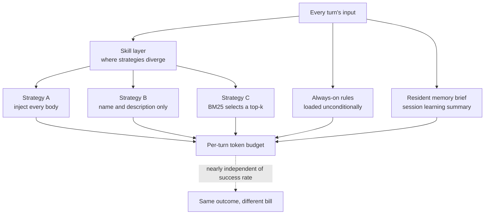

When agent spend overshoots the forecast, the first thing most teams examine is the model. Swap in something cheaper, or drop down a size. A measurement Composio published on 29 July 2026 suggests that order may be backwards. They held the model fixed, changed only the harness, and watched the token bill for the same task split several times over.

## Why this is worth reading

This post is for the platform engineers who actually own the token bill on a coding agent or an internal agent platform, and for anyone who has to decide whether to switch models. The short version is that you should measure your harness's resident cost before you touch the model. In Composio's run, success rates were nearly identical across three harnesses while median token consumption split between 61k and 340k. When we put the same question to our own harness and counted it directly, turning the selection layer on or off moved the per-turn budget by a factor of 45 to 66. The more useful finding came next. Once routing was enabled, 96.7 percent of the remaining budget was always-on rules, not skills. The fat worth trimming was not where most people look.

## Overview

Composio ran one model, Kimi K3, through three agent harnesses: Claude Code, Hermes, and Kimi Code. Twenty-eight tasks were given identically to all three. Because the model is fixed, every difference in the results is a difference the harness produced.

Success rates converged. Kimi Code finished 22 of 28, Hermes 21, and Claude Code 20 to 21. The Claude Code figure is cited as either 20 or 21 depending on the source, so we have recorded it as a range. Either way the conclusion holds: all three harnesses completed a similar share of tasks with the same model.

Cost is what diverged. The median task consumed 61k tokens in Kimi Code, 67k in Hermes, and 340k in Claude Code. That is a 5.6x spread at the median, and Composio reported individual tasks reaching as much as 30x. Time arranges itself in yet another order. Median time per task was 179 seconds in Hermes, 297 in Kimi Code, and 348 in Claude Code. The most token-frugal harness was not the fastest one.

A measurement the same team published a few days earlier sharpens the point. On a 14-task agentic benchmark, K3 matched Claude Fable 5 exactly, with the same 9 passes and the same 5 failures. On price, Fable 5 runs 10 dollars per million input tokens while K3 offers API access at 3 dollars per million and can be downloaded and self-hosted. In other words, now that open-weight models have caught up on capability, a large share of the remaining cost variable sits outside the model.

## What a harness actually does

A harness is the sum of the contracts wrapped around a model: the system prompt, the tool definitions, the routing rules, the context management policy, and the output verification gates. The model receives that entire bundle as input again on every turn. So when the harness is thick, the bill is thick even when the task is easy.

Splitting the token sources into layers looks like this.



The divergence inside the skill layer is the crux. A harness holding thousands of skills that injects all of their bodies makes the model read the whole library every turn. Keeping only names and descriptions resident makes it read the catalogue. Letting a retriever pick a handful makes it read the few books it needs. The three strategies finish the same task at roughly the same rate and bill entirely differently.

## We measured our own harness

Composio varied the harness. We did the inverse: we held one harness fixed and counted which layer its resident cost comes from. Measuring your own system is more useful in practice than transcribing someone else's benchmark.

The measurement is read-only and touches no network. The tokenizer is a real BPE, tiktoken's `cl100k_base`, not an estimate. For reproducibility we checked HEAD out into an isolated git worktree and counted that copy, then ran the same script once more against the live working tree.

```bash
# check HEAD out into an isolated worktree
bash scripts/blog/impl_sandbox.sh setup agent-harness-token-economics

# count tokens per layer (read-only, tiktoken cl100k_base)
.venv/bin/python scripts/blog/_harness_token_tax_20260730.py \
  --root /tmp/thaki-blog-sandboxes/blog-agent-harness-token-economics --k 6

# contrast against the live tree
.venv/bin/python scripts/blog/_harness_token_tax_20260730.py \
  --root /Users/hanhyojung/thaki/ai-platform-strategy --k 6

bash scripts/blog/impl_sandbox.sh teardown agent-harness-token-economics
```

The script counts four layers: the rules loaded unconditionally every turn, the index formed by skill names and descriptions, the full text of every skill body, and the resident memory brief. To that we added the worst-case cost of a retriever selecting six entries. We took the worst case deliberately, assuming the six most verbose cards were the ones chosen, so the result would not flatter the routing layer.

## Measured results

Here are the captured numbers. The left column is the isolated checkout, the right the live working tree. The live tree is larger because it carries additional plugin-installed skills.

| Layer | Isolated checkout | Live tree |
|---|---|---|
| Always-on rules | 59 files, 93,570 tokens | same |
| Skills discovered | 1,970 | 2,931 |
| Skill index, names and descriptions | 300,526 tokens | 436,516 tokens |
| Full skill bodies | 4,332,223 tokens | 6,389,650 tokens |
| Resident memory brief | 0 tokens | 1,541 tokens |
| Retriever top-6, worst case | 3,188 tokens | 3,276 tokens |

Resident memory reads 0 in the isolated checkout because that file is generated and never committed. The value that applies to a real session is the 1,541 tokens on the live side, from a 3,254-character source.

Expressed as the per-turn budget of the three strategies: A injects every skill body, B keeps only the index resident, and C lets the retriever pick the top six.


In the isolated checkout, A is 4,425,793 tokens, B is 394,096, and C is 96,758. A over B is 11.2x and A over C is 45.7x. On the live tree the gap widens with scale: A is 6,484,761, B is 531,627, C is 98,387, and A over C reaches 65.9x.

What stands out is how little C moves between the two trees. Skills grew from 1,970 to 2,931, close to a fifty percent increase, and the post-routing budget went from 96,758 to 98,387, a rise of 1.7 percent. With a selection layer in place, the cost of growing the skill estate stays close to constant. Without one, every skill you add is billed on every turn.

Then a result we had not anticipated. Looking inside budget C, always-on rules account for 96.7 percent in the isolated checkout and 95.1 percent on the live tree. The routed skill cards sit in the low thousands of tokens; the rules sit above ninety-three thousand. In a harness with a properly wired selection layer, the remaining cost is rules, not skills. Optimising skill counts revisits a problem routing has already solved, while the trimmable weight sits in the rules layer.

We checked which rule files carry that weight. The heaviest five are 5,331, 3,631, 3,497, 3,398, and 3,395 tokens. Those five alone exceed nineteen thousand tokens, close to six times the entire routed skill payload. On the skill side, the longest single card was 603 tokens. A few hundred tokens fought for in one layer and a few thousand leaking from another were sitting inside the same budget.

## What this means for ThakiCloud

This topic sits on agents and skill orchestration, so the Paxis lens is the right one. Paxis is ThakiCloud's Agent-Native Cloud control plane, treating Skills, Tools, Policies, and Audit Logs as first-class resources. What this measurement did was put a number on one of those design decisions.

The Paxis Skill Harness does not push every skill into context; it uses BM25 to select candidates. Without that selection layer, column A of the table above is billed every turn and operating cost climbs linearly with the skill estate. With it, column C is billed, and a near-fifty-percent increase in skills raised the budget by 1.7 percent. That is precisely what keeps the decision to keep growing the skill catalogue from colliding with the decision to hold per-turn cost down.

The same result also handed us homework. If 95 percent of the post-routing cost is always-on rules, then the target of a token diet is the rules layer, not the skill list. Anything loaded every turn should be worth paying for every turn, and knowledge needed only for specific work belongs on demand. We had already written that judgement down as a rule, but until we counted the layers with a real BPE we were guessing which layer was the actual bottleneck.

There is an infrastructure line here too. In Composio's measurement, K3 matched a commercial model down to the pass and fail pattern and can be self-hosted, which aligns with the direction ai-platform has taken in serving models directly with vLLM on K8s and Kueue GPU. As model capability levels off, the competitive variables left are serving cost and harness efficiency. The former belongs to ai-platform, the latter to Paxis.

## Limits and counterarguments

Composio's measurement covers 28 tasks. A spread of 22, 21, and 20 to 21 successes is hard to call statistically meaningful at that sample size, and Composio themselves concluded that success rates were comparable. The token gap is large enough to be less sensitive to sample size, but a different task mix could reorder it.

Nor does a high token count by itself prove a harness is defective. A harness that fills context generously may pay off on harder problems or longer sessions, and these 28 tasks may simply not be the difficulty at which that advantage shows. The fact that the timing figures disagree with the token ordering can be read as a hint in that direction. Where cache hit rates are high, the gap in billed dollars is narrower than the gap in tokens.

Our own measurement has boundaries too. It is a static count of the resident input layers and excludes tool output, conversational accumulation, and cache hit rates as they occur in a live session. So the ratios between A, B, and C are ratios of the resident cost that harness design creates, not ratios of an actual invoice. The top-six figure was computed as a worst case, so the real average is lower. And when counting skills, the live tree contains the same skill installed along multiple paths, so 2,931 should be read as the number of definition files discovered rather than the number of distinct skills.

Finally, this is one harness in one repository. The 96.7 percent figure emerges from a configuration where our rules layer is thick and routing is well wired. A harness with a thin rules layer that injects all skills produces the opposite picture. What transfers is the procedure, not the number.

## Wrapping up

Measure the harness before you change the model. Composio held the model fixed, changed only the harness, and showed the median token count for the same task splitting between 61k and 340k, with success rates that did not justify the gap. We held the harness fixed, split it by layer, and found that the selection layer is worth a factor of 45 to 66, and that once it is on, always-on rules consume 95 percent of what remains.

In practice that is three steps. First, count your harness's resident input by layer with a real tokenizer. Do not estimate it; count it. Second, start with the largest layer. Most teams reach first for the number of skills or tools, but if a selection layer is in place that side is already close to constant and the real cost is in the documents loaded unconditionally. Third, consider a model swap only after those two steps. Straining to save 3x on model pricing while 40x moves inside the harness is the wrong order of operations.

The counting script is left in the repository. It walks the rules directory and the skill definitions, counts tokens per layer, and compares the three strategy budgets, so any harness with a similar shape can run it with only the paths changed.

## Sources

- [Composio, Kimi K3 across three harnesses on 28 tasks](https://x.com/composio/status/2082452269522378858)
- [Composio, K3 against Claude Fable 5 on 14 tasks](https://x.com/composio/status/2082091871493574936)
- [GLM 5.2 vs Kimi K3, Composio](https://composio.dev/content/glm-vs-kimi)
- [moonshotai/Kimi-K3, Hugging Face](https://huggingface.co/moonshotai/Kimi-K3)
- Raw counts from our runs: `outputs/blog-impl/agent-harness-token-economics/run-1.log`, `run-2.log`
