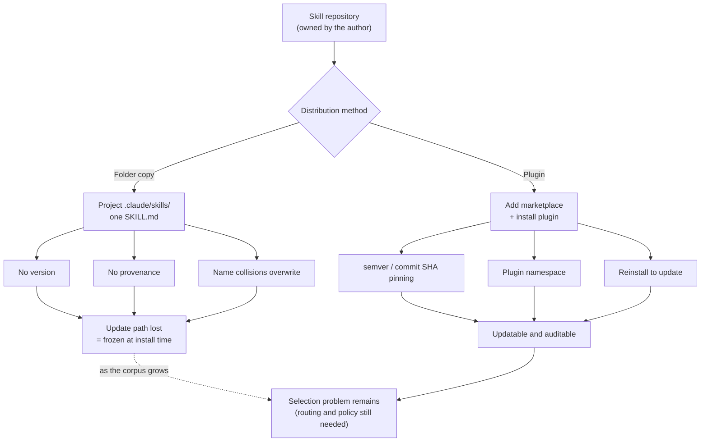

The easiest way to grow an agent skill library is to copy folders out of someone else's repository. That is what we did, and it left 1,909 directories under `.claude/skills`. This week we audited that tree properly for the first time. 82.7% of the skills are a single SKILL.md file, 88 of them declare a version, and 33 declare where they came from.


## Why read this

This post is for platform engineers who manage Claude Code skills for a team, and for tool authors who want to ship skills to other people. It is not about using one skill better. It is about owning the pile after that pile grows into the hundreds or thousands. The conclusion first: the bottleneck for skills is distribution, not quality. Copying folders preserves only a snapshot taken at install time and throws away both the update path and the provenance, so auditing and updating become impossible at exactly the moment the corpus gets large enough to need them. Plugin distribution genuinely restores two of those things, the update path and name isolation. The remaining problems, selection and control, still belong to your own harness.

## Overview

Matt Pocock started shipping his engineering skill collection as a Claude Code plugin. The previous flow was to clone the repository and copy the folders you wanted into each project. Now you register a marketplace and install a plugin. The repository's issue tracker already carried a request to expose skills as individually installable plugins, starting with `tdd`, and this release answers that direction.

The news itself is small. One repository with eight skills changed how it ships. What it did for us was force a question we had been deferring. For months we copied any skill that looked useful, folder and all. We had never counted what that corpus now looks like, or how much of it we could compare against its origin or update.

So instead of reacting, we ran an audit. A read-only script walked the whole skill tree inside an isolated git worktree and counted, per skill, whether it declares a version, whether it declares provenance, and how long it has been since anyone wrote to it. The result was worse than we expected.

## What the tool is

A Claude Code plugin is a distribution unit that bundles skills, subagents, hooks, and MCP servers into one package. You add a marketplace, install the plugin, and everything inside becomes available at once. Compared to copying folders, three differences matter in practice.

The first is namespacing. A skill that arrives through a plugin is invoked with the plugin's name attached. The review skill in a plugin called `my-tools` becomes `/my-tools:review` and can never collide with a `review` skill written by someone else. With folder copies, two skills that share a name overwrite each other.

The second is version pinning. You can pin plugin versions in `.claude/settings.json`, the catalog side can pin a plugin to a specific commit SHA, and the manifest side can pin itself to a semver string. Pinning is available on both layers, which is the part that matters. When an author changes a skill, your behavior does not quietly change with it.

The third is updating. Today the plugin system does not auto-update by default; reinstalling pulls the newer version. If you enable auto-update for a marketplace, updates happen in the background after startup. Either way, that path simply does not exist for a copied folder.

The skills in Matt Pocock's plugin attach to real workflows. There is `grill-me`, a relentless interview that sharpens a plan or design, `grill-with-docs`, which does the same while producing ADRs and a glossary, `improve-codebase-architecture`, which scans a codebase and reports opportunities as HTML, plus `tdd` and the domain modelling family. After installing, you run `/setup-matt-pocock-skills` once to tell the skills where your issues live, which triage labels you use, and whether you have one CONTEXT.md or a monorepo layout.



## Installation and integration

The actual install is two lines. Add the marketplace, then install the plugin.

```bash
claude plugin marketplace add mattpocock/skills
claude plugin install mattpocock-skills@mattpocock --scope project
```

`--scope project` binds the install to the current project. If a team shares the repository, the settings file is committed alongside it, so everyone gets the same version. Bootstrapping runs inside the agent.

```
/setup-matt-pocock-skills
```

We did not actually run this install in our environment. The same skills came in as copies months ago, and layering a plugin on top right now would make it hard to tell which copy answers a call. Instead we measured the state of those copies. The audit script below is read-only and ran inside an isolated worktree.

```bash
bash scripts/blog/impl_sandbox.sh setup claude-code-skill-plugin-distribution
bash scripts/blog/impl_sandbox.sh run claude-code-skill-plugin-distribution -- \
  python3 scripts/experiments/claude-code-skill-plugin-distribution/skill_supply_chain_audit.py \
  .claude/skills audit-detail.json
bash scripts/blog/impl_sandbox.sh teardown claude-code-skill-plugin-distribution
```

What the script looks at is simple. For each skill directory it checks whether a SKILL.md exists, whether the front matter carries a `version` style key, whether it carries a provenance key such as `source`, `repository`, or `license`, how long the description is, and how many days have passed since SKILL.md was last written.

## Measured results

The audit ran against the `.claude/skills` tree in our repository. Of 1,909 directories, 1,897 contained a SKILL.md and 12 were empty shells. The numbers below use those 1,897 as the denominator.


| Metric | Count | Share |
|---|---:|---:|
| Single-file skill (SKILL.md only) | 1,569 | 82.7% |
| Description over the 512-char guideline | 1,004 | 52.9% |
| Untouched for more than 60 days | 750 | 39.5% |
| Declares a version | 88 | 4.6% |
| Declares provenance (source/repo/license) | 33 | 1.7% |
| Duplicate front-matter `name` | 3 | 0.2% |

The number that stands out is 1.7%. Out of 1,897 skills, 33 record where they came from inside the file. The other 1,864 give you no way to tell, from the file alone, which repository they originated in, what license applies, or what the author changed afterwards. The 4.6% version figure is the same story from another angle. To update something you first need to know what you currently hold, and that information is missing.

The median time since last write was 60.0 days and the 90th percentile was 75.6 days. 750 skills have gone untouched for more than 60 days. This is a proxy for drift rather than drift itself, and going untouched does not by itself mean a skill is stale. The problem is that there is no way to check how much the original moved in the meantime.

Pulling out the specific skills this news is about makes the situation clearer.

| Skill | Files | Version | Provenance | Last write |
|---|---:|---|---|---:|
| grill-me | 1 | none | none | 75.6 days |
| improve-codebase-architecture | 1 | none | none | 75.6 days |
| domain-model | 1 | none | none | 75.6 days |
| dev-story | 1 | none | none | 75.6 days |
| ubiquitous-language | 1 | none | none | 75.6 days |
| tdd | 1 | none | none | 39.0 days |
| grill-with-docs | 1 | none | none | 17.2 days |
| code-review | 1 | none | none | 17.2 days |

All eight are a single SKILL.md with no version and no provenance. Five were copied on the same day and have sat unchanged for 75.6 days. Whether the author revised them in that window, we do not know. Installing the plugin today would bring those eight back as namespaced, separate skills while the old copies stay right beside them, leaving two sets doing the same job. Installing without cleaning up would make the corpus worse, not better.

We calculated one more thing. Skill names and descriptions together come to 1,091,058 characters, roughly 311,000 tokens. Not all of that enters any given session. We route with a BM25 retriever that pulls only the top candidates, which is exactly why a corpus this size stays workable. Still, more than half of the descriptions exceeding the recommended 512 characters is a signal that the index has no slack. On our router benchmark, BM25 alone scored 84.4% Recall@5 and 33.3% Top-1; adding an embedding hybrid moved those to 91.1% and 53.3%. The longer and more overlapping the descriptions get, the harder those numbers are to lift.

## What this means for ThakiCloud

This problem lands exactly where we keep landing while building Paxis. Paxis is the Agent-Native Cloud control plane that runs on top of ai-platform, and it treats skills, tools, policies, and audit logs as first-class resources. This audit made the practical meaning of "first-class" concrete. A skill is not code; it is a dependency. If it is a dependency, you should be able to say where it came from, which version it is, and when it was last updated.

Plugin distribution standardizes the shipping and the name isolation. What remains on our side is the two layers above it. One is selection. With 1,897 skills, no human picks from the list; the Skill Harness narrows candidates with BM25 and only the survivors reach the context window. The other is control. What an externally authored skill is allowed to execute is decided by a policy gate, and what it actually did is recorded in an audit log. Running in an isolated sandbox comes from the same reasoning. The experiment behind this post ran inside an isolated worktree, which is that idea in miniature.

There is an infrastructure angle too. As a skill corpus grows, routing quality becomes token cost. One badly chosen skill inflates the context and invites a retry. When agents run multi-tenant on ai-platform, that cost multiplies by tenant count. This is why we put router improvements ahead of model upgrades. Lifting Top-1 from 33.3% to 53.3% with hybrid reranking was the result of that ordering.

## Limits and counterarguments

The audit has clear limits. Last-write time is a proxy for drift, not drift itself. A git checkout rewrites file mtimes, so values taken inside the worktree all read zero; the age figures in the tables above are therefore taken against the live tree rather than the sandbox. For the same reason, anyone running this script elsewhere may not reproduce the age figures.

Treating missing version and provenance keys as a defect is also a choice. The SKILL.md spec does not require them, so their absence breaks no rule. The argument of this post is that because the spec does not require them, nobody added them, and the whole corpus became unauditable as a result.

Plugin distribution is not a cure-all either. Namespacing prevents name collisions but not semantic overlap. Install two `tdd` skills from different authors and the router still has to choose one. Auto-update is not the default, and turning it on introduces uncontrolled change through the distribution path, which is precisely why commit SHA pinning exists. Moving to plugins also does not remove the copies you already have. For anyone sitting on 1,569 single-file copies, migration is mostly a deletion exercise.

## Wrapping up

Copying folders to grow a skill library works fine up to about twenty skills. At 1,897 you can no longer tell what you brought in, when you brought it, or how the original changed since. Our audit put numbers on that state: 82.7% single-file copies, versions on 4.6%, provenance on 1.7%.

The conclusion from the top still holds. The bottleneck for skills is distribution, not quality. Plugin distribution restores the update path and name isolation as a standard, and the remaining selection and control problems belong to the router and the policy gate. Matt Pocock's release matters not because the skills got better but because the same skills now arrive in a form you can own.

Next time you bring in a skill, check one thing. Can you answer, right now, what you would need to look at in six months to update it? If no answer comes, you did not adopt that skill, you pasted it. Our own next step is to replace the single-file copies whose origin we can identify with plugin installs, then delete what they supersede.

## Sources

- [mattpocock/skills: README](https://github.com/mattpocock/skills/blob/main/README.md)
- [mattpocock/skills: issue #138 requesting individually installable plugins](https://github.com/mattpocock/skills/issues/138)
- [mattpocock-skills plugin page](https://claudeskills.info/plugins/mattpocock/skills/mattpocock-skills/)
- [Setup Matt Pocock Skills command](https://claudemarketplaces.com/skills/mattpocock/skills/setup-matt-pocock-skills)
- [Claude Code docs: discover and install prebuilt plugins through marketplaces](https://code.claude.com/docs/en/discover-plugins)
- [Claude Code Plugins: From Personal Setup to Org Standard](https://claudefa.st/blog/tools/mcp-extensions/plugins-distribution)
- Audit script and raw logs: `scripts/experiments/claude-code-skill-plugin-distribution/skill_supply_chain_audit.py`, `outputs/blog-impl/claude-code-skill-plugin-distribution/run-1.log` through `run-3.log`
