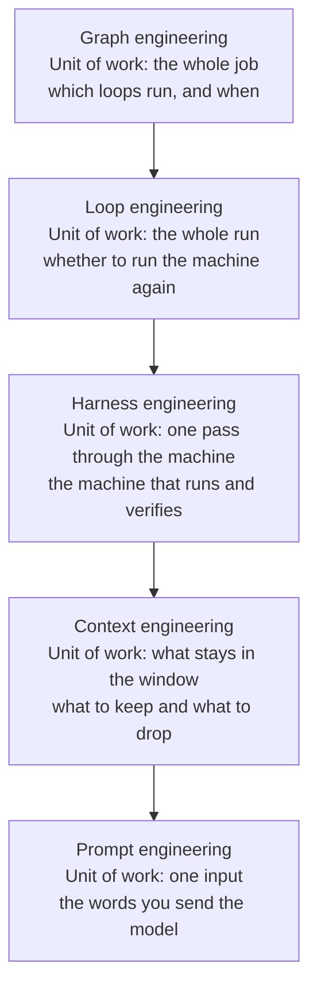

The naming series that started with prompt engineering has gained another entry. After context, harness, and loop, we now have graph engineering. The thread and article that Akshay Pachaar of DailyDoseOfDS posted on July 26, 2026 reads like a clear attempt to separate the meme from the substance. According to the original piece, the trigger came on July 18, when Peter Steinberger asked "are we still talking loops or did we shift to graphs yet," and Hamel Husain followed a few hours later with an article titled "Loop Engineering Is Dead. Enter Graph Engineering." Both were at least half joking, but the joke landed on something real. The moment several loops have to work together, you have a coordination problem, and graphs are how engineers have always described coordination.


*The unit of work grows as layers nest. From a single input up to the whole job.*

## Why read this

This post is for platform engineers who must design systems that run several agents together beyond a single agent loop, and for anyone deciding whether to adopt a graph framework like LangGraph. The conclusion up front: graph engineering is not a new technology. It is the name that stuck to the fact that coordination itself becomes an engineering problem the moment one loop stops being enough, and that is exactly why staying in the loop without a graph is the right answer most of the time.

## Overview

The original article's skeleton has three claims. First, graphs do not replace loops; they connect and govern them. Second, the five layers from prompt to graph each wrap the one before, and the cleanest way to tell them apart is to ask what that layer's unit of work is. Third, none of this practice is new. LangGraph shipped this exact model, nodes and edges over shared state, in January 2024. Microsoft's AutoGen has GraphFlow, and Google built ADK 2.0's workflow runtime on the same idea. The top reply to Hamel Husain's post, as the original article reports, captured the mood: "welcome back, langchain." Once you accept that only the name is new, one question remains. When do you use a graph, and how do you keep it from rotting. The original answers with four hard problems, and this post follows that structure while reinforcing it with numbers and cases published by Anthropic and Cognition.

## What this technology is

A graph is three things. Nodes are units of work: an agent, a plain model call, a deterministic function, a tool, or a human approving something. Edges decide what runs next: in sequence, in parallel, or conditionally based on what the last node produced. State is a shared object that flows along the edges, and every node reads from it and writes to it.

The starter graph the original uses as an example is the shape nearly every tutorial uses.

```python
graph.add_node("research", research_agent)
graph.add_node("write", writer_agent)
graph.add_node("review", reviewer_agent)
graph.add_edge("research", "write")
graph.add_edge("write", "review")
graph.add_conditional_edge("review", lambda state: "done" if state.approved else "write")
```

A researcher gathers material, a writer drafts, a reviewer judges. If the review passes, the run ends. If it fails, an edge sends the draft back to the writer. Three nodes, four edges, and one of those edges is a loop.

Here is where the perspective shifts. A single agent loop is just a one-node graph with an edge pointing back to itself. Graphs do not push loops out; they sit on top of them. So if a lower layer collapses, the graph simply fails in a more elaborate way.

## The five-layer stack and its units of work

The distinguishing method from the original thread is to ask, for each layer, what its unit of work is.

The unit of work in prompt engineering is one input. The model remembers nothing before this call, so role, background, instructions, examples, and format all ride on a single prompt. The unit of work in context engineering is what stays in the window. The window is finite and information is not, so curation, choosing what to keep, what to compress, and what to drop, becomes the work. The unit of work in harness engineering is one pass through the machine. The harness wraps the model, gathers what it needs, runs it, calls tools, and verifies the result with tests or a judge. The unit of work in loop engineering is the whole run: a goal defined upfront, brakes like max iterations and budget caps, and a completion check that is automated rather than felt. The unit of work in graph engineering is the whole job: what runs when, what runs in parallel, and who checks whom.




*The same diagram redrawn as a hand-drawn boil animation. The layout stays fixed while the strokes are re-traced every frame.*

Each layer wraps the one before it. A graph is made of loops, each loop needs a good harness, each harness call is a context problem, and every context contains prompts. This structure is also a debugging coordinate system. Find the layer whose unit of work broke, then fix that layer. As the original points out, the prompt is the easiest layer to edit, which is why it keeps taking the blame for failures that live three layers up.

## The four hard problems

The first is knowing when a node deserves to exist. The most common failure is turning "summarize this PDF" into a five-node graph with a fetcher, a chunker, a summarizer, a reviewer, and a formatter. A node earns its place only if it represents a real specialty: a different model, a different toolset, or a genuinely separate role like a read-only reviewer. Steps you could inline into an existing loop are not nodes. The original offers two filters. If you cannot draw the graph on a napkin, it is too complex. And if collapsing two nodes into one loses nothing, they were never two nodes.

The second is keeping shared state clean. In a loop, the disease is context rot. In a graph, the same disease moves into shared state. A sloppy write in node two becomes a confident input for node five, and by the time the output is wrong, the bad data has flowed through half the system. The fixes are simple. Give the state a typed schema, decide explicitly which nodes may write to which fields, and checkpoint state between nodes so you can replay a run and see exactly where it went bad. One caution: nodes after a checkpoint execute again on replay, so any node with external side effects, like sending an email or creating a record, must be safe to run twice.

The third is routing you can trust. An edge is a decision, and the question is who makes it. If a model decides the route, you get flexibility and instability in the same package. When the same state takes different paths on different runs, debugging collapses. The Google ADK 2.0 design rule the original quotes is the cleanest position in the discourse. Deterministic code should control predictable routing, and models should only handle the steps that need actual judgment. Route with code wherever the condition is checkable, and spend model calls only where interpretation is genuinely required.

The fourth is agents agreeing with each other. Loop engineering's sharpest rule was to never let an agent grade its own homework. Graphs raise the stakes. Twenty agents built on the same base model, reading the same flawed context, will happily agree with each other, and models measurably prefer their own outputs. The result is organized nonsense at industrial scale: impeccable structure wrapped around a wrong answer. The fix is a reviewer node with teeth. Run it on a different model, give it fresh context instead of the full conversation, and anchor its verdict to evidence the graph cannot fabricate, like tests that actually ran or code that actually compiled. According to the original, Cognition landed in the same place after a year of running Devin, their coding agent. Their working setup lets several agents read the work and weigh in, but only one agent is ever allowed to change anything: read many, write one. Reading is safe to do in parallel, because a bad opinion costs you nothing until someone acts on it. Writing is where the damage happens, so you keep it in one place where you can see it.

## When the graph is overkill

The honest answer is most of the time. Anthropic's published numbers make the cost concrete. A single agent burns roughly 4x the tokens of a chat interaction, and multi-agent systems burn roughly 15x. Every node you add multiplies that.

The ceiling is real too, when the task genuinely parallelizes. Anthropic's multi-agent research system, with Claude Opus 4 as the lead agent and Sonnet 4 subagents, outperformed a single Opus 4 agent by 90.2% on their internal research eval, because research fans out into independent searches naturally. In the same post, Anthropic says token usage by itself explained about 80% of the performance variance in the BrowseComp evaluation. That is a confession that much of why multi-agent wins is not clever division of labor but spending more tokens on the problem. And the standing advice from Anthropic's "Building effective agents" has not changed: find the simplest solution possible, and only add complexity when the task demands it. Even LangGraph's own guidance says that if your agent is a straightforward loop with tools, LangGraph is overkill.

The decision rule from the original: reach for a graph when the work splits into genuine specialties, needs parallel fan-out and join, needs different models per step, or needs failure isolation and auditable routing. Otherwise stay in the loop.

The conditions Anthropic lists for multi-agent fit overlap with this rule. The task's value must be high enough to pay for the tokens, parallelization must be heavy, information must exceed single context windows, and the system must interface with numerous complex tools. Domains that require all agents to share the same context, or that involve many dependencies between agents, are explicitly not a good fit today, and Anthropic adds that most coding tasks sit close to this category. There is an operational warning as well. Anthropic's research system runs its lead agent synchronously waiting on subagents, so the whole system blocks until one subagent finishes, and the asynchronous execution that would remove this bottleneck brings new problems in result coordination, state consistency, and error propagation. Adopting a graph means taking on this entire class of problems.

## Where to start

You do not need an org chart of agents on day one. Build up to it. Master a single loop first, one with brakes, a real completion check, and a critic. A graph of weak loops is just distributed failure. Draw the graph on paper before writing code, and challenge every node to justify its existence. Define the state schema and write access up front; state drift is the main way graphs rot. Make the reviewer node a different model with fresh context, anchored to external evidence. Finally, put budget caps on every node. A graph is many loops spending tokens in parallel, and a weak verifier now burns money concurrently.

## Implications for ThakiCloud products

This topic belongs to agent orchestration, so the right lens is Paxis. Paxis is ThakiCloud's Agent-Native Cloud control plane, treating Skills, Tools, Policies, and Audit Logs as first-class resources. The four hard problems above mesh one-to-one with Paxis design decisions.

The node granularity problem resembles the Paxis Skill Harness. The Skill Harness does not push all 960+ skills into context; it selects candidates with BM25 and injects only those. It pre-filters execution units that have no reason to exist, the same thinking as the original's filter: if collapsing loses nothing, it was always one node. The routing trust problem maps to Paxis policy gates. The ADK rule that deterministic code should own predictable routing points the same way as the Paxis structure where every agent action passes deterministically through a policy gate. Model calls stay where judgment is needed, and checkable conditions are checked by code.

Shared state hygiene and the agreement problem land on audit logs and the sandbox. Because Paxis passes every agent action through audit logs, the accident where node two's sloppy write becomes node five's input can be traced after the fact. Sandboxed isolated execution bounds the blast radius of nodes with external side effects, and separating the reviewer stage onto a different model with a separate context in DAG multi-agent execution is the original's reviewer-node-with-teeth, structured at the platform level. The adoption criteria the original lists, genuine specialty splits, parallel fan-out, failure isolation, and auditable routing, overlap with what Paxis already handles in the control plane. Conversely, the restraint of not promoting work to a graph when none of those criteria apply is also something a platform should help with, and on the cost side the mechanism is budget caps on every node.

## Limits and counterarguments

First, there is legitimate doubt about the lifespan of the name itself. As the original admits, this field renames itself so fast that mocking the renaming has become its own genre. The term graph engineering may not survive the year. But the design question, that coordination becomes engineering when one loop stops being enough, will remain. Invest in the question, not the word.

Generalizing the numbers has boundaries too. The 90.2% figure is from Anthropic's internal research eval, on a task that splits breadth-first like research. Anthropic itself says the same multiplier does not hold for tasks like coding, where truly parallelizable pieces are few and dependencies between agents are many. The 4x and 15x cost multipliers are also empirical figures that vary with task shape. And the Cognition case is a summary relayed by the original article; Cognition's own piece, "Don't Build Multi-Agents," leans harder on the fragility of multi-agent systems, and the two should be read together for balance.

Finally, this post carries the original article's analysis, reinforced with verified sources; it is not a post where we ran graph frameworks ourselves and measured them. The four problems and the adoption criteria match the direction of our own operating experience, but when applying them to your workload, the right move is to measure token cost and success rate before and after adopting a graph yourself.

## Summary

Graph engineering is not a new discipline replacing loop engineering. It is the name that stuck to a decision every agent builder eventually faces the moment one loop stops being enough. A graph is made of nodes, edges, and shared state, and a single loop is a one-node graph with an edge pointing back at itself, so graphs govern loops rather than replacing them. The five layers are told apart by unit of work: one input, what stays in the window, one pass through the machine, the whole run, and the whole job. Find the broken layer on these coordinates. The practical difficulty lives in four places: a node's right to exist, shared state hygiene, the routing split between code and model, and a reviewer armed with a different model, fresh context, and external evidence.

The reader's takeaway is three actions. First, check whether the agents you run today meet any of the original's four adoption criteria: genuine specialty splits, parallel fan-out, different models per step, failure isolation and auditable routing. If none apply, staying in the loop is the right answer, and that decision saves 15x the tokens. If some apply, draw the graph on paper before code, and ask every node to justify its existence. Finally, make the reviewer node, built from a different model, fresh context, and external evidence, a day-one default. The point where coordination becomes engineering is not where you install a graph framework; it is where you design who checks whom.

## Sources

- [Akshay Pachaar, Graph Engineering thread](https://x.com/akshay_pachaar/status/2081356379026280677)
- [Anthropic, How we built our multi-agent research system](https://www.anthropic.com/engineering/multi-agent-research-system)
- [Anthropic, Building effective agents](https://www.anthropic.com/research/building-effective-agents)
- [Cognition, Don't Build Multi-Agents](https://cognition.com/blog/dont-build-multi-agents)
