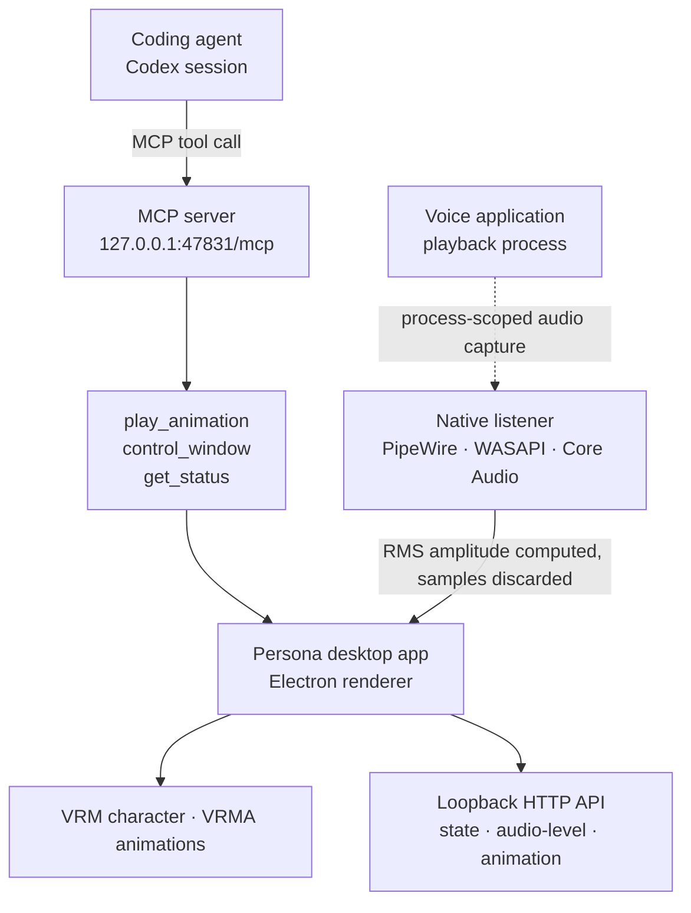

The most common mistake when opening a new capability to an agent is exposing too many tools. Hand over one general-purpose tool that reads files, writes files, and spawns processes, and the immediate work gets easier while nobody can any longer describe what is possible. Persona, an open-source project published on 28 July 2026, went the opposite direction. It connects an agent to a 3D character running on the desktop, and it exposes exactly three MCP tools.


## Why this matters to you

This post is for platform engineers wrapping internal tools in an MCP server to attach them to agents, and for anyone deciding how much authority an agent should get. Here is the conclusion first: Persona is interesting not because it renders a 3D character but because the way it narrows the capability surface is directly copyable. Three tools, enum-closed arguments, names as the contract instead of file paths, and a binding that refuses anything outside loopback add up to one coherent pattern. Even with no interest in avatars, it is worth reading as a tool-design reference.

## Overview

Persona is a cross-platform application that gives desktop voice experiences a visual identity. It renders a VRM-format character on Electron and plays VRMA-format animations. The repository was created on 28 July 2026 and, as of this writing, carries 410 stars and 36 forks. The application source is MIT licensed, and the bundled character media is excluded from that license.

The phrasing that spread the project on Twitter was that ChatGPT can now control its own 3D persona. Reading the repository documentation gives a more precise picture. The client the docs name for registering the MCP server is Codex. And the part that detects voice output from Codex and ChatGPT is not MCP at all but operating-system-level audio capture. The docs state the reason plainly: neither application currently exposes a supported cross-process realtime voice event stream, and if an official event stream appears it can map to the same contract without changing the window or animation system.

So this project contains two distinct connections. One is the MCP path where an agent issues commands to the character, and the other is the audio observation path where the character notices voice output. The design principles differ, so they are worth separating.



## What the tool actually is

Start with the MCP side. While the app is running, Persona serves a Streamable HTTP MCP endpoint. It exposes exactly three tools.

| Tool | Input | Effect |
|---|---|---|
| `play_animation` | `animation`: one of `idle`, `greeting`, `talk`, `happy`, `finger-gun`, `dance` | Shows Persona and plays one installed animation once |
| `control_window` | `action`: one of `show`, `hide`, `toggle` | Controls the window without quitting the app |
| `get_status` | None | Reads window visibility, voice state, and listener status |

Opening `electron/mcp-server.cjs` shows how that table meets the code. The server uses `McpServer` and `StreamableHTTPServerTransport` from the official `@modelcontextprotocol/sdk` directly, names itself `Persona`, and takes its version from `package.json`. Both tools declare their arguments with `z.enum`, so any string outside the allowed set is rejected at the schema layer. The animation name list is derived from a mapping object in the code, which structurally reduces the room for the documented table and the actual allowed values to drift apart.

The server instruction string is worth noticing too. It tells the agent to use `play_animation` when the user asks for a visual reaction or clearly would be served by one, and it states that Persona never speaks or plays audio and that `get_status` is read-only. Usage conditions and the absence of side effects, neither of which a tool schema conveys, ride along as a natural-language contract.

The most copyable decision is that animation names are a product contract rather than file paths. The docs spell out the effect: a future character pack can replace the media wholesale without changing the MCP configuration or granting new filesystem access. The agent only needs to know the name `dance`, and it has neither the need nor the means to learn which file sits behind it.

## Installation and integration

The documented procedure is short. Requirements are Node.js 24 or newer, npm, and a desktop session with hardware-accelerated graphics.

```bash
npm install
npm run demo
```

`npm run demo` builds the current renderer and launches Persona with automatic voice-output detection enabled. To launch in the background:

```bash
npm start -- --background
```

With the app running, register the MCP server with the client.

```bash
codex mcp add persona --url http://127.0.0.1:47831/mcp
codex mcp get persona
```

After registering, a new session has to start before the tools appear. If the port was changed through `PERSONA_BRIDGE_PORT`, the registered URL has to change with it, because the MCP endpoint shares a port with the loopback HTTP API.

There are two more entry points besides MCP. One is the `persona://` URL scheme registered by installed packages, where addresses such as `persona://show` or `persona://speaking?level=0.3` are opened with `xdg-open` on Linux, `open` on macOS, and `start` on Windows. The other is the loopback HTTP API bound by default to `127.0.0.1:47831`. It accepts three kinds of events, namely voice state, normalized level, and animation preview, and `GET /health` returns whether Persona is running along with the last state. The state event closes phase to `inactive`, `starting`, `active`, and `stopping`, and activity to `idle`, `listening`, and `speaking`.

Voice detection differs by platform. Linux polls the PipeWire graph for the target playback node and attaches `pw-record` to it, Windows uses WASAPI application loopback restricted to the target process tree, and macOS creates a private Core Audio process tap and aggregate device for the selected voice process. Linux needs `pw-dump` and `pw-record` on PATH, Windows needs build 20348 or newer, and macOS needs 14.2 or newer.

## What we verified

To be direct: this post is not a record of running the app. Persona requires a hardware-accelerated desktop session, and the character media is deliberately excluded from the repository, so `assets/model.vrm` and eight VRMA files have to be supplied before it will run. Instead we opened the repository documentation and source and report only what can be verified there. There are no benchmark figures or latency measurements in this post.

Here is what the source and repository metadata confirm. The repository was created on 28 July 2026 with its last push the same day, the language is JavaScript, and it carries 410 stars, 36 forks, and zero open issues. `electron/mcp-server.cjs` uses the official MCP SDK and declares three tools with zod schemas. `mcp-server.test.cjs` and `bridge-server.test.cjs` sit in the same directory, so both servers carry tests.

The privacy claims are written explicitly in the docs as well. Each listener is scoped to the supported application's playback process, and Persona does not capture the microphone, save audio, produce speech, transcribe content, or send audio over the network. On the Linux path the docs specify that RMS amplitude is computed from samples and every sample is discarded immediately afterward. The loopback API rejects requests carrying a non-loopback Host header, and browser clients are restricted to trusted local and supported app origins.

There is one interesting gate on the distribution side. Until the character media is replaced, every license and source field in `manifest.json` is filled in, and `distributionAllowed` is set to true, the release workflow is designed to fail. Code prevents the accident of shipping test files as-is.

## What this means for ThakiCloud products

Paxis is our Agent-Native Cloud, treating Skills, Tools, Policies, and Audit Logs as first-class resources. How to expose the tools an agent will use is the core design problem of that product, so Persona's choices apply directly.

First, closing the capability surface with names. Persona put six names under contract instead of animation file paths and hid the files behind them. Apply the same principle to internal tools and you can expose a set of predefined action names rather than shell access or path arguments. A closed name set makes the objects a policy gate inspects finite, and turns the values landing in audit logs into enumerations rather than free strings. That difference matters a great deal when those logs are aggregated later.

Second, shipping natural-language instructions instead of adding tools. The Persona server instruction string carries guidance on when to use which tool along with side-effect information: this server makes no sound, and status queries are read-only. It is a design that concedes schemas alone do not give a skill harness enough to pick a tool, which is exactly the direction our skill-description quality rules push.

Third, drawing the network boundary tight. Binding only to loopback, rejecting non-loopback Hosts, and restricting browser origins is a combination worth adopting as the default for local agent tools. The same principle holds in a Paxis environment built on sandboxed execution. The narrower the surface a tool opens, the easier the isolation boundary is to hold.

The gap this project reveals is worth recording too. Having to attach an operating-system audio tap in order to learn about voice state means today's agent applications lack a standard event channel for broadcasting realtime state. Every tool that tries to layer something on top of an agent ends up repeating the same workaround. Designing state to flow over a standard channel is worth settling early when we build agent platforms ourselves.

## Limitations and counterarguments

Start with maturity. The repository is days old, and even the release tag example in the docs is a beta form. This is a stage for reading the design, not for discussing production adoption.

Next is the barrier to running it. Character media is absent from the repository, so it cannot be cloned and run immediately; VRM and VRMA files have to be sourced and their license fields filled in. Going as far as distribution requires confirming redistribution rights for those files too. That is a safe default, but it is also an entry cost.

The feature scope is narrow as well. MCP opens only animation playback, window control, and status reads, and the docs themselves draw a line stating that Persona remains a separate desktop application whose MCP connection exposes only its own visual controls. Approaching it expecting an expressive avatar for an agent will disappoint.

Finally, the audio capture approach carries operational friction. macOS asks once for System Audio Recording permission, Windows requires a specific build or later, and Linux needs the PipeWire tools on PATH. Even with documentation explaining how narrowly capture is scoped, organizations with strict security policies will treat audio access itself as something to review. And it is worth remembering that this approach is fundamentally a temporary workaround that can break if the target application changes its process structure.

## In closing

What to take from Persona is not the character but the method of narrowing. Three tools, enum arguments, names as contract, loopback binding, and a license gate blocking distribution. Five decisions all point the same way, and the result is a server whose capabilities fit in a single paragraph.

For anyone wrapping internal tools in MCP, the next action is one thing. Before writing the tool list, write out the names of the actions the agent will perform as a finite list. If that list grows long, the signal is that the actions themselves need regrouping before the tools get split. The moment paths and free strings become arguments, both the policy gate and the audit log go blurry.

## Sources

- [xikhar/persona repository](https://github.com/xikhar/persona), MIT license, created 28 July 2026
- [Persona integrations doc (docs/INTEGRATIONS.md)](https://github.com/xikhar/persona/blob/main/docs/INTEGRATIONS.md)
- [MCP server source (electron/mcp-server.cjs)](https://github.com/xikhar/persona/blob/main/electron/mcp-server.cjs)
