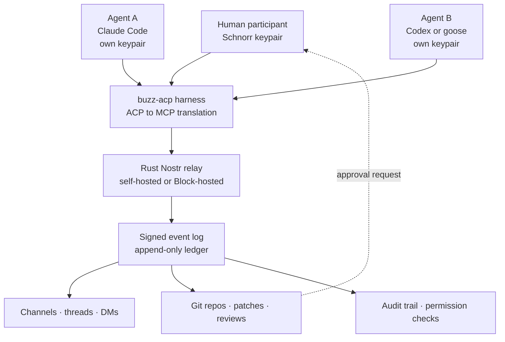

Any organization that has put agents into a real team workflow has hit the same wall. The model works fine, but the agent has no defined identity in the Slack channel. You share one bot token, or borrow a human account, or hide behind a webhook. Then the question "who approved this commit" has no answer. Buzz, which Block released on July 21, 2026, starts from exactly that question.


*Humans and agents sign with their own identities in the same channel, and every trace accumulates in one ledger.*

## Why This Matters

This post is written for platform engineers who have to deploy agents inside a company, and for anyone who has to design audit trails for agent behavior. The short version: the significance of Buzz is not "another Slack alternative shipped," it is that Buzz is the first widely visible attempt to solve **agent identity and permissions at the protocol layer rather than the application layer**. Humans and agents each hold a cryptographic keypair, and every message, code review, and automation run is signed with that key into a single append-only log. This is not an argument for replacing your company Slack today. But if you are designing an agent platform, the structure Buzz chose is worth studying.

## Overview

Buzz is an open-source collaboration platform released on July 21, 2026 by Block, the company led by Twitter and Square co-founder Jack Dorsey. It is licensed under Apache 2.0 and the repository lives at [github.com/block/buzz](https://github.com/block/buzz). By one count it passed roughly 6.9K stars within three days of launch and sat near 14.7K by July 28.

On the surface it looks a lot like Slack. There are channels, threads, and direct messages. Voice and media sharing are included. So far, familiar territory. Two things differ. First, Git repository hosting lives in the same window, so chat and code review are not split across tools. Second, and more importantly, AI agents are not add-ons bolted onto a channel. They join as **members with their own identity and permissions**.

Why that matters becomes clear when you consider the alternative. Most teams today attach agents as bots. A bot inherits the app owner's permissions, and what a bot leaves behind tells you only that "the app did it." If two agents share one bot token, they are not even distinguishable. In any moment that calls for regulatory response or after-the-fact investigation, that structure collapses.

Riley Brown's [hands-on guide](https://x.com/rileybrown/status/2082569013280796930) summarizes the platform from a different angle: you can build an agent team in five minutes, and you can attach the Codex and Claude Code subscriptions you already pay for, so getting started costs nothing extra. That guide is what queued this post.

## What Buzz Is Built From

The core of Buzz is not the chat UI. It is the identity model underneath it.

Rather than relying on a central user account table, Buzz issues each participant an independent Schnorr keypair, an approach borrowed from the Nostr protocol. Humans get a keypair and agents get a keypair. Every interaction, including messages, code reviews, and CI triggers, is recorded as a signed event in a single append-only log.

Several properties follow from this.

First, subject separation comes for free. Agent A and agent B use different keys, so the log distinguishes them naturally. Permissions are defined per identity as well.

Second, the audit trail is the record itself rather than something assembled after the fact. This is not a design where you build a separate audit table and hope the application populates it faithfully. The signed event log is the ledger. That is the basis for Block describing the product as more auditable than conventional chat products.

Third, self-hosting is a natural fit. The relay is a Nostr relay written in Rust, so an organization can run it inside its own infrastructure and keep telemetry from crossing the perimeter. Using Block's free hosted relay is also an option.

Supporting components include PostgreSQL, Redis, and S3-compatible storage. One notable detail: the multi-tenant isolation spec has been mechanized in TLA+ and its authorization properties verified in Tamarin. Applying a distributed-systems specification language and a security protocol prover to a collaboration tool is unusual. It signals an intent to put identity and isolation at the center of the product.



*The structure of Buzz. Humans and agents share one identity model, and every action converges into a single signed log.*

## How This Differs From How We Attach Agents Today

The value of this structure only shows when you put it next to current practice. In real deployments, teams attach agents in roughly three ways.

| Approach | Subject identification | Permission scope | Traceability after the fact |
|---|---|---|---|
| Shared bot token | Only down to the app | Inherits app owner's rights | Cannot tell which agent acted |
| Borrowed human account | Recorded as a person | That person's full rights | Mixed with human activity, inseparable |
| Service behind a webhook | Per endpoint | Whatever was wired | Depends on application logging discipline |
| Buzz keypair | Per participant | Defined per identity | The signed event is the ledger |

The first three share the same weakness: audit information is a byproduct of the execution path. It exists because the application promised to write it, and it goes quietly empty when the code changes or an exception path is taken. A signed event log, by contrast, makes the record itself the unit of transport. If it is not recorded, it is not delivered in the first place.

This is not free, of course. Per-participant keypairs create a new operational category: key management. Three questions come up immediately in practice. Where do agent keys live, how do you revoke and reissue when you confirm a leak, and what is the offboarding procedure when a person leaves or an agent is retired. That Buzz put web-of-trust reputation on the roadmap reads as a signal that this area is not finished yet. Any internal adoption review should make key lifecycle design an adoption condition.

## How Agents Connect

Buzz avoids lock-in to any specific agent runtime because it adopted the **Agent Client Protocol**.

A harness called `buzz-acp` translates between ACP and MCP. Any agent that speaks one of those two standards can, in principle, join a channel. In practice Block's own goose, Anthropic's Claude Code, and OpenAI's Codex all connect through that harness. goose is the open-source agent framework Block released in January 2025, which has passed 50,000 GitHub stars and now ships as one of Buzz's prebuilt harnesses.

On the command line, `buzz-cli` speaks JSON in and out, and the ACP harness bridges that JSON to Claude Code, Codex, or goose. In other words, the agent runtime you already use becomes a channel member without custom webhook plumbing. Practically, this is the largest barrier removed. If your team already works with Claude Code subscriptions, no new model contract is required.

Per the official documentation, self-hosting requires the following stack.

```text
Docker
Rust 1.88 or later
Node 24 or later
pnpm
PostgreSQL / Redis / S3-compatible storage
```

Once connected, an agent is treated like any other member. The working pattern shown in Block's demo screenshots goes like this: a human @-mentions an agent with a task, the agent plans in-thread, hands sub-tasks to other agents by mention, opens a patch in Buzz's Git hosting or a PR on GitHub, and then pings a human for the final review.

The detail worth noting is that delegation between agents uses mentions, a syntax built for humans. There is no separate orchestration DSL to learn, and a person can read the delegation as it happens. The failure mode that breaks multi-agent systems most often is that nobody can tell what is currently going on, and reusing the conversation log as the execution log removes much of that problem.

## What This Post Verified and What It Did Not

To be direct: this is not a measured report from self-hosting and running Buzz.

What was verified is the published primary material and multiple independent reports: launch date, license, repository location, identity model, ACP harness composition, self-hosting requirements, and the gaps still on the roadmap. Only items reported consistently across separate outlets made it into the body, and figures that appeared in a single source are attributed or given as a range.

What was not verified is real operational performance. Relay throughput, latency as channel size grows, and the cost curve under concurrent agent execution are outside the scope of this post. The self-hosting stack simultaneously requires Docker, a Rust toolchain, a Node runtime, and three kinds of state stores, which made it a poor fit for a short verification pass. Rather than inventing numbers, those slots were left empty. Items that need measurement will be covered in a separate experiment.

## Implications for ThakiCloud Products

The problem Buzz raises is the same one ThakiCloud has kept running into while building Paxis.

Paxis is ThakiCloud's Agent-Native Cloud control plane, which treats Skills, Tools, Policies, and Audit Logs as first-class resources. It selects from more than 960 skills using BM25, executes them in isolated sandboxes, and routes every action through policy gates and audit logs. Two axes overlap with Buzz precisely: auditability of agent behavior, and interoperability across heterogeneous agent runtimes.

The approaches differ. Buzz pushes identity down into cryptographic keypairs and treats the signed event log as the ledger. Paxis has the control plane enforce policy gates while emitting audit logs. The former secures unforgeability at the protocol level; the latter can enforce policy immediately before execution. These properties are not mutually exclusive. A signature-based ledger is strong for after-the-fact proof and a policy gate is strong for prevention, so in customer environments with high audit requirements, running both layers is a natural combination. The verification approach Buzz actually adopted, mechanizing the isolation spec in TLA+ and confirming authorization properties with a separate prover, is itself a precedent worth borrowing.

On the interoperability axis the lesson is more direct. That Buzz accommodated goose, Claude Code, and Codex simultaneously through a single ACP-to-MCP translation harness shows that agent platform extensibility comes from standard adapters, not proprietary SDKs. That is the same judgment behind Paxis treating MCP connectors as first-class. A platform that demands a proprietary SDK grows maintenance cost linearly with the number of supported runtimes, while a single standard adapter flattens that axis to a constant. With the agent runtime market still unsettled, that difference matters a great deal right now.

There is something to borrow from the delegation model as well. Buzz handles task handoff between agents through mentions, a syntax built for humans. It is a choice to leave multi-agent execution in a form people can read, and the same question recurs in Paxis's DAG multi-agent execution: do you record the execution plan only in a machine-facing structure, or also in a form a human can step into, read, and approve. Treating audit logs as a first-class resource means choosing the latter, and Buzz's thread-based delegation is one implementation of that shape.

There is an infrastructure angle as well. Buzz's requirements around a self-hostable relay and telemetry that never leaves the perimeter match exactly what ThakiCloud's ai-platform has handled for on-premises and sovereign environments. What Korean public sector and financial customers ultimately ask is whether data and execution stay inside their boundary. Running a workspace like Buzz on Kubernetes as a multi-tenant service is an extension of what ai-platform already does. The PostgreSQL, Redis, and S3-compatible storage combination is an unremarkable stack, and this is not a workload that requires GPU resource management.

## Limitations and Counterarguments

Pushing Buzz in as a company standard right now would be premature, for four reasons.

First, it is early. Mobile and desktop clients are in progress, and web-of-trust reputation features are on the roadmap rather than shipped. Teams adopting it today become early adopters who absorb the rough edges.

Second, there are compliance gaps. Mature certifications such as SOC 2, HIPAA, and FedRAMP are not covered at launch. If certification is a purchase condition for your enterprise, this is not the right tool yet. Roadmap documents should not be read as certification evidence.

Third, onboarding friction is real. Having every team member hold a Nostr keypair means understanding a concept, not clicking a button. If half your team will bounce at that step, waiting for a later release is the better call.

Fourth, the scope is heavy. For a team that needs chat without Git and agents, Buzz is overkill. Several reviews repeat the same comparison: it is like driving a truck to buy coffee.

One more point to add: a signed append-only log is strong for audit but hard to delete from or correct. In scenarios like personal data erasure requests or recalling an accidentally posted secret, that property becomes a burden rather than an advantage. Auditability and the right to be forgotten do not point in the same direction. Any adoption review should settle that tension first.

## Conclusion

The contribution of Buzz is not that it built one more chat app. It is that Buzz made clear that the real blocker when putting agents on a team is **identity and audit** rather than model performance, and that it looked for the answer at the protocol layer instead of the application layer. Giving every participant a keypair and accumulating every signed action into one ledger, then accepting heterogeneous agent runtimes through the ACP standard adapter, is that answer.

If you take one action from this, audit whether your internal agent pipeline can answer the question "who performed this action." If you are running several agents behind one shared bot token, the answer does not exist. For organizations that need certifications, the higher-value move is not adopting Buzz itself but examining how to port its design of per-subject identity and a signed ledger into the platform you already run. That is the same reason ThakiCloud made policy gates and audit logs first-class resources in Paxis.

## Sources

- [Introducing Buzz: where humans and agents work together (Block official)](https://block.xyz/inside/introducing-buzz-where-humans-and-agents-work-together)
- [Jack Dorsey is taking on Slack with Buzz, a group chat platform for teams and their AI agents (TechCrunch, 2026-07-21)](https://techcrunch.com/2026/07/21/jack-dorsey-is-taking-on-slack-with-buzz-a-group-chat-platform-for-teams-and-their-ai-agents/)
- [block/buzz (GitHub repository)](https://github.com/block/buzz)
- [Jack Dorsey's Block Launches Buzz, a Nostr-Based Slack and GitHub Rival for AI Agents (Decrypt)](https://decrypt.co/374026/jack-dorseys-block-launches-buzz-a-nostr-based-slack-github-rival-for-ai-agents)
- [Block Unveils Buzz: An Open-Source Workspace Built for Human-Agent Parity (Open Source For You)](https://www.opensourceforu.com/2026/07/block-unveils-buzz-an-open-source-workspace-built-for-human-agent-parity/)
- [Block's Buzz (2026 Guide): Self-Host the Workspace Where AI Agents Are Teammates, Not Bots](https://rohitraj.tech/en/notes/block-buzz-agent-collaboration-platform-guide-2026)
- [Building an Agent Team on Buzz, Complete Guide (Riley Brown)](https://x.com/rileybrown/status/2082569013280796930)
