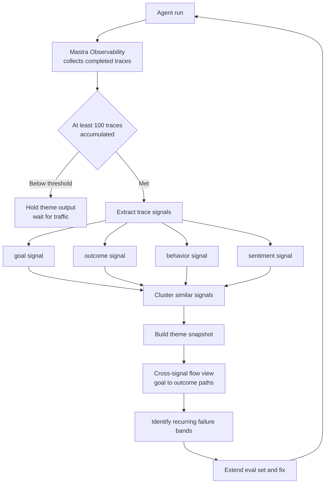

Teams that ship agents to production hit a common wall. The traces pile up fine, but nobody reads them. Thousands arrive daily, and the only ones a human opens are the handful that triggered a failure alert. The rest sit there quietly, costing storage. Trace Intelligence, which Mastra released in private beta in July 2026, aims at exactly that gap.

## Why this matters to you

This post is for platform engineers who run agents on real user traffic and own their quality, and for anyone designing an agent evaluation system. Conclusion first: **the point of Trace Intelligence is not a prettier trace viewer but moving the unit of observation from the individual trace to the theme.** A single trace tells you what happened in one session. Cluster several hundred and you get what users repeatedly ask for and where your agent repeatedly fails. The second question is the one that turns into a product decision. That said, it is in private beta with a minimum trace requirement, so read through the limits section before deciding to adopt.


*Individual traces are scattered lines; clustered themes are the thick flows they merge into.*

## Overview

Mastra is a TypeScript agent framework. It handles workflows, tool calls, memory, and evaluation in one codebase, with observability built on OpenTelemetry-style tracing. Trace Intelligence is an analysis layer on top, offered by invitation as a private beta for selected Mastra platform projects. The problem statement co-founder Sam Bhagwat gave in [his announcement on X](https://x.com/calcsam/status/2082160518115254519) is blunt: teams shipping agents can spend months reviewing traces.

Per the documentation, Trace Intelligence analyzes completed traces captured by Mastra Observability, extracts **trace signals**, and clusters similar signals into **themes**. There are four signal dimensions.

| Signal | What it captures | The operational question it answers |
|---|---|---|
| goal | What the user was trying to achieve | What is our agent actually used for |
| outcome | How that attempt ended | Which kinds of request fail repeatedly |
| behavior | The action patterns the agent took | Which tool-call paths recur |
| sentiment | User sentiment visible in the interaction | Where did we succeed technically but leave users unhappy |

Having all four together is a meaningful design choice. Outcome alone gives you a success-to-failure ratio; pair it with goal and you learn which purposes fail. Sentiment is the most interesting axis, because sessions where every tool call succeeded and a response was returned yet the user was unsatisfied are genuinely common. An observability system that only tracks log-level success misses that band entirely.

## From signals to themes, from themes to flows



*Traces decompose into signals, signals group into themes, and movement between themes becomes a flow.*

The part of the documentation that stands out is the **cross-signal theme flow**. Within a snapshot it expresses how goal themes flow into outcome themes as stages and links, rendered in a Sankey-style view, where the counts on each link are distinct traces. In practice that means you can read "what share of sessions whose goal was a pricing question ended unresolved" on a single screen. That is information no individual trace will ever give you.

Each trace also carries per-theme assignments across the ordered signals within a snapshot. So you can point at a band in the flow view and drill down to the actual traces composing it. Without that path from aggregate back to raw, an observability tool never gets used for real debugging.

## Adoption requirements

The documented conditions are as follows.

- Mastra platform Observability must be enabled with completed traces accumulating.
- Minimum versions are `@mastra/core@1.53.0` and `mastra@1.20.2`.
- Deploy or redeploy Studio for the enrolled project, then select Intelligence in the sidebar.
- Initial themes usually appear after **at least 100 completed traces from a single agent** have been processed.
- Access is by invitation, requested through the private beta form.

```bash
# Check the minimum version requirement
npm ls @mastra/core mastra

# Upgrade if below
npm i @mastra/core@^1.53.0 mastra@^1.20.2
```

That 100-trace threshold is not a footnote. Clustering-based analysis needs enough samples for themes to mean anything statistically. Put differently, this is a feature for agents already carrying real traffic, not for a prototype under development. Themes built from 100 internal test traces just reflect the developer's own usage habits.

## How this differs from existing observability tools

Agent tracing itself is not new. Mastra has supported [AI Tracing](https://mastra.ai/blog/aitracing) for a while, and there is an OpenTelemetry exporter path to external backends. Separate documentation covers tracing Mastra applications with tools like LangSmith. So "look at traces" is a solved problem.

The difference is the unit of analysis. The default unit in existing tools is one trace, with filters, search, and dashboards layered on. Aggregates like failure rate or latency distribution are provided, but the axes of those aggregates are usually predefined metadata. You can group by endpoint, model, or status code, but not by "what the user was trying to do," because that axis does not exist in the data.

What Trace Intelligence does is manufacture that axis after the fact. It reads the trace body, infers a goal, and groups similar goals to create a dimension that was never recorded. You avoid tagging upfront, but inference is involved, so accuracy is not perfect. The conditions where that trade is favorable are clear: the more open-ended the agent, where request types cannot be enumerated in advance, the better it pays off; for a narrow agent with a fixed handful of request types, plain tagging is more accurate and cheaper.

## What this means for ThakiCloud

**The Paxis lens.** Paxis is ThakiCloud's Agent-Native Cloud control plane, treating skills, tools, policies, and audit logs as first-class resources. Audit logs there already record every agent action. The question Trace Intelligence raises is whether those logs should stay a lookup surface only. In a structure that selects from over 960 skills with BM25 and runs them in an isolated sandbox, the core operational question is which request types repeatedly get the wrong skill. One audit record cannot answer that; you need clusters built per request goal. The goal-crossed-with-outcome flow view transfers directly into a way of measuring skill routing quality. It also connects to the self-evolving skill loop. The signal for choosing which skill to improve is currently failure-alert driven; ranking by the size of recurring failure themes changes the return on that effort.

**The ai-platform lens.** ThakiCloud's ai-platform serves multi-tenant AI/ML workloads on Kubernetes and Kueue. Trace clustering has implications at the infrastructure layer too. Aggregating token consumption and latency per behavior theme shows which action patterns concentrate cost. If one tool-call path eats a large share of total GPU time while succeeding rarely, that path is the optimization target. On-premises and sovereign customers add a requirement that the analysis stay inside their own cluster. Whether the same analysis is possible without shipping traces to an external SaaS becomes an actual adoption condition.

## What you can do while waiting for an invitation

The private-beta status is arguably useful preparation time, because the traces themselves have to be ready before any clustering tool attaches.

**Make session boundaries explicit.** If traces are cut at single-request granularity, goals cannot be inferred. The multiple turns a user spent pursuing one intent must group into one trace for a goal signal to exist. This is the most common gap in practice.

**Do not record outcomes as booleans.** Success and failure alone pins the outcome axis to two levels. Distinguishing abandonment mid-way, the user re-asking the same thing, and escalation to a human yields far more useful clusters later.

**Capture proxies for sentiment.** If asking users directly is impractical, retry counts, the point where a conversation was abandoned, and whether the user rephrased serve as proxies. These events usually already happen and simply are not recorded.

**Preserve tool-call paths in order.** Behavior clusters come from ordering, not from the set of calls. The same three tools in a different order is a different strategy, and only one of those orders may have a low success rate. Flattening to a set erases that distinction.

None of these four is vendor-specific. They are schema decisions that hold whether you end up on Trace Intelligence, your own analysis, or something else.

## Limits and counterarguments

**It is a private beta and not reproducible.** This post is written from public documentation and the founder's announcement. Without an invitation we could not run it and judge theme quality. In clustering-based analysis the real test is whether the themes make sense to a human, and that is exactly what we could not verify. That is why there are no performance figures here.

**Clustering may only confirm what you already know.** Teams running agents with real traffic usually already sense their main failure modes. Having automated clustering confirm that intuition with numbers has value, but whether it surfaces anything beyond it is a separate question. The value of discovery sits in the long tail, and long-tail themes are by definition sample-poor, which is where clustering is weakest.

**Signal extraction is itself an LLM call.** Pulling goal and sentiment out of a trace requires a model to read it. Analysis cost grows with traffic. Sampling rather than full analysis is likely, and then sample design becomes another accuracy variable. Not checking the cost structure of the observability layer beforehand invites surprises after adoption.

**Data governance is a blocker.** Traces contain raw user input. Having an external platform analyze them means prompt contents leave your boundary. In finance or public sector environments with export restrictions, this approach is off the table entirely. Whether a self-hosted path exists decides adoption.

**Vendor coupling.** The feature is tied to Mastra platform projects and requires specific minimum versions. Even if observability data leaves in the OpenTelemetry standard, keeping the analysis layer on the platform creates migration cost. Retaining traces yourself in a standard format and layering analysis on top is the safer long-term shape.

## Wrapping up

The next step in agent observability is not showing traces better but **needing to look at them less**. That is the direction Trace Intelligence takes. Instead of a human reading individual sessions, you read themes decomposed along goal, outcome, behavior, and sentiment, and work the largest blocks first.

If you run agents today, check whether the traces you are already collecting can carry those four axes before you wait for an invitation. Goal and sentiment are typically not recorded at all. Without those two, no analysis tool will find the band where you succeeded technically and the user still left. Schema design comes before tool selection. And where you analyze traces should be treated as a data sovereignty question, not a feature comparison.

## Sources

- [Trace Intelligence, Mastra Docs](https://mastra.ai/docs/mastra-platform/trace-intelligence)
- [Sam Bhagwat on X](https://x.com/calcsam/status/2082160518115254519)
- [Mastra now supports AI Tracing, Mastra Blog](https://mastra.ai/blog/aitracing)
