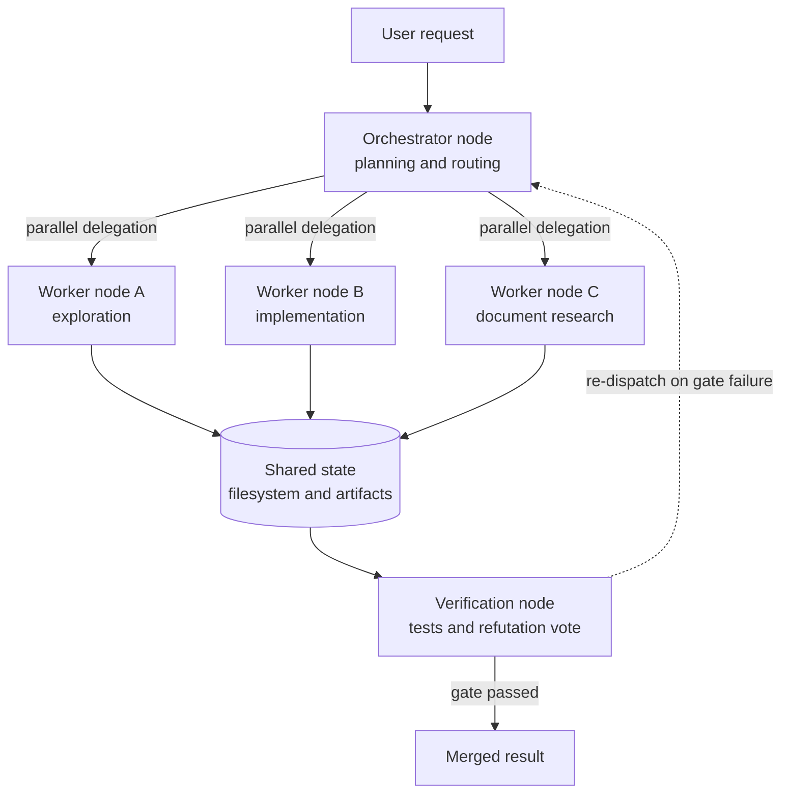

*Fanning out is the easy half. The value of a graph shows up at the gate underneath.*

## Why read this

This is for platform engineers who have started running more than one or two coding agents and now need to judge whether "we run dozens of agents" is practice or marketing. The conclusion first: organizations running dozens to hundreds of agents are not managing agent count, they are managing the shape of the graph, and the bottleneck is not model quality but node boundaries, shared state, and exit conditions. You also do not necessarily need a separate orchestration framework to build that graph. The tools already in your hands provide nodes and edges.

## Overview

It started with a short quote. In late July 2026, Anatoli Kopadze cited a 40-minute talk by the head of Claude Code on X: "85% of our engineers are running dozens or hundreds of agents. The way you do it is graph engineering." One sentence makes two claims at once, a factual claim about scale and a normative claim about method.

Let me draw the line honestly first. The 85 percent figure is a secondhand quote from a talk we were not able to view directly, so we treat it as a cited statement rather than a verified benchmark. There are verifiable numbers too. When Anthropic published the architecture behind its research feature, it reported that the parallel subagent design outperformed single-agent Claude Opus 4 by 90.2 percent on an internal evaluation, consumed roughly 15 times the tokens of a normal chat, and that token usage alone explained about 80 percent of the performance variance. For design purposes those numbers are far more useful than the scale claim, because they describe a cost structure rather than a headline.

The lineage of the term graph engineering and its layered taxonomy is something we already covered in [Graph engineering: the coordination layer that binds many loops into one task](/tech-blog/en/agentops/graph-engineering-coordination-layer/). This post is the practical companion to that one, and it deals with primitives rather than vocabulary. The subject is what becomes a node, what becomes an edge, and how that choice changes the bill.

## What the scale claim is really saying

Reading "dozens to hundreds" as a count of simultaneous processes invites confusion. Nobody can watch a hundred agents at once. What exists is a structure that removes the need to watch, and the name of that structure is a graph.

Adding one more agent adds one more decision-maker, and more decision-makers means more coordination cost. If two agents edit the same file, whichever finishes last overwrites the other. If three agents independently reach the same conclusion, something has to decide which one is adopted. If ten agents each report that they are done, those reports are worthless unless something can verify them. That is why raising the count is not itself an achievement.

So the first decisions in practice are not about how many agents to run, but about three other things. Where do you cut the work, what do the resulting pieces share, and who rules that a piece is finished. Answer those three and your nodes, edges, and exit conditions are settled. From that point on the count is merely a throughput parameter.

## Subagents are the nodes

The agent-building guide Anthropic published in 2024 laid out five composable patterns: prompt chaining, routing, parallelization, orchestrator-workers, and evaluator-optimizer. This predates the current popularity of the word graph, yet the structure was already a graph. Subagents are the nodes, the delegating main agent is the orchestrator node, and its routing decisions are the edges.



The important parts of this diagram are not the nodes but the bottom two boxes. Putting shared state on the filesystem lets workers see each other's intermediate artifacts, and at the same time creates overwrite risk. Without a verification node, a worker's self-report becomes the result and hallucinations accumulate. That is exactly why our internal rules require every fan-out to be closed by a verification stage. When quality disappoints, the most common cause is a missing verification stage rather than an insufficient model tier.

## The primitives are already in your hands

In Claude Code a subagent is defined by a single markdown file. The agent definitions in our own repository take the same shape.

```markdown
---
name: codebase-researcher
description: Maps the codebase before any code is written. Read-only.
tools: Read, Grep, Glob
model: haiku
---

Document the relevant files, existing patterns, similar prior features, and risk flags.
Return only a summary and file paths.
```

Here `tools` is the permission boundary of the node and `model` is its unit price. Those two fields effectively determine the cost curve of the whole graph. Attach a top-tier model to a node that only explores and reads files and the entire graph becomes expensive. Attach a cheap model to the verification node that renders judgment and the gate becomes toothless. That is the reasoning behind our rule that workers stay cheap while only the gates go expensive.

Edges are not separate syntax, they are expressed through dispatch. Calling several subagents in a single message creates parallel edges, and feeding one result into the next call creates a sequential edge. When several nodes touch files at the same time, isolating each one in its own git worktree removes the conflict entirely. Before adopting a framework, the thing to check is whether these primitives already draw the graph you want. Usually they do.

At Code with Claude in San Francisco in May 2026, Anthropic announced multiagent orchestration alongside outcomes, which lets you define success criteria, and dreaming, which lets Claude recall prior sessions. The composition of that announcement says something clear. Fan-out alone is not enough, and a graph only runs autonomously when exit conditions and memory sit beside it.

## What we counted in our own harness

When a claim cannot be verified, the better move is to count what you can count on your own side. These are figures tallied from our workspace as this post was written.

| Item | Count | Role |
|---|---|---|
| Skills | 1,914 | Procedural knowledge the nodes execute |
| Subagent definitions | 80 | Candidate nodes of the graph |
| Always-on rules | 60 | Constraints applied to every node |
| Registered unattended loops | 49 | The graph along the time axis |

Each of the 49 loops declares in a contract file what it produces and which signals it emits or consumes, and the registry itself is generated by a script. The reason loops are required to couple through a signal bus rather than through newly invented shared files is simple. A graph wired together by arbitrary shared files becomes a graph whose full shape nobody can see after a few months.

Node selection is code-owned as well. Nobody picks by hand among 1,914 skills, so a BM25 retriever narrows the candidates. Here is the result we actually ran while writing this post.

```text
$ python3 .claude/skills/jarvis/scripts/sra/retrieve.py \
    "Claude Code subagents agent graph orchestration multi-agent fleet parallel" --top-k 6

 #  score  kind    name                          desc
 1   10.4  skill   claude-code-ccr-cost-routing  Route Claude Code subagent traffic to a cheaper...
 2    7.9  skill   fleet-bootstrap               Make this machine's full Claude Code setup por...
 3    9.9  skill   ce-multi-agent-patterns       Design patterns for multi-agent architectures
 4    6.8  skill   agent-workflow-system         Orchestrate multi-agent workflows by composing
 5    6.5  skill   workflow-parallel             Fan out independent tasks to parallel subagent
```

That the top hit is a cost-routing skill lines up precisely with the argument of this post. The first thing a harness at scale needs is not a smarter model but routing that pushes traffic down to a cheaper tier.

One thing stays on the record. External network calls were blocked in this working environment, so we could not run a reproduction experiment that scales agent count while measuring latency and tokens. The table and the retrieval output above were tallied and executed locally, the 90.2 percent and 15x figures are Anthropic's published values, and the 85 percent is a secondhand quote. Keeping those three kinds of numbers apart serves the reader better than blending them.

## Cost decides the shape of the graph

Look at that 15x again. If a multi-agent run costs fifteen times a single-agent run, the graph is justified only when the value of the task exceeds the token cost. That inequality produces three design rules directly.

First, fan out only on work that is broad and genuinely independent. Anthropic itself noted that the multi-agent advantage shrinks on tightly interdependent work such as coding. Research-shaped tasks, where exploration branches in many directions and the total information exceeds one context window, are the ones that suit fan-out.

Second, match node unit price to the nature of the work. Send exploration and lookups to the cheapest tier, implementation and review to the middle tier, and only synthesis and final judgment to the top tier. The larger the graph, the more this placement shows up in the invoice as a multiplier rather than a linear term.

Third, let code own the exit condition. A loop stops only when something deterministic rules on it, such as a test exit code or a regex count. Let the model declare its own completion and the graph will not converge, it will simply drain the budget. For content work where judgment is fuzzy, spin up an odd number of verifiers instructed to refute and close with a vote. The tally is computed by a script, not by a person or a model.

## What this means for ThakiCloud products

Paxis is ThakiCloud's Agent-Native Cloud control plane, treating skills, tools, policies, and audit logs as first-class resources. The argument of this post is also the design rationale behind it. The skill harness selects candidates from a large skill set with BM25 so a node knows what to execute, sandboxed isolated execution keeps parallel nodes out of each other's workspace, and DAG multi-agent support expresses the orchestrator-and-worker structure drawn above directly as a resource. Policy gates and audit logs are the productized form of the third rule, which places exit conditions and the deciding authority on the code side. What an organization running dozens of agents ultimately needs is not more agents but a record it can trace back through.

On the infrastructure side, ai-platform receives the same problem at a different layer. A growing graph means more concurrent inference requests, and 15x tokens converts into serving cost. When worker traffic can be routed to in-house models on top of Kubernetes and Kueue-based GPU scheduling, vLLM serving, and multi-tenant isolation, the economics of fan-out change. This matters especially for customers with on-premises and sovereignty requirements, because graph design stops being hostage to external API pricing. Lower serving cost permits wider fan-out, and wider fan-out raises the quality of the agent product.

## Limits and counterarguments

The largest limitation is the standing of the quote this started from. The 85 percent is secondhand, and internal adoption rates run highest at the company that builds the tool. Treating the adoption rate of the team that builds Claude Code as a target for a general engineering organization is a sampling error.

The method claim has counterarguments too. A graph becomes necessary when several loops need coordinating, not from the outset. Wrapping a graph around work that a single loop already handles only widens the debugging surface. More nodes mean more failure points, and nodes added without observability produce failures whose cause cannot be established. Attaching span-level tracing before widening the fan-out is the right order.

Finally, the benefit for coding work remains contested. Changes with strong interdependence are often better handled sequentially by one agent holding the full context. Parallelization is a choice that arrives after independence has been secured, and securing that independence is still a human design judgment.

## Wrapping up

"We run dozens to hundreds of agents" should be read as a statement about structure, not a boast about count. What actually gets managed is node boundaries, shared state, and exit conditions, and once those three are settled the count drops to a throughput parameter. The verifiable numbers point the same way. Fan-out lifts performance substantially while spending 15x the tokens, so it belongs only where task value exceeds that cost.

If you take one action from this, take this one. Before you next dispatch subagents in parallel, write one sentence describing the verification node that will sit right before their results are merged. If that sentence will not come, you have a fan-out rather than a graph, and raising the count in that state raises the invoice rather than the performance. Frameworks can wait until after that.

## Sources

- [Original post by Anatoli Kopadze quoting the head of Claude Code](https://x.com/AnatoliKopadze/status/2082887253735665905)
- [Graph Engineering with Claude Code: Subagents as an Agent Graph](https://www.aibuilderclub.com/blog/graph-engineering-with-claude-code)
- [How Anthropic Built a Multi-Agent Research System (summary)](https://blog.bytebytego.com/p/how-anthropic-built-a-multi-agent)
- [Code w/ Claude SF 2026: Building on the AI exponential](https://claude.com/blog/code-w-claude-sf-2026-sf)
- [Live blog: Code w/ Claude 2026 (Simon Willison)](https://simonwillison.net/2026/May/6/code-w-claude-2026/)
- [Graph engineering: the coordination layer that binds many loops into one task (ThakiCloud)](/tech-blog/en/agentops/graph-engineering-coordination-layer/)
