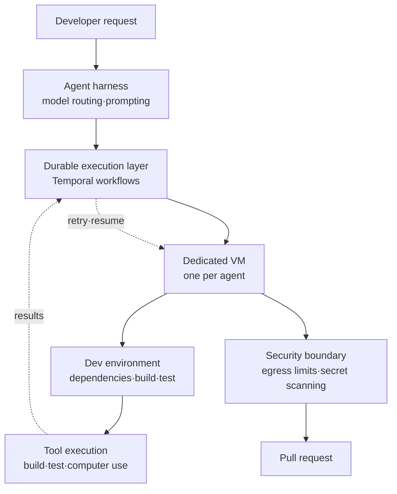

Any team that has wired a coding agent into a real repository tends to hit the same wall. The agent that looked flawless in a demo stalls halfway through actual work. It cannot run the tests, the dependencies are missing, and it has no idea about the environment variables that only ever existed on someone's laptop. So people swap the model. The internal write-up Cursor published on July 30, 2026 argues that this reflex is usually the wrong one.

*Each agent gets its own environment, works in parallel, and the results converge into one repository.*

## Why This Matters to You

This piece is written for platform engineers who have to deploy coding or autonomous agents inside their own organization, and for anyone deciding where and how that execution substrate should live. The conclusion first: **the largest single factor governing agent output quality is not model tier but the development environment in which the agent can execute and verify its own work, and that environment has to be treated as a separate product whose users happen to be agents.** Working from that premise, Cursor lifted the share of merged PRs authored by cloud agents in its own monorepo from roughly one in ten last December to 56%. We will walk through the build-out and then pull out what our own products can take from it.

<!-- nlm-visual -->

*Infographic generated by NotebookLM from the sources.*

## Overview

Cursor published [How we set up our cloud agent environment](https://cursor.com/blog/cloud-agent-environment) on July 30, 2026, credited to Mathew Hogan and Arvind Saripalli. A single sentence the official account posted on X the same day is what queued this article. Last December, one out of every ten PRs merged into the Cursor monorepo came from a cloud agent. Today that figure is 56%. The company blog phrases it as agents now writing more than half.

The part worth studying is not the growth itself but what the company points to as its cause. This is not a story about attaching a better model. It credits giving agents a development environment on par with what a human developer has, and then letting the agents improve that environment themselves.

That view comes through even more sharply in the companion post, [What we've learned building cloud agents](https://cursor.com/blog/cloud-agent-lessons). The single biggest determinant of cloud agent output quality is whether the agent has a complete development environment in which to execute and verify its work. The problem stays hidden with local agents because they inherit the developer's laptop environment for free. Move to a server and that freebie disappears.

## What a Cloud Agent Environment Is Made Of

What Cursor calls a cloud agent is not a local agent lifted onto a server. Each agent runs on its own dedicated virtual machine with its own environment, dependencies and network access. They run in parallel, run unattended, and take on longer tasks than a local agent can.

Three things are required for that picture to hold, by the company's own summary: a durable execution platform, a powerful harness, and the tooling and infrastructure that give agents realistic development environments.

### Durable Execution: They Moved to Temporal Instead of Building It

The most practical passage concerns the execution layer. As cloud agents matured, Cursor found itself rebuilding retries, scheduling across machines and durability across node failures. Temporal already solved those problems, so rather than rebuild them the team migrated.

After the move, the agent loop survives blips in inference reliability, pod hibernation and resumption, and runs stretching across days or weeks. The company states that this migration alone pushed reliability past two nines. Temporal now handles more than 50 million actions per day across more than 7 million unique workflows.

The lesson for anyone building agent infrastructure is blunt. Long-running agents converge on a workflow engine problem, and rebuilding that wheel is usually a loss.

### The Harness: Computer Use Split Into Its Own Subagent

On the harness side, there is a dedicated subagent type for computer use with its own model routing, its own prompting, and screen recording. Rather than cramming every capability into one giant prompt, work with a different character is split into a separate subagent with a model and contract suited to it.

### Workflow Lifespan: From Eternal Agents to Short Ones

Another notable shift concerns workflow lifespan. Early on there were long-lived agent workflows. Those were replaced with multiple shorter workflows that exit after completing a single task. The reason is operational. Workflows that live forever make version upgrades painful. Cut them short and new versions flow in naturally.

## Treating the Environment as a Product

The most transferable line in the write-up is the declaration that the development environment is a product in its own right, one whose users are agents rather than people.

Three practical obligations follow.

First, the cloud environment has to match the local one. When something works locally but not in the cloud, the agent burns time debugging the gap.

Second, the repository has to be legible enough for an agent to read. In Cursor's phrasing, agents must be able to run and test code without tribal knowledge. A human hire can be told by the person at the next desk, but an agent needs it written into the repository. How to run it, how to test it, which services are required, what seed data is needed, all present as reproducible scripts rather than prose.

Third, the environment has to stay healthy as the codebase changes. Environment setup is not a one-time item but an ongoing maintenance surface.

There is also an observation that this axis grows more important as models improve. Cases where agents were blocked simply because they had nowhere to execute and verify kept recurring, and as models got smarter, environment setup became the factor determining whether that potential could be used at all.

### Security Was Not Bolted On Afterward

Granting an agent execution rights widens the security surface. Cursor worked with its security team to put four things into the product: network egress restrictions, scoped and proxied git remote access, secret scanning across commits and commit messages, and secret redaction in tool results.

Those four read well as a minimum security checklist for any agent platform. Execution isolation alone is not enough. Outbound traffic and the paths credentials travel have to be closed off too.

## What the Numbers Say and What They Do Not

The published figures, collected:

| Item | Value | Source |
|---|---|---|
| Cloud agent share of merged PRs, December 2025 | roughly one in ten | Cursor blog |
| Same metric as of July 2026 | 56% (blog phrasing: more than half) | Cursor official account, blog |
| Reliability after Temporal migration | past two nines | Cursor blog |
| Temporal throughput | 50M+ actions/day, 7M+ unique workflows | Cursor blog |

These come from a single environment, the Cursor monorepo, and represent a company applying its own product to itself. PR counts do not distinguish task difficulty, so reading 56% as 56% of the engineering work would overstate it. The direction, and the cause the company assigns to that direction, are still worth borrowing.

## Implications for ThakiCloud Products

Because the subject is agent execution substrate, the Paxis lens leads, with the ai-platform lens supporting it underneath.

**Through the Paxis lens.** Paxis is ThakiCloud's Agent-Native Cloud, treating Skills, Tools, Policies and Audit Logs as first-class resources. Cursor's write-up overlaps substantially with where that design points. The Skill Harness, which selects from over 960 skills via BM25 and executes them in isolated sandboxes, corresponds to Cursor's combination of harness and execution environment. Routing every action through policy gates and audit logs sits in the same place as what egress restrictions and secret scanning were meant to solve.

There are also clear improvements to take from this piece. One is workflow lifespan design. The observation that short workflows terminating per task beat long-lived loops for both version upgrades and failure recovery applies directly to anyone operating agent DAGs. The other is promoting the environment itself to a managed artifact. Versioning the dependencies and seed state of the sandbox a skill runs in, at the same tier as the skill definition, cuts down failures where the skill was right but the environment had drifted.

**Through the ai-platform lens.** The separately published [option to run in your own infrastructure](https://cursor.com/blog/self-hosted-cloud-agents) speaks directly to our customer base. A worker process connects outbound over HTTPS only, requiring no inbound ports, firewall changes or VPN tunnels, so code, tool execution and build artifacts never leave the customer network. That is precisely the condition public sector, financial and manufacturing customers keep asking for.

ai-platform is designed to put K8s and Kueue-based GPU scheduling, vLLM serving and multi-tenant isolation on premises. Layering the agent execution environment on top of that produces a configuration where inference, tool execution and builds all finish inside the customer boundary. Adding Cursor's model of one dedicated execution unit per agent lets pod-level isolation, egress policy and secret redaction be implemented with K8s-native means. It is also where competitiveness from low serving cost becomes agent economics. Running many agents in parallel for long stretches consumes a lot of tokens, and that pattern only becomes viable when your own serving unit cost is low.

## Limits and Counterarguments

First, this is a self-referential case. The Cursor monorepo is a repository that Cursor's own engineers kept sharpening for Cursor's own agents. Organizations that cannot invest comparably in making a repository agent-legible are unlikely to see the same ratio.

Second, the claim that environment is the dominant variable rests on model quality already clearing a bar. Below that bar, no amount of environment work delivers. The lesson is closer to "stop spending your time only swapping models" than to "ignore the model."

Third, cost is absent. Giving each agent a dedicated virtual machine and running them in parallel for long stretches consumes both compute and tokens. The published piece contains no cost structure or per-PR unit economics. Anyone evaluating adoption has to compute that axis separately.

Fourth, PR share is a proxy metric. It says nothing about where the review burden moved, how defect rates shifted, or whether rollbacks increased.

## Wrapping Up

The one-line takeaway from Cursor's write-up is this: adopting cloud agents is not a model selection exercise, it is the work of building the environment those agents will live in. Across the stretch from one in ten merged PRs to 56%, what the company actually invested in was a durable execution layer, dedicated execution environments, and repository legibility.

If you are designing an agent platform, three checks are worth running this week. Can an agent build and test in our repository without tribal knowledge. Are we quietly rebuilding a long-running execution engine ourselves. Are there policy gates on the agent's outbound traffic and credential paths. If any of those stall, fixing them will pay off more than moving up one model tier.

<!-- nlm-visual -->

*Infographic generated by NotebookLM from the sources.*

## Sources

- [How we set up our cloud agent environment · Cursor](https://cursor.com/blog/cloud-agent-environment)
- [What we've learned building cloud agents · Cursor](https://cursor.com/blog/cloud-agent-lessons)
- [Run cloud agents in your own infrastructure · Cursor](https://cursor.com/blog/self-hosted-cloud-agents)
- [Cursor official account](https://x.com/cursor_ai)
