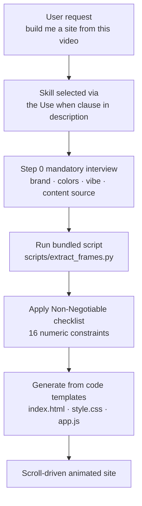

*The same skill module dropping into different agent harnesses unchanged.*

## Why read this

This is for platform engineers who run skills or plugins on coding agents, and for anyone who has to choose a skill format for an in-house agent. Two conclusions up front. First, the skill file format has already converged past vendor boundaries. Second, a skill file that actually works is a body of code and numeric constraints, not prose. The Google Antigravity skill we measured is more than half code across its 314 lines.

The occasion was ordinary. A content creator published a tutorial on building animated websites with Gemini 3.6 Flash and Antigravity, and a repository encapsulating that workflow as a skill appeared on GitHub. The file structure turned out to be far more interesting than the tutorial, because it is effectively the same specification we use every day.

## Overview

The subject is [WilkoMarketing/antigravity-video-websites-skill](https://github.com/WilkoMarketing/antigravity-video-websites-skill), an Antigravity skill that turns a video file into a scroll-driven animated website. The repository describes itself as a "Google Antigravity skill to turn videos into premium animated scroll-driven websites."

We do three things here. We take the skill file apart, we measure our own 1911 production skills with exactly the same yardstick, and we work out what the token economics of Gemini 3.6 Flash mean for agent unit cost. We did not install the Antigravity IDE and run it, so this is a structural analysis of a published artifact rather than an execution benchmark.

## What an Antigravity skill is made of

The install instructions give the structure away. The global skills directory is `~/.gemini/antigravity/skills/` on macOS and Linux, with one folder per skill.

```text
.gemini/antigravity/skills/creating-video-websites/
├── SKILL.md
└── scripts/
    └── extract_frames.py
```

`SKILL.md` opens like this.

```yaml
---
name: creating-video-websites
description: Turn a video into a premium scroll-driven animated website with GSAP, canvas frame rendering, and layered animation choreography. Use when the user wants to convert a video into an animated web experience.
---
```

Two keys, `name` and `description`, where the description states the capability in one sentence and then attaches a trigger condition with "Use when." That matches, sentence for sentence, the skill description contract we hold as an internal rule. Different vendor, different IDE, same specification.

The body has four top-level sections: `When to use this skill`, `Input`, `Premium Checklist (Non-Negotiable)`, and `Workflow`. The checklist is the part worth studying. It converts design quality, which looks like a matter of taste, into sixteen numeric constraints. Hero typography at 12rem or more, marquee text at 10vw or more, total scroll height of 800vh or more for six sections, stats overlay opacity between 0.88 and 0.92, frame advance speed between 1.8 and 2.2, canvas image scale with a sweet spot of 0.82 to 0.90. Another clause requires at least four animation types and forbids repeating the same entrance effect consecutively.

The workflow has seven steps, and step zero stands out. `Step 0: The Interview (MANDATORY)` forces the agent to ask the user six questions covering brand name, logo, accent color, background color, overall vibe, and content source before extracting a single frame or writing a line of code. It is a structural guard against an agent inventing requirements and proceeding.

The remaining steps specify the entire skeleton of the output. Step one slices the video into 150 to 300 WebP frames using the bundled script, optionally running `rembg` for background removal via the `--remove-bg` flag. Step two scaffolds into `index.html`, `css/style.css`, `js/app.js`, and `frames/`, with no bundler, just vanilla HTML, CSS, and JS plus CDN libraries. From step three onward it pins the order of loader, navigation, fixed canvas, and marquee text, how Lenis drives smooth scroll and connects to the GSAP ticker, and how the canvas renderer samples its background color from frame edge pixels every twenty frames. Dependencies are explicit too: `opencv-python` and `numpy`, plus `rembg[cpu]` if background removal is used.



*The execution path. Model freedom is squeezed between the checklist and the code templates.*

## How we measured it

Instead of impressions we counted. A script downloads the file and counts lines, code fence lines, frontmatter keys, and checklist items.

```python
for l in lines:
    if l.strip().startswith("```"):
        in_fence = not in_fence
        code += 1
        continue
    if in_fence:
        code += 1
```

The same function then ran across every `.claude/skills/*/SKILL.md` in our repository to build a comparison set. One trap surfaced. Extracting the description with `^description:\s*(.*)$` captures only `>-` for the YAML folded style most of our skills use, dropping the body entirely. The first run reported only 71 of 1911 skills carrying a "Use when" trigger, which was a parser bug rather than a property of the corpus. After teaching it to join the indented continuation lines of a folded block, the number landed where it should.

```python
inline = line.partition(":")[2].strip()
if inline and inline not in (">", ">-", "|", "|-", ">+", "|+"):
    return inline
# folded block: join the indented continuation lines
```

The scripts are at `scripts/blog/_skillmd_anatomy_20260803.py` and `_skillmd_corpus_20260803.py`, with raw output under `outputs/blog-impl/antigravity-skill-format-gemini-flash/`.

## Results

For the Antigravity skill: `SKILL.md` is 13,735 bytes across 314 lines, of which 171 lines sit inside code fences, or 54.5 percent. The frontmatter carries exactly two keys, `name` and `description`, the description is 205 characters and contains "Use when." There are four top-level sections, seven workflow steps, sixteen checklist items, and the bundled `scripts/extract_frames.py` is 84 lines.

Our own corpus, across 1911 skills, has a median of 154 lines, a mean of 189.3, and a maximum of 2063. Code share runs to a median of 18.5 percent and a mean of 19.5 percent. 1379 skills (72.2 percent) carry a "Use when" trigger in their description and 1396 (73.1 percent) keep frontmatter to just `name` and `description`. Only 154 (8.1 percent) ship a bundled `scripts/` directory.


*Code fence line share of SKILL.md under identical counting rules. The Antigravity skill's 54.5 percent sits well above our corpus median of 18.5 percent but below our toolkit-class skills, which prescribe execution steps most tightly.*

The comparison sharpens the picture. The Antigravity skill is twice as long as our median and close to three times as code-dense. Yet within our own corpus the skills that prescribe execution most tightly run denser still: pillow-toolkit at 679 lines and 87.3 percent, exiftool-toolkit at 519 lines and 85.9 percent, vips-toolkit at 483 lines and 77.0 percent. The median sits at 18.5 percent because the corpus also holds many prose-shaped skills that describe routing rules or judgment criteria.

The lesson is not about vendors. It is that the more a skill's output quality matters, the less free prose it contains and the more code and numeric constraint it carries. Antigravity turning design taste into sixteen numbers and our toolkits embedding commands verbatim are the same prescription.

Separately, Gemini 3.6 Flash, the model behind this workflow, shipped on 21 July 2026 and was available in Antigravity from day one. Per Google's announcement it uses 17 percent fewer output tokens than 3.5 Flash while output pricing dropped from $9.00 to $7.50 per million tokens. Multiplying the two effects, output cost for equivalent work lands at 0.83 times 7.50 divided by 9.00, roughly 69 percent, a saving of about 31 percent. Coding scores rose as well: DeepSWE from 37 to 49 percent, MLE Bench from 49.7 to 63.9 percent, OSWorld-Verified from 78.4 to 83.0 percent.

## What this means for ThakiCloud

From the **Paxis** side this observation is immediately useful. Paxis is ThakiCloud's Agent-Native Cloud control plane, treating skills, tools, policies, and audit logs as first-class resources. Its skill harness selects candidates from a large skill corpus with BM25 and executes them in an isolated sandbox. What this measurement confirms is that the selection signal is vendor-agnostic. An Antigravity skill also exposes `name`, `description`, and a "Use when" trigger clause, so to a router it is the same shape of input. Skills built in outside ecosystems can be indexed and added to the candidate pool as they are.

The boundary is equally clear. Format compatibility is not execution compatibility. This skill requires `pip install opencv-python` and `rembg[cpu]` in the user's environment and handles local file paths directly. Pulling in arbitrary external skills uncritically drags along dependency installation and file access. That is exactly why Paxis runs skills in a sandbox and pushes every action through policy gates and audit logs. Format convergence lowers adoption cost; execution isolation remains the platform's job.

The measurement also surfaced a task for our own corpus. Only 154 of 1911 skills, 8.1 percent, ship a bundled `scripts/` directory. That signals how many procedures are still expressed as prose when deterministic code could own them, and against our internal principle of letting code own the format, there is room left.

From the **ai-platform** side this becomes a cost question. Agent workload cost scales with output tokens, and the 31 percent saving computed above applies when using a commercial API. An organization that cannot send code or assets outside its perimeter has to produce that same saving on premise, and the means are Kubernetes with Kueue-based GPU scheduling and vLLM serving optimization. That is the target ThakiCloud's ai-platform aims at.

## Limits and counterarguments

The largest limitation is that we did not execute anything. We never installed the Antigravity IDE and ran the skill, so whether those sixteen constraints actually produce good output is unverified. We established what the file demands, not the quality of what it yields.

The metric itself is coarse. Code fence line share is a proxy for a skill's character, not a quality score. Skills that describe judgment criteria or routing rules should have low code share, and forcing code into them would make them worse. Reading our 18.5 percent median as a defect to fix would be a mistake.

The sample is also a single repository. One skill published by an individual developer cannot support a claim about the Antigravity skill ecosystem generally. How Google documents its official skill specification is a separate question, and we did not verify whether this repository follows it faithfully.

The Gemini 3.6 Flash figures rest on press coverage of Google's announcement. The 17 percent token reduction is measured against the Artificial Analysis Index and varies by workload, so the 31 percent saving holds only under that premise. We did not measure it in a live application.

Finally, observing that the format has converged is not the same as standardization. Sharing `name` and `description` is a long way from compatible tool permission models, sandbox policies, and bundled asset conventions.

## Wrapping up

Taking apart one published Antigravity skill, we found a `SKILL.md` carrying `name` and `description` with a "Use when" trigger clause exactly as ours do, 54.5 percent of its 314 lines given over to code, and design taste reduced to sixteen numeric constraints. Both claims from the opening hold. The format has converged past vendor lines, and a working skill is code and constraint rather than prompt.

There is one thing to take into practice. Every time you are tempted to write "do this well" into a new skill, ask first whether it can become a number or a line of code. If it can come down to something checkable, like 12rem or more, or between 0.88 and 0.92, write it that way. The freedom you remove from the model comes back as average output quality.

## Sources

- Skill repository: [WilkoMarketing/antigravity-video-websites-skill](https://github.com/WilkoMarketing/antigravity-video-websites-skill) (`SKILL.md`, `scripts/extract_frames.py`)
- Gemini 3.6 Flash launch coverage: [Google launches Gemini 3.6 Flash and 3.5 Flash-Lite, teases Gemini 4](https://9to5google.com/2026/07/21/gemini-3-6-flash-launch/) (9to5Google, 21 July 2026)
- Measurement scripts and raw logs: `scripts/blog/_skillmd_anatomy_20260803.py`, `scripts/blog/_skillmd_corpus_20260803.py`, `outputs/blog-impl/antigravity-skill-format-gemini-flash/run-1.log`, `run-2.log`
