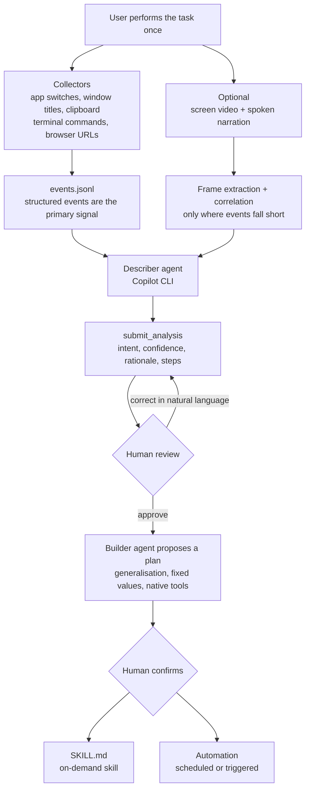

*One demonstration hardening into a reusable procedure. That is exactly what this tool is trying to do.*

## Why this matters

This post is for platform owners who hit the "who is going to write the skills" wall while rolling out agents, and for agent engineers designing a skill authoring pipeline. The conclusion first: **Skill Recorder's real contribution is not screen recording but the design decision to generalise a recording into the agent's native tool calls rather than replaying clicks, plus opening that generalisation up so a human can review and correct it in natural language. That middle step is what separates a usable tool from a demo.** Below is what we found by cloning the repository, reading the code and running its tests.

## Overview

Skills as a format converged on something close to a standard over the past year. Write the procedure in a markdown file, describe in frontmatter when it applies, and the agent picks it up on its own. The problem is who writes that markdown. The person who knows a procedure best usually has no time to document it, and the person with time does not know the procedure. The bottleneck in the skill ecosystem was never consumption; it was production.

[microsoft/skill-recorder](https://github.com/microsoft/skill-recorder) aims at that bottleneck. It records a screen session while you do your normal work once, reconstructs it through the GitHub Copilot CLI as a single intent plus an ordered list of steps, and then builds a reusable skill or automation. The licence is MIT and the copyright line reads Microsoft Corporation. At the time we checked, the latest commit was `32fd0b5` dated 30 July 2026, merging release 0.3.1.

It is larger than you might guess. TypeScript-family sources including tests and docs run a little over twenty thousand lines. This is not a demo prototype; it is built to ship.

## What the tool actually does

The behaviour breaks into four blocks.

First, **collection**. The event types defined in `common/events.ts` tell you immediately what it captures: session start and stop, active application switches, window title changes, clipboard changes, terminal commands, browser URLs, plus video start, stop and frame capture. Right from here you can see the posture: do not try to comprehend raw pixels, capture meaningful structured signals first.

Second, **reconstruction**. `electron/describer/` spins up a Copilot CLI agent and has it interpret the session. The agent gets three kinds of tool. `get_timeline` reads the segmented timeline, `get_narration` reads whatever the user said out loud, and a set of frame tools pulls the screen image at a specific moment. It submits its result through `submit_analysis`, whose arguments are telling: a title, the intent, **a confidence score for that intent**, the rationale behind that confidence, and the list of steps.

Third, **plan and approval**. The comment block in `common/skill.ts` describes this precisely. Starting from an approved analysis, a multi-turn Copilot agent first proposes a plan: how it intends to generalise the recorded task, which fixed values it needs, and which native tools of the target architecture it will use. The user refines that plan in natural language, and on confirmation the final artefact is produced.

Fourth, **output**. There are two artefact kinds: an on-demand `SKILL.md` the agent invokes when its description matches the request, and an automation, meaning a multi-step procedure run on a schedule or trigger. Microsoft Scout and Microsoft 365 Copilot (Cowork) are the currently enabled targets; Copilot Studio is marked "coming soon" and greyed out in the code.



The most impressive judgement call is how video is handled. The comments in `electron/pipeline.ts` state deliberately that the whole video is never scanned. Events are the primary signal; anything they fail to explain is surfaced as a probe suggestion and only harvested where confidence is low. The describer instructions repeat the same principle, telling the agent that most steps are fully explained by events alone and to budget roughly five frames. Compared with shoving an entire video into a multimodal model, this is far more realistic on both cost and accuracy.

The second standout is the rule to **use intent as a filter**. The instructions explicitly say not to produce a literal transcript of everything on screen. Once the intent is clear, drop the activity that does not serve it. It even singles out the first step, where the user focused the Skill Recorder window to press Start, and the last step, where they returned to press Stop, as recorder bracketing rather than user actions, and tells the agent not to emit them. If the person detoured to another site mid-demonstration, that drops out too.

## Setup and integration

We pulled the repository into an isolated worktree and ran it.

```bash
git clone --depth 1 https://github.com/microsoft/skill-recorder.git
cd skill-recorder
node --version   # v24.1.0
npm --version    # 11.3.0
npm install --no-audit --no-fund
```

Dependency installation took 25 seconds for 609 packages, which is light for something pulling in Electron 43 and Vite 8. The runtime dependency list characterises the tool well.

```json
"dependencies": {
  "@github/copilot-sdk": "^1.0.6",
  "@huggingface/transformers": "^4.2.0",
  "koffi": "^3.1.1",
  "sharp": "^0.34.5",
  "zod": "^4.3.6"
}
```

`@github/copilot-sdk` is the agent that performs analysis and building, `koffi` is the FFI used to read native window information, and `sharp` handles frame images. The presence of `@huggingface/transformers` matters: it means spoken narration is transcribed **locally**, through that library and the ONNX runtime. The macOS microphone usage string in the build config says the same thing, stating that the microphone is used only while narration is on and that transcription happens on this computer.

We ran the tests.

```bash
npm test
# ℹ tests 58
# ℹ pass 58
# ℹ fail 0
# ℹ duration_ms 686.846708
```

All 58 tests passed in 0.69 seconds. More interesting than the pass is **what is being tested**. The list includes items like: warn before every start until the detailed disclosure has been reviewed, the acknowledgement does not survive a new app process, session size accounts for every artefact and deleting removes the whole directory. A tool that records your screen, clipboard and terminal ought to have that minimum courtesy, and here it is nailed down in tests.

The compliance tests are equally notable. Unreviewed ONNX versions fail closed, unreviewed GitHub Copilot CLI versions fail closed, and a bundle containing only licence files cannot pass release verification. The exact items an organisation would want to check during due diligence are already automated.

One honest note. **We never ran an actual recording session.** It is a desktop GUI application requiring screen capture permission and a Copilot CLI login, so it cannot be reproduced end to end in an automated environment. The pipeline behaviour described above was verified by reading the code and instruction files; the numbers come from an installation and test run that genuinely happened.

## What this means for ThakiCloud

Paxis, ThakiCloud's Agent-Native Cloud, is a control plane that treats skills, tools, policies and audit logs as first-class resources. It selects candidates from more than 960 skills, executes them in isolated sandboxes, and puts every action through a policy gate and an audit log. So our interest in this tool is not "how do you choose a skill" but "where do skills come from".

First, **it names the gap on the input side precisely.** In our harness, skills are either written by a person or refined from existing skills by the nightly self-evolution loop. Both start from an already documented procedure. What never enters through either path is the procedure that lives only in someone's fingertips, such as checking a value on a particular dashboard and transferring it into a ticket template. A path from one demonstration to a draft fills that gap.

Second, **the principle of generalising to native tools rather than replaying UI is worth adopting directly.** Automation that retraces click coordinates breaks the moment the screen changes. Translate an observed click into the API call or CLI command that produces the same result and it lives much longer. Our own rules already say deterministic code owns format and adjudication while the model produces only content, which is the same idea in a different domain.

Third, **we are borrowing the decision to ship confidence with the artefact.** Attaching an intent confidence and its rationale to the analysis tells a human where to look first. During review of an auto-generated skill, that signal cuts the review cost substantially. It is a good field to add to our skill intake gate.

Fourth, **the boundary is clear too.** Because the artefacts target Microsoft Scout and Cowork, they do not drop straight into our harness. The intermediate artefact, however, meaning the intent and the step list, is target-neutral. Splitting there and rendering into our own format through an adapter is the realistic integration path. Conveniently, the repository keeps separate evaluation harnesses for the builder and the skill builder under `evals/`, so the code itself points at which boundary is replaceable.

## Limits and counterarguments

The largest constraint is that this is a desktop application. A human has to sit down and demonstrate, and grant access to the screen, clipboard and terminal. It is not something you run in batch on a server. Adopting it across an organisation requires an internal policy on which screens may be recorded in the first place. It is good that the team defended this surface with tests, but tests do not substitute for the policy.

The quality of generalisation also needs verification. Deciding what is a fixed value and what varies each time, from a single demonstration, is inherently an inference. To extract "the procedure for submitting all forms" from one record of submitting one form, you have to know whether the value entered this time was an example or a constant. Get that wrong and the skill fails quietly. That is why the tool opens the plan step to the user and accepts natural language corrections, which also means **the human review cannot be removed from the loop.**

Finally, one demonstration does not guarantee a good skill. The way a person habitually works may not be optimal, and that inefficiency gets frozen in along with everything else. Transcribing a procedure and redesigning a procedure are different jobs. This tool is good at the former; the latter remains ours.

## Wrapping up

What is worth taking from Skill Recorder is not the recording feature but three design judgements: treat structured events as the primary signal and reach for video only where confidence is low, translate observed clicks into native tool calls instead of replaying them, and open the middle of the pipeline so a human can correct intent and plan in natural language. All three transfer directly to how we design a skill authoring path.

If your team is rolling out agents, try one question. Which procedure in your organisation is repeated most often and written down by nobody? That answer is your first recording target, and the slot currently empty in your skill library.

## Sources

- [microsoft/skill-recorder repository (MIT)](https://github.com/microsoft/skill-recorder): commit `32fd0b5` at time of check, release 0.3.1 (2026-07-30)
- [Visual Studio Blog: Agent Skills in Visual Studio](https://devblogs.microsoft.com/visualstudio/agent-skills-in-visual-studio/)
- [Microsoft Learn: Use Agent Skills with GitHub Copilot](https://learn.microsoft.com/en-us/visualstudio/ide/copilot-agent-skills?view=visualstudio)
- Original discussion: [timeline post](https://x.com/hjguyhan/status/2084036443769643295)
- Execution log: installation and test figures come from `outputs/blog-impl/ms-skill-recorder/run-5.log` and `run-6.log`.
