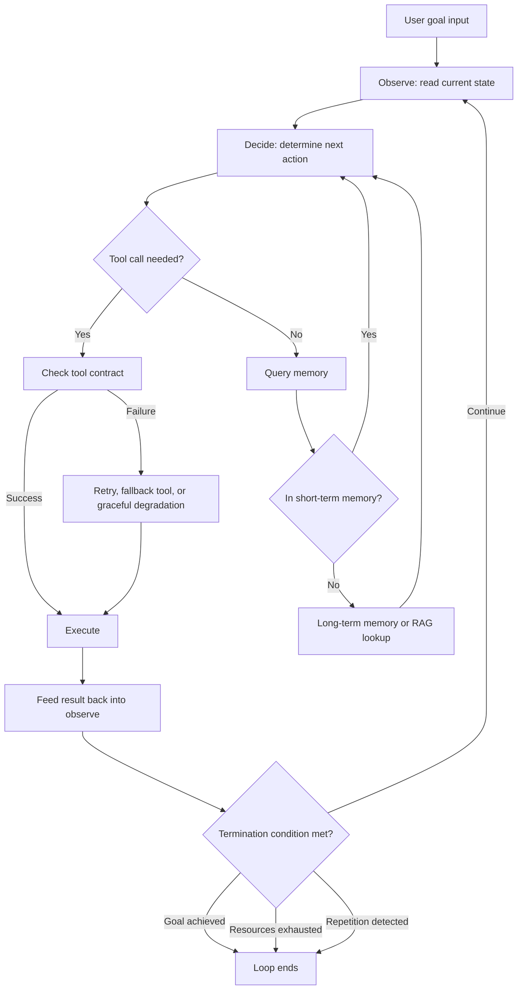

Teams bolting on their first agent usually start by wrapping a handful of tools in schemas and polishing a prompt. A few weeks in, though, the same questions keep coming back around: when should this loop stop, who steps in for a tool that fails, does it need to remember yesterday's conversation today. This post starts from the premise that locking these questions down as structure from the beginning saves you the cost of going back and fixing them later.

There are four core decisions: the criterion that tells you whether an agent is truly an agent, the contract governing tools, the agent's window onto the world, the memory tiers that decide what stays in the context window and what gets dropped, and the termination condition for the loop that wraps all of it. Get any one of the four wrong on the fly and the other three wobble along with it.

## Distinguish Agency by Recovery Ability

What separates agentic systems from automation isn't appearance, it's behavior when something fails. A self-driving car that stops at a red light is autonomous but not agentic. The input determines the output; it has no capacity to reason out a detour when the traffic light itself breaks. Only a system that can construct a new strategy on its own in an unforeseen situation has agency.

This distinction matters in practice because it flips your design judgment early on. When you build an automation pipeline, the right move is to enumerate exception cases up front and branch for each one. But carry that same approach over to an agent and the system simply does nothing the moment it hits a situation outside the branches you defined. An agent is supposed to interpret the state it observes on its own and choose a new action, and a system living inside a decision table can't do that.

Agentic systems run on a cycle of three stages, observe, decide, act. Observe reads the current state, decide picks the next action, act carries it out, and the result feeds back into observe. The cycle itself is simple, but if you don't define when it stops, the system spins forever. So the first question a designer needs to answer is "does this agent genuinely form new judgments," and the second is "when does the repetition of that judgment get cut off."

Applying this distinction to a code review bot makes the difference concrete. A bot that always leaves the same comment on a line that trips a fixed lint rule is autonomous but not agentic. A bot that observes the developer's reaction after leaving a comment, acceptance, dismissal, pushback, and lowers a given rule's priority on its own when the same type of feedback keeps getting dismissed, has agency. The two bots' code can look similar on the surface, yet their architectures are entirely different, because the latter must have a stateful path that feeds observed results back into its next decision.

## Tools Are Collaboration Contracts, Not APIs

The only channel through which an agent touches the world is its tools. Design a tool like an ordinary function or API, though, and you run into trouble. Unlike an API that a human reads documentation for and calls, a tool has to explain itself to the agent using nothing but a name, a description, and a schema. There's no human standing by to fill in the gaps.

A frequent mistake here is picking the wrong level of abstraction. Give the agent a single tool called "create event" and it has to work out the time, place, attendees, and conflicts entirely on its own. Split it into five instead, "check time," "check location," "check attendees," "detect conflicts," "register event," and each judgment arrives as an isolated unit that the agent can combine only as needed. There's no universal right answer here; you match it to how capable the agent's reasoning is.

Among the principles that matter for contract design, the one that trips people up most in practice is how errors get expressed. If a tool fails and simply reports back "it failed," the agent has no basis to pick its next move. A "permission denied" error needs to read as a signal to go acquire permission; a "target does not exist" error needs to read as a signal to create the target first. An error message isn't a log line, it's an input for the next decision.

Idempotency is another property you need to nail down at design time for the same reason. A guarantee that the same input yields the same result is what lets an agent plan ahead and design a recovery strategy for failure. Tools that mutate state, though, are fundamentally not idempotent. For these, either design the outcome as a predictable state transition, or write the contract so the agent interprets the result itself and decides the next step from there.

It's worth planning failure handling ahead of time across three tiers: retry, fallback tool, and graceful degradation. Retry is only valid for transient problems and needs a cap. A fallback tool is a backup that achieves the same purpose by a different route. Graceful degradation keeps the system running on a narrower feature set instead of taking the whole feature down. Leave these three to be improvised at runtime and the outcome differs with every failure; plan them ahead of time and the system's behavior stays consistent even when failures happen.

## Splitting Memory Into Short- and Long-Term Keeps It Dense

The context window is finite. Keeping the entire conversation around verbatim is easy to implement but saturates fast. Filter aggressively by an importance score instead, and once that scoring criterion turns fuzzy, the agent starts basing its decisions on the wrong information.

The structure that holds up in practice is physically separating short-term and long-term memory. Short-term memory holds only what the task in progress needs right now: the current conversation's context, the task's state, the immediate goal. Long-term memory holds what isn't needed right this moment but will be useful later: user preferences, recurring procedures, accumulated experience. Mix the two at the same tier and information you always need gets diluted with information you occasionally need, and density drops.

What's genuinely hard about this split is deciding when to promote something from short-term to long-term. In practice you use three axes together: frequency, importance, and time. Promote concepts mentioned often; drop details that surfaced once. Judge importance from explicit user feedback or whether a task succeeded; weight down importance as time passes. Encode all three axes explicitly in code, and the promotion criteria become reproducible.

Retrieval-augmented generation, RAG, looks like it overlaps with agent memory but actually solves a different problem. RAG is a pull system: a question comes in and it fetches the matching knowledge. Agent memory is a push system: while the conversation runs, the system decides on its own what matters and stores it. In practice it's cleanest to split the responsibility three ways by adding live tool calls to the mix. Information inside the agent's own scope of activity, conversation context, task progress, is agent memory's job; information outside that scope but reachable by search, internal docs, catalogs, is RAG's job; information obtainable only in real time, the current time, an external API's live status, is a tool call's job. Treating RAG as a replacement for agent memory tangles up the design. The two are separate, complementary layers.

The level of structure your memory uses is also a choice you need to make early. Store the conversation verbatim and you lose no information, but retrieval efficiency suffers. Structure it with a predefined schema and retrieval speeds up, but information that doesn't fit the schema gets discarded. Most production systems land in between: core metadata, task type, related files, user intent, gets stored in structured fields, while the detailed history is kept verbatim but indexed.

## The Loop's Termination Condition Must Be Judged by Code

The repetitive structure of an agentic system is dangerous in proportion to how powerful it is. Design the termination condition poorly and it fails in two directions: stopping before the goal is actually met, or continuing to run even after the goal has already been met.

Premature termination usually stems from an unclear threshold for "good enough." A goal like "process 100 records" is unambiguous, the counter hitting 100 means done, but a goal like "find the best method" leaves the system with no way to know when to stop unless "best" gets defined. So when you hand an agent a qualitative goal, you first need to translate that goal into a condition you can actually adjudicate.

Infinite loops happen when the quality of judgment isn't good enough, a state of repeating the same decision on the same observation with no progress being made. There are two safeguards against this. One is a cap on the number of iterations, cutting off unconditionally once the same pattern repeats a set number of times. The other is a progress measure, gauging whether each iteration actually made progress toward the goal and stopping if it didn't. In practice you combine at least two of four termination conditions: goal achieved, resources exhausted, repetition detected, human intervention. Rely on goal achievement alone and you have no backup for the case where the agent misunderstood the goal in the first place.

The point that's easy to miss here is who gets to judge the termination condition. Leave the "is this good enough" call to the agent itself, and the agent ends up validating its own output, which can't catch its own errors. The termination condition has to be judged by deterministic code outside the agent. It needs to be the kind of thing that comes out true or false when you run it, a test passing, a counter value, an explicit rule, and the model's natural-language self-report, "I think this is done," must never be treated as the termination signal.

Scaling out to multiple agents layers communication and conflict resolution on top of all this. For communication, pick synchronous or asynchronous to fit the situation: wait synchronously for a response when urgent action is needed, let independent work stream asynchronously otherwise. For conflicts, resolve them by priority, by negotiation, or through a central coordinator; in production, priority-based resolution is the most predictable and the easiest to debug. Negotiation-based resolution is flexible but its outcome can vary run to run, which hurts reproducibility.

How you distribute responsibility is also something to decide ahead of time. Split agents by function, analysis, planning, execution, and each agent's prompt and toolset stays narrow and clear, which is easy to manage. Split them by stage instead, problem identification, solution proposal, execution, and you can follow the flow of the work as it happens, which makes it easy to see where debugging got stuck. In practice teams usually mix the two: the overall structure is split by stage, and function-specific agents get redeployed within each stage as needed. Fail to decide this structure up front and, as the number of agents grows, who's responsible for what becomes tacit knowledge you can only recover by reading code reviews.

Before going to production, prepare design validation and operational monitoring as two separate tracks. Design validation confirms three things with tests: behavior, does the right output come out for a given input; performance, does it finish within its allotted resources; and safety, does it avoid dangerous actions. Operational monitoring continuously tracks four metrics: loop frequency, decision quality, resource utilization, error rate. Suspect unnecessary repetition when loop frequency is too high, and suspect a stall when it's too low. As these metrics accumulate, adjusting the memory structure and tuning the loop parameters is the actual path by which a production agent improves.

Below is a summary of how the four decisions covered so far mesh together inside a single system.



Translating the observe-decide-act loop and its termination condition into actual code produces the skeleton below. The key point is that code, not the model, owns the termination verdict.

```python
def run_agent_loop(goal, max_iterations=20, stall_threshold=3):
    state = observe_initial_state(goal)
    last_states = []

    for i in range(max_iterations):
        action = decide_next_action(state, goal)   # Judgment is local, no explicit link to the past
        result = execute(action)                    # Execute: a tool call or a message send
        state = merge_observation(state, result)     # The result feeds back into the next observation

        if is_goal_satisfied(state, goal):           # Deterministic judgment function (owned by code)
            return {"status": "done", "iterations": i + 1}

        last_states.append(state.fingerprint())
        if last_states.count(state.fingerprint()) >= stall_threshold:
            return {"status": "stalled", "iterations": i + 1}  # Guards against infinite loops

    return {"status": "budget_exceeded", "iterations": max_iterations}
```

On the tool side, design errors so they become input to the next decision. Instead of throwing back a single string message, return the cause together with the alternatives available to the agent.

```python
class ToolError(Exception):
    def __init__(self, reason: str, suggested_action: str):
        self.reason = reason                 # "permission denied", "target not found", etc.
        self.suggested_action = suggested_action  # A hint for what action the agent should take next
        super().__init__(f"{reason}: {suggested_action}")
```

## From ThakiCloud's Perspective

We serve a K8s-based AI platform directly in our clients' on-prem environments. From that vantage point, of the four decisions this post covers, the loop termination condition and the memory tiers in particular spill over into a platform-layer problem. When each application developer writes their own termination logic differently, one agent runs until it exhausts its resources while another stops after a single failure. From a cluster operator's standpoint, that variance shows up as unpredictable GPU occupancy. So we frequently land on the conclusion that it's safer to enforce the iteration cap and the resource-exhaustion condition as platform-level defaults rather than leaving them to application code.

The memory tier is similar. On-prem environments often don't even have the option of exporting data to an external managed vector DB or memory service. If you don't lock in a structure from the start that separates short-term and long-term memory and keeps long-term memory in storage you can operate internally, you end up having to redesign the entire architecture later because of a data-export problem.

## Summary

Standing up an agentic system isn't a matter of writing good prompts, it's a matter of deciding, up front, **how far to allow agency and how to cut off its repetition**. Distinguish autonomy from agency to determine the system's character, design tools as collaboration contracts rather than APIs, physically split memory into short-term and long-term, and make sure loop termination is judged by deterministic code. Once these four things are in place, the system as a whole stays steady even when the agent runs into the unexpected.

This post is a blog rewrite of a section from our ebook 『Agentic Software Design』.
