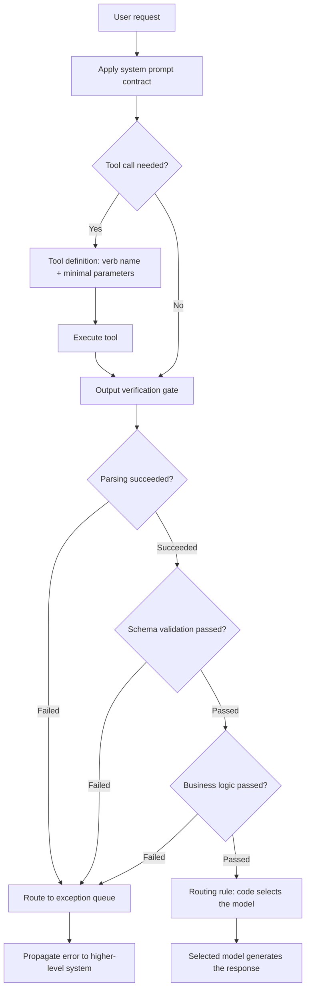

This post is for engineers who've bumped a model from Sonnet up to Opus, watched it stay stable for the first few days, and then seen it start producing different outputs for the same input all over again. By the end, you should have a feel for how firmly the four layers, system prompt, tool definitions, output verification, and routing, need to be locked down in code before an agent runs reliably regardless of model tier.

The relationship between model tier and agent reliability isn't linear the way people commonly expect. A stronger model produces better reasoning, but that doesn't guarantee the reasoning points the same direction every time. What sets the direction isn't the model, it's the structure wrapped around the model: the harness. The harness is the layer that defines how the agent thinks, which tools it uses, and by what standard it verifies its output. The reason two teams get different results from the same model and the same prompt usually comes down to whether this layer exists.

The symptoms that show up when the harness is empty are fairly consistent. Output format wobbles, one time it comes back as JSON, the next as prose. Tool selection varies too, the same request queries a database on one call and reaches for web search on another. Recovery from failure doesn't happen either; the model recognizes an error occurred but can't decide on its own what to do next. All three symptoms come from the same root: the model having to reason from scratch every single moment. That judgment is context-sensitive, and small differences in input shake the outcome. It's the same root cause behind an agent that handles a five-file summary fine but, handed thirty files, starts skipping some or arbitrarily adjusting how deep it summarizes.

When bumping the model looks like it improved things, it's usually one of two cases. One is that a stronger model's reasoning power temporarily papered over a gap in the existing harness; because the structure itself wasn't fixed, the gap resurfaces once time passes. The other is that the harness actually got improved along with the model tier, and only in this case does the effect stick. Most teams change only the model and leave the harness as is, which is why they repeatedly go through the pattern of things working well for the first two weeks and then falling apart again. The model is the engine, and the harness is what steers it. Swap in a bigger engine and leave the steering alone, and you go faster while drifting off course in the same place, the same way. The four sections below take apart the four layers that make up that steering mechanism: system prompt, tool definitions, output verification, and routing.

## The System Prompt Is a Contract, Not a Set of Instructions

Plenty of teams expect that writing the system prompt more forcefully, in more detail, will get the model to follow it better. In practice, though, the longer the prompt gets, the worse the model becomes at reflecting the whole set of instructions evenly. It ignores some parts and overreacts to others. A better approach is to treat the prompt as a contract rather than a set of instructions, a contract that clearly specifies what it takes as input, what it produces as output, and how it responds in which situations.

The first principle to hold onto when designing that contract is a single focus. Give one prompt one role. Cram multiple roles into a single sentence, "analyze the data, write the report, search when needed, and verify the results too," and the model's attention allocated to each role scatters proportionally. If multiple stages are genuinely needed, split them into separate contracts per stage and let the agent's architecture handle connecting them. With one role, the model can commit to it fully.

How you phrase constraints also affects the outcome. Listing allowed behaviors is fragile against situations you didn't anticipate; every time the model responds in a way that's not on the list, you have to extend the list, so the prompt grows without end. Listing forbidden behaviors instead tends to produce a shorter list, and the model follows a short prohibition list more accurately. This is why, when trying to stop an agent from copying search results verbatim into its answer, the prohibition "don't paste search-result sentences in verbatim" works better than the permission "provide analysis." The former makes the model re-judge what counts as "analysis" every single time; the latter draws the line once and for all.

When conveying output format, spelling out rules rather than relying on a single example is also more stable. An example shows only one input-output pair, and the moment a new input differs even slightly from that pair, the model starts guessing at the format, and that guess is often wrong. Enumerating "what must be present" as rules and leaving "what it looks like" up to the model keeps the format intact regardless of context. The more complex the input gets, the more an example's usefulness shrinks and a rule's usefulness grows.

## Tool Names and Parameters Do the Deciding for the Model

Tool definitions are the ground the model stands on when deciding when to take what action. Name a tool with a noun-first style like "reportGenerator" and the model only learns that it needs to generate a report, it still has to guess what input is required on its own. Name it with a verb in the base form like "generate_report" and the model looks straight at the tool description for the input it needs. When two tools have similarly worded names, like "user_data_analyzer" and "process_user_data," the model has to reinterpret that subtle difference on every single call, and that interpretation can waver from one call to the next.

Keeping parameters to a minimum is another core piece of tool design. The more parameters there are, the lower the odds the model fills them all in correctly, and the more uncertain a value is, the more likely the model is to either skip the call entirely or fall back on some arbitrary default.

```
# Bad design: the model has to correctly fill in five values at once
search_users(table: string, columns: list[string], filters: dict,
             sort_by: string, limit: int, offset: int)

# Good design: one required value, the rest handled by defaults
search_users(query: string, max_results: int = 10)
```

Make query the only required field and the model can focus entirely on extracting the query from the user's question. When complex filtering is needed, you can fold it straight into query itself, which naturally settles the granularity of tool calls.

Growing the number of tools also calls for caution. The more tools there are, the more of a burden the model carries in judging which tool fits a given situation, and the odds of a wrong call rise right along with it. This is also why you don't expose a web search tool to a code review agent. It's work that code alone is fully capable of resolving, but the moment a search tool is visible, the model leaks into search every time it's uncertain, and that skews review quality. Exposing only the tools directly relevant to a given role reduces judgment errors. A small set of coarse-grained tools often beats a large set of fine-grained ones.

## The Output Verification Gate Is Owned by Code

Hallucination is the thorniest problem to handle in an agent. Putting "verify it yourself" into the system prompt is logically self-contradictory. If a model could detect its own hallucination, it wouldn't have produced that hallucination in the first place. Verification has to be a separate layer, owned by code outside the model, without exception.

Splitting the verification gate into three stages clarifies each stage's responsibility. The first stage is parsing: converting the model's output into a structured form, and rejecting on the spot the moment the format breaks. The second stage is schema validation: confirming required fields are present, types match, and values fall within a valid range. The third stage is business-logic validation: rejecting output that passed the schema but violates a domain rule.

```python
def verify_output(raw_output: str, schema: dict, business_rule):
    try:
        parsed = json.loads(raw_output)          # Stage 1: parsing
    except json.JSONDecodeError as e:
        return reject(reason="PARSE_FAILED", detail=str(e))

    schema_errors = validate_schema(parsed, schema)  # Stage 2: schema validation
    if schema_errors:
        return reject(reason="SCHEMA_INVALID", detail=schema_errors)

    if not business_rule(parsed):                # Stage 3: business-logic validation
        return reject(reason="BUSINESS_RULE_VIOLATED")

    return accept(parsed)
```

How you handle output that fails verification also needs design. Retrying the model with the same input is nothing more than repeating the same judgment through another attempt, so it's likely to fail again for the same reason. A more effective approach is routing instead of retrying: send the failed output to an exception queue, and in that queue, a different agent, or a human, examines the cause, not the model. A retry is right for a transient cause like a network timeout, but for a case where the judgment itself was wrong, like a schema validation failure, repeating the same judgment just produces the same result, so routing is the right call, not a retry.

The worst way to handle a failure is to hide it and imitate a normal output. Any error caught by the verification gate needs to propagate straight up to the higher-level system as is. The agent doesn't try to conceal or soften a failure, it hands it up the moment it's detected. When this principle holds, the system's trustworthiness rests not on the model's self-assessment but on output that has actually passed verification.

## Routing and Model Selection Are Decided by Code

Some teams put branching logic like "if it's a payment question, route to the payment agent, otherwise general conversation" into the system prompt. But a model's judgment is probabilistic, so the same input can be routed differently from one call to the next. However clear the criterion is, there's no guarantee the model follows it every single time. Routing decisions need to be owned by code, not the prompt, if you want the accuracy to stop wavering.

```python
def route_request(user_input: str) -> str:
    if is_payment_related(user_input):
        return "payment_agent"
    if is_technical_support(user_input):
        return "support_agent"
    return "general_agent"
```

Once code owns routing, three things change. Branch results always reproduce exactly the same way. You can verify every path with unit tests. And when the criteria change, you don't have to retrain the model, just fix the code and it takes effect immediately.

The production pattern of combining multiple models follows the same principle. Sending a simple lookup to a lighter model and a complex analysis to a stronger one is efficient, but leave that choice to the model itself and the outcome becomes unpredictable. The correct direction is for the harness to look at the input's complexity and risk and decide which model it goes to. A representative pattern is a customer support agent that generates the first response with a lighter model, then escalates to a stronger model based on complexity if the user asks a follow-up question. Here, the judgment of "does this need escalation" is always made by code, and the model's job stays confined to generating the response.

Agent quality isn't something you design once and finish, it's something you have to keep measuring across five axes: accuracy, consistency, timeliness, appropriateness, and resilience. Accuracy is the verification gate's job; consistency is the system prompt's stability; timeliness is the execution strategy's job; appropriateness is the routing rules' job; resilience is the error-handling structure's job. Collecting failure cases in production, tracing which axis and which component each case connects to, and fixing it, repeating that cycle, is the only path by which a harness actually improves.

Below is a summary of the order in which the four layers covered so far mesh together when processing a single request.



## From ThakiCloud's Perspective

We serve a K8s-based AI platform directly in our clients' on-prem environments. From that vantage point, harness design doesn't stay confined to the application team's problem. When every team names its tools differently and applies a different strictness to its verification gates, some agents on the very same cluster let bad output through untouched while others halt over a trivial validation failure. So we take the view that it's safer to enforce the three-stage structure of the output verification gate, and the principle of propagating failures upward, as a common contract at the platform level. Leave it to each application to write its own verification logic from scratch, and you get variance, one team only parses, another checks all the way down to business logic, and that variance eventually comes back to us, the platform operator, as incident tickets.

The routing pattern for combining multiple models also connects directly, in an on-prem setting, to the question of resource placement. Have code decide which requests go to the lighter model and which to the heavier one, and that decision logic doubles as a signal for how GPU resources get split up. A system that leaves this judgment to the model itself, by contrast, makes load impossible to predict, which is about the most difficult shape for a cluster operator to deal with.

## Summary

The reason an agent still wobbles even after you bump the model is, in most cases, that the harness simply isn't there. Design the system prompt as a single-focus contract rather than a set of instructions, narrow the model's decision space with tool names and parameters, have code outside the model own output verification across three stages, and keep routing and model selection in code rather than the prompt. Get these four layers in place and an agent's behavior stays within a predictable range even when you swap the model underneath it.

This post is a blog rewrite of a section from our ebook 『AI Agent Harness Design』.

## Chapter Illustrations


