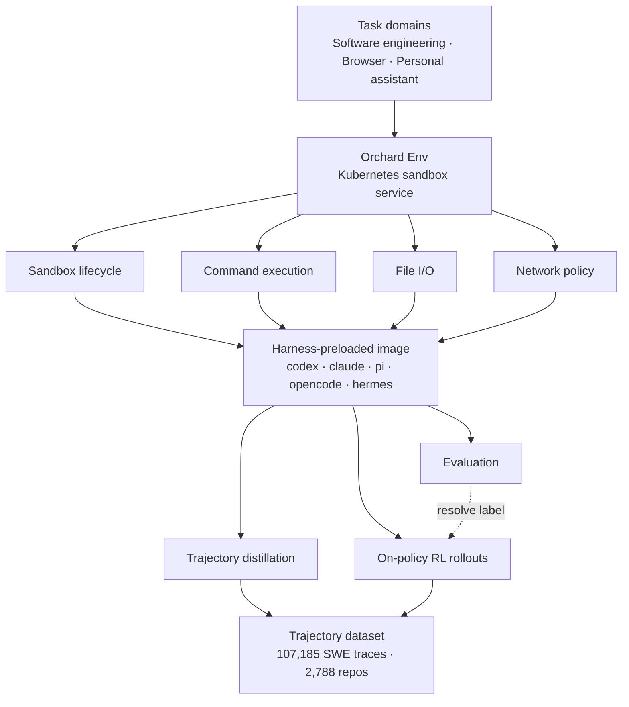

The first wall a team hits when it decides to train agents is not the model. It is spinning up hundreds of isolated environments at once where an agent can actually run commands, edit files, and fail. [Orchard](https://github.com/microsoft/Orchard), which Microsoft released on August 3, 2026, is the framework that carves out exactly that environment layer and ships it under the MIT license.

## Why read this

This post is written for platform engineers and ML engineers who want to train agents in house or stand up an evaluation pipeline. Here is the conclusion up front. The bottleneck in agent training is no longer the algorithm but the environment infrastructure, and Orchard normalizes that infrastructure into a single general-purpose sandbox service on Kubernetes so that distillation, reinforcement learning, and evaluation all share one execution substrate. If you already operate a Kubernetes cluster, this design is less a new concept to learn than a way to reuse what you already own.

One clarification before we start. Every performance number in this post is a figure Microsoft reported in its paper and public blog, not a figure we reproduced in house. Reproduction requires a GPU-backed Kubernetes cluster and a rollout budget spanning thousands of repositories, which is beyond the scope of this piece. We mark whose number is whose throughout.

## Overview

For the past two years, what got published in agent research was mostly models and benchmark scores. The infrastructure that produced those scores stayed closed. Each team built its own sandbox, kept its training pipeline internal, and accumulated trajectory datasets in private. Confirming a paper's numbers therefore meant rebuilding the infrastructure from scratch. That is precisely the problem Microsoft Research names in releasing Orchard.

Orchard's approach is slightly unusual. Instead of proposing a better training algorithm, it asks what training and evaluation both need. The answer was an isolated execution environment. Collecting trajectories needs it, running RL rollouts needs it, and final evaluation needs it. What all three want is a disposable box that can execute commands safely and let you observe the result. Turning that common denominator into a service the three stages share is Orchard Env.

The artifacts landed in three places. Code sits in the [microsoft/Orchard](https://github.com/microsoft/Orchard) repository, the paper is at [arXiv 2605.15040](https://arxiv.org/abs/2605.15040), and the training trajectory dataset is on [Hugging Face as microsoft/Orchard](https://huggingface.co/datasets/microsoft/Orchard). Microsoft Research's [official announcement](https://www.microsoft.com/en-us/research/blog/orchard-an-open-framework-for-scalable-agentic-ai/) summarizes the whole picture.

## What this technology is

Orchard Env sits at the center. It is a Kubernetes-native sandbox service, and what it exposes is deliberately thin: sandbox lifecycle management, command execution, file I/O, and network policy. What matters here is the absent side. It is not bound to a specific agent harness, not bound to a specific inference backend, and not bound to a specific task domain.

That decoupling produces a large practical effect. The sandbox image ships with major agent harnesses already on PATH, including codex, claude, pi, opencode, and hermes. Changing which harness you train or evaluate against becomes a change of command rather than a rebuild of the image. When swapping harnesses gets cheap, comparison experiments get easy, and once comparison is easy you can say with data which harness is strong at which task.



Three domain-specific training recipes shipped on top: Orchard-SWE for software engineering, Orchard-GUI for browser navigation, and Orchard-Claw for personal assistant tasks. The browser-side recipe wraps a live browser environment with fault tolerance, including navigation retries, timeout handling, and structured attribution of failures by cause. Anyone who has run rollouts against a live browser knows why all three are needed. In a browser environment, failing to separate an agent's mistake from a page that never loaded contaminates the learning signal itself.

The dataset came out alongside. The SWE-family trajectories number 107,185, collected across 2,788 GitHub repositories. Each trajectory carries a label for whether the agent's final patch passed that issue's hidden test suite. This labeling method is the crux. Because the signal is a test execution result rather than a human preference score, the reward is deterministic and reproducible.

## Installation and integration

The repository is MIT licensed, so there is no license obstacle to internal adoption. The starting point is pulling the code and standing Orchard Env up on a cluster.

```bash
git clone https://github.com/microsoft/Orchard.git
cd Orchard
```

The prerequisites reduce to two items. One is a usable Kubernetes cluster, the other an inference endpoint that can serve the model being rolled out. Because Orchard Env is not bound to an inference backend, the second item is satisfied by whatever serving stack your team already runs. On our side that is a vLLM endpoint.

An honest note here. We did not submit an actual training job to reproduce the numbers in this piece. The reason we stopped short is concrete: a meaningful rollout requires an execution budget spanning thousands of repositories on a GPU-backed cluster, which exceeds what an introductory post written one day after release can cover. Every number below is therefore Microsoft's reported value, and in-house reproduction is separated into its own experiment.

## Reported results

To restate: the figures in the table below are values reported in Microsoft's paper. They are not our measurements.

| Training stage | Task resolve rate |
|---|---|
| Base model | 22.0% |
| Supervised fine-tuning only | 64.3% |
| Supervised fine-tuning plus reinforcement learning | 67.5% |

That is a total gain of 45.5 percentage points over the base model, and the paper claims the result is state of the art among open-source models of comparable size.

How you read the numbers matters. The striking part is not the final 67.5 but how the gain is distributed. The stretch from 22.0 to 64.3, the gain from supervised fine-tuning alone, is 42.3 percentage points. Adding reinforcement learning on top yields a further 3.2 points. Most of the total improvement came from the stage that imitates good trajectories.

That distribution changes investment priorities. Reinforcement learning pipelines are expensive to build and to operate. Trajectory collection is comparatively simple, and it already takes nine of every ten points of improvement. A team starting agent training would do well to focus first on gathering trajectories with verifiable labels rather than reaching for reinforcement learning. RL can be layered on later without penalty. None of this means 3.2 points is small. In a regime where competition is decided in the decimals, that gap moves rankings.

## What this means for ThakiCloud products

The design message Orchard sends touches both products we operate.

Start with ai-platform. ThakiCloud's ai-platform is multi-tenant AI infrastructure that schedules GPU workloads with Kueue on Kubernetes and serves models with vLLM. What Orchard Env asks for is exactly this combination. Rather than introducing new specialized infrastructure, adoption reduces to layering one sandbox service onto a cluster already in operation. Agent rollouts are a workload of many short-lived jobs, which pairs well with queue-based scheduling. For customers requiring on-premises and sovereign environments, the implication is more direct. Training trajectories carry code and internal documents verbatim, which makes agent training one of the hardest workloads to send to an external cloud. Open-source training infrastructure that runs on your own cluster is therefore closer to a requirement than an option.

Paxis reads differently. Paxis is the Agent-Native Cloud control plane running on top of ai-platform, treating skills, tools, policies, and audit logs as first-class resources. The overlap with Orchard is sandboxed isolated execution. Paxis already runs skills in isolated sandboxes and passes every action through policy gates and audit logs, and the four primitives Orchard Env defines are effectively the minimum set such an execution layer needs. The choice to elevate network policy to a sandbox primitive stands out in particular. Controlling what an agent may call outward at the environment level is a good place to attach a policy gate.

Go one step further and the two products connect. The audit logs Paxis leaves as it executes skills are themselves agent trajectories. Attach a deterministic gate that judges success and failure and they take the shape of the labeled trajectories Orchard wants. Operational logs cycle back as training data, and that cycle turns on the ai-platform cluster. Just as Microsoft lowered swap costs by preloading harnesses into the image, standardizing the skill harness produces the same kind of gain.

## Limits and counterarguments

Expectations need calibrating.

First, entry cost. Orchard presumes Kubernetes. For a team that does not operate a cluster, the cost of adopting one dwarfs the cost of learning the framework. This is not a tool you start on a single laptop.

Next, dataset bias. The 107,185 trajectories look plentiful, but they all come from public GitHub repositories. Internal codebases follow different conventions. Build systems differ, dependency structures differ, and the way issues get written differs. There is no guarantee that a model trained on public-repository trajectories reaches the same resolve rate on internal repositories.

The labeling method has limits too. Hidden test pass or fail is deterministic, which is its strength, but it defines correctness only within what the tests catch. It cannot distinguish a patch that passes tests with poor design from one that passes with good design. In repositories with low test coverage, the problem grows.

Finally, timing. As of writing, the release is one day old. Community verification and independent reproduction reports have not accumulated. For the same reason we could not include in-house numbers, read every figure currently available with the awareness that the publishing party reported it.

## Wrapping up

What Orchard actually released is not a smarter agent but the blueprint for the factory that builds agents. It merged the practice of distillation, reinforcement learning, and evaluation each building their own environment into a single Kubernetes sandbox service, lowered the cost of comparison experiments by preloading harnesses into the image, and opened 100,000 trajectories labeled by test outcome. The conclusion stated at the top is recovered here. The bottleneck in agent training was the environment rather than the algorithm, and that environment now exists in standardized open-source form.

If you pick one thing to do after reading, make it trajectory collection design rather than reinforcement learning pipeline design. That most of the improvement came from there is the most practical number this release produced. If you already operate a Kubernetes cluster the entry cost is lower than it looks, and finding the points in your internal workflow where success and failure are judged automatically becomes, in practice, the first task.

## Sources

- [microsoft/Orchard GitHub repository](https://github.com/microsoft/Orchard)
- [Orchard: An open framework for scalable agentic AI, Microsoft Research](https://www.microsoft.com/en-us/research/blog/orchard-an-open-framework-for-scalable-agentic-ai/)
- [Orchard: An Open-Source Agentic Modeling Framework, arXiv 2605.15040](https://arxiv.org/abs/2605.15040)
- [microsoft/Orchard trajectory dataset on Hugging Face](https://huggingface.co/datasets/microsoft/Orchard)
