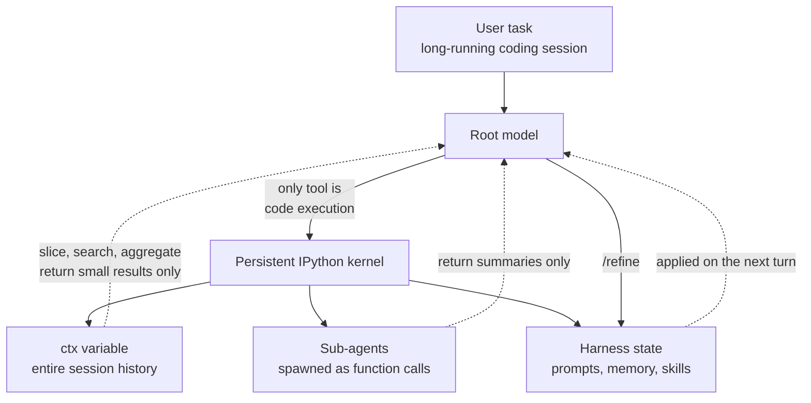

## Why This Matters

This is for engineers building or operating long-running coding agents who keep running into context compaction and token cost. The short version: Prime Agent's idea of keeping context as a variable in a persistent kernel rather than in the prompt genuinely works, and in our reproduction the tokens the model actually consumed over the same session history dropped from 321,458 to 149. But that saving depends entirely on the kind of question being asked, and it shrinks by a factor of twenty the moment the model has to read raw text with its own eyes. Everything below lives in the gap between those two sentences.


*A single persistent kernel holds the whole session while the model pulls out only the fragments it needs.*

## Overview

Prime Intellect released [Prime Agent](https://www.primeintellect.ai/blog/prime-agent) in early August 2026. It is described as a self-improving RLM agent, aimed at coding workflows and at long-running autonomous tasks. The license is MIT and the code sits on [GitHub](https://github.com/PrimeIntellect-ai/prime-agent).

The headline number in the announcement is ARC-AGI-3. Paired with Opus 5 it reported 95.5%, against a human expert baseline of 95.4% presented alongside it. On EmulatorBench it was given only a specification and wrote emulators in Rust, reproducing the SEGA Genesis and the Game Boy Color.

Those benchmarks are not what this article is about. A 0.1 percentage point gap on a single benchmark is hard to interpret without independent replication, and it is not something we can verify ourselves. The interesting part is the structure that produced it. Instead of expanding the tool list, Prime Agent shrank it to one. The only tool the model can use is a persistent IPython kernel. Everything else is expressed as code inside that kernel.

## What the Technology Is

Prime Agent rests on two abstractions. One is the recursive language model runtime it calls RLM, and the other is the Continual Harness.

The RLM idea is simple. Conventional agents push every tool result, file contents or test output alike, into the model's context window. When the window fills they summarize and compact, and compaction loses information. RLM inverts the order. The entire input is loaded into a Python REPL as a single string variable, and the root model never sees that string directly. Instead it receives a system prompt explaining how to slice the variable, write helper functions, spawn sub-LLM calls and combine the results. The prompt becomes a variable name rather than the data itself.

Sub-agents fold in under the same logic. They are not a separate orchestration layer or a dedicated tool schema, but functions called inside the kernel. Their results also stay as variables, so the bulky intermediate output a sub-agent produces never eats into the parent model's window.

The Continual Harness is the second axis. It stores supplemental prompts, memories, skill descriptions and reusable sub-agent specifications as durable state, and the agent refines that state through small, evidence-backed updates. The `/refine` command is the entry point. Mid-task, the agent judges what is working and what is not, and edits its own prompts and skills accordingly. The default scope is session-local, a default worth returning to later.

Here is the difference from the conventional approach in one picture.



In a setup built on fixed tool-call schemas and context compaction, the model spends effort working around its own scaffolding. Sub-agents and skills hand-written at design time cannot absorb what was learned during execution. Prime Agent addresses both with the same move. It makes the scaffolding out of code, and because it is code, it can be edited while running.

## Installation and Integration

Let me be straightforward. Package installation was blocked by policy in this working environment, so we could not install and run `prime-agent` itself. That is exactly where our reproduction attempt failed. This article therefore contains no numbers obtained by actually running Prime Agent. The repository documentation covers installation, authentication, running a first session, session and autonomous execution limits, and output modes, so follow the [repository docs](https://github.com/PrimeIntellect-ai/prime-agent) for running it. The RLM programming model itself is described in a [separate document](https://github.com/PrimeIntellect-ai/prime-agent/blob/main/packages/coding-agent/docs/rlm.md).

Instead we turned toward what was verifiable. Rather than Prime Agent's performance, we isolated the mechanism offered as the basis for that performance, namely the claim that putting context into a persistent kernel as a variable reduces the tokens a model consumes. That needs no API key and no network. It needs a real IPython kernel and a tokenizer.

```python
import tiktoken
from jupyter_client.manager import start_new_kernel

ENC = tiktoken.get_encoding("o200k_base")
km, kc = start_new_kernel(kernel_name="python3")

# The session history is built inside the kernel and stays in the ctx variable.
# This string never passes through the model's context.
run(BUILDER_SRC)

# The only thing the model actually utters is the code below.
run("errs = [l for l in ctx.split('\\n') if l.startswith('ERROR:')]\nprint(len(errs))")
```

The measurement works like this. We generate a synthetic 400-turn agent session log, containing the kinds of tool output that accumulate in a real long session: `go test` results, forty-line file head dumps, and intermittent stack traces and test failures. Then we compare two values. Under context stuffing we count the tokens for the entire history placed in the prompt. Under the RLM approach we count only the system prompt, the code cells the model wrote, and the results the kernel returned. Both sides use the `o200k_base` tokenizer.

The full script and execution logs are preserved under `outputs/blog-impl/prime-agent-rlm-harness/`.

## Measured Results

The history came to 1,115,465 characters across 17,284 lines. Placed whole into a prompt, that is 321,458 tokens.

The first run asked three aggregate questions: how many errors there were, what the unique prefixes of the failing test names were, and how the errors were distributed across files. The kernel returned exactly 42 errors, the two prefixes `TestRouterTimeout` and `TestTenantIsolation`, and a per-file distribution of 11, 11, 10 and 10. The tokens entering the model's context for this were 264. That is a 1,217-fold reduction against 321,458, or 99.92%. Kernel wall clock time was 0.07 seconds, and we confirmed state persistence by checking that the `errs` variable created in the first cell was still alive in the third.

Read in isolation those numbers are suspiciously good. So the second run went looking for the point where the advantage disappears. Same kernel, same tokenizer, only the nature of the question changed.


*Given the same history, the saving falls off sharply as the model needs to read more raw text.*

S1, needing only aggregates, came to 149 tokens for a 2,157-fold reduction. S2, which added reading twelve lines of raw context around each of three errors, came to 717 tokens and 448-fold. S3, which had to read forty-line blocks from four files in full, rose to 3,234 tokens and settled at 99-fold.

That gradient is the real result. Moving from S1 to S3 cut the advantage by more than twenty times. Keeping context as a variable does not magically erase tokens; it saves exactly as much as the model does not need to look at the raw text. Still, it is worth noting that even under the worst condition the factor was 99. When you are handling a million-character history, a two-digit multiplier decides whether the session can continue at all.

## Implications for ThakiCloud Products

This structure overlaps precisely with a problem we already deal with in Paxis.

Paxis is ThakiCloud's Enterprise Agent Platform. It retrieves skills, runs them in isolated sandboxes, and passes every action through policy gates and audit logs. The most painful practical point here is the bulk of skill execution results. It is not unusual for a single skill to return tens of thousands of log lines or a large query result, and loading that straight into the orchestrator's context fills the window within a few steps. The RLM prescription is to leave that result as a variable inside the sandbox and give the orchestrator only the right to query it. By our measurements that is a three-digit factor for aggregate queries and a two-digit factor even when raw reading is required. That is the size that determines how many steps a single workflow can take.

The Continual Harness sits on the same concern as Paxis's self-evolving skills. Skill descriptions and prompts frozen at design time cannot absorb what is learned in the field. What is directly worth borrowing, though, is that Prime Agent keeps this state session-local by default and permits only small, evidence-backed updates. Keeping the scope of self-modification narrow is the safety mechanism.

From the Metis angle this becomes a unit-cost conversation. Metis is the inference serving and token factory layer, taking workloads through Dedicated Endpoints and Serverless. The cost of one agent task is ultimately the sum of the tokens it burned, and context design determines most of that sum. The difference between 321,458 tokens and 264 is far larger than what you gain by switching models. Looking at context structure before shaving unit cost through model routing is the right order of operations.

Signum is the warning side. Making arbitrary code execution the only tool buys expressiveness at the price of turning the entire execution surface into an audit target. That goes double for a harness that edits its own prompts and skills. If there is no audit event recording what changed, when, and on what evidence, there is no way to explain a shift in the agent's behavior days later. Execution isolation and audit logging are not optional in this design; they are preconditions.

## Limitations and Counterarguments

Start with the limits of our own experiment. The history is a synthetic log, so it is repetitive and compresses well. Real codebases and real stack traces are more varied, so do not carry the absolute ratios over. Read the order of magnitude only. We also counted only successful cells. In a real session the model writes bad slicing code, fails, and that traceback lands back in the context. The cell count is dozens, not three. Both factors pull the measured ratio down.

There are structural objections too. This design ties the model's performance to its ability to generate code. If it writes the wrong regular expression or picks the wrong slice bounds, a quietly wrong answer comes out. An error a human could have caught by reading the raw text in context becomes invisible once it hides behind a variable. Without separately designing for observability, debugging gets harder.

Benchmark interpretation deserves caution as well. The 95.5% on ARC-AGI-3 against a 95.4% human expert baseline is a 0.1 percentage point gap, reported once on one benchmark. Until independent replication appears, it is safer to withhold the sentence about surpassing human experts. The EmulatorBench result is impressive but the task has unusual characteristics.

Finally there are operational issues. Being able to run on subscription logins is convenient, but whether an autonomous agent running for long stretches on a subscription account fits each provider's terms of service is something you need to check separately. And a stateful kernel executing arbitrary code means that kernel must live inside an isolated sandbox. Running it in autonomous mode on a local development machine and running it as a production workload are entirely different risk classes.

## Wrapping Up

What is worth taking from Prime Agent is not the benchmark number but the way it relocates the problem. While context management was a problem of compaction and summarization, there was no option other than losing information. Move context into a variable in a persistent kernel and the same problem becomes a problem of querying, and querying loses nothing.

Our conclusion from reproducing it is this. The pattern works, and the size of the gain is decided by the question, not the tool. Workloads heavy on aggregation and search earn three-digit factors, while workloads where the model must read raw text closely settle into two digits. So if you are evaluating adoption, the first thing to do is not to choose a framework but to count what your agent actually asks of its context. If aggregate queries dominate, this structure pays off immediately. If close reading dominates, start with your expectations set to two digits.

## Sources

- [Prime Agent: A self-improving RLM agent, Prime Intellect](https://www.primeintellect.ai/blog/prime-agent)
- [PrimeIntellect-ai/prime-agent, GitHub](https://github.com/PrimeIntellect-ai/prime-agent)
- [RLM programming model, prime-agent docs](https://github.com/PrimeIntellect-ai/prime-agent/blob/main/packages/coding-agent/docs/rlm.md)
- [Prime Intellect Releases Prime Agent, MarkTechPost](https://www.marktechpost.com/2026/08/06/prime-intellect-releases-prime-agent/)
