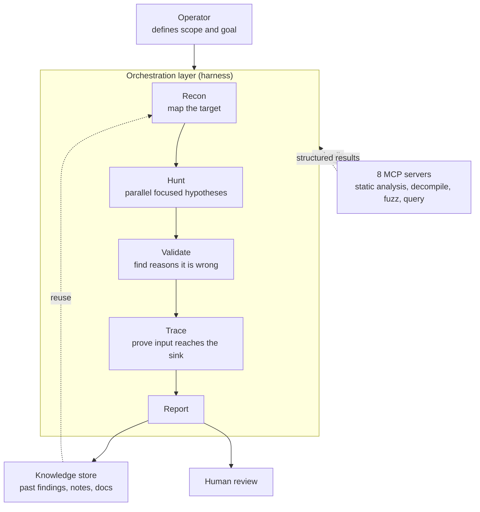

## Why read this

This is for security engineers trying to attach an LLM to code auditing or vulnerability hunting, and for platform owners who have to decide whether a human can trust what the agent produced. The conclusion first: what separates usable output from noise in this space is not which model you picked, but **whether your pipeline contains a separate stage designed to refute its own findings**. Line up six public harnesses and you find different teams arriving independently at the same answer. Separate the stage that finds things from the stage that believes them, and make the believing stage argue the other side.

*A visual for the shape of the pipeline: broad candidates entering, a trustworthy few leaving.*

## Overview

Using LLMs to find security bugs is no longer a novelty experiment. The problem is reproducibility. Send the same prompt at the same repository and today's results differ from yesterday's, and the vulnerability the model described with great confidence often does not match any real code path. The common reaction is to switch to a better model.

[Harnessing Harnesses - Climbing the LLM Hills](https://blog.zsec.uk/harnessing-harnesses/), published on 27 June by the UK offensive security researcher Andy Gill, argues that this reaction has the wrong address. What actually raised capability, cost efficiency and reliability in his own hunting pipeline was not model selection but the orchestration layer wrapped around the model. He puts it this way: trying to get useful work out of an LLM without a harness resembles supervising a room full of drunk toddlers, each convinced they are helping, none of them checking with each other.

This post is about that orchestration layer. We reviewed the five public harnesses Gill surveys plus the template he released himself, six in total, against their original repositories, and compared the design decisions. We picked this topic not because security tooling is interesting on its own. Vulnerability hunting carries an unusually high cost for false positives, so its validation design matures early. Those mature patterns transfer directly to internal business automation agents.

## What a harness owns

The vocabulary needs settling first. A harness is the orchestration layer around an LLM. It controls the inputs, tools, prompts, models, state, validation gates and outputs of each stage of work.

The relationship to MCP is where people get confused. An MCP server is one type of tool that lives **inside** the harness. It gives the model callable functions: run a command, decompile a binary, query a database. What it does not decide is when those functions get called, in what order, with what context, and what happens to the result. That is the harness's job. As Gill puts it, you can have a full suite of MCP servers configured and still produce inconsistent, unverifiable output if nothing coordinates how they are used. He runs eight MCP servers, and the harness is what makes them behave as a pipeline rather than a pile of tools.

*Each stage has its own prompt and its own input and output, and stages are joined by structured artefacts rather than one shared conversation.*

The workflow in the template Gill released, [harness-kit](https://github.com/ZephrFish/harness-kit), has exactly this shape. Recon maps the target, Hunt investigates focused hypotheses, Validate looks for reasons a finding is wrong, and Trace proves whether attacker-controlled input actually reaches the vulnerable sink. Only findings that clear those gates reach reporting.

One design decision matters more than it first appears. Stages do not share a single huge conversation. They **exchange structured artefacts**. The mapping stage returns JSON covering file paths, entry points and dependencies, and later stages take that as input. This makes the pipeline easy to rerun in part or to replace one stage at a time, and it lets Hunt workers run in parallel inside defined context budgets.

## Six public harnesses, side by side

Putting different answers to the same problem next to each other exposes what is essential.

| Harness | Scope | Validation method | Output trust level |
|---|---|---|---|
| [RAPTOR](https://github.com/gadievron/raptor) | Static plus dynamic, general purpose | Six-stage A to F pipeline, CVSS scoring, Z3 solving | Backed by tools and a solver |
| [Anthropic reference harness](https://github.com/anthropics/defending-code-reference-harness) | C/C++ with Dockerfile and ASAN build | Binary PoC reproducing the crash on the instrumented build | Proven by execution |
| [baby-naptime](https://github.com/faizann24/baby-naptime) | C/C++ binaries | Single-agent iterative loop against a live binary | Grounded in runtime signal |
| [audit](https://github.com/evilsocket/audit) | Language and repo agnostic, no build needed | Eight stages, parallel agents, mandatory trace stage | Disciplined code review |
| [VVAH](https://github.com/visa/visa-vulnerability-agentic-harness) | Language and repo agnostic | Threat modelling and taint flow first, adversarial second pass | Explicitly triage candidates |
| [harness-kit](https://github.com/ZephrFish/harness-kit) | Template | Recon, hunt, validate, trace gates | Reference structure |

The strictest is Anthropic's reference harness. It runs an autonomous find, grade and patch pipeline inside AddressSanitizer instrumented Docker containers, and every finding carries a binary PoC that reproduces the crash against the instrumented build. There is no room to argue about reachability. `vulnpipeline_recon` maps the attack surface, `vulnpipeline_run` launches independent fuzzing agents, and `vulnpipeline_report` grades each crash as passed, borderline, DoS-only or low-impact. `vulnpipeline_patch` produces a source fix, rebuilds and re-runs the PoC to confirm resolution. The price is a narrow scope: C/C++ projects with a Dockerfile, a build script and an instrumentable ASAN build. Gill notes honestly that this harness also kicked out some rubbish.

RAPTOR is strict in a different direction. A Python execution layer runs the tools and a Claude Code decision layer decides what to run, which means the orchestration logic can be tested independently of the AI reasoning. Its validation pipeline runs six stages. A through D assess whether the pattern is genuine, what an attacker would need to reach it, whether the code supports the finding line by line, and the final ruling with CVSS scoring. E covers binary feasibility including ASLR and RELRO checks, gadget availability and Z3 SMT constraint solving for one-gadget applicability. F performs a contradiction check before anything is promoted.

At the other end sits VVAH. Visa's harness inventories the repository, maps trust boundaries, assigns specialist review lenses, validates findings through an adversarial second pass, and emits SARIF and Markdown reports. The detail worth noticing is that it states its output are **triage candidates rather than confirmed vulnerabilities**. I read that as accurate self-description rather than modesty. VVAH's call graph is seeded by an LLM and reinforced with regex rather than built from a full AST, so dynamic dispatch, reflection and framework routing can be missed. A tool that tells you how far it can be trusted leaves the human that much less room to be fooled.

## The validation stage has to cross-examine

What runs through all six is that the validation prompt points in the opposite direction from the hunting prompt. Hunt forms a hypothesis, and Validate looks for reasons that hypothesis is **wrong**. Asking the same model the same question a second time is not validation.

Scrutineer's revalidate skill, which Gill cites as a good example, shows the principle cleanly. When a deep security review produces a High or Critical finding, the revalidate stage checks it against git history and returns one of `true_positive`, `false_positive`, `already_fixed` or `uncertain`. Only findings marked `true_positive` move into the verify stage where the code is tested against current HEAD. The waste of re-reporting an already fixed bug is filtered here, and the expensive verification work concentrates on findings most likely to be real.

Receiving the verdict as **one of four fixed values** rather than free prose matters just as much. When the model writes something like "this appears likely valid", the next stage has to interpret that sentence, and the interpretation shifts every run. An enum lets deterministic code own the routing that follows.

There is one more recurring mistake. Using a single system prompt for the entire pipeline. An agent mapping a codebase, an agent developing exploit hypotheses and an agent reviewing a proposed PoC all need different instructions. The harness connects their outputs and ensures each model receives only the context it needs.

## Context budgets and model routing

Gill treats the context window as a budget and gives concrete figures. A single-function analysis usually fits within roughly 8K tokens, while synthesis across several findings approaches 32K. Fuzzer output and scanner logs should generally be reduced to a few hundred useful tokens before entering a prompt.

A common failure mode in early harnesses is passing raw files, scanner output and full conversation history into every stage. More context is not automatically better when most of it is irrelevant. The harness should retrieve only the code paths relevant to the current hypothesis, summarise noisy tool output, keep a short rolling summary of completed work, and drop resolved tasks once their results live elsewhere. Gill stresses setting this strategy early, because adding context management later is painful.

Model routing follows from the same design. Cheap models classify, organise and summarise, while stronger models are reserved for validation, tracing and synthesis. The orchestration layer owns state, gates, budgets and hand-offs, and the model performs one narrow piece of reasoning at a time.

The last piece is memory. Context management decides what each stage sees within one run, and retrieval decides what can be reused from previous runs. Gill built a central store of past notes, blog posts, language-specific material and tool documentation, and runs a 360 feedback loop after each successful run so that newer findings build on that baseline.

## What this means for the ThakiCloud platform

We do not read this as somebody else's neighbourhood, because [Paxis](https://thakicloud.com/tech-blog/en/agentops/) is exactly this layer turned into a product. Paxis is ThakiCloud's Enterprise Agent Platform: it retrieves the skill that matches a request, executes it inside an isolated sandbox, and passes every action through a policy gate and an audit log. Map what these security harnesses hand-built onto that and the overlaps are clear.

Stage separation with structured artefact exchange corresponds to Paxis DAG multi-agent execution, and the pattern of running hunt workers in parallel within fixed context budgets transfers directly. The refutation gate is expressed by placing a validation skill as its own node above the skill harness. The important part is receiving the verdict as an enum rather than prose, and letting code rather than the model own the routing that enum triggers. The fact that tool execution happens only inside the sandbox and each call lands in an audit log rests on the identity and audit foundation that Signum provides. For a pipeline handling offensive security tooling, that boundary is not optional.

On the cost axis, Metis is what makes routing real. Splitting classification and summarisation onto cheap models while reserving validation and synthesis for stronger ones only converts into savings when the serving layer can mix dedicated endpoints and serverless. Split the stages while the token price stays flat and you have only increased the call count. As runs accumulate, the Maxis axis opens. Which findings a human confirmed and which were rejected is itself a label, so there is a path to moving the validation stage onto a small specialised model. Validation is a narrow, repetitive judgement, which suits that transition particularly well.

Placement is worth noting too. Code auditing pipelines handle source and incident history, so in many cases they must not leave the building. Where an air-gapped environment is a given, as in finance or the public sector, the realistic configuration is running the same pipeline on Aegis and expanding into Telox GPU capacity only when a bulk scan demands it. One Paxis. Many Workflows. Any Cloud.

## Limits and counterarguments

None of the six removes human review. Gill states plainly that a good harness does not remove the need for judgement and validation, it gives you a repeatable way to apply both.

The technical limits are equally clear. Proving by execution is the most certain method and also the narrowest, restricted to C/C++ with an instrumentable build. Language-agnostic source pipelines cover far more ground with no runtime certainty, and when the call graph is not built from a full AST they miss dynamic dispatch and reflection. Even a flexible tool like `audit` required Gill to tweak several sections before the flow worked. Output quality depends on the recon tasks, the prompts, model selection and how the repository was divided into workstreams, so running it unadjusted produces duplicated effort and shallow reviews.

The evidence behind this post has its own limits. We did not run these harnesses ourselves and measure numbers. Pointing offensive security tooling at real targets is work that belongs inside an authorised scope, not inside a blog experiment. This is an analysis comparing design decisions against public repositories and the author's own account, and the token budgets and stage structures quoted here are the figures he reports for his pipeline. There is no guarantee the same numbers hold on a different codebase.

One counterargument deserves stating. More gates reduce false positives and they reduce true positives with them. Every gate buys precision at the cost of recall. An organisation with ample review capacity, where the cost of a miss far exceeds the cost of a false alarm, may be better served by loosening the gates and putting more candidates in front of humans. Which side is right is decided by that organisation's review throughput, not by harness design.

## Wrapping up

If you have attached an LLM to vulnerability hunting and cannot trust the results, the first thing to check is not the model tier but whether the pipeline contains a refutation stage. Six public harnesses spanning different languages, scopes and validation strengths converged on the same skeleton. Separate finding from believing, make the believing stage argue why the finding is wrong, join stages with structured artefacts rather than conversation, and receive verdicts as fixed values.

A concrete order to apply this: take the stage in your current pipeline that plays the validation role and rewrite its prompt to point the other way. Change its output from free sentences to four or five fixed values, and let code decide the next action from that value. That alone moves reproducibility noticeably. Context budgets and model routing can come after.

## Sources

- Andy Gill, [Harnessing Harnesses - Climbing the LLM Hills](https://blog.zsec.uk/harnessing-harnesses/), ZephrSec, 2026-06-27
- Andy Gill, [Jenny was a Friend of Mine - MCPs and Friends](https://blog.zsec.uk/bullyingllms/), ZephrSec, 2026-04-04
- [ZephrFish/harness-kit](https://github.com/ZephrFish/harness-kit)
- [gadievron/raptor](https://github.com/gadievron/raptor)
- [anthropics/defending-code-reference-harness](https://github.com/anthropics/defending-code-reference-harness)
- [faizann24/baby-naptime](https://github.com/faizann24/baby-naptime)
- [evilsocket/audit](https://github.com/evilsocket/audit)
- [visa/visa-vulnerability-agentic-harness](https://github.com/visa/visa-vulnerability-agentic-harness)
