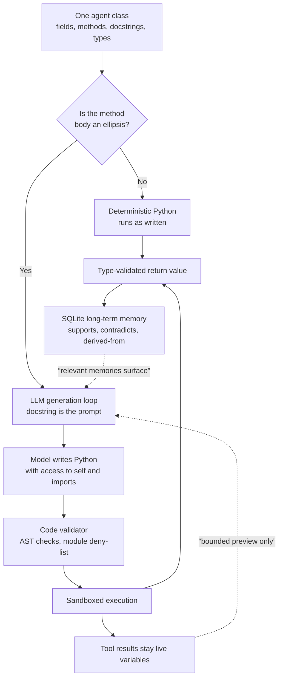

## Why this matters to you

This is for engineers building or operating an agent harness who are tired of prompt templates, tool schemas, callbacks, and workflow graphs living in four different places. The short version: NVIDIA's NOOA folds all of that into a single Python class and the fold holds up, but the one capability that decisively changes cost is pass-by-reference. When we reproduced it, a tool result of 3,200 pods dropped from 216,806 tokens of context to 700. The catch is that this framework executes model-generated code, and its own documentation states plainly that its validator is not a containment boundary. We checked, and that warning is accurate.


*The object stays live in the execution environment while only a thin reference reaches the model.*

## Overview

Agent performance has long been discussed as a model question. Which model is smarter, which one calls tools better. The NVIDIA technical blog post published on July 27, [Six Agent Harness Capabilities for Higher Model Performance](https://developer.nvidia.com/blog/six-agent-harness-capabilities-for-higher-model-performance/), inverts that frame. The harness is the architecture surrounding the model, and how it renders context, executes actions, manages state, and decides when a task is done shapes outcomes as much as the model does. The post states that harness design alone accounts for double-digit swings in benchmark results and large differences in token cost, with the same underlying model.

The artifact backing that claim is NVIDIA Labs Object-Oriented Agents, or NOOA. The Python framework, memory system, capability tests, and benchmark agents were released together with code, data, and evaluations under Apache 2.0. The repository is [NVIDIA-NeMo/labs-OO-Agents](https://github.com/NVIDIA-NeMo/labs-OO-Agents), created on July 20 and still being pushed as of August 7, with 1,130 stars. A companion paper covering the design principles and evaluation is at [arXiv 2607.20709](https://arxiv.org/abs/2607.20709).

We are writing this up not because NOOA is a new framework. The idea of keeping context as variables in an execution environment rather than as prompt text is something we already covered when we [reproduced Prime Agent's RLM harness](/tech-blog/en/agentops/prime-agent-rlm-harness/). What is different here is that NOOA decomposes that idea into six distinct interface capabilities and separates out, through benchmarks, what each one buys. For anyone building a harness, that decomposition is worth more than the framework itself.

## What this tool is

NOOA starts from one sentence. An agent is a single Python class. Methods are its capabilities, fields are its state, docstrings are its prompts, and type annotations are enforced contracts. One more rule follows: a method whose body is an ellipsis is completed at runtime by an LLM-driven loop, while a method with a real body runs as ordinary deterministic Python.

```python
from nooa import Agent

class SupportAgent(Agent):
    """You are a support agent for a customer service system."""

    order_db: OrderDB          # object state: model-visible, passed by reference

    def is_refund_eligible(self, order: Order) -> bool:
        """Return whether an order is eligible for a refund."""
        return order.delivered and order.days_since_delivery <= 30

    async def triage(self, message: str, order: Order | None) -> Ticket:
        """Triage a customer message and create a support ticket."""
        ...
```

Deterministic rules and model judgment sit side by side in the same class. The refund eligibility check, which must not be wrong, stays in code. Classifying free text goes to the model. The important part is that you no longer coordinate between the two with prompt instructions. The rule executes exactly as the code says, rather than remaining a sentence the model may or may not follow.

The six model-facing interface capabilities NVIDIA identifies are as follows. Typed input and output means agentic calls carry validated arguments and return values instead of free text. Pass by reference means the model operates on live Python objects and sees bounded previews rather than serialized dumps. Code as action means the model acts by writing Python, with control flow and inline method calls. Programmable loop engineering means orchestration loops are ordinary Python that both developers and the model can rewrite. Explicit object state means durable typed state lives on the agent object rather than in conversation history. Finally, model-callable harness APIs expose context blocks and event history as APIs the model can inspect and manage itself.



The memory subsystem deserves a separate look. Rather than an automatic background summarization pipeline, it is a store the agent curates through model-callable tools, deliberately writing, querying, and correcting records. Records carry types, importance, and tags, and typed relationships such as supports, contradicts, and derived-from connect them into a knowledge graph rather than a flat log. A background reflection pass merges duplicates, links related records, distills episodes into insights, and prunes what is no longer relevant. Everything persists in a single human-readable SQLite file that teams can inspect, back up, and review with their usual practices.

## Installation and integration

Installation is short. We put it directly into our repository's shared virtual environment.

```bash
# for a new project
uv init my-agent-project && cd my-agent-project
uv add nooa

# adding to an existing environment
VIRTUAL_ENV="$PWD/.venv" uv pip install nooa nooa-memory
```

There were no dependency conflicts. Sixty-seven packages resolved and only five were actually downloaded.

```
Resolved 67 packages in 1.18s
 + nooa==0.0.8
 + nooa-memory==0.0.8
 + openinference-instrumentation==0.1.57
 + openinference-instrumentation-litellm==0.1.36
 + openinference-semantic-conventions==0.1.32
```

Beyond the core framework, the CLI, memory, and benchmark packages ship as separate distributions. `nooa-cli` adds the `nooa` command, the trace viewer, and the eval runner, `nooa-memory` adds long-term memory, and `nooa-bench` adds the Harbor benchmark runner. You can also pull them in as extras, such as `nooa[cli,memory]`.

Models attach through a LiteLLM registry. For anyone running their own infrastructure, the important detail is that Ollama and vLLM endpoints can be named directly alongside hosted models.

```python
from nooa.unifiedllm.registry import get_llm_client

llm = get_llm_client("hosted_vllm/Qwen/Qwen3-1.7B",
                     api_base="http://localhost:8000/v1")
```

Every LLM call, code execution, and method invocation is traced by default, with parent-child spans preserved. Running `uv run nooa start-dev` brings up a trace viewer on port 5001, and if the viewer is not running, tracing silently disables itself. No configuration is required either way, which keeps the overhead low.

## What we measured

We wanted to answer one question. Of the six capabilities, what does pass-by-reference actually save? This is the mechanism NVIDIA points to as the source of both the halved token count and the absence of context compaction.

We chose an object we know well: a GPU pod inventory. We simulated a cluster-query tool returning a pod list and compared two ways of getting that result into context. One serializes the whole thing to JSON and appends it to the transcript, the way a classic harness does. The other renders only a bounded preview through NOOA's `pformat`. Tokens were counted with `char_approximate_token_counter`, which the framework itself exposes. There were no model calls, and the seed is fixed, so a rerun produces the same numbers.

| Pods | Full JSON chars | Tokens | Preview chars | Tokens | Reduction |
|---|---|---|---|---|---|
| 50 | 13,584 | 3,396 | 2,788 | 697 | 79.48% |
| 200 | 54,233 | 13,558 | 2,785 | 696 | 94.87% |
| 800 | 216,856 | 54,214 | 2,799 | 699 | 98.71% |
| 3,200 | 867,225 | 216,806 | 2,800 | 700 | 99.68% |


*Cost curves for the two ways of putting the same tool result into context. Log scale.*

What the numbers show is not a reduction ratio but a slope. Full serialization grows in direct proportion to the data and reaches 216,806 tokens at 3,200 pods, which on its own exceeds a common 200k context window. The preview, by contrast, is 697 tokens at 50 pods and 700 tokens at 3,200, which is effectively flat. However large a result the tool returns, the context budget does not move. This property is why NVIDIA reported median session prompt peaks of 22k to 72k against 200k to 400k windows on SWE-bench, and why no summarization pass was needed.

Here is what the model actually sees. List length is stated explicitly, only the first few entries expand, and long strings are cut at both ends and reported with their length.

```
ClusterInventory(cluster='tkai-prod-compute-h200', pods=list(len=3200,
    [:5]=[
        Pod(name='train-job-00000-worker-0', namespace='tkai-metis',
            phase='Failed', gpu_type='B200', gpu_count=1, ...
            image=str(len=66, [:25]='cr2.thakicloud.net/ai-pla',
                      [-25:]='9.0-cuda13.0-cudnn9-devel')),
```

On top of that, `doc()` renders a type's API contract as a prompt-ready string, which for our inventory class came to 256 characters and 64 tokens. That is the cost of telling the model what it can call without hand-writing a separate tool schema. Meanwhile the deterministic method still ran as plain Python, computing a total of 4,987 GPUs in use across 3,200 pods without involving the model at all.

The second thing we checked was the claim that agent development becomes ordinary software development. We built a small agent that triages GPU jobs and wrote five plain pytest tests against it, covering whether the deterministic method runs without a model, whether object state is real Python state, whether two instances avoid sharing state, and whether an ellipsis body is recognized as a generation method. All five passed in 1.11 seconds, with no network and no real model.

We did hit one unexpected piece of friction. Our first version of the tests failed entirely, and the cause was the constructor rather than the tests. NOOA resolves the model eagerly in `__init__`, so even an agent whose methods never touch a model cannot be instantiated without one.

```
ValueError: No LLM available for OrphanAgent. Resolution attempted:
  1. Instance-level: Not provided
  2. Class hierarchy: Not set (checked full MRO)
  3. Runtime parent: No parent agent in context
```

The framework already ships the fix. Binding `nooa.unifiedllm.fake.FakeLLMClient` to the class gives you hermetic tests. Still, if you take "test it like the rest of your software" at face value, your first thirty minutes go here. It is better to know up front that model resolution happens at construction time rather than at call time.

Third, we measured what the code validator actually blocks. The README describes its AST checks and module deny-lists as defense-in-depth guardrails rather than a containment boundary, so it seemed worth checking how accurate that sentence is.

| Code snippet | Verdict |
|---|---|
| Plain arithmetic | Allowed |
| `import os` | Allowed |
| `import subprocess` | Blocked |
| `open()` file write | Allowed |
| `importlib` dynamic load | Allowed |
| `while True` infinite loop | Allowed |

The warning was accurate. `subprocess` is blocked, but `os`, `open()`, and `importlib` all pass. This is exactly the limit of what a static checker over Python can guarantee, and as the documentation says, the containment boundary has to be OS-level isolation. We read NVIDIA declining to oversell its own framework here as a credible signal.

We did not reproduce the published benchmark numbers, so we cite them only as reported. On SWE-bench Verified, NOOA reached 82.2% with GPT-5.5, above the published leaderboard SOTA of 79.2% at the time of submission, using a general-purpose 253-line agent with no benchmark-specific prompts. On the same task set it used 29 LLM calls and roughly 1.1M tokens, while comparison harnesses needed 66 calls and 2.2M tokens to reach 78.2%, and 29 calls at 1.3M to reach 78.6%. On CyberGym L1 it solved 86.8% with network access blocked and a rule-based cheat check over every trajectory, and on ARC-AGI-3 the GPT-5.6-sol fleet reached 85.1% mean RHAE at about $13.3 per game.

## What this means for ThakiCloud

The problem NOOA targets is the one we keep running into while building Paxis. Paxis is our enterprise agent platform: it retrieves skills, executes them in an isolated sandbox, and passes every action through policy gates and audit logs. What actually determines the cost of a single unit of work there is not the model tier but how much context a tool result consumes. If one cluster query costs 200,000 tokens, that task does not get cheaper by swapping models. The gap we measured between 700 and 216,806 tokens is the unit-cost gap for a task, and it can only be closed in the harness layer.

Pass-by-reference fits us particularly well because the objects Paxis handles are large and structured. Pod inventories, audit logs, skill execution traces, and document bundles are things the model needs selective access to rather than a full read. Keeping them as live objects and handing over only a bounded preview means the transcript stays append-only and the prefill cache stays valid for the whole session. Not needing a summarization pass is not a side benefit but a direct consequence of that property.

The idea that types are contracts lands on Signum. The vulnerability-verification pipeline NVIDIA describes illustrates the structure well: three deterministic gates were written as ordinary typed methods rather than prompt instructions, so a finding is accepted only when the code says so, and the whole run stays a single inspectable trace. For anyone working on policy gates and audit logs, this restates a familiar principle. Verdicts must be owned by code rather than by a model's self-report, otherwise there is nothing to audit.

At the same time, the framework confirms why we keep the sandbox outside the process. You saw `open()` and `importlib` pass in the table above. If you run agents that execute generated code, the in-process validator is a device for catching mistakes early, not isolation, and the real boundary belongs at the container, VM, or kernel level. That requirement gets stronger the more data sovereignty is at stake: in an Aegis deployment inside a closed network, removing the path out entirely is more reliable than validating what travels along it.

At the model layer, the fact that NOOA accepts vLLM endpoints through its LiteLLM registry connects directly to Metis. A model-neutral harness lets the same agent code start on a hosted model and move to a self-hosted endpoint, and moving it with context already halved makes the throughput gain of a dedicated endpoint that much larger. Work is defined in Paxis, tokens are produced in Metis, and the same code runs on a Telox GPU cluster or on Aegis inside a customer's closed network.

## Limits and counterarguments

Maturity comes first. NOOA describes itself as a research preview and the version is 0.0.8. The README tells you to expect rough edges, and the constructor friction we hit falls in that category. Moving a production agent onto it now would be early.

Second is the scope of pass-by-reference. The 99.68% we measured came from a question where the model does not need to read the full object. Aggregating, filtering, or reading specific fields is well served by a preview, but a task where the model must read and judge all 3,200 records means the data has to enter context in some form. This conditional is the same one we hit reproducing Prime Agent, and it is not the kind of thing harness design removes. Check the nature of your questions before transplanting the savings figure onto your own workload.

Third is benchmark interpretation. 82.2% on SWE-bench Verified is impressive, but it was obtained paired with GPT-5.5, and separating the harness contribution from the model contribution would take results from the same harness across several models. The blog offering 79.8% with Opus 4.6 points in that direction, but two points is not enough. The claim that harness design produces double-digit swings matches our own experience; carrying a specific number over as the expected value for your own stack is a different matter.

Finally, the object-oriented fold itself does not suit every workflow. Collapsing an agent into one class is strong when state and capabilities belong together, but graph-based orchestration remains natural when several teams ship their own tools independently. It is more accurate to read NOOA as offering an alternative interface than as replacing existing frameworks.

## Wrapping up

What is worth taking from NOOA is the decomposition rather than the framework. The claim that the harness makes the performance is old, but what it actually points at has always been vague; splitting it into six interface capabilities makes it visible which lever moves which outcome. The one that decisively changes cost was pass-by-reference, and on our workload that was the difference between 216,806 and 700 tokens for a tool result of 3,200 records.

So the thing to do now is not to rip out your framework. Check whether the agent you are running today serializes tool results into the transcript, and if it does, pick your single largest tool and switch it to a bounded preview. The experiment code is kept at `outputs/blog-impl/nvidia-nooa-agent-harness/` with a fixed seed, so swapping in your own object gives you your own numbers immediately. And if you are executing generated code, take NVIDIA at its word about its own validator. The boundary is in the OS, not in the checker.

## Sources

- [Six Agent Harness Capabilities for Higher Model Performance](https://developer.nvidia.com/blog/six-agent-harness-capabilities-for-higher-model-performance/) (NVIDIA Technical Blog, July 27 2026, Ricardo Silveira Cabral and Paul Furgale)
- [NVIDIA-NeMo/labs-OO-Agents](https://github.com/NVIDIA-NeMo/labs-OO-Agents) (NOOA repository, Apache 2.0)
- [NVIDIA OO Agents: Native Python Object-Oriented Agents](https://arxiv.org/abs/2607.20709) (arXiv 2607.20709)
- Local measurements: nooa 0.0.8, Python 3.12.8, seed 20260809, no model calls. Raw logs at `outputs/blog-impl/nvidia-nooa-agent-harness/run-6.log`, `run-11.log`, `run-12.log`
