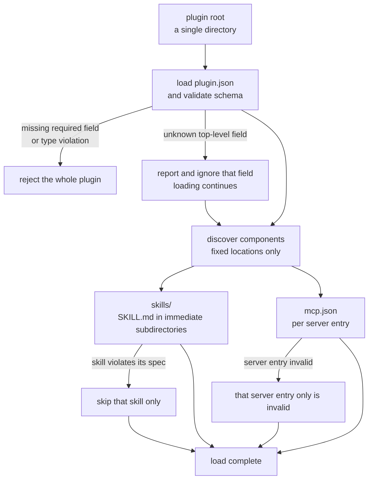

## Why read this

This is for platform engineers running several agent skills and MCP servers in-house, who keep repackaging the same assets two or three times because every client expects a different install path and config file. The short version: Agent Plugins 1.0.0 is small enough and finished enough to adopt today. But passing the official JSON Schema does not make a plugin conformant. We fed the schema eight violations that the spec text explicitly forbids, and two of them passed with no error at all. Both were the kind that cross the plugin boundary. So the real work in adopting this standard is not writing a manifest. It is putting the containment rules the schema cannot see into your client code.


*Package once, and several clients read the same shape. That is the whole proposition.*

## Overview

Two ways of giving an agent new abilities settled into place over the past year. One is the agent skill, which teaches the model a procedure. The other is the MCP server, which hands the model an actual tool to call. The split is clean, which is exactly why real deployments use both at once: one `SKILL.md` describing a deployment procedure, one MCP server that performs the deployment.

The problem was that no envelope held that pair. Skills landed in a different directory per client. MCP server configuration went into a different JSON file with different field names per client. The same asset had to be repackaged once per destination, and none of those packages were interchangeable.

[Agent Plugins 1.0.0](https://github.com/agentplugins/agent-plugins-spec) defines exactly that envelope. Amazon, Cursor, Microsoft, OpenAI and Vercel published 1.0.0 jointly on August 6, and the specification is issued under a technical steering committee of Core Maintainers from those five. Google followed by [joining as a Core Maintainer](https://developers.googleblog.com/agent-plugins-package-your-skills-tools-and-more/). Vercel published [a separate introduction](https://vercel.com/blog/introducing-agent-plugins), and VS Code already has [agent plugin documentation](https://code.visualstudio.com/docs/agent-customization/agent-plugins) online.

What makes this worth writing about is less the announcement than the size. The full specification is about 42KB and the manifest has ten fields. At that scale there is almost no adoption cost to weigh. So instead of reading it, we built one: we packaged a real internal skill, validated it against the official schemas, and deliberately fed it the violations the spec says are invalid.

## What the spec actually is

A plugin is a directory. A `plugin.json` manifest sits at its root, and two fixed locations sit beside it. Skills go under `skills/`, one per immediate subdirectory. MCP server configuration goes in `mcp.json` at the root. These locations are fixed and the manifest cannot override them. Declaring component configuration inline in `plugin.json` is likewise forbidden.

```text
thaki-blog-ops/
├── plugin.json                       # manifest (required)
├── mcp.json                          # MCP server config (optional)
├── skills/
│   └── tech-blog-deploy/
│       └── SKILL.md                  # one skill = one directory
└── com.example.client/               # client extension directory (optional)
```

The spec defines exactly two component types: skills and MCP servers. Anything else a particular client supports, such as hooks or slash commands, sits outside the v1 format and does not affect conformance. Client-specific data uses a reverse-domain namespace, under the `extensions` field in the manifest and in a top-level directory like `com.example.client/` for files. Clients are required to ignore namespaces they do not implement without validating their contents.



The thing to notice is that failure does not spread. The spec cuts failure boundaries into five levels. A broken manifest rejects the whole plugin, but one non-conformant skill only skips that skill and the rest still load. One malformed MCP server entry invalidates only that entry. An unknown top-level field is not even fatal: the client reports it, ignores it, and keeps loading. Picture a plugin carrying twenty skills and the design justifies itself.

The manifest is remarkably small. The permitted top-level fields are `$schema`, `name`, `version`, `description`, `author`, `homepage`, `repository`, `license`, `keywords` and `extensions`, and that list is closed. Only `$schema` and `name` are required.

```json
{
  "$schema": "https://agent-plugins.org/schemas/1.0.0/plugin.schema.json",
  "name": "thaki-blog-ops",
  "version": "1.0.0",
  "description": "ThakiCloud tech-blog build, validate and deploy tooling.",
  "author": { "name": "ThakiCloud", "url": "https://thakicloud.com" },
  "repository": "https://github.com/ThakiCloud/ai-platform-strategy",
  "license": "Apache-2.0",
  "keywords": ["blog", "jekyll", "deploy"]
}
```

`name` carries constraints. It must be 1 to 64 characters, may contain only lowercase letters, digits, hyphens and periods, must start and end with an alphanumeric character, and may not contain consecutive hyphens or periods. The point is that a package name can be dropped straight into a directory path or a URL.

On the MCP side, `mcp.json` holds only `$schema` and `mcpServers`. Each server picks a transport through `type`, one of `stdio`, `streamable-http` or the legacy `sse`, and a client must support at least one of the first two. The path and environment rules are where it gets interesting.

```json
{
  "$schema": "https://agent-plugins.org/schemas/1.0.0/mcp.schema.json",
  "mcpServers": {
    "blog-index": {
      "type": "stdio",
      "command": "./bin/blog-index",
      "args": ["--root", "${PLUGIN_ROOT}"],
      "cwd": "${PLUGIN_DATA}"
    }
  }
}
```

`command` must be a single executable token, not a shell command string. It is either a bare name or a plugin-relative path beginning with `./`, and a relative path must stay inside the plugin root. `${PLUGIN_ROOT}` and `${PLUGIN_DATA}` are reserved variables the client is required to supply. The first is where the plugin is installed; the second is a client-managed data directory that survives plugin updates, which is where virtual environments and caches belong. If a plugin puts either name into its own `env`, that server configuration becomes invalid.

## Installing and integrating

Packaging is a matter of creating three files. We moved an existing skill directory under `skills/` as-is and added the manifest and MCP config.

```bash
mkdir -p thaki-blog-ops/skills
cp -R .claude/skills/tech-blog-deploy thaki-blog-ops/skills/tech-blog-deploy
# write plugin.json and mcp.json at the root
```

Validation just means fetching the official schemas and running them. The spec publishes machine-readable schemas at `agent-plugins.org`, so no extra tooling is needed.

```python
import json, urllib.request, jsonschema

BASE = "https://agent-plugins.org/schemas/1.0.0"
schema = json.load(urllib.request.urlopen(f"{BASE}/plugin.schema.json"))
manifest = json.load(open("thaki-blog-ops/plugin.json"))
jsonschema.validate(manifest, schema)   # raises ValidationError on violation
```

One rule applies here. A client must not retrieve a schema over the network while loading a plugin. The `$schema` value is an identifier declaring which spec version the plugin targets, and the validation rules have to already live inside the client. Fetching it is appropriate only for an offline validation tool like our experiment script.

## Measured results

The whole run finished in 0.45 seconds, with 0.20 of that spent fetching the two official schemas. The packaged plugin came to 7 files and 14.3KB. Both the manifest and the MCP config passed official schema validation.

Opening the schemas confirmed they line up with the spec text. `plugin.schema.json` has exactly 10 top-level properties, `required` is `$schema` and `name`, and `additionalProperties` is `false`. `mcp.schema.json` carries only `$schema` and `mcpServers` as properties while exposing `server`, `stdioServer`, `streamableHttpServer`, `sseServer` and `headers` under `$defs`. That structure exists so a client can validate each server independently, which is what lets it honour the per-entry failure boundaries described above.

Then came the real test. We fed the official schemas eight cases the spec text declares invalid.


*Every manifest violation was caught. The two that cross the plugin boundary went straight through.*

All five manifest cases were rejected. The unknown top-level field `entrypoint` failed on `Additional properties are not allowed`; `Thaki-Blog-Ops` with uppercase and `thaki--blog` with consecutive hyphens both failed the name pattern; a missing `$schema` failed as a required field; and a `role` key added to `author` failed against that object's closed schema. Encoding the name rules as a regex in the schema was a nice touch.

The MCP cases split. An unknown transport type of `grpc` was rejected. The other two were not.

- `"command": "../bin/x"`: a path that escapes the plugin root, which the schema saw only as a string and let through.
- `"url": "http://deploy.example.com/mcp"`: plaintext HTTP to a non-loopback host, accepted.

The spec text forbids both without ambiguity. Section 4.1 requires a client to reject a plugin-supplied path that resolves outside the plugin root, and section 7.2.1 requires HTTPS for non-loopback endpoints. Neither is the kind of constraint JSON Schema can express. Path containment depends on how the filesystem resolves the path after following symlinks, and the loopback decision requires checking whether the host is exactly `localhost` or an IP literal in a loopback range. Both are questions of interpretation, not syntax.

The spec knows this. It states that where the schema and the specification text conflict, the text is authoritative. In practice that sentence means one thing: schema validation is necessary but not sufficient, and whoever accepts and runs plugins has to implement the containment and URL rules in their own code. Skip that, and a plugin package can point at an arbitrary executable path or leak a token in plaintext.

Finally we scanned our own skill corpus. Of 1,935 `SKILL.md` files, 1,924 carried a `name` in frontmatter (99.4%), and 1,923 of those already satisfied the plugin name rules outright. A `description` was present in 1,924, with a median length of 542 characters, a 95th percentile of 1,025 and a maximum of 1,915. Ninety-seven exceeded the 1,024-character ceiling we hold as a house rule. Names need essentially no work; the actual cleanup list is 97 descriptions. If that is the real cost of moving a 1,935-skill corpus, there is no reason to defer the standard.

## What this means for ThakiCloud

The part that lands directly on us is **Paxis**. Paxis is our Enterprise Agent Platform: it retrieves skills and runs them in an isolated sandbox, and what the Skill Harness selects from is precisely the skill assets this article is about. Until now those assets were in our own format. Agent Plugins lets the same assets ship in a shape that external clients such as ChatGPT, VS Code and Cursor read directly. That opens a path where a customer keeps using a plugin from their own developer tooling inside a Paxis workflow, or where a domain skill we build gets deployed straight into a customer's IDE. Not packaging a skill twice ultimately means the cost of wiring up one more workflow goes down.

At the same time, this standard re-proves a point we keep making. A format buys portability, not trust. A plugin is a package that points at executable subprocesses, and the spec itself states that its containment rules do not sandbox a plugin subprocess. The two schema-passing cases from our experiment are the concrete shape of that warning. This is where **Signum** belongs. Recording which plugin was installed for which tenant, which origin its MCP servers connected to, and who approved that installation is territory the spec hands to the client. Because Agent Plugins deliberately declines to define installation, distribution and policy, using this standard in an enterprise means filling those blanks with your own policy gate.

The execution economics thread runs to **Metis**. One more plugin also means one more skill description resident in context. Our measured median description length of 542 characters matters again here. As skills multiply, selection cost grows linearly, and that cost converts into tokens per unit of Paxis work. The easier standardization makes it to add assets, the more the routing decision about what to load and when starts to dominate.

## Limits and counterarguments

That the spec is small is a virtue and also a statement about how much it leaves unsolved. There is no installation, no distribution, no registry, no version resolution and no dependency handling in v1. Where a plugin comes from and how it updates is entirely the client's business. Reading this as the ecosystem having been tidied up overstates it. What got tidied is the directory layout and the list of manifest fields.

Authentication is absent too. The spec states that v1 defines no OAuth configuration and no portable credential-reference fields, and it warns that headers are visible package data rather than a secret mechanism. Since authentication is nearly always required when connecting a real remote MCP server, that part still varies per client. Portability is not complete.

The sharpest caution is the one we measured. Passing the official schema guarantees neither safety nor conformance. Wire a single `jsonschema.validate` into CI and call it done, and the two cases we slipped through will sail down the same pipeline. If you build a validator, you must layer path resolution and URL scheme checks on top of the schema.

Finally, adoption is still closer to declaration than to implementation. Publishing a specification and implementing it are different acts, and how far any given client actually goes has to be confirmed in that client's own documentation. If you are building a plugin now, pick one target client and validate against its docs.

## Wrapping up

Agent Plugins 1.0.0 folds skills and MCP servers into a single folder, and it is small enough to have only two required fields. Packaging an internal skill produced 7 files and 14.3KB that passed the official schemas unmodified, and across a 1,935-skill corpus essentially nothing violates the name rules while only 97 descriptions need trimming. On adoption cost alone, this standard is already cheap.

What needs correcting is your expectation of validation. Two of the eight violations the spec text forbids passed the official schema untouched, and both crossed the plugin boundary. That is why the spec says its text outranks its schema.

Reduced to one action for today: pick one skill and package it as a minimal plugin with nothing but `plugin.json` and `skills/`, and when you write the validation script, put path containment and URL scheme checks on the line right after schema validation. The packaging takes half an hour. Those two extra lines are what make the standard trustworthy later.

## Sources

- [Agent Plugins Specification v1.0.0](https://github.com/agentplugins/agent-plugins-spec) (the specification itself)
- [Agent Plugins package your skills, tools, and more](https://developers.googleblog.com/agent-plugins-package-your-skills-tools-and-more/) (Google Developers Blog)
- [Introducing Agent Plugins](https://vercel.com/blog/introducing-agent-plugins) (Vercel)
- [Agent plugins in VS Code](https://code.visualstudio.com/docs/agent-customization/agent-plugins) (Visual Studio Code Docs)
- [Agent Plugins example and migration guide](https://github.com/agentplugins/agent-plugins-example)
