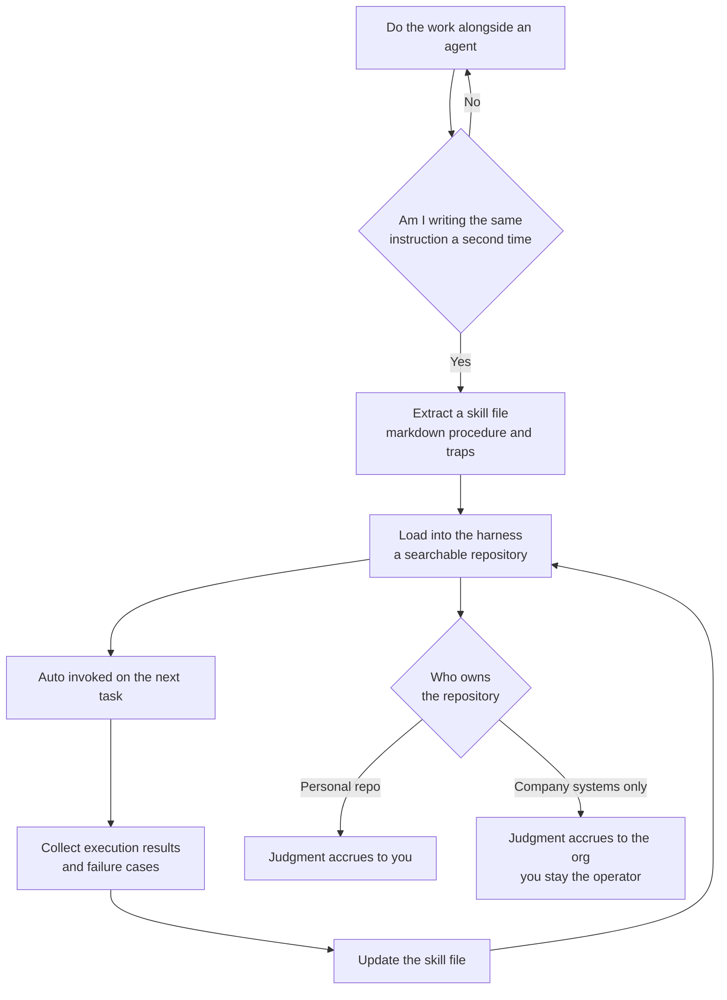

## Why read this

This is for engineers who have wired agents into real work and keep retyping the same instructions, and for engineering leads looking for a way to turn agent usage from personal knack into an organizational asset. The conclusion first: what Garry Tan put on stage at Startup School 2026 is not about model selection, it is about **the structure outside the model**. If you are giving the same instruction twice, that is not a prompt to polish, it is a signal that the work has not been written down as a file yet. And where those files accumulate decides who owns that judgment a few years from now.

*A rendering of work that settles into files and compounds with each repetition. The strands that never get wound simply scatter at the edges.*



*The full Startup School 2026 talk. Running time is roughly 42 minutes.*

## Overview

In early August 2026, Y Combinator president Garry Tan spent 42 minutes on the Startup School 2026 stage talking about personal AGI. What he means by that is not a new model tier. He is describing agents that run on your own infrastructure, accumulate knowledge about you over time, and widen the range of what you can build as a result. The talk walks through the tools and workflows he uses daily and lands on an argument that founders should own their intelligence rather than rent it.

This is worth reading closely because most of us are already halfway there and have skipped the other half. We use coding agents, we keep notes of instructions that worked, we reuse good prompts. What we usually cannot answer is whether any of that is accumulating in a searchable, structured repository, and who owns that repository. The talk aims directly at that gap.

A few lines get quoted in nearly every writeup. The model is just the engine and everything else is the car. When people ask how he prompts his AI, the answer is that he does not, because the skills are the prompts. The line we find most operationally useful is a different one: if you had to ask for something twice, you failed.

## The claim that skills are the prompts

Read literally, this is easy to misunderstand. It sounds like prompt engineering stopped mattering, but the actual structure is closer to the opposite. Prompts did not disappear, they **changed location**. Instructions that used to be typed once into a chat window and thrown away now settle into files and get reused.

The loop runs like this. You get something done alongside an agent. In the process it becomes clear what worked and where the traps were. Rather than leaving that in the transcript, you convert it into a skill file and load it back into your harness. The next time similar work arrives, you do not restart the conversation from scratch, the file gets pulled in. That conversion step is what the talk calls skillifying it.

The important part is that the loop is closed. A skill file is not a document you write once, it is an asset that takes execution results back in and gets revised. That is why it improves over time, and that accumulation is what the talk means by compounding. Swapping in a better model is a one time improvement, this loop adds a little every week.

Tan's own setup is described as a knowledge wiki running to roughly 220,000 pages, markdown skill files that instruct agents, and a harness connecting models to deterministic code. GStack, which he open sourced, is presented as a toolkit that turns Claude Code into something like an engineering team, with skills split across office hours, design, code review, QA and browser testing.

## The word harness deserves attention

Of those three pieces, the one practitioners most consistently undervalue is the harness. The phrase that matters is connecting models to **deterministic code**.

Any team that has run agents for a while knows the failure pattern. Hand the model responsibility for formatting and adjudication and the output drifts a little every run. Given identical instructions it writes the status as complete one day and as processed the next. Ask it to run a quality check and it reports that it passed. That drift is not a sign of a weak model, it happens because room to drift was left open. What a harness does is take that room back. Counting, normalizing enum values, deciding pass or fail, rendering the final format: code owns all of it. The model is left with the content.

So skill files and harnesses are a pair. The skill file carries judgment and procedure, the harness carries the boundaries and the verification. Either one alone collapses. Skill files without a harness are a nice collection of instructions, and a harness without skill files is an executor that accumulates nothing.

## What makes a skill file actually hold up

The talk stops at the principle of skillifying. But follow that principle and most of the files you produce become notes nobody opens within a few weeks. Running skills ourselves, four things separated the files that survived from the ones that rotted.

First, **the definition of done has to live inside the file**. A file that only lists steps forces the agent to declare its own progress, and it will generally declare that it finished everything. That judgment needs to be an executable check, not a sentence. Write down which command must exit zero, which file must appear, which value must clear which threshold, and the file locks into the harness at that moment.

Second, **failure cases carry more information than the procedure**. Models can infer a reasonable happy path on their own. What they cannot infer are the traps specific to that domain. Which argument, when omitted, silently produces a wrong result. Which version it only works on. What a state looks like when it appears successful but is not. Those lines decide what the file is worth. That is why our skill documents carry incident dates and symptoms verbatim.

Third, **write down when not to use it**. Once a repository grows, the problem is not missing skills, it is several similar ones. If you do not state which cases this file does not cover and what to read instead, the wrong procedure gets pulled in simply because the name roughly matched. One line of boundary raises retrieval quality.

Fourth, **every line costs something**. From the moment a skill lands in the index it shows up as a candidate on every invocation. So ask of each sentence whether the agent gets it wrong without it, and delete it if not. Turning every twice repeated action into a file fills the repository with noise, and that noise eats exactly the benefit this approach was supposed to deliver.

Put together, a skill file is not a well written instruction, it is **a procedure with verification conditions and failure knowledge attached**. Only in that shape can a harness execute it and feed the results back.

## Why bring up Spinoza

The spine of the talk is not technical, it is the seventeenth century philosopher Baruch Spinoza. Excommunicated for heresy, offered a salary on condition of silence, grinding lenses by day and writing dangerous books by night. The talk reads him as someone who could hold that position because he owned his own tools, and argues that this is structurally the same position the knowledge worker occupies in 2026.

The historical contrast that follows is blunter. Craftsmen owned their tools and that ownership was the basis of their freedom. The factory severed that relationship. The loom belonged to the mill. Knowledge workers assumed they were safe because their tools lived inside their heads where nobody could confiscate them, and that assumption dissolves the moment cognition is externalized into skill files. The warning the talk leaves behind is this: if you do not own your skills, your job becomes a skill file.

Translated into practice: model quality is rented and will not differentiate you, because everyone ends up on comparable models. A repository holding your own judgment is something you can own, and the gap between those who have been accumulating one and those who have not keeps widening. That is also the basis for the claim that the next generation of startups will run on smaller teams.

There is a part of this argument that sits uncomfortably with employers. We come back to it below.

## What this means for ThakiCloud

This talk is not somebody else's story for us, because **Paxis** is precisely this structure built as an enterprise product.

The Paxis Skill Harness takes an incoming request, searches the skill repository for a match, and executes it inside an isolated sandbox. Moving the personal harness the talk describes up to organizational scale drags in requirements that always follow: who is allowed to execute which skill, what that execution touched, and where a human approval belongs on the risky steps. Paxis handles that layer with policy gates and audit logs, with identity and permissions resting on **Signum**. What a personal repository can safely omit becomes a precondition for adoption inside an organization.

The knowledge side maps across as well. A 220,000 page wiki is unusable without retrieval. That is the job of the Paxis knowledge engine, and the observation that the real bottleneck shifts from writing skills to **selecting skills** as the count grows is one we arrived at independently. Past a few hundred skills, similarly named entries start pulling the wrong one in. Retrieval and routing become first class components of the harness.

The next layer is **Maxis**. Skill execution records are training data in their own right. Once you have accumulated which procedure passed on which inputs and where it failed, those trajectories open a path to specializing smaller models to handle the same work more cheaply. This is where the compounding the talk describes gets realized at organizational scale: execution produces learning, and learning lowers the cost of execution. That cost is then recovered in the **Metis** serving layer.

Ownership also carries into infrastructure choice. If the thesis is to run on your own infrastructure, the enterprise answer to that requirement is on premise deployment through **Aegis**. A skill repository and its execution history are that organization's judgment in its most concentrated form, so where they sit is a sovereignty question rather than a convenience one.

In one line: take what the talk recommends to individuals, move it to organizational scale, and approval, audit and isolation follow. Paxis is that whole set built as one piece.

## Limits and counterarguments

A few things are worth pressing on before accepting the argument as given.

Start with incentives. A YC president saying that small headcounts can build large things aligns exactly with the shape of the companies he funds. The claim that smaller teams got better may be an observation, but it is also a position. The evidence offered in the talk is largely a demonstration of his own workflow, not a controlled comparison or a team level productivity measurement.

Second, be wary of the impression that skill files are a universal answer. Every additional skill creates a standing cost. Its name and description enter the index and appear as a candidate on every call, and a loosely related skill pulled in by mistake produces something worse than not having it. In our own experience, **deleting unused skills** has contributed more to quality than adding new ones on several occasions. So read the rule about skillifying anything you repeat twice as conditional. Work that is both repetitive and carries judgment is the candidate. A single simple command is better left alone.

Third, the tension between personal ownership and organizational assets remains unresolved. The talk recommends keeping skills in a personal repository, which from the employer's side means procedural knowledge created during work walking out into a personal account. That is unsettled territory in terms of copyright and trade secrets, and the talk addresses it only from the individual's side. In practice both parties are safer agreeing in advance where the boundary between company and personal repositories sits and what happens on departure.

Finally, we assembled this from the talk video and published summaries and coverage, and ran no separate reproduction. The quoted lines were chosen because they appear consistently across outlets, but check the original video for exact wording.

## Wrapping up

Garry Tan's talk is not a model or product launch, it is a proposal about how to work. Instead of typing instructions into a chat window, write the procedure down as a file, run that file on a harness kept honest by deterministic code, and feed the results back into the file. The distinction at the center of the proposal is that the model is rented and this repository is owned.

So the thing to do today is not to install a new tool. Pick one task you asked an agent to do **twice in the same spirit** over the last two weeks and move that procedure into a single markdown page. Write what has to be verified, where it is easy to go wrong, and what counts as finished. That is your first skill file. What accumulates as that page becomes ten is not prompts, it is judgment.

## Sources

- [Garry Tan: Own Your Intelligence (YC Startup Library)](https://www.ycombinator.com/library/WX-garry-tan-own-your-intelligence)
- [Garry Tan: Personal AGI Is How You Stay Under Your Own Power (talk video)](https://www.youtube.com/watch?v=eRrc1pUY5oU)
- [Garry Tan: Personal AGI Is How You Stay Under Your Own Power (YC Root Access, full transcript)](https://www.ycrootaccess.com/p/garry-tan-own-your-intelligence)
- [Garry Tan on Personal AGI and Spinoza (StartupHub.ai)](https://www.startuphub.ai/ai-news/artificial-intelligence/2026/garry-tan-on-personal-agi-and-spinoza)
- [Start A Business? There's An AI Agent For That! Y Combinator Head Explains How (Forbes)](https://www.forbes.com/sites/joemckendrick/2026/08/09/go-all-ai-y-combinator-head-urges/)
- [Inside Garry Tan's AI Coding Setup (YC Startup Library)](https://www.ycombinator.com/library/OW-inside-garry-tan-s-ai-coding-setup)
- Original post: [@alex_prompter via @hjguyhan](https://x.com/hjguyhan/status/2086419638821495238)
