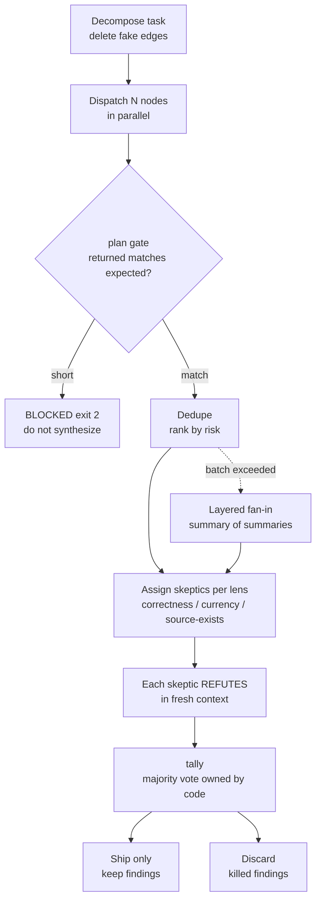

*Fanning out is easy. The gate that merges everything back is the hard part.*

## Why This Matters to You

This is for engineers who spin up several subagents at once for reviews or research, and for the team leads who have to trust those results and decide what happens next. The short version: what determines quality in a multi-agent graph is not how many nodes you dispatched, but whether the results passed a verification gate before you merged them. When we instrumented our own session logs, only 9 out of 180 fan-outs had been closed by verification. That is a 5% closure rate. The other 95% were merged unverified and put in front of a human.

There is a second finding. The idea that fan-out is what makes things expensive did not hold in our data. Cost attaches to dragging work out on the main thread instead of delegating it.

## Background

In July 2026, the term Graph Engineering started circulating on X. It is the fifth name in a line that runs prompt engineering, context engineering, harness engineering, loop engineering. In Japanese-language circles, Masahiro Chaen described it as the same idea as the Dynamic Workflow pattern in Claude Code or UltraCode. That post landed in our queue and became the reason for this article.

Reactions to the term were split. Harrison Chase, who built LangChain, replied on X: "So i didn't really know what graph engineering is, and i still don't really... but it's basically just langgraph?" That is a fair reaction from the founder of a company that has been selling graph orchestration for years. LangGraph is a three-year-old product by 2026, and its Send primitive has let nodes route work to downstream nodes at runtime for a long while.

So this article is not about whether the term is new. We already run this pattern in production and we have the execution records. We want to open those records and see what the graph actually bought us and what it did not. Measurements are more useful here than commentary on vocabulary.

## What the Technique Actually Is

Graph Engineering treats an AI application as an explicitly designed workflow rather than one autonomous agent. It defines how agents, tools, deterministic functions, validators, data sources, and humans coordinate to finish a task, expressed as nodes and edges. Nodes do the work. Edges manage dependencies. Parallel execution, verification, and session-to-session continuity all become structural rather than incidental.

The part people skip is the edges. For every step in a fan-out, ask whether this task actually consumes the *result* of the previous one. If it does not, that is not a dependency. That is just the order you happened to write the code in. We call this the fake-edge test, and deleting fake edges is what turns the same work into parallel work.

The inverse also bites. If two prompts never mention each other but touch the same file or the same rate-limited API, that is a hidden edge. Those need serialization or worktree isolation. When nodes that look independent are not, the graph breaks quietly.

Fan-out has three chronic failure modes. The first is context collapse: pushing the raw output of N nodes into one synthesis step blows past the window. The second is false independence, the hidden-edge problem above. The third is the nastiest, silent node death. One of two hundred nodes dies and the report still looks complete, because a dead node does not leave a blank. It simply never happened.



The last two steps carry the weight. The verdict is not narrated by the model; deterministic code counts the votes. When a model says "I checked and it looks fine," that is not verification. That is self-reporting.

## Installation and Integration

Our closure driver is not an external package. It is a script inside the repository, so there is nothing to install and it runs on the shared interpreter.

```bash
.venv/bin/python .claude/skills/jarvis/runtime/graph_close.py --help
# usage: graph_close.py [-h] {plan,tally,stats} ...
#   plan   dead-node guard + dedupe + layered fan-in + skeptic plan
#   tally  vote on skeptic verdicts (delegates to verify_fanout)
#   stats  closure rate across recorded sessions
```

There are two commands. You collect the node results and hand them to `plan` to get a verification plan, then dispatch the skeptics it names and hand their verdicts to `tally`.

```bash
# 1) tell it how many nodes you dispatched via --expected
.venv/bin/python .claude/skills/jarvis/runtime/graph_close.py plan \
  --results nodes.json --expected 4 --max-skeptics 3

# 2) hand the collected verdicts to the vote
.venv/bin/python .claude/skills/jarvis/runtime/graph_close.py tally \
  --verdicts verdicts.json
```

The node-result contract is small. Each entry needs a `claim` or `text`; `source`, `risk`, and `node` are optional.

```json
[
  {"node": "correctness", "claim": "...", "risk": "high", "source": "https://..."},
  {"node": "security",    "claim": "...", "risk": "high", "source": "internal://..."}
]
```

Here is the first trap we hit, recorded as it happened. We initially named the key `finding`. The script did not raise an error. It read all four entries as empty nodes and returned `"returned": 0, "lost_nodes": 4`. A schema mismatch does not surface as a parse error; it surfaces as node death. The gate did its job, but the failure mode was easy to misdiagnose.

## Real Experiment Results

What follows comes from this repository's actual session logs and command output. Every number is copied from the runs below, and the raw log lives at `outputs/blog-impl/graph-engineering-closing-fanout/run-1.log`.

### The closure rate was 5%

```bash
$ .venv/bin/python .claude/skills/jarvis/runtime/graph_close.py stats
{"status": "ok", "stage": "stats", "sessions_with_agents": 2,
 "agent_dispatches": 80, "fanout_events": 9, "closed": 0, "closure_rate_pct": 0.0,
 "baseline_2026_08_09": {"fanout_events": 180, "closed": 9, "closure_rate_pct": 5.0}}
```

The cumulative baseline as of 2026-08-09 is 180 fan-outs and 9 verified closures. Five percent. The rule requiring a verification stage had been in our documentation from the start. It simply was not running. The cause was friction, not capability: closing a fan-out meant hand-writing JSON through five steps, and our hooks could not even observe subagent dispatches. Fan-outs are now recorded in a ledger, and the closure commands are surfaced at the moment they happen.

### Dead nodes have to block synthesis

We dispatched four nodes and returned only three, then ran the gate.

```json
{"status": "blocked", "expected_nodes": 4, "returned": 3, "lost_nodes": 1,
 "findings": 3, "skeptics_to_dispatch": 9,
 "note": "BLOCKED: 1 node(s) returned nothing. Re-run them or pass --allow-partial;
          never synthesize on a partial set and call the report complete."}
```

Exit code 2. Do not write a report on a partial set and call it complete; if you want to proceed anyway you have to say `--allow-partial` out loud. Without this gate, one dead node out of two hundred still yields a polished report, and that is the most dangerous output a pipeline can produce.

### The cost model ran opposite to the folklore

The cost block in that same output is the interesting part.

```json
"cost": {"skeptic_turns": 9,
         "est_usd_if_delegated": 0.18,
         "est_usd_if_done_inline": 1.41,
         "main_thread_turns_collapsed_to": 2,
         "basis": "measured 2026-08-09: $/main-turn 0.157 @220k ctx, corr(cost,turns)=0.991"}
```

Nine skeptic turns cost $0.18 when delegated and $1.41 when done on the main thread, roughly 7.8x. The underlying measurements: cost correlates with main-thread turn count at 0.991, and with fan-out width at only 0.412. Cost per turn stayed flat between $0.14 and $0.18 whether or not a fan-out was running.

The spend breakdown explains why. Cache reads are 57% of it; output is 9%. The expense is not generating a lot of tokens, it is re-sending a fat context on every turn. That makes delegation a cost *reduction* strategy, not a cost driver. When a worker runs 40 turns in its own context and returns one summary, 40 main-thread turns become one.

There is a condition attached. Worker output must come back as bounded JSON. Text that enters the main context once is billed again on every subsequent turn. That is why the dispatch prompt itself carries this line: "Do NOT return your research notes, quotes, or reasoning trace, they would land in the main thread and are billed on every later turn."

### Dedupe and the skeptic budget

We made two of the four nodes return the same claim and capped the skeptic budget at three.

```json
{"status": "ok", "expected_nodes": 4, "returned": 4, "lost_nodes": 0,
 "deduped_away": 1, "findings": 3, "skeptics_to_dispatch": 3,
 "cost": {"est_usd_if_delegated": 0.06, "est_usd_if_done_inline": 0.47},
 "skipped_by_budget": [{"id": "f0", "claim": "..."}, {"id": "f1", "claim": "..."}]}
```

The duplicate merged automatically, and the findings dropped by the budget are named in `skipped_by_budget`. That detail matters. Capping coverage silently is the same as narrowing your review and then reporting that you looked at everything. If something got dropped, the output has to say so.

Model routing per lens is also owned by code. `correctness` goes to sonnet; `currency` and `source-exists` go to haiku. There is no reason to spend a frontier model on a link check.

### Code counts the votes

We supplied three verdicts per finding and ran the tally.

```json
{"mode": "majority", "total": 3, "kept": 2, "killed": 1, "unverified": 0,
 "findings": [
   {"id": "f1", "refuted": 0, "cast": 3, "decision": "keep"},
   {"id": "f2", "refuted": 1, "cast": 3, "decision": "keep"},
   {"id": "f0", "refuted": 2, "cast": 3, "decision": "kill"}],
 "closure_receipt": "outputs/state/graph-fanout/closures.jsonl"}
```

Finding f0 drew two refutations out of three and was killed. The design detail worth noticing is the `unverified` bucket: when skeptics crash or time out and cast no votes at all, that is not treated as a safe pass. It is classified as unverified and returns exit code 2. Reading zero votes as approval is exactly how a pipeline keeps running with a dead verifier.

The closure receipt persisting to a file is deliberate too. What was verified, when, and what was discarded all leave an auditable trace.

## What This Means for ThakiCloud

We ran this experiment on code our Paxis team uses daily, so these implications are operational experience rather than speculation.

From the **Paxis** angle, DAG multi-agent execution on an Enterprise Agent Platform earns trust through the contract that closes a fan-out, not through the fan-out itself. Retrieving a skill and running it in an isolated sandbox is a question of width. Passing the result through a verification gate before it reaches a human or the next workflow is the question of trust. Drop the second half and automation becomes a machine for producing wrong answers quickly. That is precisely why we are publishing an embarrassing 5% closure rate: a rule that nobody measures is a rule nobody follows.

From the **Signum** angle, a closure receipt like `closures.jsonl` is the raw form of an audit log. Regulated industries will only approve agent automation when there is a record of what the agent claimed, what verification it passed, and what was ultimately accepted. Policy gates and audit logs belong inside the execution path, not in a report written afterward.

From the **Metis** angle, per-lens model routing is token economics in practice. Most verification nodes are fact checks and link checks that a small model handles fine; only the judgment nodes need a higher tier. Mixing Dedicated Endpoints with Serverless lets the infrastructure layer absorb that routing. The gap between $0.06 delegated and $0.47 inline in the run above translates directly into cost per unit of work.

These layers are not separate stories. Paxis executes the work, Metis sets the token economics of that execution, and Signum makes the residue auditable. One Paxis. Many Workflows. Any Cloud.

## Limitations and Counterarguments

The strongest objection is Harrison Chase's: this is not new, it is LangGraph. We largely agree. Graph orchestration is years old, and renaming something does not create capability. Our claim is not that graphs are new. It is that the practice of building graphs without closing verification is widespread, and the gap is measurable.

The second limitation is the scope of our data. A 5% closure rate comes from one repository's session logs in a single-operator environment. Different team sizes and workloads will produce different numbers. The cost correlations are similarly bound to our context sizes and model mix; they are measured on sessions with roughly 220k of resident context, and the advantage of delegation shrinks in much lighter sessions.

The third point is the most fundamental. A graph buys width, not judgment. A graph where verifiers read yet another report is internally consistent and verifies nothing. You have to anchor to something that cannot be argued with: a test that actually passed, a URL that actually resolves, a number that was actually reproduced. Without anchors, a majority vote is confidently wrong.

Finally, if the work is not wide, a graph is overkill. A one-off fix, a single bug, exploratory work where you do not yet know what you are looking for, or genuinely sequential work will all go faster and cheaper with a single agent or a loop. If the fake-edge test finds no parallelizable pair, it was never a graph problem.

## Wrapping Up

Whether the name Graph Engineering is new does not matter much. Three things did show up in our measurements.

First, fanning out is easy and closing is hard. Nine closures out of 180. A rule that carries friction and goes unobserved does not get followed, no matter how clearly it is written.

Second, cost attaches to main-thread turns, not fan-out width. A correlation of 0.991 against 0.412. Holding back on delegation is not thrift, it is waste, provided you take worker output back as bounded JSON.

Third, code has to own the verdict. Dead-node guards, dedupe, exposing what the budget dropped, and majority voting are all deterministic work that costs no tokens. The moment you ask the model whether it verified something, you have replaced verification with self-reporting.

If you are running fan-outs today, try one thing first: pass `--expected N` on your next parallel dispatch. That single flag tells you whether a node died quietly. That is where we started.

## Sources

- [Graph Engineering Explained: What Actually Changed](https://www.louisbouchard.ai/graph-engineering-explained/) (Louis Bouchard)
- [Is Graph Engineering Here? LangChain Says It's Nothing New](https://ai-engineering-trend.medium.com/is-graph-engineering-here-langchain-says-its-nothing-new-17a35a2bad37)
- [3 Years of Graph Engineering with LangGraph](https://www.langchain.com/blog/3-years-of-graph-engineering-with-langgraph) (LangChain)
- [Graph Engineering for AI Agents: A Complete Guide in LangGraph](https://www.analyticsvidhya.com/blog/2026/07/graph-engineering/) (Analytics Vidhya)
- Original post: [@masahirochaen](https://x.com/hjguyhan/status/2086426503936700493) (2026-08-09)
- Run log: `outputs/blog-impl/graph-engineering-closing-fanout/run-1.log`
