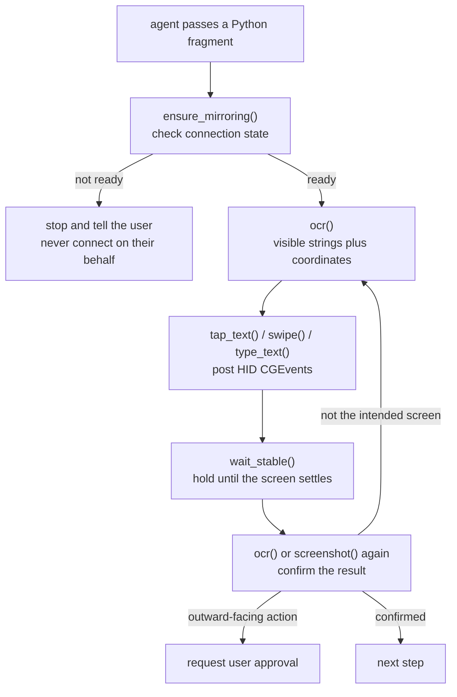

## Why read this

This is for platform engineers and security owners weighing whether to let an agent touch something hard to undo, such as a real device or an internal system. The short version: the technical barrier is already low, and everything left is approval design. phone-harness, published on August 7 and sitting at 850 stars three days later, needs 792 lines of code to drive an iPhone, and cloning, installing and running its check took us minutes. Yet the largest share of its documentation and skill definition is not about how to operate the phone. It is about what not to do and when to stop and ask a person. The four checks that failed when we ran `--doctor` were, without exception, things only a human can clear. This project is worth looking at because it treated that fact as a design premise instead of routing around it.


*What stands between the agent and the device is the actual subject of this tool.*

## Overview

Handing an agent a browser is routine now. There is a DOM, so finding and clicking an element is straightforward, and when it breaks you fix a selector. A physical phone was a different problem for a long time. iOS automation typically demanded Xcode and WebDriverAgent, developer provisioning, sometimes a jailbreak. Access itself was a project.

[phone-harness](https://github.com/ShawnPana/phone-harness) skips that stack entirely by using one macOS iPhone Mirroring window as its transport. The mirroring window renders the phone as a Mac window and forwards mouse and keyboard input as touches. That makes capturing the window and running Apple's Vision framework OCR over it the eyes, and posting CGEvents at the HID level the hands. The repository calls this the poor man's DOM.

The repository was created on August 7 and gathered 850 stars and 65 forks within three days. It is MIT licensed and Python only. Our reason for writing this is not iPhone automation. It is that this project is unusually honest, in both code and documentation, about what a harness owes you when an agent touches something real and hard to reverse.

## What the tool is

The structure is simple. The entire Python codebase is 792 lines, and 346 of those, nearly half, are the helper module the agent actually calls.

```text
src/phone_harness/helpers.py   346 lines   22 functions the agent calls
src/phone_harness/mirror.py    259 lines   mirroring window control and CGEvent posting
src/phone_harness/admin.py      70 lines   install check (doctor) and skill output
src/phone_harness/ocr.py        56 lines   Vision framework OCR
src/phone_harness/run.py        40 lines   CLI entry point
```

The agent uses these functions inside a Python fragment passed over a heredoc. This is a script runner, not a framework.

```bash
phone-harness <<'PY'
print(screen_info())
PY
```

The composition of those 22 helpers shows what the tool considers important. On the reading side there are `screenshot`, `ocr`, `find_text` and `screen_info`. On the acting side there are `tap_text`, `swipe`, `scroll`, `type_text`, `home`, `app_switcher`, `open_app` and `long_press`. But a substantial share of the rest is neither reading nor acting. `connection_state` and `ensure_mirroring` decide whether to stop before starting, `wait` and `wait_stable` hold until the screen settles, and `scroll_until` and `scroll_collect` judge when to quit. More design went into confirming state and defining termination than into the actions themselves.

The return shape of `ocr()` follows the same direction. Every visible string comes back with a confidence score, a center point and a bounding box. The intent is that the agent filters in Python to pick an exact target rather than eyeballing a screenshot and guessing coordinates. The skill documentation says outright to prefer `ocr()` over looking at screenshots, because handing image interpretation to the model costs reproducibility. When `tap_text()` fails it raises with what IS currently visible, so there is a basis for re-checking state before a retry.



The step that matters in this loop is the final confirmation. With no DOM there is nothing to assert against, so the capture itself is the only ground truth. The skill documentation insists on calling `wait_stable()` after every action and then reading the screen again. Do not assume the action worked because you performed it; look. That is exactly the principle we keep pressing on when designing agent loops. An executor cannot be allowed to self-report success, and the observed result has to be the termination condition.

List traversal is built on the same philosophy. `scroll_collect()` decides whether to keep scrolling based on whether **the screen actually moved**, not on whether the parser found new rows. The point is to keep a dense screen or a missed OCR line from ending the scroll early. The return value states whether `stop` was `reached-end` or `max-scrolls`, so the caller can tell reaching the bottom apart from hitting a limit. No silent truncation.

The most striking part of the documentation is not a feature but a prohibition. The skill definition puts a "When Not to Use" section first: if the task can be done on the web or on the Mac, do it there and leave the phone alone. A "Consent" section then says to stop and ask before anything outward-facing or hard to reverse, such as sending a message, posting, purchasing, deleting or changing settings. It goes as far as saying not to linger in the user's personal areas, in Messages, Photos and Mail, beyond what the task needs.

It also draws a line around connection itself as not the agent's job. If the phone is not connected, `ensure_mirroring()` raises a clear error and stops. The documentation then names two things the agent must never do: press the connect button on the user's behalf, and poll waiting for the connection. Retry once, after the user confirms they have done it themselves.

## Installing and integrating

Installation is three steps: clone, install dependencies, install editable.

```bash
git clone --depth 1 https://github.com/ShawnPana/phone-harness ph
cd ph
VIRTUAL_ENV="$PWD/../.venv" uv pip install \
  pyobjc-framework-Quartz pyobjc-framework-Vision \
  pyobjc-framework-Cocoa pyobjc-framework-ApplicationServices
VIRTUAL_ENV="$PWD/../.venv" uv pip install -e . --no-deps
phone-harness --doctor
```

Following the documentation literally gets you stuck here. The README, `install.md` and the `dependencies` list in `pyproject.toml` all name `pyobjc-framework-AppKit`, and no package by that name exists on PyPI. We checked, and that URL returns a 404. The AppKit wrappers ship in `pyobjc-framework-Cocoa`. Run the documented command and it stops at this error.

```text
× No solution found when resolving dependencies:
╰─▶ Because pyobjc-framework-appkit was not found in the package registry
    and you require pyobjc-framework-appkit, we can conclude that your
    requirements are unsatisfiable.
```

Swap the name for `pyobjc-framework-Cocoa` and it resolves. In our environment five packages installed, with `pyobjc-framework-quartz` and `pyobjc-framework-vision` at 12.2.1. The interesting part is that `--doctor` cannot catch this. It checks whether `AppKit` imports, not what the package is called, so once Cocoa is installed the check simply passes. The mismatch between the declared dependency and what is actually needed is not something the checker can see.

To make the agent reach for the tool on its own, register it as a skill. The repository emits its own skill definition on standard output.

```bash
mkdir -p ~/.claude/skills/phone-harness
phone-harness skill > ~/.claude/skills/phone-harness/SKILL.md
```

## Measured results

After installation, `--doctor` exited with code 1. Two of six checks passed and four failed.


*Every remaining failure right after install waits on a physical human action.*

The two that passed were the pyobjc framework imports and the presence of the iPhone Mirroring app. The four that failed were the Accessibility permission, the Screen Recording permission, iPhone Mirroring running, and a paired mirroring window. Our environment has no paired iPhone, and being a headless session we cannot flip permission toggles in System Settings either. So we did not reproduce the stage where a screen is actually captured and a tap is sent. Everything in this article about operating the phone comes from reading the repository's documentation and code; what we measured directly stops at installation and the check.

That failure does not weaken the conclusion. It is the conclusion. All four failures are things **only a human can clear**, and the tool treats that as a premise rather than a bug. The doctor output tells the user which pane to open for each item and stops there. It does not try to route around them.

There is one more piece of honesty. The doctor output ends with this paragraph.

```text
note: these are the permissions currently known to be required. A fresh
machine may still prompt for more the first time an action runs — approve
them in System Settings if a step silently does nothing despite this passing.
```

It warns that even after the check passes, macOS may prompt for more the first time a real action runs, and that taps may silently do nothing. The tool documents the incompleteness of its own checker inside that checker. You do not see that often in agent tooling.

## What this means for ThakiCloud

What makes this interesting to us is not the iPhone but the **boundary design**. **Paxis** is our Enterprise Agent Platform: it retrieves skills, runs them in an isolated sandbox, and passes every action through a policy gate and audit log. The hardest part of that structure is not attaching a tool. It is redefining, per tool, which actions require human approval. phone-harness put that definition directly into its skill document. It enumerates outward-facing and irreversible actions as approval targets, and pushes physical acts like connecting entirely outside the agent's authority. That is exactly the contract our Skill Harness should demand of any skill it accepts. A skill that describes capabilities without a prohibition list gives a policy gate nothing to attach to.

There is a second point: this tool put its approval checkpoints in the **code path**, not in a prompt. Try to act while disconnected and `ensure_mirroring()` raises, with the user's next step embedded in the exception. It does not rely on the agent remembering a rule; the function physically blocks. That matches a principle we return to whenever we design skill contracts. Asked for in prose, a constraint wavers; owned by code, it does not. When choosing where to attach a policy gate, look for the point where a function can refuse, not the point where a model judges whether to pass.

For **Signum**, what needs auditing changes. Browser automation leaves request logs, but posting taps at coordinates over HID leaves the target app with no trace at all. Only the harness knows what was pressed. Running this class of tool in an enterprise makes it mandatory to force an action log on the harness side and lift it into audit events. Device control is the kind of automation most prone to an audit gap.

The verification loop leads to **Maxis**. This harness re-reads the screen and confirms the result after every action, and that confirmation record is trajectory data as-is. It captures which action on which screen produced the intended result, and where it failed and backed up. On the path of feeding execution results back as training data to build customer-specific models, verified trajectories like these are valuable precisely because success is already labelled.

## Limits and counterarguments

The biggest constraint is the platform. iPhone Mirroring is a premise, so a Mac is required, and if Apple changes how that app behaves the harness shakes as a whole. Because it drives a human-facing window programmatically rather than using an official automation interface, that dependency rests on observed behaviour, not a contract. Putting it on the critical path of a production workflow is precarious.

The permission model is heavy too. Granting Accessibility and Screen Recording to a terminal gives keystroke and screen-capture ability to everything running in that terminal. The grant is not scoped to phone-harness. On a shared development machine that decision should not be made lightly.

Reliability deserves a cold look as well. Locating coordinates by OCR is fundamentally weaker than a selector. The documentation itself lists pitfalls: Home Screen icon labels are not tap targets, the window moves so coordinates must never be cached, input is swallowed unless a text field is focused first. A long list like that also means these things go wrong often in practice.

The absence of a DOM defines the character of the approach. With browser automation you can structurally assert that an element exists and what its value is, and the assertion fails immediately when wrong. With only screen capture, no such assertion is possible; what remains is the observation that the screen looks a certain way. Observations wobble with lighting, animation, font rendering and load latency. That is why the skill documentation demands `wait_stable()` after every action, and that mitigates the problem rather than removing it. For workflows that need deterministic verification, this class of tool should not be the final gate. A human check or a separate API cross-check has to sit behind it.

The repository being very young matters too. It is three days old with nine open issues. Eight hundred and fifty stars signal attention, not stability. The dependency name error we hit suggests it is fair to assume more rough edges remain.

Finally, there is territory we could not verify. As noted, without a paired device and permissions we did not reproduce actual operation. The numbers you would most want in real use, such as OCR accuracy or tap success rate, are not in this article. If you need those, you will have to build the environment and measure them yourself.

## Wrapping up

phone-harness shows that the entry barrier to iPhone automation has come down to 792 lines. Cloning and installing it required fixing exactly one package name in the documentation, and what remained after that was four permission toggles a person has to flip.

So what to take from this tool is not an operating technique. It is that as capability gets cheaper, boundaries get more valuable. This project wrote more about what it will not do, where it stops to ask, and how far its own checker vouches, than about what it can do. Every design that hands an agent something hard to reverse eventually converges on writing that document.

If you are planning to attach a new tool to an agent platform, try one thing today. Look in that tool's skill definition for the prohibition list and the approval checkpoints. If they are not there, that is the document you need to write before attaching it.

## Sources

- [ShawnPana/phone-harness](https://github.com/ShawnPana/phone-harness) (repository, MIT)
- [phone-harness SKILL.md](https://github.com/ShawnPana/phone-harness/blob/main/SKILL.md) (skill definition and consent rules)
- [phone-harness install.md](https://github.com/ShawnPana/phone-harness/blob/main/install.md) (install requirements and permissions)
- [pyobjc-framework-Cocoa](https://pypi.org/project/pyobjc-framework-Cocoa/) (where the AppKit wrappers actually ship)
