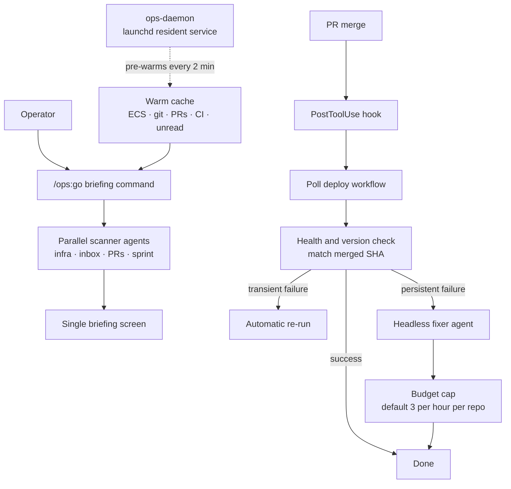

*Two ways to hold the same capability.*

## Why read this

This is for platform engineers and tech leads weighing whether to hand internal operations to an agent, and wondering how many skills to build and how thick each one should be. The short answer: the metric that matters when you evaluate a tool like this is not the skill count but the average thickness of one skill and the routing that picks it. Count is a marketing number. Thickness and routing decide your token bill and your accuracy.

The subject here is an open-source plugin called claude-ops, but this is not a product tour. Instead of copying the numbers printed in its README, we counted the repository tree, and three different numbers came out of the same repository. Following that disagreement makes it fairly clear what actually becomes the bottleneck when you run an agent harness for real.

## Overview

claude-ops aims to turn Claude Code into a business operating system. Lifecycle Innovations Limited publishes it under the MIT license. At the time we checked, the repository had 99 stars and its last push was 2026-08-11 at 08:04 UTC. The post that surfaced it on our timeline yesterday described it as 57 skills and 21 agents.

The core experience is a single command, `/ops:go`. Run it and you get infrastructure health, CI/CD status, a unified unread count across Slack, Telegram, WhatsApp and Gmail, open PRs, sprint progress, and a revenue and cost snapshot spanning Stripe, RevenueCat and AWS, all on one screen. One command instead of six morning tabs is the pitch.

So far this is a well-built dashboard. It gets interesting where version 2.0 changed direction. What had been a briefing and communications surface became an autonomy layer for Claude Code itself. Merge a PR and a hook polls the deploy workflow, calls the health endpoint on success, and verifies that the version endpoint returns the merged commit SHA. On failure it re-runs transient errors automatically, and if that does not work it dispatches a headless fixer agent. A post-deploy recovery loop that runs without a human in it.

## What the tool is

The structure is easier to see drawn out.



A few design choices are worth noting.

First, data collection happens before the model context loads. Every skill uses pre-execution shell blocks that gather data before the model wakes up, and a background daemon pulls that data every two minutes, so `/ops:go` hits a warm cache. Given that much of an agent's perceived latency is tool-call round trips, this is a sound trade.

Second, the auto-fix loop has brakes on it. A budget cap defaulting to three runs per hour per repository, single-flight locks against concurrent execution, and content-hash dedup against repeat work all ship together. Whoever built this knew that the first thing to break when you bolt on an autonomous loop is infinite retry.

Third, safety hooks are always on. Secret scanning, an `rm -rf` anchor block, and a warning on pushes to main are defaults. Outbound one-to-one channels have to clear a separate approval gate.

Fourth, the credential resolution chain is documented: Doppler MCP first, then the Doppler CLI, then 1Password, Dashlane and Bitwarden, then the macOS Keychain, then environment variables, and finally Claude Code's encrypted user config. For a tool touching credentials across 22 services, publishing that order counts for something.

### Agent teams, and a CI test that enforces the contract

The most instructive part was somewhere else. Every skill that spawns agents is built to support Claude Code's agent teams feature, and CI checks that it does.

Agent teams are a coordination layer that lets several agents share context, report progress, and accept mid-flight steering. You enable it with `CLAUDE_CODE_EXPERIMENTAL_AGENT_TEAMS=1`. With it on, `/ops:go` dispatches its infra, inbox, PR and sprint scanners into one team, so that when the inbox agent notices a Slack message referencing an email thread, the email agent raises that thread's priority. With the flag off, everything falls back quietly to uncoordinated parallel subagents.

That is the feature. The lesson is what follows it. `tests/test-agent-teams.sh` audits every skill: if a skill lists `Agent` in its allowed tools, it must have the team-create and message-passing calls, a documentation section, a feature-flag check, and a fallback path, and CI fails if any of those is missing. Rather than asking skill authors in prose to honor the convention, they wrote code that checks.

If that check was worth having at 63 skills, it stops being optional at several hundred. It is the same call we made when we wrote our rules so that the shape and pass status of an output are decided by code rather than by the model's own report. Conventions people agree to uphold do break eventually, and the moment you notice is usually after an incident.

## Installing and integrating

Installation goes through the plugin marketplace.

```bash
# 1. Register the marketplace
/plugin marketplace add Lifecycle-Innovations-Limited/claude-ops

# 2. Install the plugin
/plugin install ops@ops-marketplace

# 3. Run the setup wizard
/ops:setup
```

Claude Code 1.0 or later is the only stated prerequisite; the wizard installs everything else through Homebrew, apt or winget. It installs the background daemon at step 2, so pre-warming is already running while you are still answering whether to connect Slack, and your first briefing comes out of cache.

If you run several CLIs, there is a separate path.

```bash
npx claude-ops-installer install
```

That command reads a single central config and mirrors skills and binstubs into the expected layout of each detected CLI among Claude Code, Codex, Gemini, OpenClaw, Hermes and OpenCode. The idea is to stop describing the same capability once per harness, which points the same direction as keeping skills outside the harness in the first place.

There are 22 integrations. Most offer both an MCP path and a CLI path, and the wizard lets you pick per integration. GitHub and AWS effectively require the CLI, Linear and Vercel are fully covered by MCP alone, and WhatsApp has no MCP at all so it uses a dedicated CLI. Gmail's MCP is read-only, so sending and archiving need the CLI. The table documenting what you give up per integration is the most practical page in the whole document.

## What we measured

We counted the skills. The timeline post said 57, the README badge said 62, and the architecture diagram and directory listing inside that same README said 22. Since all three disagreed, we counted the actual files through the GitHub tree API.

```bash
python3 scripts/blog/_exp_claude_ops_20260811.py
```

Here is what came back.

| Source | Skills | Agents |
| --- | --- | --- |
| Timeline post | 57 | 21 |
| README badge | 62 | 21 |
| README architecture diagram and directory listing | 22 | 12 |
| Git tree, measured | **63** | **21** |

The tree holds 63 directories matching `skills/<name>/SKILL.md` and 21 markdown files under `agents/`. The repository is 933 files in total, including 7 hook files and 26 markdown documents.

The badge is off by one, so it is essentially current. The architecture diagram is the problem. Its 22 and 12 are about a third of reality, and they sit exactly where a reader looks first to understand the structure. Given that the repository was pushed the same morning we wrote this, it is a textbook case of prose falling behind the tree in an actively developed project.


*Read count and thickness together and the two harnesses point in opposite directions.*

The more interesting number was not the count but the thickness. The average `SKILL.md` in claude-ops is 16,360 bytes. Agent definitions average 6,669 bytes. Counting our own repository the same way gave 1,946 skill documents averaging 8,786 bytes, plus 67 always-on rules averaging 3,487 bytes.

Line those up and the picture is clear. claude-ops puts nearly twice our content into one skill and keeps only 63 of them. We write each skill thin and have thirty times as many. Two opposite solutions to the same problem.

## Few thick skills versus many thin ones

This difference is not taste. It is routing.

At 63 skills the model can read them all and choose. Putting every name and description into context is affordable, and once it has chosen, a 16 KB document hands over the full context in one shot. A skill can afford to be thick precisely because its odds of being selected are high enough.

Past roughly nineteen hundred skills that approach collapses. Loading every name and description alone costs real tokens each session, and the model is choosing out of noise. So we put a retrieval layer in front. When a request arrives, a searcher combining BM25 and embeddings narrows it to at most three candidates, and only those get loaded. Keeping skill documents thin follows from the same constraint: when a candidate is thick, choosing wrong costs more.

Put plainly, writing thick skills costs you a ceiling in the low hundreds. Growing the count costs you an extra router to operate. Neither is free, and which one you picked determines how wide a domain that harness can eventually cover. For a scope as defined as company operations, thick wins. For a scope that stays open-ended, build the router first.

Seen this way the count disagreement reads differently too. Badges and diagrams are strings a person maintains by hand. The larger a harness grows, the more certainly those hand-maintained numbers drift from the tree, and the drift is silent. That is exactly why we pinned down in our own rules that counts, lengths and pass status are computed by code rather than asserted by a model. Anything worth counting needs code that counts it.

## What this means for the ThakiCloud stack

The problem claude-ops takes on overlaps precisely with the one Paxis takes on. Paxis is ThakiCloud's Enterprise Agent Platform: it retrieves skills, executes them in an isolated sandbox, and puts every action through policy gates and audit logging. Three things we confirmed while reading claude-ops land directly on that design.

First, skill routing becomes its own component the moment scale arrives. claude-ops holds at 63 without a router, but enterprise work automation crosses several hundred quickly as each department adds workflows. That is why the Paxis Skill Harness carries a retrieval layer from the start. The ceiling on how many skills you can add is the ceiling on how much work you can automate.

Second, an autonomous loop needs a brake owned by code. The hourly budget cap and single-flight lock in claude-ops are not options; they are the precondition for turning autonomy on at all. Paxis places human approval and policy gates at the same layer, and keeps execution traces and cost measurements alongside them. Autonomy without an approval gate is not a feature, it is a pending incident.

Third, credentials and audit belong in a separate layer. claude-ops handles keys for 22 services, documents its resolution order, and states plainly that it sends no telemetry. That is a conscientious posture, but it is a personal-tool posture. At organization scale, who ran what under which permission has to be reconstructable after the fact, which is why Signum holds IAM, multi-tenancy and audit events as shared foundation.

One more follows from that. The claude-ops auto-fixer dispatches a cheap model headlessly, and its competitor-intelligence pipeline works the same way, reportedly running on about a dozen search calls a week and roughly 320k tokens a month at ten-brand scale. Which model you attach to a worker that runs on repeat sets the break-even point of that automation.

Metis absorbs exactly that point through Dedicated Endpoints and Serverless, lowering the token cost of a single worker run, and runs the same workload on Telox GPU clusters or on Aegis inside a customer's air-gapped network. The economics of work automation come down to call price times call count, and infrastructure can move both terms. A personal tool can hide this arithmetic inside a subscription cap, but once an organization runs workers continuously, price per call becomes the boundary of what you can adopt.

## Limits and counterarguments

A few things to weigh before adopting this as-is.

It is designed around an individual or a very small team. macOS Keychain access, Continuity-based phone integration and auto-launching Elgato Camera Hub all reach deep into one person's workstation. There is no structure for several people sharing the same automation, and credentials stay scattered across personal stores.

Credential concentration is a real risk. One tool resolves keys for 22 services while a resident daemon runs in the background. The documentation is candid about scope and the source is public and auditable, which helps, but concentrating that much authority in one process is a decision that deserves separate review in an organization.

Documentation drift is a genuine cost. As shown above, the skill count varied threefold inside a single README. That is common in an actively developed project, but if you evaluate on the documentation you will form the wrong picture. Count the tree yourself.

Finally there is the standing cost of the daemon. Pre-warming every two minutes, memory extraction every thirty minutes, and competitor-event draining every ten minutes all run at once. You buy lower latency by spending resources while idle. If you look at the briefing once or twice a day, that trade is worth recomputing.

## Wrapping up

What is worth taking from claude-ops is not the feature list but the design decisions: writing skills thick and capping them at 63, fitting the autonomous loop with a budget cap and single-flight lock before anything else, and documenting the credential resolution order. Those are calls a team makes only after actually running an agent harness.

So the next step we would recommend today is not an adoption review but a measurement. Count the skills in the harness you are running now, and the average size of a skill document. If the count has crossed into the hundreds and there is no router, your bottleneck already moved from the model to the selection step. If the count is small but the documents are thin, your model is probably rebuilding context from scratch on every run. Either way you cannot know before counting, and the number printed in the documentation is not the answer.

## Sources

- [claude-ops repository (Lifecycle Innovations Limited, MIT)](https://github.com/Lifecycle-Innovations-Limited/claude-ops)
- [Original timeline post](https://x.com/hjguyhan/status/2086832106148425975)
- Skill and agent measurement: `scripts/blog/_exp_claude_ops_20260811.py`, result log `outputs/blog-impl/claude-ops-business-os/run-1.log`
