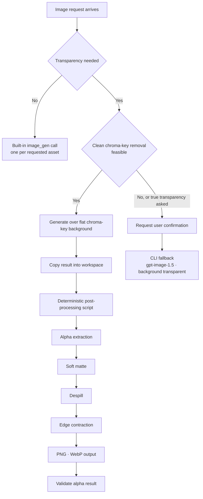

*Attaching a capability and defining a procedure are different jobs.*

## Why read this

This is for platform engineers and agent developers who have wired skills into an in-house agent and are watching output quality drift from call to call. The conclusion up front: the body of a well-built skill is not the sentence that invokes the model, it is the procedure that has been carved out into code so the model cannot touch it, and that procedure is far cheaper than you would guess.

Codex's `imagegen` skill is a good specimen. Reduce what it does to one line and it is image generation, yet most of the skill document is not about how to make an image. It is about which path to take when, where to save the result, and which script to hand the work the model cannot do. Below we read those rules, then implement the post-processing the skill delegates to an external script and measure what it costs and what it buys.

## Overview

Codex CLI has used gpt-image-2 as its default image model since April 21, 2026, replacing gpt-image-1.5. That swap left an interesting mark on the skill design. As we will see, the newer model does not support one feature the older one had, and the skill fills that hole with procedure.

`imagegen` is not a user-authored skill, it is a system skill. The canonical copy lives at `skills/.system/imagegen/SKILL.md` in the `openai/skills` repository, with a sample copy shipped inside the Codex repository as well. It has been revised recently through a pull request titled `[codex] Update imagegen system skill`. In other words the file is part of the product rather than documentation about it, and it gets the same treatment as versioned code.

There are two ways in. You can name it, as in `codex "Create a dark-mode dashboard header banner $imagegen"`, or natural language will route there on its own. The targets are images that get used inside a project: website assets, game assets, UI mockups, product mockups, wireframes, logos, infographics.

## What the skill actually specifies

Reading the skill document, the rules fall into three layers.

The first is path routing, deciding between the built-in `image_gen` path and the CLI fallback, and the criteria are quite specific. The document states that the user saying the word "batch" is not on its own grounds for the CLI fallback. Even when several assets are requested, if the user has not explicitly asked for CLI, API, or model controls, the built-in path is used with one built-in call per requested asset. Why a sentence like that is necessary becomes obvious once you have lived it. Models see a phrase like "several images" and drift toward whichever path looks more powerful, and that path is usually slower and more expensive.

The second layer is what happens to the result. The skill distinguishes how to set the output path and whether this is a situation where the result belongs saved into the current project or is only a preview. Being able to make an image and landing that image correctly inside a project are different problems, and the skill declines to leave the second one to the model's discretion.

The third layer is the one this article cares about: transparent backgrounds, where the hole mentioned earlier shows up. gpt-image-2 does not support `background=transparent`. If you need genuine transparency you have to invoke gpt-image-1.5 through the CLI with `--background transparent --output-format png`, and the skill declines to make that the default. Instead it directs the agent to generate the image over a flat chroma-key background, copy the result into the workspace, run the `scripts/remove_chroma_key.py` helper, and validate the alpha result. What that helper owns is chroma-key alpha extraction, soft matte, despill, edge contraction, and PNG plus WebP output.

The CLI fallback opens only when the request looks too complex for clean chroma-key removal or the user explicitly asks for true transparency, and even then it runs only after user confirmation.



What deserves attention here is where the weight sits. The model's job is the one box at top left, and everything running down the page after it is fixed procedure.

## Setup and integration

You can test the core of this design without Codex CLI by implementing the four post-processing stages the skill pushes outward. We ran the experiment in an isolated worktree.

```bash
bash scripts/blog/impl_sandbox.sh setup codex-imagegen-skill-procedure
```

First we generated a test asset the way the skill directs, over a flat chroma-key background.

```bash
.venv/bin/python scripts/blog/gen_image.py \
  --prompt "A single glossy ceramic coffee mug, deep navy blue glaze, centered, \
studio product photography, isolated on a perfectly flat uniform chroma key green \
background, no shadows on the background, no text, no labels" \
  --output outputs/blog-impl/codex-imagegen-skill-procedure/asset-chroma.png
```

There is a reason we picked a mug with a handle. The interior of the handle is an enclosed region with no connection to the image border, so any approach that fills the background inward from the edges leaves that hole intact. It is the detail that separates a correct implementation from a plausible one.

The post-processing is implemented with nothing but NumPy and Pillow. Alpha extraction keys on green dominance, the G channel minus the larger of R and B. The soft matte ramps that dominance linearly between two thresholds so the boundary keeps partial alpha. Despill clamps green down to the average of the other two channels wherever it dominates, and edge contraction pulls the matte one pixel inward with a minimum filter.

```bash
bash scripts/blog/impl_sandbox.sh run codex-imagegen-skill-procedure -- \
  .venv/bin/python chroma_experiment.py asset-chroma.png <results dir>
```

As a control we also computed a binary matte using a single threshold, so we could count in pixels what each stage actually removes.

## Measured results

These are measurements on one 1536x1024 image, roughly 1.57 million pixels.


*Fringe removal, per-stage wall time, and output size by format, side by side.*

The first thing we checked was boundary quality. The binary matte cut with a single threshold left 2,376 pixels that were still green inside the visible region. Applying the soft matte and despill brought that to zero, and it stayed at zero through edge contraction. The binary matte has zero partial-alpha pixels by definition, while the soft matte produced 1,929 of them, and those 1,929 pixels are what make the boundary read as a line rather than a staircase.

The enclosed-region check returned 75,791 pixels: transparent area with no connection to the image border, which is to say the inside of the handle. Had we filled the background inward from the edges, that many pixels would have stayed opaque. Keying on color instead avoids creating the problem in the first place.

The cost came in far lower than expected. Alpha extraction and soft matte took 1.14 milliseconds, despill 6.36, edge contraction 4.67, for 12.17 milliseconds total. Given that the model call producing the same image runs in seconds, the entire post-processing chain lands under one percent of generation time.

We measured the output formats too. Lossless WebP came in at 457.2 KB against PNG's 1,321.8 KB, 65.4 percent smaller. That explains why the skill specifies emitting both. Shipping a web asset and keeping an editing source are different requirements.

One number deserves an honest caveat. Despill touched 1,033,335 pixels, 65.7 percent of the image, with a mean reduction of 167.23. That looks dramatic, but most of it is the background itself, which gets alpha zero and disappears anyway. The visible improvement came from the small subset of those pixels sitting on the boundary. Do not read that figure as the effect size of despill.


*The final cutout, transparent through the inside of the handle.*

## What this means for ThakiCloud

This case lands on exactly the spot Paxis is designed around. Paxis is our enterprise agent platform: it retrieves skills, runs them in an isolated sandbox, and puts every action through a policy gate and an audit log, and how skills are written there governs output quality. What `imagegen` demonstrates is putting procedure rather than capability into the skill. The model produces content only, while what happens in what order, where it gets saved, and how failure is judged are owned by code. Running our own in-house skills has pushed us to the same conclusion repeatedly. When output wobbles between calls, the cause is usually not the model tier, it is a stretch of the process where degrees of freedom were left open.

The rule that the CLI fallback runs only after user confirmation is also worth pausing on. It is a structure that takes human approval before moving onto a more expensive or riskier path, and the Paxis human approval gate plays exactly this role. That approval and the path choice then need to land in an audit log, because otherwise you cannot explain later why that path was taken. Signum, which owns identity, permissions, and audit events, carries that layer. The deeper automation goes, the more audits ask why a path was chosen rather than what was done.

From an execution economics angle, Metis owns that one box at the top left. What the ratio between 12.17 milliseconds of post-processing and a multi-second model call tells you is that essentially all of the cost in this workload sits in the model call. How many calls you make per asset is therefore the cost, which is ultimately the same point the skill is making when it forbids drifting to another path merely because the word "batch" appeared. Metis is the layer choosing whether that call is held on a Dedicated Endpoint or flows through Serverless, and that choice converts into the token cost of a single Paxis work item.

## Limitations and counterarguments

First, the scope of our experiment. We did not install Codex CLI and run the `imagegen` skill directly. Codex was not available in this environment, so we did not verify that the routing behaves as documented. What we verified is what it costs and what it achieves when the post-processing stages the skill delegates outward are implemented to the same specification. That is not a verification of the skill itself.

The implementation is also ours, not OpenAI's. We did not read and port the original `remove_chroma_key.py`. We took the four stage names from the documentation and implemented each in a standard way. Thresholds of 20 and 70 and a one-pixel contraction are our choices, and we do not know what values the original uses. These numbers therefore mean "implement these four stages this way and you get roughly this," not "the original performs this well."

The measurement conditions are narrow as well. One image, and a studio product shot with a perfectly flat background and a sharp subject boundary at that. Hair, translucent glass, motion-blurred edges, the conditions that actually make chroma keying hard, were not tested at all. A fringe count of zero holds only under these conditions, and the fact that the skill document carves out an exception for requests "too complex for clean chroma-key removal" suggests such conditions exist.

Finally, the argument in the other direction. Freezing procedure into code raises stability and lowers flexibility. If a future gpt-image-2 revision starts supporting transparent backgrounds, the entire bottom half of that flowchart becomes unnecessary. A design that embeds procedure into a skill also takes on the debt of tracking model evolution through skill revisions. Reading `imagegen` as a versioned system skill updated through pull requests precisely in order to service that debt is probably the accurate view.

## Wrapping up

Having read the `imagegen` skill and implemented its post-processing, the value of this skill turned out not to lie in being able to make an image. It lay in identifying what the model cannot do, carving it out into deterministic code, and fixing in prose which path to take and when to ask a human.

That procedure cost 12.17 milliseconds on a 1.57 megapixel image. For under one percent of the model call that produced the same image, 2,376 green fringe pixels disappeared and 75,791 pixels of enclosed region that an edge-based approach would have missed were handled correctly. Exchange rates between quality and cost this favorable are not common.

What to do now is pick one in-house skill and reread its document. Count the ratio of what has been left to the model against what code owns, and check which side the items that wobble between calls are sitting on. They are usually still on the model's side, and as measured above, moving them costs far less than you would expect.

## Sources

- [The imagegen system skill in the openai/skills repository](https://github.com/openai/skills/blob/main/skills/.system/imagegen/SKILL.md)
- [The imagegen sample skill shipped inside Codex](https://github.com/openai/codex/blob/main/codex-rs/skills/src/assets/samples/imagegen/SKILL.md)
- [Pull request #18852 updating the imagegen system skill](https://github.com/openai/codex/pull/18852)
- [Notes on image generation in Codex CLI and the move to gpt-image-2](https://codex.danielvaughan.com/2026/04/27/codex-cli-image-generation-gpt-image-2-visual-development-workflows/)
- [Codex use case: from idea to proof of concept](https://developers.openai.com/codex/use-cases/idea-to-proof-of-concept)
