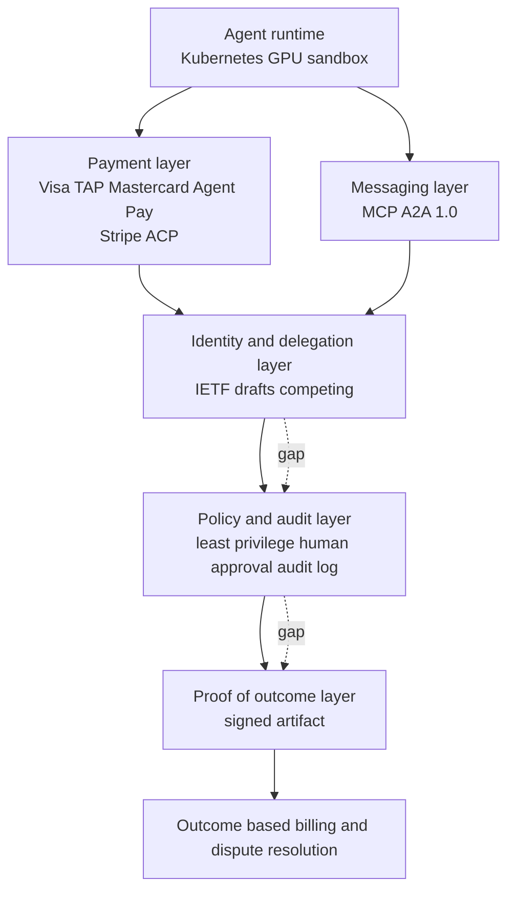

## Why This Matters

This post is for platform engineers who actually want to wire agents into internal workflows, and for the decision makers who have to sign off on that. The short version: giving an agent money is already a solved problem. What remains is the layer that proves who an agent acts for and how far it is allowed to go.

As recently as 2025, this was hypothetical. It isn't anymore. Visa, Mastercard, and Stripe have each shipped commercial agent payment infrastructure, and the protocol agents use to talk to each other has moved under the Linux Foundation and hit 1.0. Meanwhile, the standard that defines who delegated to an agent and when that authority expires is still a handful of individually submitted IETF drafts competing with each other. What is blocking adoption is not model capability. It's this asymmetry.

<!-- nlm-visual -->

*Infographic generated by NotebookLM from the sources.*

## What Got Settled in a Year: Payments and Messaging

Let's start with what's already finished.

On payments, the card networks moved in directly. Visa's [Intelligent Commerce](https://www.visa.com/en-us/solutions/intelligent-commerce) names authentication, risk, and trust as new problems the moment AI initiates a transaction, and it attaches a Trusted Agent Protocol so merchants can identify and verify the agent. Mastercard announced [Agent Pay](https://www.mastercard.com/global/en/news-and-trends/press/2025/april/mastercard-unveils-agent-pay-pioneering-agentic-payments-technology-to-power-commerce-in-the-age-of-ai.html) in April 2025 with Agentic Tokens, an extension of its existing tokenization scheme that binds a card credential to an agent, a merchant scope, and a consent policy. Stripe's [Agentic Commerce](https://stripe.com/use-cases/agentic-commerce) lets an agent pay within spending guardrails while every transaction stays visible in real time and purchase history stays traceable. OpenAI went further and built a checkout experience [directly inside ChatGPT](https://openai.com/index/buy-it-in-chatgpt/) using the Agentic Commerce Protocol it built with Stripe.

Messaging tells the same story. Google's [Agent2Agent](https://developers.googleblog.com/en/a2a-a-new-era-of-agent-interoperability/), announced in April 2025, launched with more than 50 partners, was [donated to the Linux Foundation](https://developers.googleblog.com/en/google-cloud-donates-a2a-to-linux-foundation/) that June, and shipped a 1.0 spec under foundation governance in April 2026. Anthropic's [MCP](https://www.anthropic.com/news/model-context-protocol) followed a similar path: it became the de facto standard for tool connectivity, then moved to the Agentic AI Foundation in December 2025.

The signal here isn't any single product. **When a spec one company was pushing gets handed to a neutral foundation, that means competition at that layer is over.** Building a new agent payment rail or a new agent to agent message format today is too late. Those seats are already taken.

## The First Unowned Layer: Identity and Delegation

The problem starts right after. A payment network judges whether a given credential is allowed to pay. It does not judge whether this agent genuinely represents a specific person, who granted that delegation, or when it gets revoked. That's not a payments question. It's an identity question.

There are attempts to claim this space. IETF has an [Agent Identity Protocol draft](https://datatracker.ietf.org/doc/draft-singla-agent-identity-protocol/) that's been updated through version 03 as of June 2026, covering decentralized identifiers, cryptographic delegation chains, capability based authorization, and deterministic revocation. But this is **an individual submission, not an IETF standard.** There is no working group behind it. And there are competing drafts: `draft-klrc-aiagent-auth`, with names from AWS, Okta, and OpenAI attached, appeared in July 2026, and the WIMSE track has its own separate draft. On the vendor side, Microsoft is pushing its own agent specific identity control plane with Entra Agent ID.

Having more than three drafts in competition tells you two things at once: the problem is real, and nobody has won yet. Set against how fast payment rails converged into a foundation, that contrast shows just how empty this layer still is.

The question that actually needs an answer in production isn't "are you human." Proof of humanity is already a crowded market where approaches like World ID and C2PA compete. The empty space sits right next to that question. Who are you? Whose delegation do you carry? What are you allowed to do? Until when? And how do we revoke that authority immediately? Proof of authorization has to come before proof of humanity.

While we wait for a standard to settle, this information has to live somewhere. At minimum, you can fill in the five fields below for every internal agent right now.

```yaml
agent:
  id: agent://thaki/contract-review-42   # the identifier that uniquely names this agent
  owner: legal-team                       # the organization accountable if something goes wrong
  delegated_by: hong                      # who this agent acts on behalf of
  expires_at: 2026-08-16T12:00:00+09:00   # when the delegation expires. an unbounded delegation isn't a delegation
  scope:
    read: [contracts/*]
    write: [review/*]
    payment: { daily_limit_krw: 500000 }
  revocation: https://iam.internal/agents/contract-review-42/revoke
```

The point isn't the schema. It's making sure the expiration and revocation fields are never blank. Once a standard settles, you can just port these five fields into that format. If you never filled them in, there's nothing to port.

There's another layer stacked on top of this. Once agents start calling other agents, delegation becomes a chain. If A hands work to B and B then calls an outside service, somebody has to compute whether that last call still falls inside the original human's scope of authority. This is exactly where escrow falls short. Holding funds is a mechanism for after a dispute happens. Preventing an out of scope call from happening in the first place requires walking the entire chain and narrowing the scope at every hop. That's why every one of the competing IETF drafts treats delegation chains and revocation as core, not optional.

## The Second Unowned Layer: Authorization and Security

Once an agent starts touching real systems, a worse problem than hallucination shows up: indirect prompt injection, where reading an external document causes the agent's behavior to change because of instructions planted inside that document.

NIST defines this as agent hijacking and has tightened its evaluations, reporting that its own red team [pushed the success rate from 11 percent to 81 percent](https://www.nist.gov/news-events/news/2025/01/technical-blog-strengthening-ai-agent-hijacking-evaluations) using new attack techniques. Anthropic published its own [prompt injection defenses](https://www.anthropic.com/research/prompt-injection-defenses) for browser using agents, and it was explicit that this shows progress, not that the problem is solved. Even models that got the attack success rate down to roughly 1 percent are described as carrying meaningful residual risk.

How urgent this space has become is visible in what OWASP did. The excessive agency item in [LLM Top 10 2025](https://genai.owasp.org/resource/owasp-top-10-for-llm-applications-2025/) already recommended least privilege and human approval for high risk actions, and in December 2025 OWASP went further and published a separate [Top 10 for agentic applications](https://genai.owasp.org/resource/owasp-top-10-for-agentic-applications-for-2026/), spelling out ten threats from goal hijacking to agents that escape their controls as their own standalone document. Adding one more item to the existing list wasn't enough to cover it.

Which means the thing that decides agent platforms going forward isn't how smart the agent is. It's **how narrowly you can scope its authority and how fast you can pull it back.**

## The Third Unowned Layer: Proof of Outcome

Billing models have already moved from seat based to outcome based. Intercom's Fin charges [$0.99 per resolution](https://www.intercom.com/pricing), and Salesforce Agentforce runs a Flex Credit model that works out to [$0.10 per action](https://help.salesforce.com/s/articleView?id=004811240&language=en_US&type=1). Both figures are public list prices as of August 2026, and both are numbers a vendor can change at any time.

This is where a question shows up that nobody owns. A customer asks it plainly: the dashboard says the agent resolved this ticket, but did it actually?

Answering that requires somebody to prove the outcome actually happened, that the agent caused it, that it landed within the agreed timeframe, whether a human stepped in along the way, and whether it was later rolled back. Right now, the companies selling this kind of proof each do it through their own dashboard. Judgment Labs, which does trace analysis and failure mode detection, disclosed [$32 million across a seed and Series A](https://www.businesswire.com/news/home/20260512621556/en/) in May 2026, which is a decent read on how much demand there is for this.

Evaluation itself has moved past scoring outputs. Anthropic's own writeup on [agent evals](https://www.anthropic.com/engineering/demystifying-evals-for-ai-agents) says automated evaluation alone isn't enough and has to be paired with production monitoring and human review. OpenAI's [agent evals guide](https://developers.openai.com/api/docs/guides/agent-evals) grades the entire execution flow: whether the tool choice was right, whether the agent handed off when it should have, and whether any policy was violated.

Once evaluation moves in that direction, its nature changes. It stops being a QA tool that measures quality after deployment and becomes **a gate that decides pass or fail before execution.** The closest analogy is a Kubernetes admission controller: it stamps task success rate, policy compliance, financial risk, cost, and actual value created onto a single record, and that record is what splits pass from review from block.

Once that verdict lands as a signed artifact, everything downstream opens up at once. If a single record ties together which agent did what for a given task, whether the customer confirmed it, whether any policy was violated, and what it cost against what value it created, that one record becomes the billing basis, the evidence for a service level agreement, and an input to a reputation score all at once. What matters more is that both sides can now argue from the same record when a dispute happens. Right now that record doesn't exist, so you get "our dashboard shows it as resolved" running in parallel with "we never felt like it was resolved," and the two never meet.

Reputation is made from the same material. What actually gets used in operations isn't a five star rating, it's task success rate, policy violation rate, rollback rate, human intervention rate, average cost, and latency, tracked separately by task category. The same agent might be excellent at contract review and mediocre at web research, and collapsing that into one score makes it useless for any real decision.

## Redrawn as a Stack

Stack up everything covered so far as layers and the gap becomes visible at a glance.



The bottom two layers belong to foundations now, and outcome based billing at the top is something each vendor runs on its own. The three layers in the middle are empty. And when the middle is empty, the top and bottom don't connect. The payment rail moves money without knowing whether that spend was a legitimate delegation, and the billing system sends an invoice without being able to prove the outcome behind it was real.

## Seeing a Gap Isn't a Reason to Build Into It

Once you've drawn the map, the opposite judgment has to follow it. Some seats are clearly already too late to enter, or impossible to win now.

An agent specific card or wallet is too late. That would mean walking straight into a seat Visa, Mastercard, and Stripe have already commercialized, and there's no reason for us to fight a card network for it and win. Foundation models are the same story. A general purpose agent framework sits on top of protocols that already moved to a foundation, so its differentiation erodes fast. Human identity systems are already crowded too. Voice agents are technically mature, but the ability to just answer a phone call is turning into a commodity quickly, and without workflows and revenue attached on top of it, nothing distinctive survives.

What's still empty is the middle three layers we just walked through: authority delegation and policy gates, action auditing, outcome verification, and the foundation that ties these three together so multiple agents can transact safely. Rather than fighting payment rails, model providers, and identity suppliers head on, the better odds are in standing at the layer that connects and governs all of them.

## What This Means for ThakiCloud's Products


*Thaki Agent Control Plane. The bottom two layers are our infrastructure; the six above them are the control plane.*

How ThakiCloud reads this map is simple. We don't build a payment rail or a foundation model. Instead, we build the control plane that lets an enterprise hand an agent authority, budget, and work without giving up safety.

**Paxis** is an Agent-Native Cloud built to sit directly at this layer. Paxis treats skills, tools, policies, and audit logs as first class resources. It searches across hundreds of skills to pick the right one for a task, runs it in an isolated sandbox, and routes every action through a policy gate and an audit log. Of the gaps mapped above, the policy and audit layer is exactly this product's seat. Least privilege and human approval gates, the thing OWASP thought serious enough to warrant its own separate document, shouldn't be a rule typed into a prompt. It has to be a contract the runtime enforces, and we designed the code, not the model, to own that.

**Signum** supports the identity layer underneath that. Our call here is not to build yet another identity system from scratch. With three IETF drafts competing and Microsoft pushing its own control plane, betting everything on predicting the winner is a real risk. The realistic seat is a neutral delegation plane that bridges Keycloak, cloud IAM, and enterprise directories. Attach an owner, a delegator, an allowed scope, an expiration time, and a revocation path to every agent, and keep the identity provider underneath swappable no matter which one eventually wins.

**Metis** builds the economics underneath all of this. For outcome based billing to work, the cost of a single task has to sit comfortably below the value it creates, and most of that cost is inference. Lowering serving cost is what actually builds margin into an agent business model, which means the inference layer and the agent layer aren't two products running in parallel. They're one profit and loss structure. This combination fits Korean public sector and financial customers with strong on premise and air gapped requirements especially well. The more an organization needs its audit logs and delegation records to never leave the building, the more being able to run the control plane on its own infrastructure becomes an actual purchase condition, not a nice to have.

## Limits and Counterarguments

Three counterarguments are worth raising against this framing.

First, the gap might not stay empty for long. Given how fast payment rails settled in a year, there's a real chance a foundation or a major vendor claims the identity layer within 2027 too. If that happens, the neutral delegation plane seat could shrink down to a mere integration layer. Even then, though, the work of bridging multiple identity providers together doesn't go away.

Second, proof of outcome might be a consensus problem rather than a technical one. What counts as "resolved" differs by domain, and if the service provider itself is the one making that call, fairness questions follow immediately. Producing a signed artifact is the easy part. Getting both sides to actually accept that artifact as valid is a different problem entirely.

Third, there's a wide gap between marketing language and actual adoption. Take GEO as an example: a 2024 KDD paper reported improving visibility by up to roughly 40 percent under experimental conditions, but a [critical survey](https://arxiv.org/abs/2607.14035) published in 2026 points out that no technique has yet been proven to reliably improve organic discoverability or business outcomes across multiple platforms over the long term. Agent infrastructure discourse is hard pressed to avoid the same trap. What's needed right now isn't a bigger picture. It's actually measuring pass rates, cost, and dispute counts in one real domain.

## Where This Leaves Us

The card networks solved handing money to an agent. The foundations solved letting agents talk to each other. What's left is everything in between. The layer that decides who an agent represents, how far it can go, and whether what it just did is a real outcome still has neither a standard nor a winner.

Which is why what's worth building right now isn't one more voice agent or one more evaluation dashboard. It's tying delegation, policy, and proof of outcome together into a single control plane. And there's a clear first step you can take today. Pick one agent already running inside your company and write down what authority it currently holds, who granted it, and how you'd revoke it. In most organizations, all three of those fields come back blank, and that blank is the internal version of the exact gap this piece has been describing.

<!-- nlm-visual -->

*Infographic generated by NotebookLM from the sources.*

## Sources

- [Visa Intelligent Commerce](https://www.visa.com/en-us/solutions/intelligent-commerce)
- [Mastercard Agent Pay announcement](https://www.mastercard.com/global/en/news-and-trends/press/2025/april/mastercard-unveils-agent-pay-pioneering-agentic-payments-technology-to-power-commerce-in-the-age-of-ai.html)
- [Stripe Agentic Commerce](https://stripe.com/use-cases/agentic-commerce)
- [OpenAI Buy it in ChatGPT](https://openai.com/index/buy-it-in-chatgpt/)
- [Google A2A launch](https://developers.googleblog.com/en/a2a-a-new-era-of-agent-interoperability/) · [Linux Foundation donation](https://developers.googleblog.com/en/google-cloud-donates-a2a-to-linux-foundation/)
- [Anthropic Model Context Protocol](https://www.anthropic.com/news/model-context-protocol)
- [IETF draft-singla-agent-identity-protocol](https://datatracker.ietf.org/doc/draft-singla-agent-identity-protocol/)
- [NIST agent hijacking evaluations](https://www.nist.gov/news-events/news/2025/01/technical-blog-strengthening-ai-agent-hijacking-evaluations)
- [Anthropic prompt injection defenses](https://www.anthropic.com/research/prompt-injection-defenses)
- [OWASP Top 10 for LLM Applications 2025](https://genai.owasp.org/resource/owasp-top-10-for-llm-applications-2025/) · [OWASP Top 10 for Agentic Applications 2026](https://genai.owasp.org/resource/owasp-top-10-for-agentic-applications-for-2026/)
- [Intercom pricing](https://www.intercom.com/pricing) · [Salesforce Agentforce pricing](https://help.salesforce.com/s/articleView?id=004811240&language=en_US&type=1)
- [Anthropic agent evals](https://www.anthropic.com/engineering/demystifying-evals-for-ai-agents) · [OpenAI agent evals guide](https://developers.openai.com/api/docs/guides/agent-evals)
- [GEO critical survey 2026](https://arxiv.org/abs/2607.14035)
