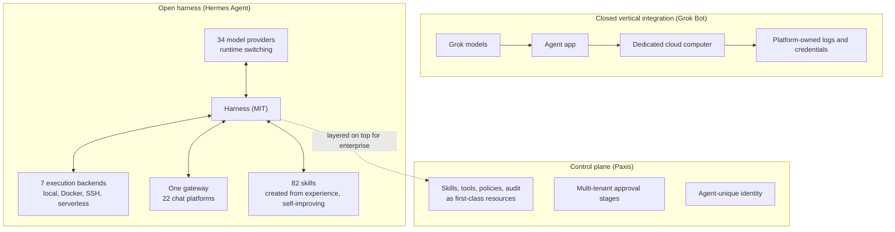

If you are a platform engineer or tech lead deciding whether to bring agents into your organization, and if so which layer to own and which to buy, this week's agent-platform debate is worth your time. The short version: the claim "a 100% open-source version of Grok Bot" is close to true on the harness axis, and not true on the cloud-computer axis.


*The transparent modular harness on interchangeable cubes, against the solid monolith in the background: a visual of harness separation versus vertical integration.*

## Why read this

This post is for the team that wants to move the question from "which company's agent app do we use" to "which layer do we keep in-house." The Grok Bot launch in early August, and the "100% open-source version" claim that followed a week later, point at the same direction. Verifying that direction against code gives you a criterion for choosing the layer you control among model, harness, and execution environment.

## Overview

On August 11, SpaceXAI shipped the Grok Bot beta: an agent app for Mac, iOS, Windows, and Linux where a user creates an autonomous digital team member, and the bot logs in and performs work on its own. The concept is giving the agent a dedicated cloud computer. We already read that launch through the lens of identity and audit logs in our August 12 post.

The timing was not accidental. That same week, Grok 4.6 launched and hit usage-cap resets, and NVIDIA pushed a lightweight open model aimed at agentic work. As model rankings churn every quarter, the next axis of competition is shifting from the model itself to the environment in which the model works. Grok Bot's dedicated cloud computer aimed precisely at that axis, so the open-source reaction a week later was not random.

A week after the launch, Shubham Saboo, a Google senior AI PM who runs the awesome-llm-apps open-source project, posted: "INSANE. This is 100% Open Source version of Grok Bot. Works with any Agent harness. Let that sink in." The tweet cleared 120K views. Our pipeline's August 20 enrichment identified the referenced target as Hermes Agent, the open-source camp's framework. This post takes that identification as a premise but does not treat the claim itself as fact. We separate where it holds and where it does not, using verifiable code.

## Grok Bot and Hermes Agent: two vertical stacks

Grok Bot is vertically integrated. Model (Grok), app (agent client), and execution environment (dedicated cloud computer) are one package. What the user buys is not an agent but a room where the agent can work, fully furnished. Convenience is maximal; the doors of the room do not open. Login credentials, execution permissions, and audit logs all belong to the platform, and the user remains a rental tenant.

Hermes Agent is the opposite structure. Nous Research's MIT-licensed "self-improving AI agent" describes itself in its official README as follows: "Use any model you want: Nous Portal, OpenRouter, OpenAI, your own endpoint, and many others. Switch with hermes model: no code changes, no lock-in." And it does not live only on your laptop: Telegram, Discord, Slack, WhatsApp, Signal, and CLI are all served from a single gateway process, while execution runs on seven terminal backends from local through Docker, SSH, Singularity, Modal, Daytona, to Vercel Sandbox.

| Axis | Grok Bot (vertical) | Hermes Agent (harness separation) |
|---|---|---|
| Model | Grok family only | 34 providers, runtime switching |
| Execution | Managed dedicated cloud computer | 7 backends, self-hosted |
| Surfaces | Four native apps | 22 chat platforms via one gateway |
| License | Code not public | MIT, full code public |

## What the code audit found

The claims "100% open source" and "works with any agent harness" are auditable. We pulled the Hermes Agent repository as a submodule and counted the numbers in the table above directly.

The `plugins/model-providers/` directory holds 34 providers: Anthropic, OpenAI Codex, Gemini, xAI, DeepSeek, Bedrock, Vertex, Ollama Cloud, and custom (your own endpoint). Model switching is implemented as a physical act of swapping a provider plugin. The honest translation of "works with any agent harness" is "works with any model."

The `plugins/platforms/` directory holds 22 surfaces: Telegram, Slack, WhatsApp, Line, WeCom, Discord, IRC, SMS, and more. A single gateway process representing one agent across all these channels solves the same problem as Grok Bot's four native apps (one agent, many surfaces) with the opposite solution (all channels attached to one gateway).

In `tools/terminal_tool.py` we confirmed the seven backends: local, docker, ssh, singularity, modal, daytona, sandbox. This list is the substance of the "cloud computer" axis. Per the README, Daytona and Modal provide serverless persistence: the environment hibernates when idle and wakes on demand. The catch is that this serverless is not leased to you; the operator attaches their own Modal or Daytona account.

The `skills/` directory bundles 82 SKILL.md files, and `plugins/` contains 18 plugin directories including memory, cron_providers, browser, and observability. The closed learning loop (the agent creates skills from experience and improves them in use) is the README's core claim, and every stage of that loop lives in this public code. The memory plugin owns agent-curated long-term memory, cron_providers owns natural-language scheduled automation, and agentskills.io standard compatibility makes skills portable. Each stage of the learning loop can be opened and read as code, which means "self-improving" is an object in the codebase, not a marketing phrase.

The install path is verifiable too. The official README's install command is a single line on Linux, macOS, WSL2, and Termux:

```bash
curl -fsSL https://hermes-agent.nousresearch.com/install.sh | bash
```

Native Windows uses a PowerShell one-liner, and Android has a documented Termux path. The README states the installer pulls in uv, Python 3.11, ripgrep, and ffmpeg, and we confirmed those dependencies in the repo's `setup-hermes.sh`. "It lives where you do" is really "it installs wholesale onto your own machine": the shortest way to state the structural difference from Grok Bot.



In other words, the anatomy of the "100% open-source version" claim is this. On the code-public axis it holds. On the model-swap axis it holds. On the execution-environment axis, "the configuration is public" holds, but "the computer is given to you" does not. Where Grok Bot's cloud computer is a managed service, the open-source side is a self-hosted recipe including serverless options. The same problem is solved one way as a package and the other way as a parts list.

## ThakiCloud product implications

This configuration is the question we face daily while designing Paxis.

**Paxis lens.** Paxis is ThakiCloud's Agent-Native Cloud, treating skills, tools, policies, and audit logs as first-class resources. The 82 bundled skills and plugin structure Hermes shows point at the same problem from a different starting point. Open-source harnesses first solved "how does a single agent improve itself" for one user or one team. Paxis has to solve what comes on top of that: which teams' agents, with which permissions, through which approvals, under whose name is each action recorded. That is the "who column" in the audit log we discussed in our August 12 post. Where Grok Bot logs in with a human account, Paxis separates agent-unique identity, a tool permission set, and session-level audit. What the open-source harness has proven is that this separation is technically viable; what remains is how far it holds under enterprise multi-tenancy.

The gap is concrete in three places. One is approval: 82 skills and 18 plugins are all opened by a single person's judgment, but in an organization, agent actions that read internal data or upload files externally need tiered approval, and that approval must come from a platform policy gate, not the agent's execution loop, to be auditable. The second is identity: when one gateway serves 22 platforms, mapping which channel a request came from to which agent session belongs is the platform's job. The third is audit: a learning loop in which the agent changes its own behavior via skills it created is powerful, but if the loop itself is excluded from audit, the question "did the agent widen its own permissions?" has no answer. Making these three things first-class resources is the layer Paxis builds on top of the harness.

**ai-platform lens.** The execution-environment axis lands in infrastructure. Reading the list of seven backends shows agent execution demand moving from "my laptop" to "any isolated environment." As that demand grows, providing agent-dedicated execution environments becomes infrastructure in the same layer as providing model serving. An "agent execution layer" joins the coordinates where we aim Telox and Velox at GPUaaS and bare-metal supply, alongside the Metis serving layer. The open-source harness treating its own endpoint (the custom provider) as a first-class citizen is also a signal that this layer is wanted on-premises.

## Limitations and counterarguments

We state the evidence boundary honestly.

First, the original "100% open-source version" claim is one developer's tweet. We could not open the exact target of that link during this audit. Identifying it as Hermes Agent is based on our internal enrichment, which cites two comparison articles; the premise of this post is that identification. If the premise points elsewhere, the core argument (the substance of harness separation) stands, but the "Grok Bot counterpart" frame needs adjustment.

Second, mind the nuance of "100% open source." The code is public, but the default experience still points to the company's own portal (Nous Portal). Code openness and default openness are separate issues, and the latter more often demands enterprise control.

Third, Grok Bot's strengths must not be underrated. The managed cloud computer bundles identity, usage, and billing, which is not burden-free; the existence of the burden is itself the benefit. What the open-source harness hands to the operator is the sum of everything that managed service hides.

Fourth, Hermes Agent is a single-organization project. Its governance, security response, and long-term support scale differ from an enterprise platform. "100% open source" described the state of the code, not a promise of operational maturity.

## Wrap-up

The agent-platform configuration is moving like this. Model vendors bundle agent and execution into one package and sell convenience. The open-source camp separates the harness from model and environment and sells control. The "100% open-source Grok Bot" claim compressed that contrast into one sentence, and the code audit found it precise on the harness-separation axis and correctable to "the parts list is public" on the cloud-computer axis.

The criterion we leave to the adopting team: look at the three layers (model, harness, execution environment) separately, and separate what is easy to swap from what is hard. Models are now a swappable part on both sides. The layer you truly must own is the control plane stacked above them: skills, policies, and audit logs. When decisions split on that layer, whether the harness you chose today is public code or a managed package becomes your negotiating power for the next step.

---

*Sources: Shubham Saboo's original tweet (x.com), HuggingNews coverage of the Grok Bot beta launch, Nous Research's Hermes Agent official README and repository (verified against code as of 2026-08-21), and ThakiCloud's August 12, 2026 tech-blog analysis of Grok Bot. The identification of the tweet's linked target as Hermes Agent is our internal enrichment's inference, and we state it as such.*