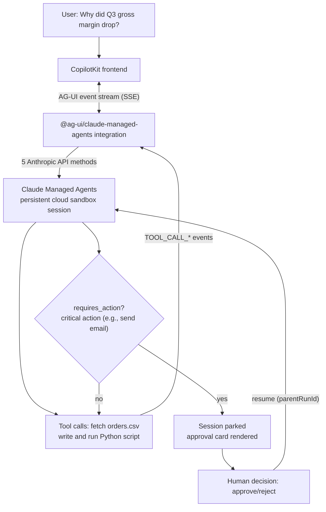

## Why read this

If you are a developer building a product where an AI agent does real data analysis in a cloud sandbox, watched from a screen, with humans holding approval authority over "critical actions," read this post. The conclusion first. After installing the new cookbook that connects Anthropic's Claude Managed Agents with the AG-UI protocol and CopilotKit, and running protocol-level experiments directly, **agent work is not "response text" but an "event stream," and human approval (interrupt and resume) is designed as a first-class citizen of that stream.** Ultimately it is a problem of consuming a protocol, and that is the core of this post.

## Overview

On August 21, Anthropic's developer account (@ClaudeDevs) announced a new cookbook with the line "Claude Managed Agents can drive many different UIs." The cookbook is a demo combining the AG-UI protocol with CopilotKit, margin-analyst-demo. The user asks one question, "Why did Q3 gross margin drop?", and watches the agent pull an order ledger into a cloud sandbox, write a Python script, hit a traceback on real messy data, read the error, fix the script itself, and run it again - all visible on screen.

Three things overlap. AG-UI is a public event-based protocol between an agent and user applications. Claude Managed Agents is a stateful, tool-using agent runtime hosted by Anthropic. CopilotKit is the framework that draws that stream into a real UI (chat, file panel, terminal panel). Let us sort out each one's position first.

## What this technology is

### AG-UI: standard wiring between agent and UI

AG-UI (Agent-User Interaction Protocol) is a public, lightweight, event-based protocol that standardizes the connection between agent backends and user frontends. In the words of the official docs, it standardizes "agent state, UI intent, and user interactions flowing between the model/agent runtime and the user frontend."

People handling agent protocols for the first time get confused by one point: four similarly named protocols exist - MCP, A2A, AG-UI, and A2UI. Both the AG-UI official docs and the CopilotKit docs address this confusion head-on. In short:

| Protocol | Connects | Role |
|---|---|---|
| MCP | agent to tools | tool-call standard |
| A2A | agent to agent | inter-agent communication |
| AG-UI | agent to user UI | event-stream-based UI wiring |
| A2UI | (generative UI spec) | spec for agents to "build" UI widgets |

A2UI and AG-UI have similar names but live on different layers. A2UI is a generative UI spec defining the UI widgets an agent delivers, while AG-UI is the interaction protocol wiring the agent to the entire frontend, including that UI. They are used together.

### Claude Managed Agents: hosted sandbox sessions

Claude Managed Agents is Anthropic's hosted runtime. You define an agent and a sandbox environment once, then run sessions on top of it, where files, tool state, and conversation persist across turns. The managed_agents directory of the official cookbook collection (claude-cookbooks) is full of notebooks teaching this API surface: data analysis agents, Slack bots, SRE on-call responders (human-approval-pending before merge), MongoDB integration, prompt version pinning and rollback, session budget caps, multi-agent teams, memory stores, inference region pinning, and more.

margin-analyst-demo is the member of this cookbook family that shows "how to attach a UI." The demo is built on the official npm integration package @ag-ui/claude-managed-agents, with CopilotKit as the frontend.

### Two execution modes: replay and live

The best-designed part of the demo is the separation of execution modes.

- **replay (default)**: needs no API key at all. A ReplayClient, driven by a recorded session transcript, implements five Anthropic methods (beta.agents.retrieve, beta.sessions.create/.update, beta.sessions.events.send/.stream). Everything above the client seam - the turn loop, event transformation, and park/resume of the public ManagedAgentsAgent - is all real. The status bar always shows REPLAY. In the demo author's words, "a demo that silently fakes API calls is not a demo."
- **live**: a mode verified against a real Anthropic account. One setup:live command provisions the environment and agent, and the agent curls a dataset into a real cloud sandbox to analyze it. Without ANTHROPIC_API_KEY, MA_AGENT_ID, or MA_ENV_ID, it refuses to start rather than silently downgrading to replay.




## Setup and integration

Spinning up the demo takes 30 seconds.

```bash
git clone https://github.com/jerelvelarde/margin-analyst-demo
cd margin-analyst-demo
npm install
npm run dev          # http://localhost:3000, replay mode (no key needed)
```

To go live, put ANTHROPIC_API_KEY in .env.local, verify beta access (200 means available, 403/404 means the account is not enabled), then provision the agent and environment with npm run setup:live. One caveat: the dataset must be reachable from the sandbox. The curl that fetches data runs in Anthropic's cloud environment, regardless of the author's machine. So a localhost URL does not resolve. Upload the dataset as a raw file URL and register it in the environment variable ORDERS_CSV_URL.

We installed the official Python SDK to touch the protocol itself in Python.

```bash
VIRTUAL_ENV="$PWD/.venv" uv pip install ag-ui-protocol
```

The installed version was ag-ui-protocol 0.1.20. The ag_ui.core module has 93 symbols, and the EventType enum had 33 members at experiment time: TEXT_MESSAGE_* family, TOOL_CALL_* family, STATE_SNAPSHOT/STATE_DELTA, MESSAGES_SNAPSHOT, ACTIVITY_*, THINKING_*, REASONING_* family, RAW, CUSTOM, plus RUN_STARTED/RUN_FINISHED/RUN_ERROR and STEP_STARTED/STEP_FINISHED. An EventEncoder that encodes the SSE wire format (accept="text/event-stream") ships with it.

## Actual experiment results

We reproduced the cookbook scenario at the protocol level, locally. A deterministic experiment using no LLM and no API key: a mini data-analysis agent streams the full AG-UI event vocabulary through the EventEncoder, stops at a HITL interrupt, the client decodes the SSE and reconstructs state, then resumes with approval and run 2 delivers the report. The experiment script is scripts/blog/_agui_experiment.py, and the real outputs remain in run-1.log through run-9.log.

### Experiment 1: analysis over messy data

The experiment data is a 40-row orders CSV. We planted a shipping-cost spike in the Q3/EAST segment. The agent calls two tools (read_orders, margin_by_region) and puts {loaded_rows: 40} in the STATE_SNAPSHOT and the analysis results in STATE_DELTA. Result: Q3/EAST was the worst with 7 orders, $8,164.29 revenue, and a 6.08% gross margin, while Q2/WEST was 41.0% on 8 orders. Run 1 ended with 21 events, the last being RUN_FINISHED, but the outcome was an interrupt, not a success.

```
Interrupt(id="int-approve", reason="human_approval",
          message="Q3/EAST margin 6.08% - approve report?")
```

### Experiment 2: the client reconstructs state from the stream

On the client side, we pull data: JSON out of SSE lines, initialize state from STATE_SNAPSHOT, and merge analysis results via the add op of STATE_DELTA. Then we built the resume request.

```
resume: [{"interrupt_id": "int-approve", "status": "resolved", "payload": {"approved": true}}]
```

Run 2 emitted 19 events, and RUN_STARTED carries parentRunId="run-1". That means continuing a prior execution within the same thread. The report streamed as 9 text-message chunks after the render_report tool call, and the total SSE byte count of run 2 was 1,928.

### Experiment 3: the schema is strict (lessons from 7 iterations)

An interesting failure log. The experiment script hit 7 bugs before first success, most of them the pydantic strictness of the AG-UI SDK.

- Omit messageId from ReasoningStartEvent() and it is rejected with field required
- The role of ReasoningMessageStartEvent must be the literal 'reasoning', not 'assistant'
- ReasoningEndEvent also requires messageId
- ResumeEntry is a pydantic model, so json.dumps raises a TypeError (model_dump() is needed)

That such fine-grained discipline - reasoning messages need ids, and their role is not assistant - is enforced in the real SDK is a fact agent UI developers should know before wiring a server. Because the side consuming the event stream and the side producing it are bound by the same schema, bugs fail immediately rather than late.

### What actually happened in the demo's live mode

Our experiment is a protocol reproduction, and the testimony of the live mode, where the model really acts, is left by the demo README. We pick two things.

First, numbers wobble between live runs. In the demo author's verification runs, the counterfactual ("what gross margin would have been without the Q3 shipping spike") landed at 38.63%, then 38.57% on the next run, and excess shipping was $107,526, then $105,901. Both are defensible readings, and both differ from each other. But the headline (34.6%, -4.07pp vs Q2, the same 3 SKUs) landed in the same place every time. A signal that is truly in the data means the model converges to the same conclusion no matter which method it chooses.

Second, two bugs were found only in live mode. One: the model sent a chart with a compound "% / $" unit, so every Y-axis label was clipped to "0% / $" and all six labels were identical and all wrong. The other: the cd /mnt/session && python3 analyze.py path caused every file in the tree to be listed twice, once as relative and once as absolute. The recorded transcript sends hand-tuned payloads, so both were unreachable in replay. The demo's principle that "what tests cannot prove does not show in the footage" simultaneously shows the opposite fact: live verification does not replace tests.

## ThakiCloud product implications

This combination overlaps exactly with Paxis's design language. Paxis is ThakiCloud's Agent-Native Cloud, the control plane on top of the agent platform that treats Skills, Tools, Policies, and Audit Logs as first-class resources.

**Why the approval gate is a protocol.** In margin-analyst-demo, send_email is a frontend tool. When the agent calls it, the Managed Agents session parks in requires_action, the approval card renders the actual email to be sent, and nothing resumes until a human clicks. If rejected, the agent registers the decision rather than retrying. Paxis's way of stopping dangerous agent actions has the same shape: agent actions pass through policy gates and audit logs, and the approval-pending-to-resume part is defined by the protocol. The lesson AG-UI's Interrupt/ResumeEntry gives Paxis is clear: do not hand-write approval UI per app; contract interrupt-resume as first-class events of the stream.

**State is reconstructed from the stream.** The demo's file and terminal panels derive from the AG-UI event stream. Every line and every file comes from observed tool calls; nothing is staged. The same principle holds in Paxis's sandboxed isolated execution. What the UI shows must be a function of what the agent actually did, and session state must be reconstructable from the stream. Even the mapping of threads and sessions that survives server restarts (.managed-agents.json) is ultimately a device for resuming consumption of that stream.

**The economics axis descends into ai-platform.** Live sessions are billed and outlive processes. That is why the demo even npm-script-izes the teardown command. The execution economics of agent UX converge on serving cost. That is why ThakiCloud's ai-platform (Metis) optimizes multi-tenant model serving on K8s and Kueue: because it decides the token budget agents can spend.

## Limitations and counterarguments

First, our experiment is a protocol-level reproduction. The numbers from live mode where the model judges over real data (38.63% vs 38.57%, etc.) are the demo README's testimony, not values we reproduced directly.

Second, Python's ag-ui-protocol is core-only. It provides types and the encoder, but no agent/server implementation; the official integration is the npm @ag-ui/claude-managed-agents. Attaching it to a Python runtime means writing your own adapter, and at 0.1.x the event vocabulary may grow. The "33 today" figure is the value at the time of this experiment.

Third, live mode requires beta access, sessions are billed, and they outlive processes. The demo author writes, to that degree, "do not restart the demo with Ctrl-C"; the lifecycle of state and cost differs between replay and live.

Fourth, it is still too early to say AG-UI has fully secured its place among MCP, A2A, and A2UI. The protocol layers overlap, standards are being reorganized in transition, and the table in this post is a reading as of today.

## Conclusion

When you build an agent UI, look first at what is in the event stream you emit, before what to show on screen. The AG-UI + Claude Managed Agents + CopilotKit combination showed three core points.

- Agent work is an event stream. Not text responses, but the flow of TOOL_CALL, STATE_DELTA, REASONING, RUN_FINISHED, and the UI is a derivation of that flow.
- Human approval is also an event. Park with Interrupt, resume with ResumeEntry, chain executions with parentRunId. Not an approval UI, but an approval protocol.
- Reproduction separates by mode. Replay is optimal for a no-key full walkthrough, and live is optimal for catching "bugs tests cannot prove." Both are needed, and both must be labeled honestly.

As a next step, we recommend forking the demo, replacing send_email with your own domain tool or workflow, and starting by attaching an audit log to the requires_action park.

## Sources

- margin-analyst-demo (AG-UI x Claude Managed Agents x CopilotKit demo, README): https://github.com/jerelvelarde/margin-analyst-demo
- Claude Managed Agents cookbook (anthropics/claude-cookbooks, managed_agents): https://github.com/anthropics/claude-cookbooks/tree/main/managed_agents
- AG-UI official docs (Overview): https://docs.ag-ui.com/introduction
- AG-UI Python SDK (ag-ui-protocol): https://docs.ag-ui.com/sdk/python/core/overview
- CopilotKit docs (AG-UI and A2UI: Understanding the Differences): https://docs.copilotkit.ai/
- @ClaudeDevs tweet (2026-08-21): https://x.com/hjguyhan/status/2090772123866599723
- Experiments for this post: scripts/blog/_agui_experiment.py, outputs/blog-impl/agui-claude-managed-agents/run-1.log~run-9.log (ag-ui-protocol 0.1.20, Python 3.12.8)
