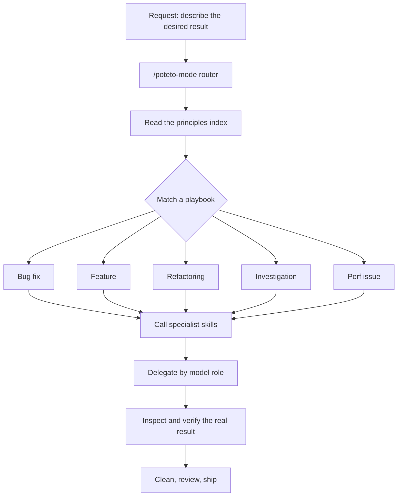

*Concept art: verification as the gate between parallel agents and the mainline.*

## Why Read This

If you run coding agents daily, this article helps you decide one thing: where to place the verification of agent output. The core conclusion is a single one. The bottleneck that stops you from parallelizing agents is code verification, and the answer is not "more agents" but "making verification a first-class capability of the repository." This article walks through pstack, the Cursor plugin published by Cursor engineer Lauren Tan (@poteto), and the engineering principles embedded in it.

## Overview

According to the reports circulating this week, Lauren Tan merged more than 1,000 PRs into main last month alone, and is close to 800 more in the first 12 days of this month. The target is the Cursor product code that millions of developers use every day, which is what makes it product code rather than one-off experiments. Her background is unusual in itself: React Compiler at Meta, tech lead and engineering manager at Netflix, and now five months into Cursor, with her first month spent getting familiar with the codebase, by her account.

The diagnosis she repeated in a one-hour podcast is a single one. The biggest problem in AI coding is not generating code, it is verifying code. If an agent cannot run the product itself, drive the UI, read CPU traces and heap snapshots, and open an emulator to reproduce a problem, a human ends up checking the result. At that point the human is the verifier, and a verifier is a resource you cannot parallelize.

The 1,000 PRs a month did not come from prompt tricks. They came from designing the verification capability first and duplicating agents only after. The methodology was published as a plugin called pstack, and Flávio Copes's deep dive, "A deep dive into pstack," is the primary source for this article.


*Lauren Tan explains her agent workflow in the podcast "Are Agents About to Replace Software Engineering?"*

## What pstack Is

pstack is a Cursor plugin built around the premise that "AI coding agents can write a lot of code. That is useful, but it is not the same as engineering." The stated goal is to write less code, raise the quality, and secure enough verification that several agents moving in parallel do not turn the repository into a mess.

The plugin itself is bigger than a collection of prompts. It ships 23 workflow skills, 21 engineering principles, 22 task playbooks, 2 specialized subagents, helper programs, and an optional automation pack. But you do not need to memorize any of it. Most of the time you use a single command: /poteto-mode.

Describe the result you want in one sentence. poteto-mode picks a playbook, creates a task list, calls the skills it needs, delegates the work to models suited to each role, and demands evidence before it reports success. A short request becomes a complete engineering workflow. Bugs route to the Bug fix playbook, new behavior to Feature, structural changes to Refactoring, questions to Investigation, and measured slowdowns to Perf issue.

There is one detail that matters here. The chosen playbook is not read by the model and improvised into a shorter plan. It is copied verbatim into the task list. Every named step stays visible, and if pstack skips something, the step remains in the task list with the reason recorded. Dropping half the checks quietly cannot happen structurally.

## Architecture: Router, Playbooks, Model Roles

poteto-mode is a router. It does not contain every instruction for every task; it selects the smaller pieces and runs them in the right order. The first task-list item is always reading the principles index. Then it matches the request to a playbook, calls the specialist skills and delegates by model role, inspects and verifies the result, and proceeds to clean, review, and ship.



The 22 playbooks are easiest to understand grouped by job.

**Understand before changing.** The Investigation playbook handles read-only questions. /how traces the current system, and /why is added when the question involves history or intent. The output is an architectural explanation. An agent that edits the first plausible function usually fixes the symptom, while an agent that traces the runtime path has a chance to find the real boundary. /why starts from Git history and pull requests and searches seven evidence categories: source control, issues, long-form documents, team chat, infrastructure monitoring, error tracking, and product analytics. One investigator owns each available category, and a final model combines the evidence with facts kept separate from inference. Empty searches are reported too. A missing design document is itself evidence, and more honest than inventing a plausible reason on the spot.

**Build and change code.** A bug must be reproduced before it is fixed. Competing cause hypotheses are formed, ruled out with runtime evidence, and a fix is re-verified on the original reproduction path. A refactor first records existing behavior, with a characterization test, snapshot, or equivalence script, and then changes structure in small steps while that check stays green. A performance issue starts from a trace and compares the baseline against the result; "it feels faster" does not count as evidence. Hillclimb improves one metric over several attempts, and each attempt states a hypothesis, measures the result, keeps the win, and discards the loss. Visual parity starts from screenshots and treats a nonzero pixel difference as a failure.

**Diagnose without fixing.** Runtime forensics captures a live signal (CPU profile, heap snapshot, browser trace), and Trace forensics starts from an artifact someone already captured, turns large trace data into something queryable, narrows it to the costly frame or retention path, and maps the finding back to source code. These playbooks do not quietly turn a diagnosis request into a fix. Once the cause is known, a new Bug fix or Perf issue task starts.

**Keep long work moving, and pick it back up safely.** Autonomous run drives one task until a checkable condition is met. Autopilot-full drives a queue of independent PRs through verification and merge, and Autopilot-stack creates one reviewed stack and leaves the final landing to a human. Orchestrate is the option for projects that last several days, create many stacked PRs, and need a standing coordinator plus a fleet of agents. pstack is strict about this distinction: a job one agent finishes in a single session does not need Orchestrate. Session pickup reconstructs a previous agent's state from its transcript, branch, and decision log, and Pause safely stops at an atomic boundary, makes the current work durable, and writes a resume note. A new agent should not redo three hours of completed work because it did not know where the last one stopped.

**Maintain the delivery pipeline.** Babysit drives a PR or stack to merge-ready: conflicts first, then a report on any required rebase, then review threads and CI. Shipping is a separate task. It verifies each PR with a fresh agent, checks that old verdicts still describe the current commit, and lands only the contiguous verified part of the stack. This separation is deliberate. A green PR is ready for a merge decision; it is not permission to merge.

The design skills are /architect and /arena. /architect starts from the caller's usage, not from the implementation file. It runs in five phases: ground the problem, sketch several shapes, implement against the sketch after a checkpoint if one was requested, and throw the sketch away and redesign when repeated friction proves it wrong. /arena gives the same task to several models. Each candidate writes to its own worktree and explains the alternatives it considered and rejected. The coordinator creates a private rubric, a separate model judges every candidate against it, and the coordinator reads every result from start to finish. Then it picks one candidate as the base and folds in the strongest ideas from the others. This is not a vote. One candidate can win while another contributes a better error model or a smaller interface. If all candidates converge on the same shape, that agreement is useful evidence; if they diverge wildly, the prompt was under-specified and the arena runs again with a clearer brief. /interrogate is the multi-model review. It sends the same diff to several models, and the lead reviewer groups findings into four buckets: act on, consider, noted, dismissed. The dismissed section is part of the result. Review-agent noise should be visible, with what was rejected and why, so you can override the judgment instead of accepting a mysterious filtered list. The skill never applies changes automatically.

## The 21 Principles

pstack includes 21 small principle skills. poteto-mode keeps a short index of them inside its own file and reads that index at the start of multi-step work. When a task triggers a principle, it opens the complete skill and applies it. Some principles reduce code: Laziness Protocol prefers deletion and the smallest complete change, Subtract Before You Add removes dead paths before introducing a new design, and Minimize Reader Load reduces layers and hidden state. Some shape the architecture: Model the Domain replaces scattered conditions with one explicit structure, Boundary Discipline validates external data at the edge and keeps internal logic clean, and Make Operations Idempotent makes retries converge on the same result. And some define proof: Prove It Works checks the real artifact, Fix Root Causes follows the symptom to its mechanism, and Sequence Work into Verifiable Units ends each small step with a check.

You do not invoke these principles as commands. You use their names to steer the current run: "Apply prove it works. Run the real import flow and inspect the records it writes." The reply must name the decision the principle changed. Repeating the principle's name does not count as evidence.

## Verification as a First-Class Citizen

The core of pstack is here. It rejects "the build passed" as complete evidence. The verification must match the thing that changed. A command-line change runs the real command, a UI change walks the changed flow on the real path, a migration replays real input, a performance change compares traces, and a storage change must read the value back.

When a repository has no reliable way to do that, pstack creates one. /create-verification-skill inspects the repository and writes a project-local verify-<app> skill. The generated skill carries exact instructions for five jobs: launch the application, check that the instance is healthy, drive the user-facing behavior, capture evidence, and clean up only what the verification started. It also creates a feature map. Each feature records how a user reaches it, how an agent drives it, and what observable state proves it works. Before handing the skill over, pstack runs it once from start to finish. /maintain-verification-skill compares every mapped feature against the current source and runs one live pass. It can update the verification skill, but it cannot hide a product bug by editing the documentation.

Flávio Copes singled out this part as his favorite in his article, because "verify it" becomes a capability of the repository. The answer to the verifier bottleneck sits exactly here. If an agent can drive the product through Chrome DevTools or an emulator, and a feature map tells it where each feature is and how to reach it, then when a colleague throws over a single screenshot or a vague bug description, the agent can find the feature, reproduce the problem, and verify the fix.

Agent failure modes become skills. It is the method she described in the podcast. Every time an agent guesses, misses reading code, or goes in the wrong direction, that failure is written down as a skill. Then the skill is tested like code: several subagents execute the task separately, the coordinator sets the rubric, another model cross-checks the scoring, and the loop repeats until the results are stable. The 23 skills and 21 principles inside pstack are the accumulated result of that loop.

## Model Roles and Parallel Execution

pstack splits work by model strength. /setup-pstack detects the models available on your account and assigns them to roles: implementation, investigation, judgment, review. The bundled defaults send precisely specified code to Sol, fast mechanical work to Grok, and judgment and prose to Fable; review panels mix those models with Opus. The number of models registered on a panel role determines how many reviewers or candidates pstack starts. Setting a role to auto or inherit-parent lets it take the parent chat's model.

This is exactly why pstack fits Cursor best. pstack wants different models for different jobs, and Cursor can assign a different model per subagent within one task. The skills themselves are SKILL.md files, so they load as-is in other coding agents such as Claude Code and Codex. If you want a Claude Code port, there is pstack-claude. It is not the official package, so the Cursor-only pieces, per-subagent model assignment and /loop and plugin setup, are lost. The playbooks, principles, /how, /why, and /interrogate are instructions, not Cursor APIs, so they still make sense.

## Run It While You Sleep

Long autonomous work needs a finish condition. "Work on this for four hours" measures motion. "Stop when there are zero old callers and every parser fixture passes" measures an outcome. A complete overnight request looks like this.

```
/poteto-mode I am going to bed. Migrate every caller to the new parser in a fresh worktree.
Done means zero old callers, every parser fixture passes, and the old API is deleted.
Keep a decision log. Do not ask before committing.
/loop until done. If you reach a real dead end, stop and explain.
```

Each iteration follows the same pattern: check the finish condition, make one justified change, verify the real result, keep and commit if it improved, discard if not, and write one row to the decision log. The decision log is a TSV file; each row records the time, phase, decision, reason, evidence, and result.

She now allows agents to auto-merge PRs, by her account. One morning, 20 PRs had already landed on main automatically when she woke up, and a direct check on main found no problems. The prerequisite for that morning was not trust. It was the verification loop that ran before those 20 PRs, and the Shipping playbook rule that only the contiguous verified part lands.

## What It Means for ThakiCloud

Paxis is ThakiCloud's Agent-Native Cloud, and it treats skills, tools, policies, and audit logs as first-class resources. pstack reads as a version of the same idea that one engineer built by hand inside Cursor.

First, the shape of verification as a gate. Paxis runs agent behavior through policy gates and audit logs, and pstack's /interrogate and Shipping playbook implement the same shape, "a fresh agent verifies before anything lands," at the project-local level. pstack's feature map, a contract that records how each feature is reached, how it is driven, and what observable state proves it works, is the shape a Paxis skill takes when it becomes executable.

Second, accumulating failure modes into skills. When Paxis's skill harness routes a request to the right skill via BM25, the source of the skill is the accumulated failure modes and verified workflows. The 23 skills and 21 principles inside pstack are one engineer's judgments externalized, and the platform's value is that that externalization can be shared, versioned, and audited across a team.

Third, model roles. /setup-pstack assigning models to the implementation, investigation, judgment, and review roles is the same logic that Paxis's workload routing and Metis's model routing run at platform scale. A different model for a different job is a direction proven in usage.

## Limits and Counterarguments

First, the numbers are report-based. The "1,000 PRs a month" figure rests on second-hand summaries of the podcast. The size distribution of the PRs, small changes versus large features, is not disclosed. The merge count is impressive, but judging the engineering value requires the distribution, not the count.

Second, pstack is Cursor-centric. Per-subagent model assignment and /loop are Cursor-specific, and the Claude Code port loses that shape. The playbooks and principles transfer, but the vessel for multi-model execution changes.

Third, the machinery costs. pstack can start several agents for one task, and if they all use frontier models, the token bill adds up fast. Even Flávio Copes says he would not run the full workflow for every change. Moving one date, correcting one sentence, or changing one configuration value does not need several models, an architecture arena, a decision log, and a verification skill. The 1,000 PRs a month are a number from an engineer who works in a large product codebase every day, and the economics of that workflow may not hold in other repositories.

Fourth, this is one person's style. pstack encodes Lauren Tan's engineering style, and the plugin itself does not claim that style is universal. The existence of /automate-me, which generates your own personal mode from your recent transcripts, is that acknowledgment.

## In Summary

The bottleneck of AI coding is not generation, it is verification. If an agent cannot verify its own result, the human becomes the serial verifier, and adding more agents does not raise throughput. pstack's answer is to make verification a capability of the repository: build the verification skill and the feature map that match the thing changed first, accumulate failure modes into testable skills, and only then duplicate the agents.

If you take one thing from this article, take this. Before you scale agents in parallel, ask whether your repository can answer "how do we verify this change." If it cannot, your first task is not more agents. It is building the verification loop.

## Sources

- Flávio Copes, "A deep dive into pstack" (August 21, 2026): https://flaviocopes.com/pstack/
- YouTube, "Are Agents About to Replace Software Engineering? | Lauren Tan and Roshan Sadanani": https://www.youtube.com/watch?v=A63sedG-p5Q
- Michael Guo (@Michaelzsguo), post of August 26, 2026 (second-hand summary of the podcast): https://x.com/Michaelzsguo/status/2092578668316864525
