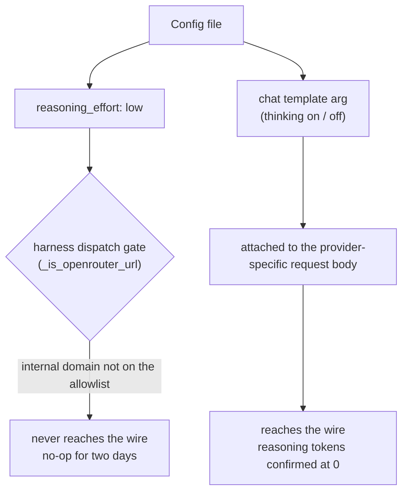

If you run a coding agent against a self-hosted model, some of the settings in your config file are probably not reaching the server. We spent two days with `reasoning_effort` turned down before discovering the field was never sent to our endpoint at all.

Finding it took one line of source. Here is the last gate in the function that decides whether the harness attaches that field:

```python
if not self._is_openrouter_url():
    return False
```

The allowlist held a handful of specific hosts. Our internal domain was not among them. The setting stayed in the file, every command exited zero, and nothing warned us. For two days it looked exactly like a setting that was working.


*A setting that reached the wire and one that did not: one carries the light, the other fades.*

## We split four arms to find what actually mattered

Our agent kept failing to finish multi-defect tasks. We needed to narrow the cause, and we had three candidates: an insufficient turn budget, the absence of an explicit provider selection, or the harness tuning we had been accumulating.

We changed one variable at a time across four arms. The task was a Python file with two defects. Grading came from the test runner's exit code, not from anything the model claimed. Each arm ran in an isolated working directory, and we interleaved the order.

| Arm | Changed | Median wall | Median output tokens | API calls | Passed |
|---|---|---|---|---|---|
| baseline | nothing | 7s | 291 | 5 | 3/3 |
| A1 | turn budget 40 → 120 | 7s | 273 | 5 | 3/3 |
| A3 | explicit provider removed | 7s | 314 | 5 | 3/3 |
| pretune | all tuning reverted | 7s | 278 | 5 | 3/3 |

Twelve runs, twelve passes, no separation between arms. Three hypotheses died at once. The last row stung the most: the arm that reverted every tuning change we had made over several days finished in the same seven seconds.

<!-- nlm-visual -->

*Infographic generated by NotebookLM from the sources.*

## So what does reduce verbosity

If `reasoning_effort` never ships, what remains is the chat template argument. We sent three short code-generation prompts twice each to the same endpoint.

| | Median completion tokens |
|---|---|
| default (thinking on) | 132.5 |
| thinking off | 64.0 |

Roughly half. This one travels in the provider-specific request body, and it does reach the wire. We confirmed it by watching the reasoning token count drop to zero in the response.

A single-sample measurement can be pulled by an outlier. One short prompt producing an unusually short answer can inflate the saving to five times; the median of six measurements is two. The quotable number is the latter.

Two settings, two fates. `reasoning_effort` is cut off at the host allowlist gate; only the chat template argument actually reaches the wire.


*Two settings, two fates: reasoning_effort never ships past the host allowlist gate; only the chat template argument reaches the wire.*

## The missing skills turned out to be a working directory

A second symptom ran in parallel. We had bridged our repository's skills into the agent, and every query reported none available.

Calling the discovery function directly from Python returned forty-three. Measuring the prompt showed a 4.6KB skill index. The tools were exposed. Inside a session, though, the answer stayed the same: nothing there.

We suspected the model, then asked it to paste the raw tool output instead of summarizing.

```json
{"success": false, "error": "Skill 'game-start' not found.", "available_skills": []}
```

The tool really was returning empty. We asked the agent for its working directory and got the home directory, even when launched from inside the repository. With no project root to find, project skills resolve to zero. Seeding the working directory through an environment variable brought back all forty-three, and skill bodies loaded normally.

## Three misdiagnoses, one shape

When convergence failed we blamed the model; the cause was a config file mutated mid-run. When skills went missing we wrote it off as hallucination; the report was accurate. When a fivefold saving appeared, it was a single-sample outlier.

Every time an observation looked strange we suspected the model first, and every time the harness was responsible. A self-hosted model feels less familiar than a commercial API, so suspicion drifts that way naturally. The unfamiliar part was not the model. It was the wiring around it.

## What to take away

Verify separately that a setting arrived, rather than assuming it did because you wrote it down. Three ways work. Read the condition in the source that decides whether the field ships. Read the value back out of an artifact or a response. Or send the same request under both conditions and compare token counts.

Treat any number measured once as unquotable. A single-sample measurement is pulled by outliers; the median of repeated measurements is the quotable number.

When you want to know what an agent actually received from a tool, ask for the raw output rather than a summary. That single instruction resolved a problem we had carried for three days.

These figures come from Qwen3.8-27B NVFP4 served on a single B200 node. The seven-second figure belongs to this trivial task alone and should not be read as general coding-agent performance.

<!-- nlm-visual -->

*Infographic generated by NotebookLM from the sources.*

## References

- [vLLM supported models docs](https://docs.vllm.ai/en/latest/models/supported_models/) : the reference for self-hosted serving configuration
- [Qwen3 blog](https://qwenlm.github.io/blog/qwen3/) : the concept behind the thinking-mode toggle and chat template arguments
- [OpenRouter docs](https://openrouter.ai/docs/quickstart) : the provider family the harness gates on a host allowlist
