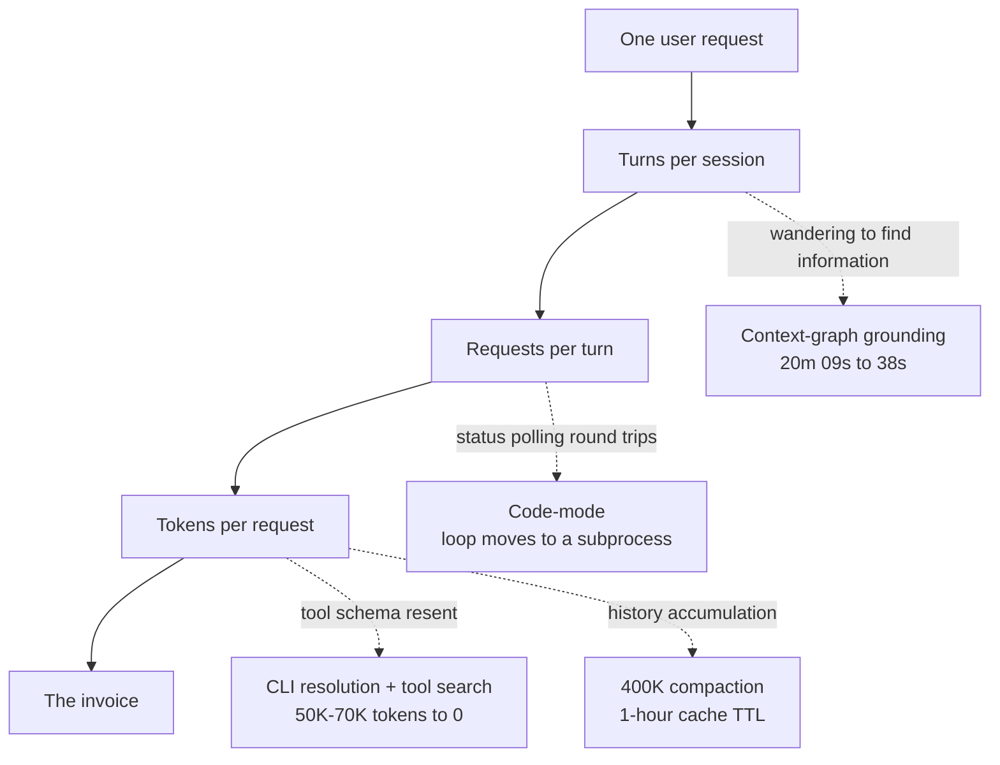

## Why read this

This is for platform engineers and engineering leaders who rolled out a coding agent and are now staring at next month's invoice wondering whether this is sustainable. The short answer up front: agent cost does not fall when you negotiate the model price down. It falls when you strip out the tokens the agent generates on its own behalf, separate from anything a person asked for.

Uber published numbers on August 27, 2026 that back this up. Between February and August, weekly active users grew 7x and weekly agentic requests grew 9.4x, yet total AI spend has been roughly flat since April. Holding the model constant to isolate their own optimization work, cost per 1,000 model requests fell 34% from its peak and cost per session fell 52% from its June peak. Usage went up 9x while unit cost went down by half.

Most of what an agent spends never reaches the user's request.

## Spend is a product of six terms, and only three belong to you

Uber decomposes the cost of an agentic session into six multiplied terms: users, sessions per user, turns per session, requests per turn, tokens per request, and price per token. The decomposition is useful because each term behaves differently.

The first two, users and sessions, are terms you never want to shrink. Shrinking them means adoption failed. The last one, price per token, is set by the vendor. All you control there is which model runs which workload.

That leaves the middle three: turns, requests, and tokens. What they share is that they measure **work the agent does for itself, not work anyone requested**. Re-reading the tool catalog every turn, polling a job status five times, digging through twenty files because it does not know where the answer lives: nobody asked for any of it. That is why almost all of Uber's optimization effort lands on those three terms.

Where agent spend leaks, and the fix for each. Every reducible term traces back to work nobody requested.

## The tool schema is billed on every turn

The largest and least visible leak is the MCP tool schema.

MCP loads the tool definitions of every connected server into context at session start, whether or not the engineer will ever invoke them in that session. At Uber's scale, roughly 100 installed tools added 50,000 to 70,000 tokens of schema to the initial prompt, and that block was re-sent on every subsequent turn. Billing starts before the user types a character.

Third-party SaaS is worse. Vendors cannot anticipate which customer uses which feature, so they design servers that expose the full product surface. In Uber's example, one workspace suite ships 49 tools at about 22,000 tokens of schema, while messaging and project-tracking vendors ship 34 and 46 respectively. Connect two or three of those and the agent is carrying more tool documentation than the file it is editing.

Uber's fix is not to remove MCP but to **move it out of the model's line of sight**. More than 1,000 internal and third-party MCP servers sit behind a single gateway that centralizes authentication and policy, and that gateway is exposed to the model two ways. The first is CLI resolution: the model runs one shell command, and the CLI resolves and invokes the tool against the gateway at call time. MCP schemas disappear from session context entirely. The second is tool search: the model searches the catalog and loads only what it needs, on demand. Selection accuracy holds even as the catalog grows into the thousands, which also mitigates the quality degradation that large tool sets usually cause.

The important shift is where MCP sits. MCP stays as the protocol and backend integration layer. What stands in front of the agent is a CLI, tool search, and code-mode skills. That relocation is effectively the answer to the long-standing complaint that MCP feels slow and not particularly agentic.

## Code-mode pushes the polling loop outside the model

Once tools are reachable as shell commands, a second door opens: the model can batch several actions into a single script.

Under standard MCP flow, one action is one model turn. Running a single SQL query means emitting the request, polling status two to five times, and retrieving the output. Every intermediate response lands in context, and accumulated context is re-billed on every later turn. Code-mode moves that loop into a Python script running in a subprocess. What comes back to the model is only the summary.

Here is what Uber measured running five identical SQL queries through both paths in the same session.

| Query | LLM tool-use | Code-mode | Savings |
|---|---|---|---|
| SELECT 1 (1 row) | 903 | 402 | 55% |
| COUNT(*) (1 row) | 954 | 403 | 58% |
| GROUP BY LIMIT 20 | 1,600 | 457 | 71% |
| SHOW COLUMNS (175 rows) | 2,200 | 900 | 59% |
| SELECT * on a wide table | 1,431,594 | 900 | ~100% |

The first three rows carry the finding. Even for queries returning a single row, nowhere near any response-size limit, usage dropped by more than half. The savings did not come from bypassing a large data payload. They came from eliminating **overhead unrelated to the work itself**: schema initialization, multi-turn polling, and step-by-step reasoning repeated at every hop. The last row tells a different story. Going from 1.43 million tokens to 900 is a signal that data which never belonged in the model's context was landing there.

Bulk workflows compound the effect. What would have been N model turns becomes one script, and savings exceed 90%. Uber pre-built more than 25 code-mode skills for its most-accessed MCP servers so that standard workflows default to the cheapest path.

## A wandering agent is the expensive one

An ungrounded agent does not fail cheaply. It fails slowly, resending an ever-larger context window to search one more location.

Uber concluded that across a codebase of hundreds of millions of lines and thousands of tables, agents spend far more turns locating information than generating code. So they built an AI Context Graph linking services, engineering teams, incident logs, pull requests, design docs, deployments, datasets, and historical table usage queries. It integrates more than 30 internal systems into 24 million nodes and 80 million edges across 86 node types and 117 edge types, and any agent can query it in natural language.

The comparison that lands is the same prompt sent to the same model, with and without grounding. The grounded agent queried historical usage, identified the specific table more than 50 analysts actually use, and answered in 38 seconds. The ungrounded agent had no visibility into that table. It spent 20 minutes and 9 seconds inspecting service code, spawned two subagents, hit three errors, and concluded incorrectly that the dataset was unqueryable.

Two things follow. Grounding is a quality improvement and a cost reduction at the same time: an answer 32 times faster is also an answer 32 times cheaper. And an ungrounded agent is expensively wrong. The most alarming part of that comparison is not the 20 minutes. It is that the answer at the end was wrong.

## Two defaults move more than they look like they should

The remaining levers are configuration defaults. Unglamorous, and applied across the whole fleet at once.

The compaction threshold comes first. Uber triggers automatic compaction at 400,000 tokens even for models with a 1M context window. A large window is not a reason to fill it. The threshold was set against the cost of re-transmission and cache bursts, not against model capacity. Reasoning effort was also defaulted down to medium. Output tokens, including internal reasoning tokens, are billed at multiples of the input rate on primary models, so this adjustment hits the most expensive token category directly.

Cache TTL comes second. Since every turn re-sends the full history, caching the preceding context drops subsequent reads to 0.1x the standard input rate. Write premiums differ, though: a 5-minute entry costs 1.25x, a 1-hour entry 2x. The optimal TTL therefore depends on the gap between turns. Engineers routinely leave interactive sessions idle for more than five minutes, which kept invalidating the prefix cache, so Uber moved interactive sessions to a 1-hour TTL and left the 5-minute TTL to short-lived subagents.

The subagent default model belongs in the same category. The primary model handles decomposition and evaluation while subagents execute well-defined tasks with specified inputs, most of which do not require frontier-level reasoning. Uber defaults subagents to a cheaper model with manual override available, and calls it one of the highest-impact levers in the interactive environment.

## We measured the same thing in our own repository

The reason this does not read as somebody else's problem is that our own measurements of our internal agent harness point the same direction.

Analyzing our session ledger on August 9, 2026, the correlation between cost and main-thread turn count was 0.99. The correlation between cost and fan-out width was 0.41. Cost per turn stayed flat regardless of whether fan-out happened. Broken down by category, cache reads were 57% of spend and output was 9%. Expensive because a fat context is re-transmitted every turn, not because a lot was generated. Resident context measured 322,000 tokens for orchestrator sessions and 215,000 for others.

One of the anti-patterns Uber's dashboard flags is preloading 100,000 tokens of system instructions and tool definitions before any user input. We were in the same trap, in a worse form. On August 16, 2026 we measured a subagent baseline of 186,357 tokens. Against a cheaper model's 200,000-token window, 93% was already consumed before a single character was sent, leaving about 14,000 tokens of headroom. The headless path measured 217,000 tokens, which meant it could not start at all. The cause was that our own exposed skill catalog had grown enormous.

Same disease. We responded by gating skill exposure by working hours and machine. Uber responded by moving MCP schemas behind a CLI. The approaches differ, the diagnosis does not: anything resident in context pays rent on every turn.

## What this means for ThakiCloud products

The cost equation in this post maps cleanly onto how we positioned our products.

The middle three terms, turns and requests and tokens, belong to **Paxis**. Paxis is the control plane that automates enterprise digital work with agents, and it treats Skills, Tools, Policies, and Audit Logs as first-class resources. What Uber solved with CLI resolution and tool search, Paxis solves with its skill harness: rather than loading hundreds of skills into context, it retrieves only the ones a task needs, and MCP connectors sit behind a policy gate and an audit log. For the same reason code-mode pushes polling loops into a subprocess, Paxis refuses to make the model perform procedures that can be handled deterministically, and hands them to skill code instead. The model judges; the code repeats.

The last term, price per token, belongs to **Metis**. Uber can only pick a model, not renegotiate a rate, because they buy inference through external APIs. Serve inference yourself and that term becomes negotiable again. Metis pairs vLLM-based serving with quantization and serverless scale-to-zero so each workload can sit at its own Pareto point between cost and quality. In our own measurements, changing two serving settings produced an 18.8x difference in single-stream throughput and 17.9x at saturation, on the same checkpoint and the same GPU. That is the kind of headroom you cannot see from behind a vendor API.

Put the two together and the picture closes. Metis makes tokens cheap. Paxis makes you spend fewer of them. For customers with on-premises or air-gapped requirements, the same structure drops onto **Aegis**, where the data never leaves the building and every optimization above still applies.

## Limits and counterarguments

You cannot transplant Uber's numbers into your organization. Uber says so explicitly: savings vary with codebase size, team size, and agent workflows. What transfers is not 34% or 52% but the methodology of benchmarking real work and optimizing for accuracy and cost together.

The context graph deserves particular caution. A 24-million-node graph is what you get when more than 30 internal systems are already well organized and you have a team to connect them. An organization with fewer than ten systems attempting the same thing will spend more building the graph than it saves. The principle of grounding generalizes. The implementation scale does not.

Moving to managed agents has a price too. When the platform controls model routing and execution harnesses, spend becomes predictable and individual engineer autonomy shrinks. That tension probably explains why Uber chose real-time spend visibility, Slack nudges, and approval flows over hard caps. Hard caps are easier to administer and they block the person in a hurry.

Finally, every number here is Uber's own reporting. The vendor comparison is stated to be based on publicly available information, but the savings figures themselves have not been externally verified. The direction matches what we measured independently. The magnitude is not something we have grounds to take at face value.

## Wrapping up

Lowering agent cost turns out to be an engineering problem. Rather than dropping to a cheaper model or discouraging tool use, the winning move is finding and deleting tokens that create no value. Uber did that, grew usage 7x, lowered unit cost across every metric, and held or improved output quality.

If you pick one thing to try, measure your agent's session-start context. Count how many tokens are already occupied by tool definitions and system instructions before the first prompt is typed, and it becomes immediately obvious that the number is being billed again on every turn. Ours was 186,000. Only after measuring it did the rest of this stop reading like somebody else's story.

<!-- nlm-visual -->

*Infographic generated by NotebookLM from the sources.*

## Sources

- [Running a Software Factory Efficiently at Uber Scale](https://www.uber.com/us/en/blog/efficient-software-factory/), Uday Kiran Medisetty, Uber Engineering, August 27, 2026
- Internal session ledger analysis (2026-08-09) and headless context probe measurements (2026-08-16), ThakiCloud internal data
