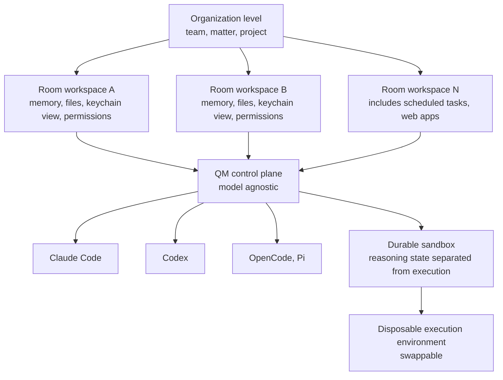

*An abstract rendering of the post's core concept: a control plane holding many isolated workspaces, with the model layers swappable underneath.*

## Why read this

This is for engineers building agent platforms and decision makers operating agents inside an enterprise. In the panel Y Combinator published on September 7, 2026, the centerpiece was a case where the same model weights, run through a weak harness and a strong one, produced ARC-AGI scores of about 30 percent and about 95 percent (95.5). The conclusion up front, agent performance differences are coming out of harness implementation quality rather than the model, and that has become a validated proposition in a startup accelerator's production environment. YC published its own harness, QM, under the MIT license as evidence of the claim.

## What happened

YC's official account posted a long thread arguing that harnesses are frequently treated as mere scaffolding, mere prompt engineering, and not real research, and that the treatment could not be farther from the truth. It passed 280k views within a day. The harness panel that same day introduced ARC-AGI, OpenJarvis, a local personal AI, and Prime Agent, a reinforcement-learning based agent.

The panel's core experiment is a comparison with a single controlled variable. The model weights stay the same (Claude Opus is cited as the example), and only the harness configuration changes. The levels of context caching, agent-to-agent messaging, sandbox selection, example design. Change those variables and the ARC-AGI score moved from the 30 percent neighborhood to the 95 percent neighborhood. The same model receiving different scores means a substantial share of the score is determined in the layer between the model and the world.

The reason the evidence YC brought does not stop in the lab is simple. QM was already open-sourced under the MIT license on July 31, 2026, and it is the harness YC uses to run its own company. Per secondary coverage, roughly 50 internal agents run on QM across accounting, legal, events, and engineering teams, and QM itself was built with the help of agents. The organization making the claim is simultaneously the organization operating it.

## What QM is

QM (Quartermaster) is a multiplayer agent harness. It is designed on the premise of one company running many people, many channels, and many agents at the same time.

The isolation unit is the difference. QM creates a workspace per employee and per Slack room (channel), isolated and scoped. Each workspace carries its own memory, files, keychain view, permissions, scheduled tasks (cron), web apps, and a durable sandbox. The "room" concept matters because agent memory and permissions are sliced at the unit of collaboration (project, team, matter), rather than the unit of the individual. The accounting agent cannot touch the legal agent's memory, and the legal agent cannot gain write access to engineering files. That structure is guaranteed at the isolation level.

Second is model agnosticism. QM is a control plane that accepts Claude Code, Codex, OpenCode, and Pi. YC designed it deliberately this way to avoid vendor lock-in. In a market moving as fast as this one, pinning a harness to one vendor's model ties the whole organization to that vendor's price list and feature roadmap.

Third is the separation of reasoning state from execution. The QM architecture splits a persistent reasoning and state layer from disposable, swappable execution sandboxes. If a sandbox dies or is contaminated, the agent's memory and task context survive, and execution resumes on a fresh sandbox. The durability of unattended long runs comes from this split.

Deployment ships with Fly.io and AWS options, and the precondition is that the organization has a platform engineer. QM is classified as agent infrastructure, a system that goes beyond an installable tool.

## Why the harness is on the research front now

The 30 versus 95 experiment matters because harnesses sat outside the research object for a long time. In the world of model benchmarks, the harness was treated as experimental noise. The same model was presumed to give the same score, and the experimental environment was ignored rather than standardized. But when the noise in a controlled experiment grows large enough to move 65 percentage points, it is no longer noise. It is a variable.

In practice, the levers the harness owns sort into four. Context caching cuts repeat cost, agent-to-agent messaging builds division-of-labor structure, sandbox selection designs failure isolation, and example design steers behavior. All four change performance from outside the model, without touching its weights. That is why "harness engineering" started being called an independent technical field.

## ThakiCloud product implications

The central proposition of this story overlaps directly with where ThakiCloud already stands. Paxis is a platform that treats the agent execution environment as a product, and its structure is in the same architecture family as QM.

The seat where QM's room-level isolation corresponds to Paxis is workspace-level resource separation. Paxis treats Skills and Tools, Policies and Audit Logs as first-class resources, and the QM workspace, with its own memory, permissions, and keychain view, is exactly that "first-class resource" sliced at the unit of collaboration (room). The requirement that an agent must be able to show what it did via an audit log becomes satisfiable only when permission isolation extends down to memory and keychain isolation, and QM proves that with its structure.

The model-agnostic control plane also connects to serving routing. Just as Paxis selects a skill via BM25 and executes it in an isolated sandbox, the harness's ability to swap model adapters is a device that removes model-market volatility from organizational risk. As QM plugs in four models, an execution environment that treats the model like a resource turns the answer to "what if the model changes next quarter" from a code change down to a configuration level.

From Metis, the context lever receives additional evidence. The panel experiment citing context caching and compression as one axis of harness configuration is an external signal that context management at the serving endpoint determines performance at the same level as model choice. We already measured an 18.8x single-stream and 17.9x saturation gap between platform serving defaults and tuned settings, and context caching is the next axis that produces gaps of that scale in agent workloads.

## Limits and counter-arguments

The strongest counter-argument is the nature of ARC-AGI. It measures reasoning generality, but it does not represent the whole of production workloads. There is no report in this panel that the 30 versus 95 gap reproduces at the same size in practical domains like coding, document processing, and data pipelines. The fact that a harness moved 65 percentage points on ARC-AGI is real, and the fact that we do not yet know whether it is a lever of the same size on every task is also real.

Second is the YC context itself. A startup accelerator's internal operations are an environment with wide tolerance margins and a limited domain. An accounting, legal, and events agent running smoothly does not mean the same structure transplants unchanged into a regulated industry's production system. QM's deployment requiring a platform engineer is YC acknowledging that boundary itself.

Third is the direction of the proposition. Opposite the claim "the harness matters", the claim "the model determines the harness" always sits. Half of the 95 percent on ARC-AGI still comes from the model's ability to make 95 percent possible. The harness research moving to the front is closer to a declaration that the two fields can no longer be discussed separately.

## Summary

This story's receipts are two. One is the controlled experiment where the same model split into 30 percent and 95 percent. The other is the fact that the organization operating that experiment open-sourced its harness under MIT. When the claim and the operation sit in the same organization, the sentence "the harness is real research" moves from claim to observation.

The agent platform selection meeting needs one more question. "What does this platform's harness isolate, what does it remember, and which models can it plug in?" The question that used to come first, the model's score, now comes after it.

## Sources

- [Y Combinator official tweet (2026-09-07)](https://x.com/hjguyhan/status/2097075016735261177)
- [GitHub: yc-software/qm](https://github.com/yc-software/qm)
- [StartupFortune: Y Combinator open-sources QM](https://startupfortune.com/y-combinator-open-sources-qm-the-ai-agent-harness-it-uses-to-run-itself/)
- [explainx.ai: YC self-improving harnesses panel (2026-09)](https://www.explainx.ai/blog/yc-self-improving-harnesses-openjarvis-qm-panel-september-2026)
- [MarkTechPost: YC open-sources QM multiplayer AI agent harness (2026-08-03)](https://www.marktechpost.com/2026-08-03/y-combinator-open-sources-qm-multiplayer-ai-agent-harness/)
