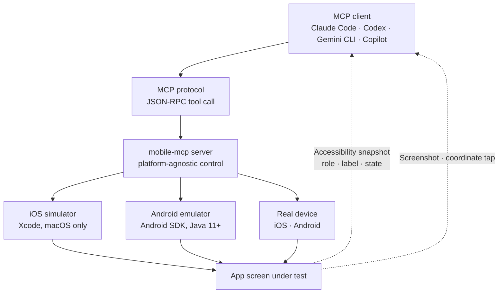

*An abstract rendering of the post's core concept: an agent (the glass cube) crosses the single bridge of device control and touches the blocks of an app screen directly.*

## Why read this

This is for engineers who build or QA mobile apps, and for teams operating AI agents in-house. The conclusion up front: a phone screen is now within an agent's reach through a single tool call. iOS simulators, Android emulators, real devices alike. What fills the gap is not a platform-specialized framework but one MCP server, mobile-mcp. With a one-line npx install, the loop where an agent reads the screen, presses a button, and checks the result in a screenshot is complete.

## What Mobile MCP is

mobile-mcp is an MCP (Model Context Protocol) server built by the mobile-next organization. It has around 6,400 GitHub stars, more than 500 forks, and is licensed under Apache 2.0. Its role, in one sentence, is "the interpreter between AI agents and iOS/Android devices."

Agents have hit a wall in mobile automation. iOS meant the Xcode and WebDriverAgent ecosystem, Android meant ADB and Appium, and handling both meant holding deep knowledge of two platforms. Mobile E2E testing frameworks have crossed part of that wall, but they are optimized for executing scenarios written in code. The layer designed for an agent to look at where a button is, decide what to press next, and act on its own has been missing.

mobile-mcp fills exactly that layer. It applies the JSON-RPC tool-calling convention shared by MCP clients such as Claude Code, Codex, Gemini CLI, GitHub Copilot, Cursor, Windsurf, VS Code, Amp, Kiro, and opencode to mobile device control. A client does not need to know whether the target is iOS or Android, and does not need to know the platform APIs. It calls tool names like `screenshot`, `tap`, and `scroll`.

## It touches the screen two ways

There are two modes in which an agent handles a device.

The first is a structured accessibility snapshot. Elements of an app screen come back as structured data with a role, a label, and a state. Information like "the login button is in the upper left and currently active" is consumable as text, without any image processing. For an LLM, reading that structure costs less than pushing a screenshot through a vision model, and the coordinate-guessing step disappears entirely.

The second is screenshot-based coordinate tapping. Screens that expose no accessibility tree, custom-drawn UIs, games, canvas-based apps, leave the accessibility snapshot empty-handed. A screenshot fills that space, the agent decides the target's coordinates in the image, and fires a `tap`. The two modes complement each other: elements readable as structure are handled as structure, and the rest as pixels.



The key in this structure is the middle layer: the mobile-mcp server absorbs the platform difference. The client prompt stays natural language, "open the app and check the nickname on the profile page," and the server plus the device selection decide on which platform that instruction runs.

## Installation and integration

The prerequisites are Node.js 18 or later and npm 9 or later. The macOS machine handling iOS needs Xcode, and the machine handling Android needs the Android SDK and Java 11 or later. Simulators and emulators both run on those SDKs, so a team that already has a mobile development environment adds nothing but the MCP server.

Registering it in Claude Code is one line.

```bash
claude mcp add mobile -- npx -y @mobilenext/mobile-mcp@latest
```

Other clients put the same launcher into an `mcpServers` block as JSON.

```json
{
  "mcpServers": {
    "mobile-mcp": {
      "command": "npx",
      "args": ["-y", "@mobilenext/mobile-mcp@latest"]
    }
  }
}
```

Because `npx -y` pulls the latest package on every run, there is no separate install state to manage. After registration, you issue device-related instructions inside the client, and the usual flow has the agent itself breaking down "launch the simulator," "install the app," "go to the login screen," and "check this button's state" into ordered tool calls. mobile-next's wiki carries a Getting Started document for Claude Code separately.

## The mobile-next ecosystem

mobile-mcp is not a standalone tool but the agent layer of the mobile-next ecosystem. Two neighboring projects come from the same organization.

mobilecli is a universal CLI for both iOS and Android. Listing devices, installing apps, and collecting logs all come out of one interface without a platform branch. mobilewright is a TypeScript/JavaScript automation framework that drives devices through code scenarios.

Laying the three layers side by side makes the division of labor visible. mobilecli is the layer where "a human drives the device from a terminal," mobilewright the layer where "code executes a scenario," and mobile-mcp the layer where "an agent drives the device in real time on instruction." They share the lower control core and swap the interface on top. The organization's official documentation site is mobilenext.ai.

## Implications for ThakiCloud products

The axis of this story is worth reading from the Paxis perspective. Paxis is an Agent-Native Cloud that treats the agent execution environment as a product, and in that structure MCP connectors are first-class resources. Attaching an external tool to an agent's hand is not a few lines of config there; it is platform work with authentication (OAuth auto-reconnect), permissions, audit logs, and policy gates.

What mobile-mcp shows is that that "hand" now reaches mobile devices. Once the loop where an agent reads an app screen and decides its action holds, part of mobile QA moves from "a human runs the scenario" to "an agent executes the intent." Instead of rewriting regression scenario code at every screen change, you throw an instruction, "check that the discount rate renders correctly on the checkout screen," and receive the result as an audit log.

Two boundaries that Paxis must draw here. The first is permission. An agent that controls a device can actually press a payment button, enter an authentication code, and reach into contacts. Without a structure that limits which tool calls are allowed by policy and audits before and after, mobile automation becomes a mobile incident. The second is isolation. Just as agent execution runs in sandboxes, device-control sessions must be bound to independent workspaces so one agent's failure does not spread to another device session.

## Limitations and counterarguments

The biggest limitation is that the agent does not know the difference between an emulator and a real device. A path that rendered green in a simulator can behave differently on a real device under frame drops, latency, and OS version differences. The fact that "passing in the simulator" is not evidence of "passing on the device" is identical to conventional E2E testing. mobile-mcp does not shrink that gap.

The second is the iOS-side prerequisite. Xcode and macOS are required. On a Windows machine the iOS simulator path does not open, and the automation scope narrows to Android only. If a team's machine fleet is already mixed, the premise of "every device through one agent" holds only partially.

The third is the quality of the accessibility tree. For an app whose developer never hung proper accessibility labels, the structured snapshot returns an empty screen. The agent then falls back to coordinate tapping, and the reliability of pixel-only UI manipulation is essentially lower. Between apps designed to be machine-readable and those that are not, the success rate of the same mobile automation diverges.

Finally, mobile-mcp is not claimed to replace E2E testing frameworks. Determinism, reporting, and matrix execution of scenario-based testing are not mobile-mcp's current concern. The two live on different layers: the layer where an agent executes an "intent" and the layer where code executes a "scenario." How to blend the two in a QA strategy is a different question for every team.

## Wrap-up

An agent that drives a device means mobile platform expertise drops out of the agent's required parts list. The people who design mobile automation are no longer only those who know Xcode or those who know ADB; they are also those who know MCP. One line of install, Apache 2.0, 6,400 stars. Those numbers speak to the tool's maturity, and the door that maturity opens is the experiment of shrinking "a human drives it" in mobile QA and mobile operations.

From the Paxis perspective it can go one step further. When the platform keeps permissions, isolation, and audit logs on behalf of the agent that controls a device, mobile automation moves from pilot scale to operating scale. The next question is not "can the agent test the app" but "under which policy, with which audit trail, does it test."

## Sources

- [Ryrenz tweet (Mobile MCP intro, 2026-09-09)](https://x.com/hjguyhan/status/2097478579961700366)
- [GitHub: mobile-next/mobile-mcp](https://github.com/mobile-next/mobile-mcp)
- [mobile-next official docs](https://mobilenext.ai/docs/)
- [Getting Started with Claude Code (Wiki)](https://github.com/mobile-next/mobile-mcp/wiki/Getting-Started-with-Claude-Code)
- [mcp.so: mobile-mcp server listing](https://mcp.so/servers/mobile-mcp)

*The install commands, tool list, and license in this post were verified against public documentation (README, wiki, directories); local execution was not reproduced in this session.*
