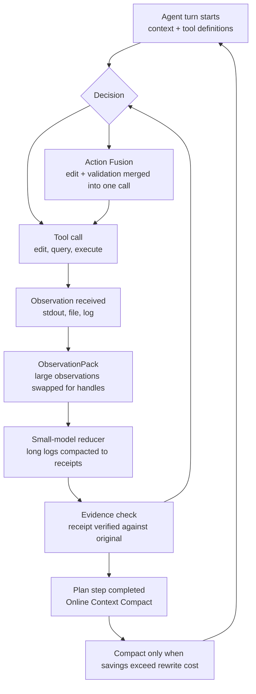

## Why Read This

If you operate coding agents or automation agents and have the sense that your monthly bill is driven less by "how good the model is" and more by "how the surrounding harness wastes tokens," this post is for you. The conclusion up front: NVIDIA has open-sourced SoL-Pi, an efficiency extension for its Pi agent harness, and the four mechanisms it ships are not vendor-specific tricks. They are a general-purpose checklist for auditing where your agent's tokens go.

## Overview

SoL-Pi (Scaling Auto-Research Loops for Efficient Agent Harnesses) is an efficiency extension that layers on top of NVIDIA's Pi agent harness. NVlabs [published it on GitHub](https://github.com/NVlabs/SoL-Pi) in early September 2026, and the [project page](https://nvlabs.github.io/SoL-Pi/) explains the design intent.

To see why SoL-Pi starts at the harness, look at the structure of agent costs first. Every turn, an agent sends the system prompt, tool definitions, conversation history, and tool call results together. A large observation that enters the context once is re-sent, and re-billed, on every subsequent turn. So an agent's token spend is driven less by "how many decisions were made" than by "how many times which data was re-transferred." Swapping models changes the quality of the decisions; the transfer waste survives.

The most interesting part of this project is not the four mechanisms themselves but *how they were found*. SoL-Pi is the output of an auto-research loop in which the AI acts as a researcher: it observes the agent's behavior, identifies where tokens are wasted, proposes fixes, patches bugs, and tests the improvements. An agent researched its own harness's cost and reduced it.

The savings NVlabs reports on the project page:

- Up to 64% lower token consumption versus the stock Codex and Claude Code harnesses
- 45% to 49% lower tokens versus base Pi
- 50% to 54% lower API call costs, worth roughly $8.75 to $13.50 per hour for a professional researcher

Note the different baselines. "Up to 64%" is measured against stock Codex/Claude Code harnesses; "45% to 49%" is measured against Pi already in place. Same project, different reference lines.

## What It Is

SoL-Pi targets the structural waste of the agent loop. When an agent calls a tool, the result enters the context, and that context is re-sent on every subsequent turn. A large observation that enters once is billed repeatedly, every turn, for the rest of the session. SoL-Pi intervenes at four points in that structure.



### 1. Action Fusion

Merges predictable sequences into a single action. The canonical case is the "edit, then immediately run a validation command" pattern. Stock behavior is four steps: edit tool call, result, model decision, validation tool call, result. SoL-Pi bundles the edit and its follow-up validation command into one tool call, removing the intermediate model decision step. Less latency, fewer tokens. "Edit a file, then run the build" is the most common coding-agent loop, and the canonical target for this fusion.

### 2. ObservationPack

Keeps long tool outputs out of the context. Large results are stored locally and replaced with a stable handle plus a short excerpt; the full content is paged back on demand. Concretely: if a 40KB build log enters the context, ObservationPack keeps the log locally and leaves only "handle H-12, first 10 lines" in the context. When a later turn needs a specific part of the original, it pages it back through the handle. This is the fix for "repeated billing": the moment you read the same build log three times, you have paid for it three times.

### 3. Evidence-Preserving Reducer

Delegates first-pass processing of long diagnostic logs to a cheaper small model. The critical property is evidence preservation: a verification step checks that every piece of information quoted in the small model's receipt exactly matches the archived original log. If it does not match, the quote does not pass. Picture a 2,000-line diagnostic log: the small model compresses it to a 30-line receipt, and code checks that each quoted line in the receipt exists verbatim in the archived original. It is a code-level block against the classic error-propagation path where a summary quietly distorts the facts.

### 4. Online Context Compact

Treats completed plan steps as compaction points for Pi's native context compaction, but does not compact unconditionally. It applies a dynamic cost allocation: compact only when the projected future token savings exceed the cost of rewriting the context. The judgment is per subtask, not a fixed schedule.

Lined up against established context-engineering practice, the four mechanisms read like this.

| SoL-Pi mechanism | Waste it targets | Relation to existing practice |
|---|---|---|
| Action Fusion | Tokens spent on intermediate decisions | Automates the "two-step merge" of workflow specs at the tool level |
| ObservationPack | Repeated transfer of large observations | Automates sandboxing and summary delegation |
| Evidence-Preserving Reducer | Fact distortion in summaries | Small-model delegation plus verification against the original |
| Online Context Compact | Rewrite cost of indiscriminate compaction | Adds a "savings greater than cost" judgment to step-boundary compaction |

The design principle matters too: SoL-Pi installs as an extension on top of an unmodified Pi release. All four mechanisms are opt-in and disabled by default. You turn them on one by one and measure, without changing baseline harness behavior.

## Installation and Integration

Per the repository README, installation is one line:

```bash
pip install git+https://github.com/NVlabs/SoL-Pi
```

Within a Pi workspace you activate the extension and opt in per mechanism. Porting these patterns to other harnesses (Claude Code, Codex, etc.) is not bundled with SoL-Pi; each operator must implement it on top of that harness' extension mechanism. The "Implications" section below lays out that porting list.

## Actual Experiment Results

Reproduction attempt failed: this publishing window did not have a networked sandbox available, so we did not reach pip install or a measured benchmark. Every number in this section is from NVlabs' [project page](https://nvlabs.github.io/SoL-Pi/) and [repository](https://github.com/NVlabs/SoL-Pi). With no independent reproduction, treat the savings figures not as quotes to copy but as a basis for auditing where your own tokens leak.

Three structural points worth re-checking from the published numbers.

First, most of the savings come from context transfer, not from the model. ObservationPack and the Reducer both target "repeated billing of one large observation," a cost that survives any model swap. Just as a model upgrade raises the quality of the decisions, a transfer-structure improvement lowers the unit price of tokens.

Second, small-model delegation can move cost rather than delete it. The Evidence-Preserving Reducer sends long logs to a cheaper model, but the verification step is an extra call. The 50% to 54% total API cost reduction holds even when the effect is cost moved to a cheaper place rather than cost vanished. If the total goes down, the structure succeeded.

Third, opt-in design means nothing is automatic. Defaults off means the 64% is not given; the operational act of enabling and measuring each mechanism is the precondition for the savings.

## ThakiCloud Product Implications

The four SoL-Pi mechanisms are less "new technology" than the formalization of what mature agent-operations teams already do in practice. Two product lenses.

**Paxis (agent operations).** Paxis is the Agent-Native Cloud control plane that executes agent workflows. Translated into Paxis operating practice:

| SoL-Pi mechanism | Corresponding Paxis operating practice |
|---|---|
| Action Fusion | Workflow specs that merge edit-then-validate tool chains into a single call |
| ObservationPack | Delegation contracts: large tool output stays in the sandbox, only a summary enters the context (bounded output) |
| Evidence-Preserving Reducer | Anchor verification of subagent results against the source; never trust the summary alone |
| Online Context Compact | Context cleanup at task-step boundaries with a "savings greater than cost" criterion |

The stronger signal is the auto-research loop itself. SoL-Pi's mechanisms were *discovered* by an agent that measured its own harness's cost and proposed improvements. That is the same direction as Paxis' self-evolving skills, and it is evidence that "the harness, not the model, determines agent quality" holds on the cost axis as well.

**ai-platform (infrastructure).** A 50% token-cost reduction transfers directly to serving infrastructure. On the same GPU running the same model, the context length the harness sends determines throughput and power draw. ObservationPack-style handle substitution becomes a KV-cache reuse problem on the serving side, and context compaction becomes requests-until-saturation. SoL-Pi is a case study in "transfer-volume design," not "model selection," and that is the cheapest lever for lowering token unit price on a GPUaaS.

## Limitations and Counterarguments

First, the numbers are NVlabs' own measurements. No independent reproduction exists, and "up to 64%" presupposes a favorable comparison. Check whether the baseline is "stock vs stock" or "stock vs tuned."

Second, Pi dependency. SoL-Pi is an extension for Pi. Using it with Claude Code or Codex means re-implementing the four patterns on each harness's extension mechanism, and that porting cost can eat into the savings. The Evidence-Preserving Reducer's original-verification step, in particular, requires the harness to provide an observation archive.

Third, quality risk in small-model delegation. If the reducer's summary drops a line that becomes the next decision's premise, the receipt still matches the original text while the judgment is wrong. "Matches the original" is text identity, not semantic identity.

Fourth, much of this pattern set is already published context-engineering practice. SoL-Pi's novelty is that an auto-research loop discovered and measured them, not that it found a new law of physics.

## Wrap-up

Four things to take from SoL-Pi as an agent operator.

1. **The cost source is transfer volume.** A large observation in context is re-billed every turn. Handle substitution (ObservationPack) is the simplest, surest saving.
2. **Merge edit and validation into one call.** Predictable two-step chains can run without the intermediate decision (Action Fusion).
3. **Summaries must preserve evidence.** Compact with a cheap model, but gate on verification against the original, or the summary becomes an error-propagation channel (Evidence-Preserving Reducer).
4. **The discovery method is the point.** The mechanisms were found by an agent that observed and measured its own loop. Teams that run a cost-measurement loop over their own harness lower spend without changing models.

The era of fixing costs by swapping models is giving way to the era of cutting costs by designing the harness. SoL-Pi is a case that shows that order, in code and in numbers.

## Sources

- [NVlabs SoL-Pi GitHub](https://github.com/NVlabs/SoL-Pi)
- [NVlabs SoL-Pi project page](https://nvlabs.github.io/SoL-Pi/)
- [36kr SoL-Pi coverage](https://eu.36kr.com/en/p/3978268468525825)
- [KuCoin News SoL-Pi flash](https://www.kucoin.com/news/flash/nvidia-open-sources-sol-pi-harness-to-cut-ai-token-costs-by-64)
