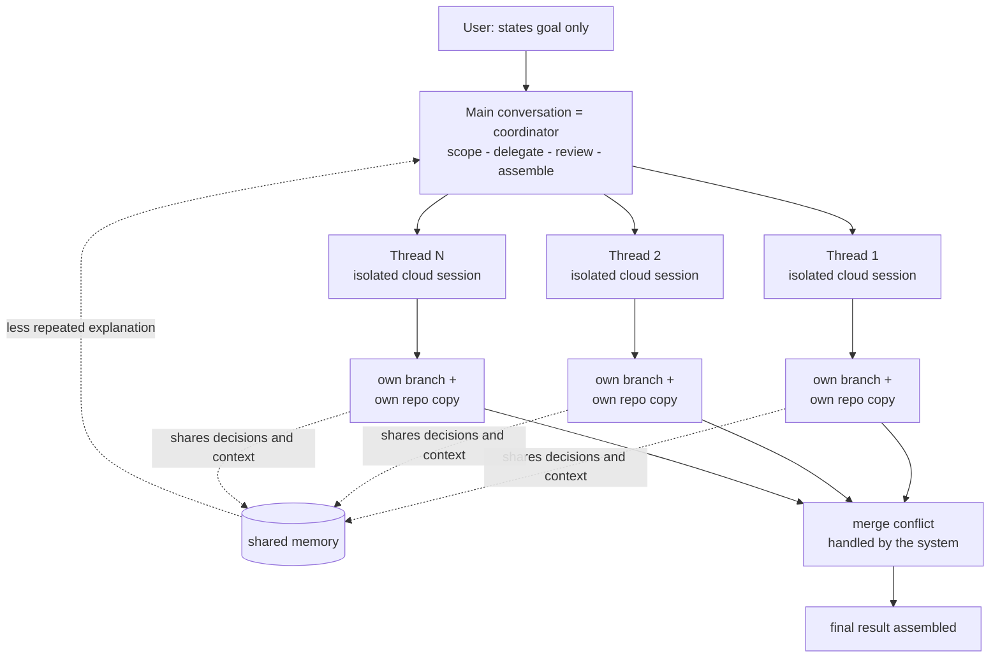

This post is for platform engineers who run parallel coding agents or who answer for their bill, and for teams that treat agent coordination as an operations problem rather than a model problem. The cost and confusion of running coding agents in parallel come mostly from the coordination structure, not from differences in model ability. The redesigned Claude Code Projects, shipped by Anthropic as a beta on September 17, 2026, hands that coordination to a single coordinator. The user states only the overall goal; Claude scopes the request, splits it into parallel threads, coordinates each thread while it works on an independent cloud session, reviews the outputs, and assembles the final result. If you operate parallel agents on a platform like ThakiCloud, the reason to read this is that the coordination structure maps almost one to one onto ThakiCloud's Paxis control plane.

The old Claude Code project was keyed to a folder: the user split the work by hand, passed it between threads, and combined the results at the end. The labor of coordination sat with the user. The redesign changes who that labor belongs to. The coordinator is now Claude, not the user, and the user states the goal and steers progress.

*An abstraction of the post's core concept.*

## In plain terms

Picture a mid-sized construction site, where several floors go up at once and the electrical, plumbing, and rebar work overlap. The old way was that the site manager (the user) decided every morning who gets what, mediated whenever two crews hit the same wall, and drew the whole completion map at night. Almost all of the day's labor went into coordination.

The redesigned Claude Code Projects does not change the manager's role. It seats an AI in that role. The manager's only job is to declare the overall schedule. The AI decides which floors to run in what order and which overlap, resolves the conflict (the merge conflict) automatically when two floors lay the same wall, and lifts each floor's decisions (we are using this material on this floor) into a shared memory so the other floors do not have to ask again. The manager can steer any single floor on demand, and can tell one floor to spend the more expensive material (a higher-effort model).

The key is that there is one site. Each floor's work runs in an independent session, on an independent branch, on an independent repo copy. So if one floor builds a wall wrong, the other floors stand, and the conflict surfaces only when the system stitches the floors together. The whole difference is between "running several sites by hand" and "running one site that the AI runs."

## Overview

The Claude Code Projects redesign was announced as a beta on September 17, 2026. The structure compresses to one line: one (conversation) coordinates, many (cloud sessions) run in parallel, and shared memory ties them together. The rollout is stated to start with a small subset of Claude Pro and Max subscribers who use Claude Code cloud sessions and have no existing projects, then widen to more Pro and Max users within a few weeks, then to Team and Enterprise plans. Existing Pro and Max projects keep working as-is and upgrade as the rollout progresses.

Why this announcement matters now is that parallel agent coordination has become an operations line, not a benchmark line. Each parallel thread counts as a full cloud session and burns the plan limit faster, and there is a cap of 200 new threads per project per day. That cap is a cap on operations cost, not on performance. Choosing the coordination structure is choosing the bill, and this announcement puts that claim in writing.

## The structure: coordinator and parallel threads

The skeleton splits into three layers.

First, the main conversation is the coordinator. The user states only the goal, and Claude does the scoping, the delegation to parallel threads, the coordination of progress, and the review-then-assemble of the final result. This coordinator absorbs the three actions the user used to do by hand: splitting, hand-off, and combining.

Second, each parallel thread is a full Claude Code cloud session. A thread can make code changes, run tests, and open a pull request. Critically, each thread carries its own branch and its own repo copy. When several sessions edit the same repository at once, the conflict is not mediated by the user; the system handles the merge conflict.

Third, there is shared memory between threads. A decision and its context made in one session propagate to the others. There is no need to re-explain context like "this module was already decided to use approach A," and repeated explanation drops.

The diagram below shows this coordination structure top to bottom. A thread delegated from the main conversation works on an isolated session, branch, and repo copy; its decisions collect into shared memory and flow back to the coordinator; the final merge-conflict handling then assembles the result.

The design decision worth noticing is where the isolation lives. Isolation happens at the session level (each thread is a full session) and at the repository level (each thread has its own branch and copy) at the same time. If isolation lived only at the session level and the repository were shared, parallelism would be speed but the conflicts would still be the user's. If isolation lived only at the repository level and the session were shared, the shared memory and context would tangle and coordination would fall back to the user. Claude Code Projects isolates both, and ties them together only with shared memory.

## Shared memory and merge conflicts

What shared memory cuts is repeated explanation. A constraint or decision made in one place flows across threads, so each thread does not re-ask the coordinator "which constraints are already decided." But this shared memory does not synchronize the threads. They still run as independent sessions on independent repo copies, so their work does not physically overlap.

And when that non-overlapping work is finally merged back into the same repository, the conflict surfaces once, at the merge-conflict step. Instead of walking the floors re-measuring walls, the user watches the single moment the system stitches them. There is a precondition here: the threads must carry enough isolation (branch, copy) for the conflict to land "once." If isolation is weak, conflicts fire several times mid-way and fall back to the user. The quality of shared memory and merge-conflict handling is therefore a function of the quality of the isolation design.

## Cloud sessions that keep running, and what they cost

Cloud sessions keep running after the laptop is closed and are reachable from a phone. The "run it overnight and collect it in the morning" pattern extends automatically across several threads. The announcement names application latency improvement, migrating disabled API endpoints, endpoint profiling, coordinating changes across API, web, and mobile repos, and building a C compiler with parallel Claude as use cases.

The cost is in the billing structure. Because each parallel thread counts as one full session, running several in parallel burns the plan limit faster. And there is a cap of 200 new threads per project per day. Consumption is visible in Claude's Usage settings.

Read the two numbers together and the real message of this announcement is not "parallel is faster" but "the system now carries the cap and the accounting for parallel." 200 a day is an operations cap, not a performance cap, and the per-thread full-session accounting is a first attempt at pricing the unit cost of parallel agents. Choosing the coordination structure is choosing the bill, and here that claim first lands with numbers.

## ThakiCloud lens: Paxis's control plane and Metis's serving economics

ThakiCloud already runs this structure at the intersection of two products.

Paxis lens (primary). Claude Code Projects' "main conversation as coordinator, thread as isolated session, shared memory as context propagation, merge conflict as system assembly" overlaps the Paxis execution model. Paxis is ThakiCloud's Agent-Native Cloud control plane: the user declares a goal at one entry point, and Paxis picks a skill (from 960+ via BM25), runs it in parallel in an isolated sandbox, passes every action through a policy gate and an audit log, and then assembles the result. The "isolated session plus isolated repo copy" of a parallel thread is the same design decision as Paxis's sandboxed isolated execution. Isolation is placed on both the session and the resource so that one agent's failure does not pollute another agent's workspace. And the shared memory that carries "decisions and context across agents" is the same problem as the multi-agent DAG context propagation in Paxis's memory and orchestration layer. What Claude Code Projects confirmed as a product in September 2026 is external evidence that the direction Paxis bet on, moving coordination from the user to the control plane, is correct.

Metis lens (complement). The 200-a-day cap and the "one thread equals one full session" accounting translate the unit-cost problem of parallel agents into a serving-economics problem. That is exactly the question Metis answers: when you serve one coordinator and N worker threads together, how do you count N and how do you bill it? When parallel agents scale up (more threads), serving throughput and token cost do not grow linearly; they hit a cap (the plan limit, the thread cap) and break. ThakiCloud's ability to set that cap directly on its own GPUs and queues in on-prem and sovereign environments means converting a cloud subscription's 200-a-day cap into a physical resource cap. The coordination structure (Paxis) and its execution economics (Metis) read as a pair right here.

## Limits and counterarguments

First, the beta is open to a small subset, and the expansion schedule is stated only as "within a few weeks" and "then Team and Enterprise." There are no firm dates, so how this structure settles into caps and accounting at Team and Enterprise is still unknown.

Second, the fact that each parallel thread burns the plan limit as a full session means that parallel is more expensive. Coordination becoming convenient and total cost going down are two different things, and as long as there is a 200-a-day cap, the total cost of parallel is managed by a cap, not erased by one.

Third, the quality of shared memory and merge-conflict handling depends on the quality of the isolation design. If isolation is weak, shared memory pollutes context and merge conflicts fire several times instead of once, and the work falls back to the user. The system handling it does not remove the isolation precondition.

Fourth, this is the structure of one vendor's product. How other vendors' parallel agent coordination (their isolation unit, their shared-memory scope, their caps) overlaps or diverges is not answered by this announcement. What ThakiCloud should compare in Paxis is not "did Anthropic do this" but "do our isolation, caps, and accounting solve the same problem."

## So what can you change

Three things you can apply right after reading.

One, re-check the isolation unit of your parallel agent operations on both the session and the resource (branch, copy) side. If isolation is on only one side, parallelism is speed and the conflicts and context pollution remain with the user.

Two, put the cap and the accounting on parallel first. Just as Claude Code Projects gives the system a 200-a-day cap and a "thread equals full session" accounting, ThakiCloud's Paxis should treat the worker-thread cap and the unit-session cost accounting as first-class resources of the execution structure. Pricing the coordination comes before moving it to the control plane.

Three, bound shared memory to "decision and context propagation," and do not synchronize the whole context. The wider the propagation, the wider the pollution. Let the minimum necessary decisions flow between threads, and keep the physical isolation in the repo copy. That is the core balance of this structure.

The battlefield of parallel coding agents is no longer the per-token price of the model. It is coordination, isolation, caps, and accounting. Claude Code Projects is the announcement that first confirmed that battlefield as a product, and ThakiCloud's Paxis already sits on that same battlefield as its own control plane.

## Sources

- [Claude Code Projects, redesigned (Anthropic official)](https://claude.com/blog/projects-redesigned)
- [Claude Code Projects docs (code.claude.com)](https://code.claude.com/docs/en/claude-projects)
- [devops.com - Anthropic adds a coordinator to Claude Projects](https://devops.com/anthropic-adds-a-coordinator-to-claude-projects-for-running-ai-work-in-parallel/)
- [marktechpost.com - Anthropic launches Claude Code Projects in beta](https://marktechpost.com/2026/09/17/anthropic-launches-claude-code-projects-in-beta-parallel-cloud-sessions-that-keep-running-after-you-close-your-laptop/)
- [X - @claudeai (hjguyhan RT)](https://x.com/hjguyhan/status/2101338989697585503)
