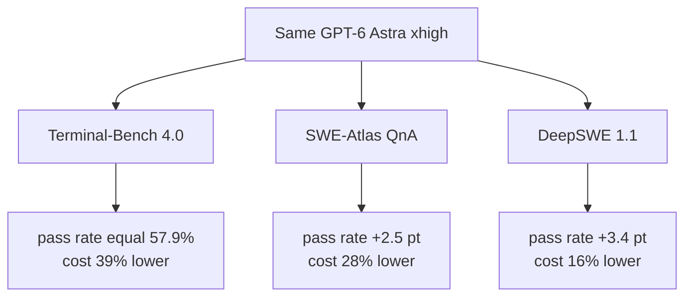

If you run coding agents and have wondered whether token cost is really a model-choice problem, this is the post for you. In one sentence: the tokens an agent burns waiting for tool results are a cost set by harness design, not model capability. Moving that management to the async side can cut it by up to 39% at the same pass rate.


*An abstract rendering of a central coordinator with parallel tool streams flowing around it, some in progress and some returning results.*

## Why read this

Teams that ship agents to production compute cost from two variables. Model price and call count. But there is a third variable between them: the tokens the model spends waiting for results after it calls a tool: polling, heartbeating, sitting idle. That overhead is not a problem of model "intelligence." It is a structural cost that appears when the harness wrapping the agent manages tools synchronously.

This post is about an open-source harness that isolates that third variable: Unreal Agent, from Unreal Labs. For platform teams running coding agents, it is a directly usable reference for deciding "where can I cut cost without changing the model." For teams building a harness themselves, it shows the real code structure behind sync versus async tool calling.

## Overview

Unreal Agent, released by Unreal Labs on September 22, 2026, is an open-source project that bills itself as an "async-first agent harness." The license is MIT, the primary language is Go (go 1.27.0), and the repository splits into three parts. `harness/` is the library, `cmd/` is the executables that use it, and `benchmarks/` is the benchmark runner.

Taken verbatim from the official blog, the one-line definition is: "an agent harness that delivers up to 40% cost savings compared to Codex and up to 20% compared to Pi on production workloads and coding/science benchmarks, without any negative performance impact." The key qualifier here is "up to." Across the three published benchmarks, the actual savings are 39%, 28%, and 16%. None is constant. Why the gap varies is the main point of this post.

## What is this technology

First, the structure that makes the agent harness keep the model waiting. A conventional coding agent manages tools synchronously. When the model calls a tool like Bash or a file read, the turn blocks until that tool finishes. A slow tool, say a dev-environment setup that takes minutes, is the case in point. Meanwhile the model cannot work. And to know "is it done yet," the model must poll; to keep the connection alive, it must send a heartbeat. Each of those polls and heartbeats is billed in tokens.

Unreal Agent moves that responsibility off the model and into the harness. It manages tools "completely asynchronously," so the model no longer has to wait, poll, or heartbeat. Two things open up as a result. First, users can steer the agent at any time without waiting for tool calls to finish. Second, the agent can pack more useful tool work between model calls.

There is a concrete scene this design enables. Kick off a dev-environment setup that will take minutes, and while it runs, explore the codebase and search the web in parallel. During the time it would otherwise spend calling a tool and waiting, the model is doing other work.

### Architecture: the components the harness creates

The `harness/` package is built from the components the README names. Each one's responsibility is summarized in the table below.

| Component | Responsibility |
|---|---|
| Inbox | Session-scoped, in-memory idempotency (dedup) for external, control, and crash inputs |
| Coordinator | Runs LLM turns, persists accepted inputs, resolves tool translators, dispatches committed operations |
| Tool Translator | Validates a tool call synchronously and translates it into operations. Performs no I/O and does not suspend the event loop |
| Operation | A serializable description of async work produced by a tool translator |
| Session Store | Persists append-only session history and operation state; supports recovery and forks |
| Context Builder | Statefully assembles model input in memory. No I/O or persistence dependencies |
| LLM Adapter | Sends prepared input to the provider and returns normalized responses; handles auth, cancellation, errors |
| Tool Registry | Stores tool definitions (Bash, ViewImage, etc.) and their translators |

What to watch in this layout is where the boundary between "sync" and "async" is drawn. The tool translator validates synchronously on the coordinator's event loop. It does no I/O and does not block the loop. Then it produces the "operation" that runs asynchronously. In other words, validation is fast and synchronous; execution is slow and asynchronous. That split is the core of the whole design.

### The async tool-call flow

The path from the moment the model calls a tool until the result comes back looks like this.

```mermaid
flowchart TB
    A[Model issues a tool call] --> B[Event log appends 'in-progress' record immediately]
    B --> C[Tool translator: sync validation, creates operation]
    C --> D[Coordinator: dispatches operation async]
    D --> E[Tool runs in background]
    E -.-> E2[Model does not wait,<br/>handles next task / user input]
    E --> F[Tool completes: result arrives]
    F --> G[Result appended to session log (append-only)]
    G --> H[LLM re-invoked without breaking cache]
    H --> A
```

The engineering challenge the official blog flags is exactly the `H` step. Each time a tool completes, the result is appended to the session log and the LLM is called again, without breaking the prompt cache. If the cache breaks once, the next LLM call re-bills every input token. Keeping the cache stable while results stream in asynchronously is, in the source's own words, "an interesting engineering challenge."

## Installation and integration

I actually pulled this harness, built it, and probed the runner. The experiment ran in an isolated git worktree, and the result logs are kept at `outputs/blog-impl/unreal-agent-harness/`.

First, fetch the repository and build the whole thing. It is a Go module, so `go build` runs after dependency download.

```bash
git clone https://github.com/unreallabsai/unreal-agent
cd unreal-agent
go build ./...
```

In this run, `go build ./...` passed with rc=0. The dependencies `github.com/oapi-codegen/runtime`, `golang.org/x/image`, and `golang.org/x/sys` were downloaded. `go.mod` declares `go 1.27.0`.

The executable is `cmd/unreal-agent-runner`. With the `-p` flag it sends a request from a single prompt, no stdin JSON.

```bash
unreal-agent-runner -p 'your prompt here'
```

The actual options and request schema, as seen via `--help`, are below.

```text
Usage:
  unreal-agent-runner [options] < request.json
  unreal-agent-runner [options] 'JSON request'
  unreal-agent-runner [options] -p 'prompt'

Options:
  -log-directory string        session JSONL log directory (default <workspace>/logs)
  -p prompt                    send a request by prompt without reading stdin
  -session-directory string    session files directory (default .harness/sessions)
  -tool-heartbeat-interval duration  tool-wait heartbeat interval (default 10m, 0 disables)
  -workspace string            agent workspace and Bash working directory (default .)

Request schema:
  messages: array of {role, content, message_id?}
  prompt:   shorthand for one user message
  model:    provider model ID (default UNREAL_HARNESS_LLM_MODEL)
  max_attempts: retries (default 5, 1 disables)
  system_prompt: replaces the default system prompt
```

The `-tool-heartbeat-interval` flag is a telling contrast. In a sync harness the model must send the heartbeat itself. Here the heartbeat is a harness option, firing only when a tool is blocked for a long time, at a default 10-minute interval. One-line summary of the structure that moves connection-keepalive from the model to the harness.

The model is set via the `UNREAL_HARNESS_LLM_MODEL` environment variable. The official benchmarks ran on GPT-6 Astra (xhigh), and this harness assumes the direction of offsetting a high per-token cost of frontier models through async savings.

## Actual experiment results

My experiment is at the level of "fetch the source, build it, and verify the runner's real contract (options, request schema)." It is not a full benchmark rerun. The benchmark figures are quoted from Unreal Labs' official runs, on GPT-6 Astra xhigh.

The three-benchmark table from the official blog, organized:

| Benchmark | Unreal Agent | Codex | Pi |
|---|---|---|---|
| Terminal-Bench 4.0 | 57.9% / $1,428 | 57.9% / $2,350 | 55.0% / $1,827 |
| SWE-Atlas Codebase QnA | 65.8% / $936 | 63.3% / $1,303 | 64.0% / $1,033 |
| DeepSWE 1.1 | 72.4% / $1,367 | 69.0% / $1,633 | 69.6% / $1,584 |


*Left: total cost per benchmark (USD). Right: pass rate (%). unreal-agent (blue) is cheaper than Codex (gray) across all three benchmarks at an equal or higher pass rate. (Official runs, GPT-6 Astra xhigh)*

How to read this table matters. On Terminal-Bench 4.0 the pass rate is exactly the same. 57.9%. But total cost is $1,428 versus $2,350; Unreal Agent is 39% cheaper. Same accuracy, lower cost only. That is where the claim "the harness makes cost an independent variable" holds in its purest form.

The other two benchmarks push the point further. On SWE-Atlas QnA the pass rate is 65.8% versus 63.3% (Unreal Agent leads by 2.5 points) while cost is $936 versus $1,303, 28% lower. DeepSWE 1.1 is 72.4% versus 69.0%, a 3.4-point lead, with cost $1,367 versus $1,633, 16% lower. So "accuracy equal or higher, cost lower" holds across all three.

The savings range from 39% down to 16% because of the workload's tool-call density and parallelism. The official blog attributes the savings to two factors. First, a minimal harness footprint and token-optimized tool output (simple prompts, no sub-agents or workflows). Second, more tool work per model turn. With the poll tokens for waiting gone, the same turn can carry heavier tool calls. The denser and more parallel the tool calls, the larger the savings versus Codex.



## ThakiCloud product implications

This topic touches both of ThakiCloud's product lenses.

**Paxis lens (agent execution).** Paxis is the control plane of the agent-native cloud, running agent workloads, including coding agents, in isolated sandboxes. For a platform running agents, the fact that a third cost variable exists beyond "model price × call count", namely the tool-call overhead, goes straight into run-economics design. Async tool calling also carries a secondary benefit: users can steer in real time. Combined with Paxis's human-approval and audit logs, it creates an operating scenario where a person can redirect the agent while it is running a slow tool. That improves the responsiveness of the execution environment (steerability), not just the cost.

**ai-platform lens (serving economics).** Just as Metis measures serving economics as cost per token, agent-workload cost should be measured on the axis of "tokens consumed per tool call" as well as "tokens × turns." An async harness removing poll and heartbeat tokens means more tool work per agent while fewer input tokens. Same direction as low-cost serving that makes agent execution economical.

Tied into one line: from the view that you are buying the execution environment when you run agents, harness design becomes a specification of that environment. Like choosing a model spec, whether to manage tool calls synchronously or asynchronously is now a design variable judged on cost and responsiveness.

## Limitations and counterarguments

Four conditions apply when reading these numbers.

First, the benchmarks were run by the vendor. On a single model (GPT-6 Astra xhigh), with no independent reproduction yet. "Up to 40%" rests on the premise that the official pass-rate difference is within benchmark variance.

Second, the savings are not constant. 39%, 28%, and 16% vary with the workload's tool density and parallelism. Generalizing to "cut agent cost by 40%" would be wrong. On workloads with sparse tool calls, the savings can be far smaller.

Third, the price of async design is engineering complexity. Mixing results into the session log without breaking the prompt cache is, in the source's own words, "an interesting engineering challenge." A team putting this harness into production must rebuild completion, cancellation, and background-task lifecycle on top of it. The source also states that the assumptions of a CLI-based SDK (local sessions, subprocesses, resource limits) do not carry over to production as-is.

Fourth, my experiment was at the level of build plus runner-contract verification. It is not a full benchmark rerun. The table figures are quoted from the official runs. There is no operational data yet from actually attaching this harness to a production workload.

## Summary

Recapping the conclusion I set out: agent cost is not determined by "model price × call count" alone. There is a third variable, the poll and heartbeat tokens the model burns waiting for tool calls, and that value is set by the harness's sync/async design.

Unreal Agent is a real case of moving that third variable into the harness. An MIT-licensed Go harness that builds from source, with a transparent runner contract (options, request schema). On GPT-6 Astra it published up to 39% savings at an identical pass rate.

Two next actions for teams running agents. First, if your agent's tool calls are synchronous, measure the tokens the model spends on waits, polls, and heartbeats. That is the third cost variable. Second, for teams on frontier models, judge whether the async harness is a lever that offsets the high per-token cost, using per-workload savings (tool density, parallelism). Harness design now stands alongside model choice as an independent variable that sets agent-run economics.

## Sources

- Unreal Agent official repository (MIT, Go): <https://github.com/unreallabsai/unreal-agent>
- Unreal Labs official blog (2026-09-22, source of the benchmark tables): <https://unreallabs.ai/blog/unreal-agent/>
- Technical report (arXiv): <https://arxiv.org/abs/2605.13360>
- Public run summary (AI/TLDR): <https://ai-tldr.dev/releases/unreallabs-unreal-agent/>
