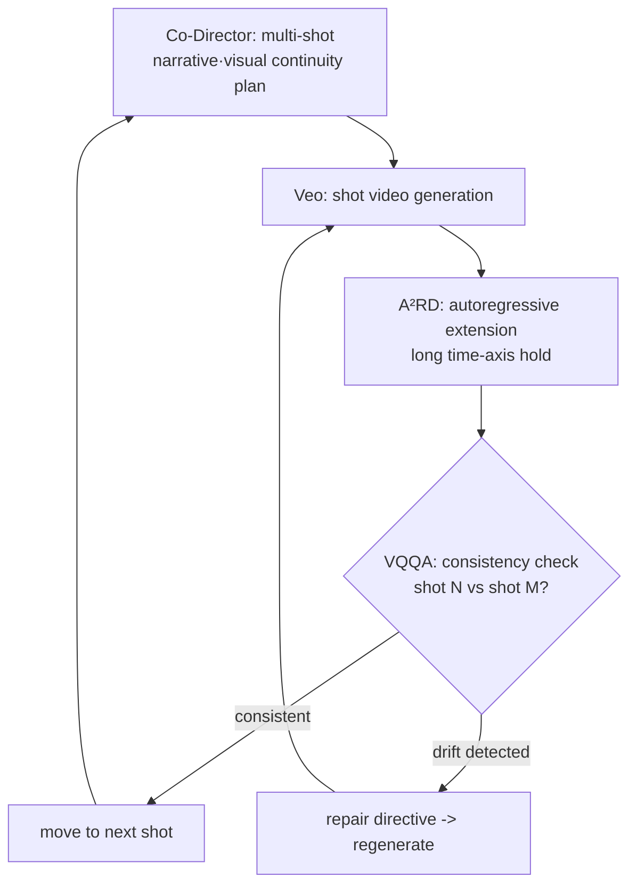

*A single coordinator circles the subject, issuing instructions to each agent and re-checking their results.*

## Why read this

If you design multi-agent systems, especially if you are stuck on consistency over a long time axis (agent drift, cascading failure), this post is for you. The conclusion first: the force that keeps long-form generated video consistent is not a larger single model, but the orchestration of agents that plan and then verify that plan. The unified multi-agent framework Google announced on September 24, 2026 shows exactly that structure. This post examines what each of the four agents does, and what that structure gives to agent design.

## Overview

The long-standing hard problem of video generation models is the time axis. A short clip can look fairly convincing, but once it passes the minute mark, problems pile up. A character changes from shot to shot (identity drift), the spatial layout of a scene stops being consistent, and the narrative collapses before it can get long. In a linear pipeline that regenerates every frame from scratch, these small errors accumulate until they become a **cascade failure**.

Google Research did not solve this with "a better video model." Instead it put an **agent orchestration layer** on top of Gemini (planning, orchestration) and Veo (video generation). A single coordinator plans the whole narrative, several agents split generation and verification, and one verification agent closes the loop on consistency.

## What each of the four agents does

The announced framework is made of four parts.

1. **Co-Director.** Plans the narrative and visual continuity across multi-shot sequences. It sets out in advance who is where in which shot and how it hands off to the next one. It is the agent that owns the overall orchestration.
2. **CANVAS.** Maintains spatial and visual consistency. It tracks the scene's "world state", where people are and what lighting is on, and keeps it from breaking between shots.
3. **A²RD (Agentic Autoregressive Diffusion).** Extends the long time axis autoregressively. Instead of a single model emitting all frames at once, it chains the next shot conditioned on the previous shots' results. This component is published as its own paper (arXiv: 2605.06924).
4. **VQQA (Visual Question Answering).** The agent that **verifies** consistency. It asks visual questions like "is the person in shot 3 the same as in shot 1?" or "does this shot's background conflict with the previous one?", detects drift, and issues a regeneration directive when it finds some.

The structurally important one is number 4. VQQA is an agent that **judges**, not generates. A coordinator plans, a generator produces, and a verification agent closes it. That is the difference between "do everything with one model" and "orchestrate agents".

Drawn as a diagram, the structure is:

Reading the flow, it is a loop of plan (coordinator) → generate (Veo) → extend (A²RD) → verify (VQQA) → repair/continue. The point where the loop closes is VQQA; without it, generation just piles up and nobody asks "is this right?"

## Why orchestration, and not a single model

In one line: consistency is not a by-product of generation; it is **made by verification**. A linear pipeline generates each shot looking only at the previous shot's output, so errors accumulate irreversibly. The multi-agent structure puts a verification agent in the loop so it catches an error before it moves to the next shot.

This design is not limited to video generation. It applies to any agent system that must hold consistency over a long time axis: code generation followed by verification, document editing followed by consistency checks, multi-step data pipelines. The core is separating "generate" and "verify" into different agents and looping generation back on the verification result.

## Limitations and counter-arguments

This framework is an **orchestration layer**, not a new base model. The quality ceiling is still set by Veo and Gemini. A good agent does not make Veo render a shot it cannot render.

The "10-minute" figure is a research demo result, not a product SLA. Whether the full 10 minutes stay consistent in real deployment, and how much regeneration the verification loop demands (that is, how much the total generation cost rises), must be checked separately. There is also a risk that the loop runs forever if VQQA fails to catch the drift it should.

Finally, the cost of this structure is in **verification**, not generation. Running VQQA on every shot can make verification calls more expensive than generation calls, producing a situation where "the verification agent eats the budget". How often to verify against how many shots is what sets the structure's economics.

## ThakiCloud product implications

This structure overlaps with the pattern Paxis uses.

**Paxis lens.** Paxis is an Agent-Native Cloud running on top of DAG multi-agent orchestration. The structure where a coordinator plans, workers execute, and a verification agent closes on their results is Paxis's base loop. What corresponds to VQQA is Paxis's verification stage: policy gates plus audit logs. The principle "another agent closes on a produced artifact with a judgment" is the core design of ThakiCloud's agent systems. The plan-generate-verify-repair loop in this post is the exact skeleton Paxis workflows use when they handle long time-axis work.

**Metis lens.** Serving Gemini- and Veo-tier models is also Metis's role. When orchestration hops between several models, deciding which model each call goes to is Metis's model routing. Planning, generation, and verification are tasks of different complexity, so routing each to a different model tier cuts cost. Verification (VQQA) is close to a structured judgment, and planning (Co-Director) is close to open generation. Assigning the two to different model tiers lowers the orchestration's overall inference unit cost.

## Wrap-up

What Google showed was not "a better video model" but "agent orchestration running on top of video models." The coordinator plans, the generator makes, A²RD connects the time axis, and VQQA verifies and catches drift. The general principle of this structure is separating generation and verification into different agents and looping generation back on the verification result.

From the ThakiCloud perspective it overlaps exactly with Paxis's base loop. Paxis already separates worker generation from the verification stage and closes with policy gates plus audit logs. This post's insight is to back that design up with an external example of why it is needed for long time-axis work. The next experiment we would recommend is scanning the verification agent's call frequency against the number of shots (or steps) in a Paxis workflow, and measuring the balance between drift-detection rate and total generation cost.

## Sources

- Google Research, "Automating coherent long-form video generation": https://research.google/blog/coherent-long-form-video-generation/
- A²RD: Agentic Autoregressive Diffusion for Long Video Consistency (arXiv): https://arxiv.org/abs/2605.06924
- Google Research official announcement (LinkedIn): https://www.linkedin.com/posts/googleresearch_today-we-announce-our-new-unified-multi-agent-activity-7508974334711865344-eeOU
