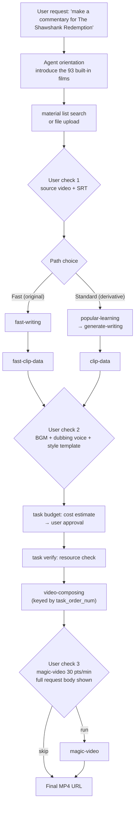

## Why you should read this

If you are a developer who wants to turn a one-sentence content pipeline into an agent skill, you need to decide one thing this week: which part of the pipeline you bring in as open source, and which part you hand to a vendor API. That decision determines the maintainability of the product. The core conclusion first: narrator-ai-cli is not a local generation tool but a paid API client, and the "open source" part under the MIT license is only the SKILL.md file that teaches the agent how to use the commands. This post separates what we measured without a key from what is only a marketing claim, and dissects the skill as a case study in external-service integration skill design.

## Overview

The post started circulating on X on September 29 (UTC). It says, in effect: narrator-ai-cli-skill is open source, so once you drop it into an agent like Claude Code there is basically nothing left to manage. Say "make me a commentary video for The Shawshank Redemption" and it handles the rest. It lists six capabilities: automatic script generation, precise clip timing, 63 voice tones with voice cloning, 90-plus visual templates, automatic matching of 146 BGM tracks, and finished video output.

The project is actually two repositories. The skill repository (NarratorAI-Studio/narrator-ai-cli-skill) is MIT-licensed and consists of SKILL.md plus a references/ directory (workflows.md, operations.md, magic-video.md, resources.md). The CLI repository (NarratorAI-Studio/narrator-ai-cli) is a Python package that acts as a client for the Narrator AI API (openapi.jieshuo.cn). The official README has an accurate metaphor: "The CLI is the hands, the skill is the brain." The brain decides what to do; the hands actually call the API.


*A concept render of the flow from one sentence to a finished video, with the agent working through resource-confirmation and cost-approval stages.*

## What this tool is

### Two paths: Fast Path and Standard Path

The pipeline diagram in SKILL.md splits script generation into two paths.

| Path | Flow | Notes |
|---|---|---|
| Fast Path (original copy) | fast-writing → fast-clip-data → video-composing | Officially labeled "faster & cheaper". For writing new copy in your own style |
| Standard Path (derivative copy) | popular-learning → generate-writing → clip-data → video-composing | Learns the style from a popular commentary video (popular-learning), then generates copy in that style. Derivative (二創) content |

Both paths converge on video-composing, which is keyed by the task_order_num of the previous step. magic-video (visual templates) is an optional final step, and the final output is an MP4 URL. The task types command confirms 9 real task types: popular-learning, generate-writing, fast-writing, clip-data, fast-clip-data, video-composing, magic-video, voice-clone, tts.

### Built-in assets: three numbers measured without a key

In an isolated environment (Python 3.12, installed from the v1.0.0 tag, no API key), we measured the asset list commands.

```bash
$ narrator-ai-cli material list --json | python3 -c "import json,sys; print(len(json.load(sys.stdin)))"
93
$ narrator-ai-cli bgm list --json | python3 -c "import json,sys; print(len(json.load(sys.stdin)))"
146
$ narrator-ai-cli dubbing list --json | python3 -c "import json,sys; print(len(json.load(sys.stdin)))"
63
```

93 films, 146 BGM tracks, 63 dubbing voices: exactly the three numbers the post claimed. The genre distribution is drama 17, action 15, romance 12, comedy 12, thriller 5, crime 4, police 4, anime 3, fantasy 3, fantasy-comedy 3. The dubbing voice IDs are in the form MiniMaxVoiceId*, which directly shows that the TTS layer is MiniMax. Voice names are often tied to film characters (e.g., a character from Farewell My Concubine), so the "63 voice tones" is really a character-voice archive rather than a set of generic voices.


*Measured 2026-09-30 via `material list --json` without an API key. Total 93.*

### The body of SKILL.md: the Agent Rules

The core of this skill is not the command manual but the Agent Rules written in SKILL.md. The five "always" items, translated, read as follows.

1. **Confirm before acting.** Get explicit user approval before every resource (source video, BGM, dubbing, template) and before every magic-video submission. Never auto-select, never auto-submit.
2. **Source data, never invent.** Build the video JSON from material list fields or task search-movie output. If neither yields it, ask the user.
3. **Honor the language chain.** The dubbing voice's language determines both the writing task's language parameter and every magic-video text parameter. All three must match.
4. **Paginate to exhaustion.** Fetch material list until total is consumed. Never trust a truncated terminal display.
5. **Poll with the canonical while loop.** Poll tasks in a while loop at 5-second intervals. No fixed-iteration for loops.

The "never" items are more concrete failure-prevention rules. magic-video is billed at 30 points per minute and is irreversible, so the agent must show the full request body (template plus every template_params value) and get the user's approval before submitting. If the narration language is non-Chinese, submitting the hardcoded Chinese defaults for magic-video text parameters puts Chinese text into the video, so that is forbidden. Passing task_id (a 32-character hex) as order_num returns error 10001 ("task association record data anomaly"); the downstream step wants task_order_num (a prefixed string like generate_writing_xxxxx). And if any step fails, automatic path-switching is forbidden; the agent must ask the user explicitly whether to retry, switch, or abort.



*The confirmation gates (1, 2, 3) are hardcoded into the pipeline. On failure, the agent asks the user to retry, switch, or abort instead of switching paths on its own.*

### First-message rule: lead with the material library

SKILL.md has a Conversation Initiation section. On the first message of a session, the agent must not assume the user will upload their own video; it must proactively mention the pre-built material library (about 100 films with video + SRT ready) first. Then it offers three entry points: if the user has a specific film in mind, search the built-in materials first and fall back to task search-movie; if they want to browse, present 5 to 8 titles spanning varied genres from material list --json; if they want to upload their own, guide them through file upload. The Fast-versus-Standard question is only allowed after the source material is confirmed, so the user is never forced into a choice without context.

## Installation and integration

The commands as run in our sandbox.

```bash
# Install the CLI (official README)
pip install "narrator-ai-cli @ git+github.com/NarratorAI-Studio/narrator-ai-cli.git"

# Configure the API key (key issuance by email request)
narrator-ai-cli config set app_key <your_app_key>

# Install the skill: clone into the agent's skills folder (SKILL.md + references/ both required)
git clone https://github.com/NarratorAI-Studio/narrator-ai-cli-skill.git \
  /path/to/your/project/.skills/narrator-ai-cli
```

The plugin.json metadata declares the install spec: pip plus the GitHub archive v1.0.0 zip, with requires listing the narrator-ai-cli binary and the NARRATOR_APP_KEY environment variable. Keys are not self-serve; you request them by email, and the same company runs the point balance. The skill repository even ships .gitleaks.toml and .trufflehogignore, and its CI workflow appears to run secret scanning. Enforcing secret hygiene in CI for an agent-skill repository is uncommon.

## Hands-on results

On September 30, 2026 we ran everything that can be re-measured without an API key.

| Item | Command | Result |
|---|---|---|
| Version | `--version` | narrator-ai-cli 0.1.0 (installed from v1.0.0 tag; version field mismatch) |
| Task types | `task types` | 9 types (see table above) |
| Films | `material list --json` | 93, genre distribution captured |
| BGM | `bgm list --json` | 146 tracks |
| Dubbing voices | `dubbing list --json` | 63, MiniMaxVoiceId* |
| Balance | `user balance` | "API key not configured. Run: narrator-ai-cli config init" |

Exactly two places require a key: the balance check (user balance) and every generation task. Commands that inspect cost and resources before creation also really exist.

```bash
# Estimate point cost before creating (operations.md)
narrator-ai-cli task budget --json -d '{
  "learning_model_id": "<id>",
  "native_video": "<video_file_id>",
  "native_srt": "<srt_file_id>"
}'
# Returns: viral_learning_points, commentary_generation_points,
#          video_synthesis_points, visual_template_points, total_consume_points

# Verify resources before creating
narrator-ai-cli task verify --json -d '{"bgm":"<bgm_id>","dubbing_id":"<voice_id>",...}'
```

Error codes 10009 (account balance insufficient) and 10013 (sub-key quota insufficient) are documented in operations.md for out-of-points cases. We did not run actual video generation: we have no API key, and this post only states as fact what can be verified without one. "Clip timing is precise and BGM matching is natural" is the vendor's claim, not a verified number in this post.

## ThakiCloud product implications

**Paxis lens.** narrator-ai-cli-skill is a textbook case of the "external-service integration skill" that Paxis treats as a first-class resource. Three things read clearly from an agent-orchestration perspective.

First, the always/never clauses of the Agent Rules are a text-form implementation of policy gates: human confirmation before resource selection, cost estimation (task budget) before submission, and showing the full request body before any irreversible operation (magic-video). It is the same grammar as why Paxis makes Policy and Audit Log first-class resources. The difference is the enforcement point: this skill writes the rules as text and relies on model compliance, while Paxis enforces the same rules as policy gates and audit logs. That a two-file skill (SKILL.md + references/) can design this level of discipline is a data point for skill authors; that text discipline is the first stage of enforced discipline is a data point for platform designers.

Second, the references/ split is a token-management pattern. SKILL.md holds only the decision flow and the rules, while topic-level detail (resource field mapping, polling patterns, error codes, magic-video parameters) is deferred to four reference files. This is exactly the direction Paxis skill design is moving: thin SKILL.md, fat references.

Third, cost visibility as contract. When the sentence "30 points per minute, irreversible" sits in the never-items of the skill body, the agent has to ask the user every time it performs that operation. It is a pattern of putting the thing that spends the user's money into the contract (the prompt) rather than the code. When building a ThakiCloud agent workflow that calls a billed external API, placing a task-budget-style "cost estimate before action" command as a gate stage is precisely this.

**ai-platform lens (brief).** The fact that the 63 dubbing voice IDs are in MiniMaxVoiceId form means the TTS layer is also a vendor API. If the same "movie commentary pipeline" were needed in an on-prem or sovereign environment, the API-client segments (script generation, TTS, clip composition) would have to be replaced with local models (e.g., VoxCPM2-class TTS) and local composition. The skill's structure (confirmation gates, cost estimation, references split) is reusable; the execution backend is not.

## Limitations and counterarguments

1. **The "open source" boundary.** MIT applies to the skill files only. The generation pipeline, the material library, the TTS, and the billing are all a closed service. The original post's claim of "basically nothing left to manage" is true of the agent's behavior, not of the data flow (your video is uploaded and processed through a third-party API).
2. **Vendor dependency.** Key issuance and balance top-ups are operated by people (email, WeChat). If the service changes, the skill becomes a dead document. The only service-failure signal the agent can see is the 10009/10013 out-of-points error.
3. **The legal gray zone of derivative content.** Commentary videos built on film footage are derivative works, and the copyright status varies by jurisdiction. The 93 built-in films are assets the provider prepared, but the distribution risk stays with the user.
4. **Maturity.** The v1.0.0 tag while CLI --version reports 0.1.0, and a support channel that is a personal email: signals of an early project.
5. **Verification limits.** This post did not run video generation. Quality claims (clip timing, matching naturalness, "reduce headcount to zero") are unverified.

## Summary

narrator-ai-cli-skill is worth reading less for "you can automate movie commentary videos" and more as a design case of an agent skill wrapping a paid external API. The three numbers that verify without a key (93 films, 146 BGM tracks, 63 voices) match the marketing, and the match itself reveals the product structure: asset lists are public, generation is paid. The five Agent Rules, every confirmation gate, the cost estimate, and the full-body disclosure before irreversible work, are patterns you can port directly into ThakiCloud Paxis skill governance. If you are considering adoption, the order we recommend is: obtain a key, then measure the Fast Path task budget estimate, the point consumption, and the finished-video quality on your own content. One-line takeaway: **the skill is open source; the pipeline is not.**

## Sources

- [narrator-ai-cli-skill (GitHub)](https://github.com/NarratorAI-Studio/narrator-ai-cli-skill)
- [narrator-ai-cli (GitHub)](https://github.com/NarratorAI-Studio/narrator-ai-cli)
- Original tweet: [candy @shenxiankk](https://x.com/shenxiankk/status/2104744469258195416)
- Aliyun developer community: [narration video workflow based on narrator-ai-cli](https://developer.aliyun.com/article/1727596)
- Tencent Cloud developer: [technical breakdown of narrator-ai-cli](https://cloud.tencent.com/developer/article/2654341)
