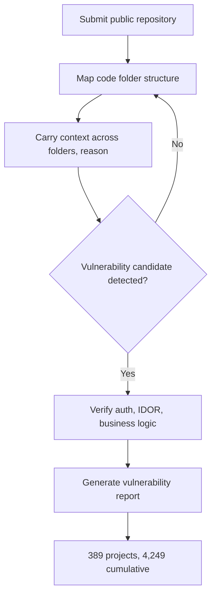

## Why Read This

A post for the engineer who puts an agent in production to own security and infrastructure, and for the team lead who must decide whether to adopt that agent. This week settled one sentence. **Security review is no longer a person scanning code by eye; it is an agent task where an open-weight model digs through code on its own and finds vulnerabilities.** And the question that transition leaves behind is no longer "do we use it" but "how do we run it, and how do we prove what it did."

*An abstract rendering of an agent scanning a code structure and detecting vulnerabilities.*

## Overview

Z.ai announced on September 30 that OpenVuln, its vulnerability-audit tool built on the open-weight flagship GLM-5.3, has so far surfaced 4,249 potential vulnerabilities across 389 open-source projects. OpenVuln is "still running," so the number keeps climbing. Its growth from the official blog's initial report (roughly 2,400) to 4,249 is the evidence.

What makes the milestone matter is its character, not its size. The sentence "a model looks at code and finds bugs" has moved from a lab demo to an operating number of a running tool. From ThakiCloud's vantage point, in an Agent-Native Cloud (Paxis) where agents do real work, a high-risk agent task like security review does not stand without isolation, policy gates, and audit logs. This post builds that prerequisite on the concrete case of OpenVuln.

## What This Technology Is

OpenVuln is delivered as a Hugging Face Space (zai-org/OpenVuln). Submit the URL of a public repository and the agent explores the repository, sweeps the code, and reports vulnerability candidates. What sets it apart is that it operates not as rule-based static analysis (SAST) but as reasoning that carries context across folders and files.

The model under that reasoning is GLM-5.3. Z.ai's 743B-parameter open-weight flagship, released on August 14, 2026. It is a variant that layers scaled post-training on the same base weights as GLM-5.2. As a result, GLM-5.3 is reported to post the highest score of any open-source model on Terminal-Bench 3.0 and roughly a 50% improvement over the prior generation on Z.ai's internal coding benchmark. "The strongest open-weight model for coding and agentic work" is the core of those numbers.

Here is how to read the audit flow, where the agent operates.

The key is stage E. Auth bypass, IDOR (Insecure Direct Object Reference), and business-logic errors are the bug classes a human reviewer actually looks at. They are the territory where static-analysis tools struggle, and where an agent that "understands the code at once" is comparatively strong. That OpenVuln has automated this class of bug across 389 projects means one axis of security review is moving into tooling.

## Running OpenVuln

The simplest use is to drop a public repository URL into the Space and run it. On submission the agent pulls the repository, maps the folder structure, and sweeps files for vulnerability candidates. A report is produced, and OpenVuln has kept this process running across 389 projects to accumulate 4,249.

A community implementation runs the same flow locally. Swonkio/Vuln-GLM-5.3 is a local, source-only agentic code-audit console in the OpenVuln visual language. The core is "run my model on my machine to sweep my code, without sending it to a public API."

Here the open-weight property becomes a practical question. Organizations that cannot ship code to a third-party security API (security, privacy, regulatory constraints) can run the audit agent on their own model and infrastructure. Open-weight turns that option from "impossible" into a "design problem."

## Verified Results

I quote the reported figures as-is, but I state their character plainly.

First, 4,249 across 389 projects is the milestone Z.ai reported on September 30. It is "detected potential vulnerabilities," not "patched and closed" or "registered CVEs." Because OpenVuln is "still running," the number rises with time, and its growth versus the official blog's initial report (about 2,400) shows that.

Second, GLM-5.3's coding and agentic reports (top open-source on Terminal-Bench 3.0, ~50% over the prior generation on the internal bench) rest on Z.ai's and multiple outlets' reporting.

Third, the flip side of this capability was reported alongside it. One outlet said NIST took note of the result; another reported that Anthropic issued a warning around GLM-5.3's offensive capabilities. Precisely, Z.ai made "emergent cyber capabilities" the subject of the official blog. Defense (finding vulnerabilities) and offense (composing exploit chains) come from the same capability. This duality is handled next, from the Paxis lens.

## Implications for ThakiCloud Products

**Paxis lens.** ThakiCloud's Paxis is an Agent-Native Cloud where agents do real work. The skill harness, sandboxed execution, and policy gates plus audit logs are first-class resources by design. OpenVuln is a case that shows, in numbers, why that design is necessary. "An agent that digs through code and finds vulnerabilities on its own" is itself a high-risk agent task, and putting it in production requires (1) an isolated execution environment, (2) a policy gate that controls access, and (3) an audit log that captures every action. The 4,249 figure is the proof that "the agent does work"; to do that work safely, Paxis's three prerequisites apply as-is. This is the ground on which a security-audit workflow becomes a first-class Paxis domain.

**ai-platform lens.** That GLM-5.3 is open-weight matters from the infrastructure side too. In a multi-tenant on-prem environment, you can serve your own model and run the audit agent under the condition that code does not leave. For customers who require self-hosting and sovereignty, "do the security review inside, without depending on an external API" is direct value. Low serving cost raises how often the agent runs, and run frequency translates into audit coverage.

## Limits and Counterarguments

This result has clear boundaries.

First, 4,249 is "detected," not "threat." Each item needs human verification for whether it is a real vulnerability, whether it is exploitable, and whether it is already known. Automated detection is strong at producing the review queue, but it does not replace the verdict.

Second, agent-based audit has a larger false-negative problem (bugs it misses). Finding 4,249 also means there may be parts it did not find. The territory SAST tools cover by rules and the territory an agent covers by reasoning do not fully overlap. The two are complementary, not substitutes.

Third, dual use is inescapable. The same capability enables both defense (finding vulnerabilities) and offense (composing exploits). Open-weight makes that capability runnable by anyone. So alongside the "how do we build the model" debate, the "how do we run it in our environment and how do we prove it" debate is required at the same time.

Fourth, the sentence "the model is safe" does not hold. What is safe is not the model but the environment the model sits in. Isolation, policy, audit, and the human reviewer who makes the final verdict compose that environment.

## Takeaway

This week recorded the moment a long-standing labor-intensive task, security review, moved into an agent task. OpenVuln and GLM-5.3 are the concrete evidence of that transition, and the 4,249 figure shows the scale of "the agent does work."

The next step is clear. Review whether to introduce an open-weight-based audit agent into your own codebase, and if you do, design it with isolated execution, policy gates, and an audit log as prerequisites. In an era when the finder is no longer a person, the fence must move from outside the model to between the model and its environment. On the day an agent finishes the security review, how you run that agent and how you prove it becomes the team's edge.

---

**Sources**
- Z.ai official blog: [GLM-5.3: Frontier Coding with Emergent Cyber Capabilities](https://z.ai/blog/glm-5.3)
- OpenVuln (Hugging Face Space): [zai-org/OpenVuln](https://huggingface.co/spaces/zai-org/OpenVuln)
- Community implementation: [Swonkio/Vuln-GLM-5.3](https://github.com/Swonkio/Vuln-GLM-5.3)
- Z.ai X announcement: [GLM-5.3 across 389 open-source projects, 4,249 vulnerabilities](https://x.com/Zai_org/status/2105132385700634721)
- The Agent Report: [Z.ai Tops the Open Coding Leaderboard on Post-Training Alone](https://the-agent-report.com/2026/08/glm-5-3-zai-post-training-coding-cyber/)
- Aitrove: [GLM-5.3 Z.ai Coding & Cybersecurity 2026](https://www.aitrove.ai/blog/glm-5-3-zai-coding-cybersecurity-2026)
