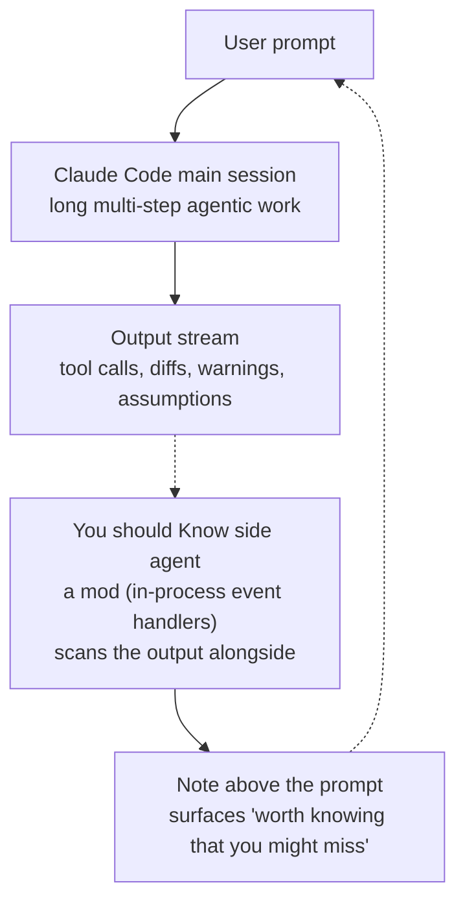

## Who should read this

If you run hour-long agentic coding sessions, or you operate your team's agent workflows as a platform owner, read this. The conclusion in one line: **as agent sessions get longer, the bottleneck moves from "can the agent do it" to "can a human keep up with the results", and Anthropic has shipped a side agent that keeps that attention for you, as a built-in feature (mod) of Claude Code.** You should Know watches Claude's output and surfaces, as a note above the prompt, anything "worth knowing that you might miss".

## Overview

On October 3, 2026, the official Claude developers account announced a new plugin: "We're adding a new plugin to Claude Code: You should Know. It scans Claude's output for important information you might miss to help keep you in the loop." In the official docs' terminology, the feature is a built-in mod called `cc-plugin-you-should-know`. The enable command is `/plugin enable cc-plugin-you-should-know@builtin`, and it is disabled by default.

The word "mod" deserves attention first. The tweet calls it a plugin, but the Claude Code docs classify it as a mod. A mod is the kind of plugin that runs inside Claude Code itself.

## What is a mod

The docs' definition, in their words: a mod is a plugin that changes how Claude Code looks and behaves. It is a bundle of JavaScript or TypeScript event handlers that Claude Code invokes when events happen: a tool call, a submitted prompt, a part of the interface being drawn. A handler can watch the event, change it, or take it over.

The docs list five things a mod can do.

First, **draw an interface you can use**: a pane beside the transcript, or a band above the prompt, with tabs, buttons, and text fields. The "note above the prompt" that You should Know surfaces is exactly this power at work.

Second, **redraw Claude Code's own interface**: replace or restyle the tool call row, the spinner, or the dialog Claude uses to ask questions.

Third, **step into a tool call or a request**: hold a tool call while you ask the user a question, answer it without running the tool, or send one request to a different model.

Fourth, **run your own code on a command**: a `/command` that runs a function immediately, with no Claude turn, even while Claude is working.

Fifth, **share data between handlers**: a mod's handlers share the variables in their file, so one handler that counts tool calls can feed another that shows the count beside the spinner.

*The relationship between the main session and the side agent. The side agent does not intercept output; it scans alongside and raises a note above the prompt only when needed.*

Mods run in the Claude Code CLI and in the Code tab of the Claude Desktop app. The docs also note that some built-in mods have public source in the mods directory of the Claude Code repository: the `/diff` pane, `agents-md` (loads AGENTS.md as project instructions), `sec-default` (a policy-enforcement model), and `telemetry` (methods other mods can call). You should Know's source is not on that public list.

## What You should Know does

The docs describe the feature in a single sentence: "Runs a side agent that watches your back while Claude works on longer tasks. When it finds something worth knowing that you might miss, it shows you a note above the prompt."

Unpacked: while Claude works on a long task, a side agent works alongside. When it finds something worth knowing that you might miss, it shows you a note above the prompt. Third-party coverage puts the target this way: the warnings, assumptions, and breaking changes that get buried in walls of output during long sessions.

Three operational facts, per the docs. First, it is off by default; it appears under Installed, Show disabled in `/plugin` if available for your org. Second, built-in mods are tied to Claude Code's own analytics records, and can be turned off via `/plugin` or through the analytics switch, for example `DISABLE_TELEMETRY`. Third, the settings and flags that stop installed mods (`disableAllHooks`, `--bare`, `--safe-mode`) **do not stop built-in mods**. That third fact is the one to notice from a security standpoint: the switch that stops third-party plugins does not apply to a first-party observation feature, so telemetry-sensitive environments should confirm that premise before enabling it.

The rollout is still in progress. The anthropics/claude-code repo on GitHub carries an issue titled "Built-in plugin startup tip references unavailable plugin", reporting that the startup tip points at a plugin not available to everyone. The docs' own "if available for your org" qualifier is the same point.

## Implications for ThakiCloud

**Paxis lens**: Translated into platform language, the problem this feature solves is "the human-attention bottleneck in agent sessions". Paxis is the Agent-Native Cloud control plane that routes every agent action through policy gates and audit logs, and the reason audit logs exist rests on the premise that "a human cannot keep up with the agent". You should Know tests that premise in real time, inside the IDE, while the session is still running. An audit log is something you read after the session; a note above the prompt is something you read during it. They are two designs placing the same signal on different time axes.

The question to port to Paxis is clear: in your agent workflows, which signals must a human not miss, and do those signals belong only in the audit log, or should some of them appear as real-time notes at specific points in a running session (entering a long task, just before a risky action, on an exception-state transition)? You should Know is a first-party proof of concept for the latter.

**ai-platform lens**: A side agent is, by definition, additional inference. A model reading the main session's output alongside means per-session cost goes up. From Metis's viewpoint this is the "inference cost of the observation layer" problem, and the crux is designing signal density so the observation is worth more than it costs.

## Limits and counterarguments

**Single-source behavior**: The primary source for the behavior described here is one sentence in the official Claude Code docs. Which model the side agent uses, what its scan cadence is, and how note density is tuned are not confirmable from public material.

**Signal-to-noise**: Third-party coverage makes the same warning: "watch whether the signal-to-noise ratio holds in practice". If it raises a note in every session, the note becomes something people ignore. The quality of an observation feature is decided by how well it stays silent, too.

**Telemetry premise**: Per the docs, the feature is tied to environments where Claude Code's analytics are on, and it cannot be stopped by the flags that stop installed mods. In privacy-first workflows, enabling it changes the premise of the environment, and that should be considered.

**First-party bias**: Claude Code embedding a structure where first-party code observes its own output raises the symmetry question against a neutral observer (a third-party agent, external audit). The limits of a setup where one party holds both the observer's identity and the observed target will keep following this in agent-governance discussions.

## Wrap-up

You should Know is small. One mod's side agent, one line of note above the prompt. But the direction it points is the problem you will keep meeting as sessions get longer: the information, warnings, and assumptions a human cannot keep up with while the agent works. The feature is a signal that this gap is starting to be filled by a note during the session, not a log after it.

If you run agent workflows, the next action is one: make a list of the signals in your workflow that a human must not miss. Then check where you keep them today. If they live only in the audit log, it is time to review the "in-run observation" point that You should Know is experimenting with.

## Sources

- The Claude developers account's You should Know announcement (RT): [x.com/hjguyhan/status/2106396751804633192](https://x.com/hjguyhan/status/2106396751804633192)
- [Claude Code official docs: Mods overview (includes the cc-plugin-you-should-know entry)](https://code.claude.com/docs/en/plugins/mods/overview)
- [tools4all.ai: Claude Code Adds 'You Should Know' Output Plugin](https://tools4all.ai/trends/claude-code-adds-you-should-know-output-plugin)
- GitHub anthropics/claude-code issue #99071 (startup tip referencing an unavailable plugin)
