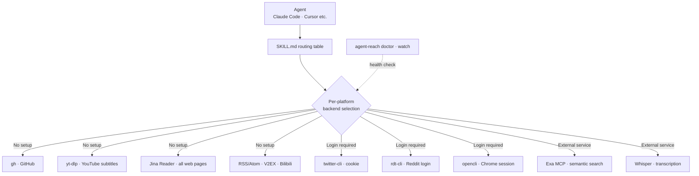

## Why Read This

You should read this post if you are a developer running an AI agent that has to read news, documents, and social content, or an operator who owns that agent's external content costs (search APIs, scraping infrastructure, subscriptions). The conclusion is one line: **most of the cost an agent needs to read the internet was zero to begin with, we were buying paid APIs every time, and Agent-Reach is the routing layer that turns those free paths (Jina Reader, RSS, yt-dlp, gh) into a standard agent capability.** We have been using this tool as the fallback provider for ThakiCloud's skill system since July 2026, and this time we re-measured everything from installation to actually reading content.

## Overview

On October 5, 2026, a tweet went around: "Your AI agent can now read the entire internet, with zero API fees". It says Agent-Reach plugs into agents such as Claude Code and Cursor. That same day we checked the repo tagline for the tool: "Give your AI agent eyes to see the entire internet." The description that follows is that reading and searching across Twitter, Reddit, YouTube, GitHub, Bilibili, and XiaoHongShu comes from one CLI, at zero API cost.

"entire internet" is marketing language, naturally. But the core claim, zero API cost, makes sense once you see how it actually works. Agent-Reach is not a crawler that scrapes the internet itself. It is a capability layer that picks the access paths that are already free per platform (public APIs, RSS, Jina Reader's anonymous endpoint, yt-dlp), installs the CLIs it needs, runs health checks, and routes the agent with "read this platform with this command."

We wrote this post for a simple reason. On the agent-running side, content access is a recurring cost, and manually checking "does a free path exist?" every time is inefficient. Agent-Reach compresses that check into one `doctor` command.

## What Is Agent-Reach

The command set as of v1.5.0 looks like this: `setup` (interactive configuration), `install` (one-shot install), `configure` (store configuration values, extract browser cookies), `doctor` (platform availability check), `uninstall`, `skill` (register the agent skill), `format` (clean up platform output), `transcribe` (transcribe URLs and audio, via Whisper/Groq/OpenAI), `check-update`, `watch` (health check for scheduled jobs), `version`.

Channels fall into two kinds.

First, no-setup channels (no login required). Based on the doctor result we measured, 6 of 15 were usable immediately after install.

- GitHub: read and search repositories and code with the `gh` CLI
- YouTube: extract video info and subtitles with `yt-dlp`
- V2EX: read nodes, topics, and comments via the public API
- RSS/Atom: read feeds directly
- Bilibili: search API (full features need the separate `bili-cli`)
- All web pages: convert to markdown with Jina Reader (`curl https://r.jina.ai/<URL>`)

Second, login and opt-in channels. Twitter/X, Reddit, Facebook, Instagram, XiaoHongShu, Xueqiu, Xiaoyuzhou podcasts, LinkedIn, and Exa semantic search. "Zero API cost" does not apply on this side. The watch report's Reddit entry explains that Reddit has no no-setup path (anonymous .json is blocked and the official API requires an approval process), and that desktop relies on opencli reusing the Chrome login state or the server installing rdt-cli and running rdt login. Twitter/X needs a cookie on top of the `twitter-cli` install, and Facebook and Instagram reuse the Chrome login state through `opencli`.

The structure in a diagram looks like this.



The precise meaning of "zero API fees" is also fixed here. The cost that comes out of the free paths, Jina Reader's anonymous endpoint, RSS, GitHub/YouTube public data, is zero. Exa semantic search, Whisper transcription, and each platform's official API still follow their own pricing. Agent-Reach does not remove cost; it makes the agent pick the free paths automatically. Even the free paths have a boundary. Jina Reader's anonymous endpoint is not unlimited, it has its own rate limit, and for continuous operation the Jina docs recommend an API key. In other words, the scope of "free" is something you re-check per channel.

## Installation & Integration

We installed from the git source into our shared venv.

```bash
VIRTUAL_ENV="$PWD/.venv" uv pip install "git+https://github.com/Panniantong/Agent-Reach.git"
.venv/bin/agent-reach doctor
.venv/bin/agent-reach version
```

The `version` output was `Agent Reach v1.5.0`, and `check-update` confirmed "current version: v1.5.0, the latest version". As of October 6, that is the same version we first installed on July 15. This tweet was a re-promotion of an existing tool, not a new release.

When `doctor` finishes, the skill file is registered automatically as well. Our machine's output verbatim: "Skill installed for Agent: ~/.agents/skills/agent-reach, Skill installed for Claude Code: ~/.claude/skills/agent-reach". This SKILL.md acts as the routing table between the agent and the tool. It holds a table mapping platform name to read command and search command, and the agent looks at the table and executes commands in its own shell. Claude Code, Cursor, and other agent frameworks all follow the same scheme as long as they match the skill file format.

`watch` is for scheduled jobs. Run it from `cron` or a scheduler and it reports per-channel status, presenting the reinstall command alongside for dead channels. Having "install" and "monitoring" in the same CLI is this tool's ops-oriented design.

The `skill` subcommand is the core of the integration. It drops a SKILL.md file into the skill directory, and that file is not code, it is a routing table. Each platform is mapped to a "read command" and a "search command", and when the agent sees the table it learns "read web pages with Jina Reader, read YouTube subtitles with yt-dlp." Because Agent-Reach injects the knowledge of "what to read with" as an agent skill rather than providing a "read API" directly, it works with no extra code on any agent that can run shell commands and read files (Claude Code, Cursor, etc.).

There are caveats too. `agent-reach install` drags in system dependencies such as node and mcporter, so it is safer to check the current state with doctor and selectively enable only the channels you need, rather than doing a full install. Channels like Reddit require installing `rdt-cli` separately and running `rdt login`.

## Hands-On Results

We actually used the 6 no-setup channels that the post-install doctor check confirmed.

The first experiment was reading the Agent-Reach repository page itself with Jina Reader.

```bash
curl -s "https://r.jina.ai/https://github.com/Panniantong/Agent-Reach"
```

The output was 23,090 bytes of markdown. It included the title, the URL source, and the README body, with no API key used. If an agent wants to read this tool's documentation, that one line is all it needs.

The second experiment was reading an RSS feed. We pulled the Hacker News feed and extracted the item count and titles.

```bash
curl -s "https://news.ycombinator.com/rss"
```

The feed was 11,482 bytes and had 30 items. The top 5 headlines verbatim: "Beam: Reflection's 501B open-weight model", "Dust: Pretraining Transformers Without Backpropagation", "Opus 5.5 agents discover two room-temperature magnetic semiconductor candidates", "Find the flattest route between any two points in SF", "Web Search API". With one line of XML parsing, an agent has the structure it needs to monitor headlines.

The third was the doctor and watch reports. doctor reported 6/15 channels available, and watch walks through the remaining 9 channels, presenting "what must be installed and what login state is required" for each, alongside the commands. These two outputs become the basis for an agent to judge for itself "what content access is possible in this environment."

The total cost was zero, because all three experiments used only free endpoints. Of course, that number is the cost of "our experiment segment"; if you use paid channels like Exa search or transcription, each carries its own fee.

## Implications for ThakiCloud Products

ThakiCloud's Paxis is an Agent-Native Cloud that treats the way agents use tools as a first-class resource. Skills, Tools, Policies, and Audit Logs are that treatment. Agent-Reach's design fits Paxis's viewpoint quite precisely.

Paxis picks among 960+ skills with BM25 and runs them in isolated sandboxes. Agent-Reach's SKILL.md routing table shows the same pattern at a smaller scale. The mapping "this platform with this tool" is written in the skill file, and the agent finds the mapping and executes it. Both keep the tool list as data (a skill file) rather than code, which is why adding a new platform requires no agent code changes.

We already use this pattern. In the ThakiCloud skill system, when the primary method (WebFetch, gh, dedicated scrapers) hits a 403, a paywall, or a rate limit, we fall back to Agent-Reach's Jina Reader path. It has been the same combination since the July 15, 2026 verification. Content access is one of the highest-failure segments in an agent pipeline, and just having one free fallback path raises pipeline survival.

The second implication is the policy gate. Login channels like Twitter, XiaoHongShu, and Instagram sit in each platform's ToS gray zone. Using such a tool in Paxis requires a structure that records "which channels are enabled and which cookies run the process" in the policy gate and the audit log. Agent-Reach extracts browser cookies with `configure`, and the agent platform side has to control which account those cookies belong to and what is allowed.

## Limitations & Counterarguments

Do not believe "entire internet." It is 15 platforms, and only 6 of them are no-setup. Reddit has no free path at all, and Twitter, Facebook, and Instagram presume a logged-in state. The rest of the internet (deep pages of ordinary websites, login-required services, PDFs, images) is outside this tool's scope.

There is also a part that should not be read as "entirely free." Of the 15 channels, the ones where "zero API cost" actually applies are only the 6 no-setup channels that need no key. The `transcribe` command is the counterexample. It transcribes a URL or audio via Whisper, whose backend is Groq or OpenAI, and both are paid APIs. Exa semantic search is the same: it needs an Exa key. In other words, Agent-Reach's "zero API cost" is a property of the reading channels, not a promise of the whole tool. Re-checking the cost boundary per channel is on the adopter.

Account risk on cookie-based channels is real too. The opencli approach that reuses a Chrome session is effectively running with your personal account, and if a platform judges it abnormal access, account sanctions can follow. In operations, the standard is to use a dedicated account, and Agent-Reach's docs do not enforce that.

The CLI output being in Chinese is also a fact as of v1.5.0. The status messages for doctor, watch, and check-update all come out in Chinese. It does not hinder functionality, but reading the logs, or handing interpretation to an agent, costs non-Chinese-speaking teams a little. It also means this tool was built with the Chinese community as its primary audience, which in turn shows up in the weight of ToS-gray-zone channels (XiaoHongShu, Bilibili).

The same applies to the `format` subcommand, which currently only supports xhs (XiaoHongShu) output cleanup. Its real scope is narrow compared to the name "platform output formatting."

Finally, Agent-Reach is a routing layer, not an interpretation layer. The markdown Jina Reader hands back does not separate ads from body text. Judging whether an RSS item is actually relevant to the agent's work remains the agent's job. The claim "lets you read the internet" must always carry the premise "judging how to use what was read is separate."

## Takeaways

When an agent needs to read the internet, it is time to build the habit of checking for a free path before buying a paid API. Agent-Reach turns that check into one `doctor` command. Right after install, the 6 no-setup channels (Jina Reader, RSS, YouTube subtitles, GitHub, V2EX, Bilibili) open immediately, and the login channels open only when needed.

For us, this tool was not marketing but a practical path that cuts recurring cost. When content-access failures disappear from an agent pipeline, you get that much more room to run experiments. We recommend two next steps: run `agent-reach doctor` in your own agent environment to see which channels are available, and when you enable a login channel, design the policy gate and audit log alongside it.
