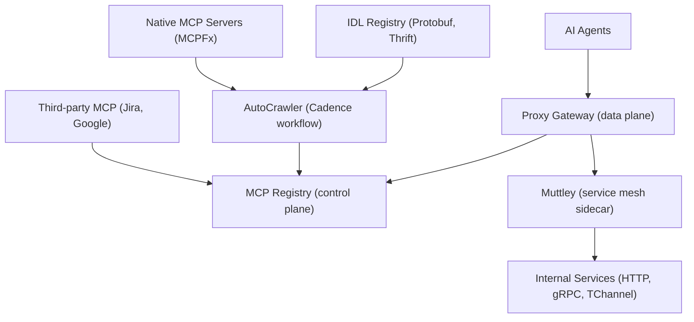
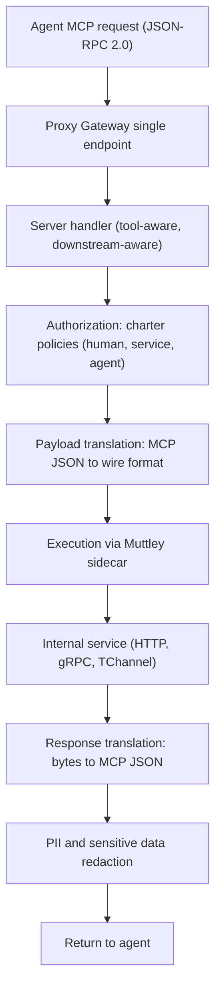

## Why You Should Read This

If you are building a company-level agent platform, or deciding how to expose thousands of internal APIs to AI agents, this is the article to read. The conclusion up front: **Uber consolidated 800+ MCP servers and 5,000+ tools behind a single MCP Gateway, and the core was three decisions. It made existing services MCP-able through protocol translation rather than rewriting. It started from the governance principle that discovery does not imply exposure, with everything disabled by default. And it treated context as a scarce resource, solving context bloat with incremental discovery, response projection, and code mode.**

## Overview

Uber's adoption of AI agents was fast. Early on, individual teams wired up ad-hoc MCP (Model Context Protocol) integrations, and the value was clear. Agents became dramatically more capable when they could access live business context, query internal services, and take meaningful actions on behalf of users.

As adoption accelerated, the problems surfaced. Teams built integrations independently, which fragmented tooling and duplicated infrastructure. MCP tools were hard to discover, difficult to operate reliably, and tightly coupled to specific services or agent implementations. What worked at small scale stopped meeting Uber's needs once hundreds of teams began exploring agentic workflows. Without a unified architecture, scaling MCP increased operational complexity, security risk, and developer friction, ultimately limiting its impact.

In early October 2026, Uber's engineering blog published "Designing MCP Gateway: Uber's MCP Management Platform." Eight engineers co-authored it, including Alok Srivastava (Principal Engineer) and Uday Kiran Medisetty (Distinguished Engineer) from the Business Platform org. The MCP Gateway they describe is now the foundational microservice powering all MCP interactions at Uber, hosting over 800 MCP servers and over 5,000 tools.

## What Is This Technology

The MCP Gateway is the orchestration and routing layer between AI agents and Uber's back-end services, plus native MCP servers. Uber runs a microservice architecture with thousands of internal services exposing APIs over HTTP, gRPC, and TChannel. Those APIs are valuable context for an AI system, but asking each team to author MCP servers by hand would be slow and painful.

The gateway splits into two primary components.

- **MCP Registry (control plane):** the single source of truth holding a catalog of hundreds of MCP servers backed by internal services, along with thousands of tools. Tools range from no-code definitions that expose existing APIs as MCP tools to fully native implementations built explicitly against the MCP specification. The registry is the source of truth for discovery, ownership, and enablement across the ecosystem.
- **Proxy Gateway (data plane):** the core runtime service that executes MCP requests. It translates MCP protocol calls into HTTP, gRPC, or TChannel requests, forwards them to the appropriate back-end service, and converts the responses back into MCP-compatible results. Agents interact with existing systems through a consistent MCP interface, and the underlying services require no changes.

The core insight is simple: existing APIs are the fastest way to give agents tools. Rather than asking teams to rewrite their services for an agentic world, the MCP Gateway meets them where they are. Protocol translation happens transparently in the middle, so downstream changes are zero.

*Control plane and data plane. AutoCrawler scans IDLs and native servers to populate the registry, and the Proxy Gateway translates and routes requests at runtime.*

## Design 1: Control Plane and Discovery via AutoCrawler

Tools enter the registry through three paths.

**IDL-backed services.** Traditional back-end services defined with Protobuf or Thrift IDLs get their MCP servers and tools derived directly from the IDL Registry by AutoCrawler. AutoCrawler is a Cadence-powered distributed workflow system subscribed to Uber's IDL registry and internal service signals. On a fixed schedule, a cron job triggers a workflow that scans for newly added services, APIs, and schema changes. For every service:API group, it performs the following steps.

1. Upsert a virtual MCP server for the discovered service.
2. Parse the associated Protobuf or Thrift files to extract method names, request and response schemas, and documentation comments.
3. Use an LLM to generate enriched, agent-friendly tool descriptions from the extracted schemas and comments.
4. Translate Protobuf/Thrift schemas into MCP-compatible JSON-RPC 2.0 schemas.
5. Register the generated tools in the MCP Registry in a disabled-by-default state.

**Native MCP servers.** Servers that implement the MCP protocol directly are also supported. Uber builds native MCP servers with MCPFx, its internal framework. Each native server emits a heartbeat metric signaling presence and readiness, and AutoCrawler continuously monitors these signals to discover new servers. When one is found, AutoCrawler makes a listTools call to retrieve the tools and schemas the server explicitly exposes, then creates a virtual proxy MCP server containing all of them, again in a disabled-by-default state.

**Third-party MCP servers.** The gateway also centralizes external integrations such as Jira and Google. Two components cooperate here. The MCP Gateway relays the caller's user token downstream while enforcing gateway capabilities like authorization, rate limiting, and sensitive data redaction. A third-party MCP service exchanges the internal user token for the corresponding external authentication token before dispatching the request to the external MCP server.

This shared foundation lets MCP discovery scale across thousands of services while keeping service teams off the critical path.

## Design 2: Data Plane, Translation and Execution

The Proxy Gateway is the runtime service. It continuously consumes server and tool configurations from the control plane and refreshes its in-memory state on a fixed cadence, so configuration changes such as tool updates or enablement take effect in real time without restarts or redeploys.

Based on this configuration, the data plane dynamically materializes virtual MCP servers. Each virtual server exposes a single `/[service-name]/mcp` endpoint, which is the entry point for agent execution. Incoming requests resolve to their corresponding server handlers through a built-in proxy server. Each handler is tool-aware and downstream-aware, routing and executing MCP requests correctly at runtime.

For IDL-backed downstreams, the handler maintains an in-memory mapping describing the downstream destination: an HTTP endpoint config or gRPC/TChannel procedures. When an MCP request arrives, it translates the incoming JSON payload into the appropriate wire format, forwards the request to the downstream, and translates the Protobuf or Thrift byte response back into MCP-compatible JSON for the calling agent. The actual downstream execution happens via Muttley, Uber's service mesh sidecar that runs alongside all back-end services. By delegating execution to Muttley, the MCP Gateway automatically inherits existing service-to-service routing capabilities.

*What happens per request. Authorization and redaction are built into the gateway at tool-level granularity.*

## Design 3: Governance, Discovery Does Not Imply Exposure

Even though the registry creates servers automatically, ownership and control of every MCP server stay with the service team. A core design principle of the gateway is that discovery doesn't imply exposure. Every MCP server and tool starts disabled, and it must be explicitly reviewed and enabled by the owning team. Service owners can review and refine the generated tool definitions before enabling them.

Every change to a tool description triggers a config change diff, which must be approved by server owners. Owners can approve and deploy the config change, and roll back to a previous known version if needed.

Security is built in at tool-level granularity. The gateway uses Uber's internal Access Control System to apply different charter policies to detected caller actors: humans, services, and agents. Charter policies are created at the server level, with optional tool-level overrides. Out-of-the-box redaction of PII and sensitive data from tool responses is also part of the baseline.

## Design 4: Context Economics, Taming Context Bloat

As the gateway scaled to hundreds of servers, the hardest problem became token cost.

**Incremental discovery: Omni MCP.** MCP has no native concept of cross-server search. An agent must already know which server to talk to before it can ask what tools are available, and configuring an agent for an MCP server means explicitly wiring up the server URL, credentials, and tool list. Done for hundreds of servers, that does not scale, and all of that context eats the model's context limit. Uber's answer is Omni MCP, a single proxy server that lets MCP clients access any of the gateway's servers with a gradual discovery pattern, unlocking context and token optimization through incremental discovery. It exposes four tools.

- `discover_server`: discover an MCP server based on the query intent
- `discover_tools`: look up the tools for a server
- `get_tool_schema`: get the JSON schema for a tool
- `invoke_tool`: invoke a tool

Together, these four tools give incremental discovery, access to all servers, and the built-in access control plus the rest of the gateway features.

**Response Projection.** A GraphQL-like calling pattern for MCP tools. It injects a new field into the tool request schema that instructs the gateway to request only the needed fields, not all of them. The gateway then trims the response at runtime, keeping only the projected fields. This is what allowed Uber to scale API schema compatibility for MCP at the enterprise level.

**Code Mode: aifx.** Coding agents mostly operate in shell environments, where writing tool output directly to files is more efficient than loading full responses into model context. aifx, Uber's CLI for agentic operations, serves this pattern by routing MCP calls through the gateway without requiring any MCP server to be installed. It helps agents discover the right MCP tools without the MCP definitions being present in context. It exposes three commands.

- `aifx mcp list`: list available MCP servers
- `aifx mcp search`: search tools across all MCP servers
- `aifx mcp call`: invoke an MCP tool through the MCP Gateway

Agents can chain these in a single command and write output to files, making the filesystem the context overflow valve. Code Mode is now the company default for MCP tool use in coding agents at Uber.

## Implications for ThakiCloud

This design maps directly onto both of ThakiCloud's products.

**ai-platform lens.** ThakiCloud's ai-platform is a K8s-based AI/ML SaaS infrastructure where Metis serves models in customer environments. Read the Uber pattern as-is, and "no downstream rewrite plus protocol translation" is the same problem as exposing model serving endpoints as agent tools. Keeping downstream changes at zero when turning model serving APIs into tools, delegating execution to a service mesh sidecar the way Muttley does, and separating multi-tenant authorization by actor type (human, service, agent) the way charter policies do, these three are especially effective in environments with heavy on-prem and sovereign requirements. The gateway's principle of meeting teams where they are means the cost of pulling an existing API into the agent world drops from rewriting to translating.

**Paxis lens.** Paxis is ThakiCloud's Agent-Native Cloud, treating Skills, Tools, Policies, and Audit Logs as first-class resources. Uber's "discovery doesn't imply exposure" principle points in the same direction as Paxis's policy gate and audit log model. Separating what an agent can discover from what it can actually use, and putting owner approval (a config change diff) and rollback in between, corresponds one-to-one with Paxis's execution model where agent actions pass through a policy gate plus audit logs. Omni MCP's incremental discovery and aifx's code mode also resemble how Paxis's Skill Harness selects from 960+ skills via BM25. The premise is the same: context is a scarce resource, so show agents the right tool at the right moment, not every tool at once.

## Limitations and Counterarguments

**Single critical path.** All MCP traffic funnels through one foundational microservice. Availability, capacity, and latency become a single point of failure for the company's entire agent experience. The published article does not discuss SLOs, failure isolation, or capacity design, so it is unclear what operational investment sits behind "800 servers, 5,000 tools."

**The review burden shifts somewhere.** Disabled-by-default is a safety mechanism and an adoption barrier at the same time. The quality of LLM-generated tool descriptions depends on the quality of the source IDL documentation, and reviewing and enabling 5,000 tools ultimately consumes service team headcount. The faster automation makes discovery, the more governance can throttle enablement.

**IDL-first assumption.** No-code translation only works for services with Protobuf/Thrift IDLs. REST services without IDLs, or services with thin documentation, still need native MCP servers written in MCPFx, which weakens the "meet teams where they are" claim. Third-party integrations have a similar structure: a dedicated third-party MCP service must be built for each partner.

**Eventual consistency window.** The data plane refreshes in-memory state on a fixed cadence, so there is a delay between an enablement or rollback and its effect. This is the price of periodic synchronization over near-real-time control.

**Counterargument: centralization vs team autonomy.** A unified control plane may be the right answer at hundreds-of-teams scale, but for much smaller organizations, per-service local MCP servers could be faster. Uber's choice is a decision about scale, not a universal answer, it is their answer to their size of problem.

## Summary

There are three things to take from Uber's MCP Gateway.

1. **Discovery does not imply exposure.** Auto-discovery fills the catalog, but enablement happens only through explicit owner approval. This is a model for designing governance into agent infrastructure by default.
2. **Translation, not rewriting.** Existing APIs become MCP tools through protocol translation with zero downstream changes. The real cost of agent adoption is decided not by the model but by whether this translation layer exists.
3. **Context is a scarce resource.** Incremental discovery (Omni MCP), response projection, and code mode (aifx) all treat "what goes into the agent's context" as a design problem.

The article's own closing line is worth quoting. "If you're building agentic systems at scale, the hardest part isn't the AI. It's building the connective tissue, the discovery, the security, the reliability that makes agents trustworthy enough to act on behalf of real users in a production environment." ThakiCloud faces the same problem. Tying thousands of tools, policies, and audit records into a single control surface is harder than serving the model or running the agent.

For teams that want to expose internal APIs to agents, the next concrete steps narrow to three. (1) Inventory the APIs that have IDLs or schemas. (2) Split them into the range that no-code translation can cover versus the range that needs native implementations. (3) Define the enablement approval process first: who reviews which diff, and when.

## Sources

- [Designing MCP Gateway: Uber's MCP Management Platform (Uber Engineering Blog, 2026)](https://www.uber.com/us/en/blog/designing-mcp-gateway/)
