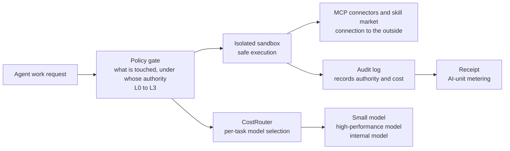

SAP's new invoice has a new line item: 'AI units.' It is one word, but the way companies pay for AI changes with this line item. No longer a flat monthly subscription, it is a consumption model that drains as agents reason and work. Add the visibility into usage that comes with it, and this invoice is a different species of document from the old subscription contract. It landed in front of customers in October, alongside the new term SAP officially introduced: the 'Autonomous Enterprise.'

A slightly paradoxical pairing. The 'autonomy' of a company whose agents judge for themselves and see work through to the end comes with a receipt that has a meter on it. In the same week, Seoul's IT industry made the same point in three voices. A Samsung SDS vice president said in an interview that as agents multiply, permissions get more complex. SK AX named its business an 'enterprise AI integrated control tower.' KT set the slogan of its AX blueprint as 'use it often.'

Line up one week's headlines and the shift becomes visible. The first question about enterprise AI has moved from 'how smart is it?' to 'can it be audited, measured, and stopped?' And at the center of this paradox sits the question companies have kept postponing: when agents really do the work, where does the receipt go? This week is a special one by the standard of a single headline's worth of change. A company that has overseen corporate ledgers for more than 30 years put 'autonomy' out as a product, and in Korea, three companies spoke in the same week about how to put controls on that autonomy.

*The core concept of this post, a metered receipt with moving agents, visualized.*

## The Day the ERP Giant Changed the Invoice

The core of SiliconANGLE's reporting is a single sentence. It means 'AI on the app,' not 'AI in the app.' The Autonomous Enterprise architecture was first presented at the Sapphire event in May, and in October its two pillars, Joule Work and Joule Desktop, moved to general availability. Instead of embedding an assistant in each application, Joule reads intent and performs work across both SAP and non-SAP apps.

Behind it lies a 'secret weapon': a structured knowledge graph built from the ERP's data, processes, policies, and relationships. Finance, supply chain, spend, workforce, customer experience. Domain-specific autonomous agents are expanding in each of these areas, and SAP is turning the fact that generic models struggle to reproduce this knowledge into its competitive edge. At the same time, it holds to the principle that humans remain in the loop to ensure governance, audit, and transparency. The controls and audits that Korea's finance and public sectors demand meet exactly at this point.

From Korea's perspective, this GA is not just a global news item. It is a signal that agent work can actually be placed on an ERP that still holds the system of record position in manufacturing, finance, and the public sector. The billing change is worth a second look here too. Moving from subscription-centric to a consumption model that drains 'AI units' makes agent inference costs visible every month. The industry is calling this a new FinOps challenge for enterprise AI operations. What SAP is selling in October is, in the end, not the capability itself but the capability with a meter attached. Salesforce and ServiceNow are pushing in the same direction with headless applications and a context layer. It is not one company's symbol, but the movement of the industry's center of gravity.

<!-- nlm-visual -->

*Infographic generated by NotebookLM from the sources.*

## Three Voices from Seoul

Samsung SDS said it will release 'FabriX 2.0' at the end of October and roll it out to customers in sequence by mid-November. In an interview with Etoday, Vice President Shin Gye-Young summarized the four elements of 'agent governance' as permissions, cost, security, and evaluation. The logic is simple. In a structure where agents hand work to other agents, if an agent reaches a system it has no permission for, or if permissions are traded at will, the 'control baseline' disappears.

The device brought out for this is the 'AI gateway.' Simple repetitive tasks go to small models, complex reasoning goes to high-performance models, and confidential data goes to internal models instead of external ones. It is automatic routing that cuts token cost and blocks data exfiltration paths. Skills and MCP from external agents such as ChatGPT and Gemini are also linked via API, gathered and managed in a marketplace, and keyword filters, guardrails, and red-teaming models are provided.

And demand for this governance has already begun in the public sector. Reports that public agencies such as the Legislation and Diplomacy Ministry and government24 are building AI agents directly in a no-code environment show that control is not an after-the-fact task after deployment but a prerequisite before it.

SK AX is selling the control tower itself. It manages Gemini, ChatGPT Enterprise, Claude Enterprise, and M365 Copilot together in a single environment, and controls users' permissions, access, usage history, and security policies. In May of this year, it also signed a formal service partnership with OpenAI. The 'shadow AI' that Daehan Economic's reporting highlights, the behavior of employees using external AI without a management system, has risen as a new security risk in the same context. KT goes one beat further and raises the usage-rate problem. The slogan 'use it often' itself is the recognition that the premise is not performance but frequency and habit. What KT put out alongside is a sovereign AI appliance, the NPU LLM station, for finance, public, and manufacturing customers who cannot easily send data outside. Seoul's three voices were actually looking at the same control layer from three angles. Permissions, usage, placement.

## The Flood of Models, and a Question Growing Old

Gather even just one week of model news and the flow becomes clear. According to Reuters, DeepSeek is on the verge of closing a new funding round of more than $12 billion, with battery maker CATL and Tencent taking the largest stakes. Mistral unveiled 'Mistral Large 4,' a one-trillion-parameter multimodal model, and a weight release is planned within roughly three weeks after safety testing. Reflection AI's 'Beam,' in which Nvidia has bet $800 million, is a design that activates only 23 billion of a total 501 billion parameters per task, cutting inference compute to about one quarter of equivalent open models. Free distribution of the weights and fine-tuning tools is planned for the end of this month.

There is a notable detail as well. Samsung Electronics invested 3 billion euros in Mistral in September and is now a shareholder. In a phase where open weights are pouring out, a Korean semiconductor company has put a stake in a European frontier lab.

Three new moves in one week means the question 'which model to use' is going low-resolution. Performance gaps between models are being compressed and inference unit prices are on a downward path. In such a phase, the differentiation variable a company can grasp is no longer the model but the layer above it. Which systems an agent can reach, how much it spends, and what it leaves behind. That is the body of the invoice.

## Prediction: Autonomy Is No Longer a Performance Problem, It Is an Audit Problem

Looking one to two years out, agent governance will repeat the path information security compliance went through. Just as public tenders and financial audits require 'is there an audit log' as a mandatory item, 'what data, when, and under whose permission was it reached' becomes the first question in agent operations. A company that cannot answer this question cannot even reach the decision stage of 'whether to use agents.' The higher the autonomy, the more the weight of this audit completely covers the shadow of the performance problem.

The invoice follows the same logic. The moment inference is measured in 'AI units,' 'which model is used for which task, and how much it costs' becomes a CFO's problem, not an IT department's. Overlay shadow AI and the story grows larger. AI used outside management is already spending cost and handling data somewhere, so 'AI that gets used often' in an environment without a control layer becomes not productivity but a surface for incidents. Where a meter is installed, the side that can read the meter and close the valve becomes the true supplier. SAP's and Samsung SDS's and SK AX's announcements this week are all attempts to sit in that seat.

## Putting the Paxis Lens on This Week's News

Paxis is ThakiCloud's Agent-Native Cloud. It is a formal product running as v1.1 GA. Look at this week's news through Paxis's lens and the direction is not new. Paxis built in from the start both the 'four elements of agent governance' that Samsung SDS organized and the 'human in the loop' principle that SAP emphasized. Skills, tools, policies, and audit logs are first-class resources of the same grade as workloads, not auxiliary features.

In Paxis, the level at which an agent can act autonomously is fixed in stages from L0 to L3. Before execution, a policy gate judges what can be touched and under whose authority it can be touched. Where Samsung SDS tried to block the path of confidential data flowing to external models with internal-model routing, Paxis has the policy gate perform that judgment at the structural unit level. All execution happens inside an isolated sandbox, and connection to the outside goes through MCP connectors and the skill marketplace. For customers that require sovereignty, the same workloads also run on top of on-premises K8s (ai-platform). CostRouter picks a model for each task, sending simple work to small models and heavy reasoning to high-performance models. It is the same logic as the 'AI gateway' Samsung SDS brought out this week, but in Paxis it is not a feature bolted on later; the design itself is that way. The four pains this week's news revealed: audit, permissions, safe execution, cost. Paxis is a structure where these four are pre-assembled as resources, not fitted in later.

The control flow, summarized at a glance:

SAP attached a receipt to autonomy, Samsung SDS named the four elements, and SK AX built a control tower. And the model layer is flooding out. There is one common variable hidden behind a week of news. The ability to cut a receipt. The answer Paxis offers to a company that is about to hire its first 'non-human employee' is clear.

The receipt is already on the books.

<!-- nlm-visual -->

*Infographic generated by NotebookLM from the sources.*

## References

This article was written by synthesizing the news below.

- Korea Economic, [[Three SIs, Three Takes] ③ In the era big tech has seized the cloud, what do SIs sell?](https://www.dnews.co.kr/uhtml/view.jsp?idxno=202610060808264360478)
- Reuters, [France's Mistral launches AI model it says outperforms some Chinese rivals](https://www.reuters.com/world/china/mistral-ceo-says-new-ai-model-beats-chinese-ones-some-areas-2026-10-06/)
- Etoday, [[Interview] Shin Gye-Young, Samsung SDS VP, "As agents multiply, permissions get more complex... control..."](https://www.etoday.co.kr/news/view/2632793)
- SiliconANGLE, [SAP expands Joule into an agentic work layer as Autonomous Enterprise goes live](https://siliconangle.com/2026/10/06/sap-expands-joule-into-an-agentic-work-layer-as-autonomous-enterprise-goes-live/)
- Maeil Business Newspaper, ["So what if AI performance is good? You have to use it often..." A look at KT's AX blueprint](https://www.mk.co.kr/article/12169683)
- Global Economic, ["Stopping China's open-source lead"... Nvidia-backed US 'Reflection AI,' ultra-efficient mo...](https://www.g-enews.com/view.php?ud=2026100623323126060c8c1c064d_1)
- Reuters, [DeepSeek set to net over $12 billion in new fundraising, source says](https://www.reuters.com/world/asia-pacific/deepseek-raise-least-12-billion-tencent-backed-funding-bloomberg-news-reports-2026-10-06/)
