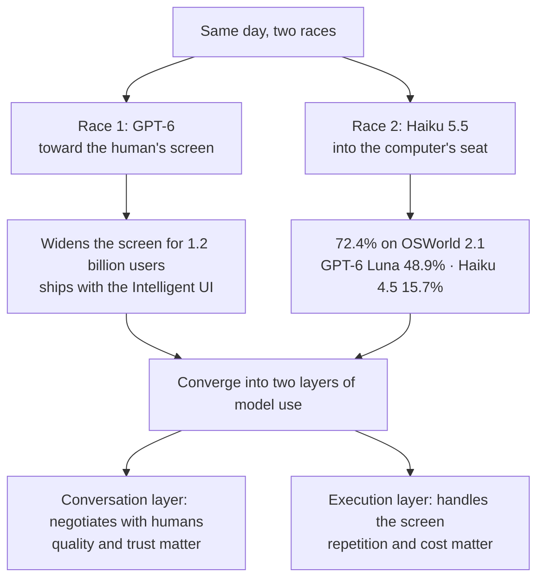

An agent's hand is cheaper than you would expect. The day GPT-6 launched to 1.2 billion people, the lead in computer-use scores quietly tilted toward the small model Claude Haiku 5.5. The signal this morning's digest points to is exactly this crossover. While the flagship's announcement filled the headlines, the baseline of agent operations moved quietly in the other direction. There is a lot of news, but it all converges on one direction. It is a setup in which the small model takes the seat at the computer while the flagship fills the human's screen. Does this crossover mark the starting point of enterprise agent operations in the second half of the year?

*A visual metaphor for the article's key idea.*

## Two launches on the same day

OpenAI announced GPT-6 and a new Intelligent UI on the same day. Subscribers to the Plus, Pro, Business, and Enterprise tiers of ChatGPT can access the model in all regions, and the launch targets 1.2 billion users. The flagship has gone toward the human's screen. Along with GPT-6, an interface called the Intelligent UI ships as a package. From OpenAI's perspective, a conversation is not completed by model performance alone. How the interaction happens on the screen is the variable that separates one user experience from another. Access across all regions, including the Enterprise tier, reads as intent to push this UI into the business domain. The battlefield of agent automation is widening from a race of model performance to a race of SaaS UI. A finished product experience, untethered from a model API, also shapes the enterprise's adoption path. The moment some of the automation built on top of a platform moves inside the provider's screen, control tends to shift to the owner of the UI.

At the same moment, the other side produced a different result. Anthropic's Claude Haiku 5.5 led OpenAI's GPT-6 Luna on every reported benchmark. The number that draws the eye is the computer use test OSWorld 2.1. The previous generation Haiku 4.5 sat at 15.7%. Haiku 5.5 recorded 72.4%, and GPT-6 Luna's score on the same test was 48.9%. The small model beat the flagship and surpassed its own previous generation. The jump from 15.7 to 72.4 in a single generation is the core of today's signal.

Set the two events side by side and the picture sharpens. GPT-6 is a launch that widens the screen for 1.2 billion people. Haiku 5.5 is a launch that turns the agent's hand into a cheap resource. GPT-6 Luna's 48.9% is still a high score. The weight of one generation moving from 15.7% to 72.4% on the same test is a different matter. Both happened on the same day, but the stories differ. One faced the screen of 1.2 billion people. The other faced the mouse and keyboard. That is why we call it two races.

## What 72.4% measures

OSWorld is a test that puts a computer in front of the model and measures whether it completes a task on a real screen. It is the place where you check whether an agent moves from the stage of talking to the stage of using its hands. Computer-use ability means the agent typing on the keyboard and moving the mouse in front of a real screen to complete a task. It covers opening a document, filling in a table, switching apps, and coming back from an error screen. It is a domain where the screen itself becomes the execution environment, without a person's help. This domain cannot be scored with text generation. It is a test you pass only by actually moving the screen.

Most of the gap between 15.7 and 72.4 lies in the segment that separates a completed task from an incomplete one. A model that handles a computer at the 70% level settles into the role of the default execution model of an agent workflow. The name that reached that line is not the flagship but Haiku. A small, fast, and cheap model takes the threshold of agent work first.

What this shift changes is the cost structure of agent operations. The expensive part of the workflow was the hand. Handling the screen and the system one action at a time required a strong model and a high cost. When a small model reaches agent-work level, the hand becomes a consumable. The flagship's seat moves its center of gravity toward the part that negotiates with a human.

Translated into the language of operations, 72.4% is more concrete. If an agent takes a screen task a hundred times, it finishes seventy-two and fails the rest. A system in which every failed case passes to a human hand does not hold. Procedures for partial completion, retry, and human handoff must be prepared together. The score of 72.4% is not a degree of completion but the starting point of repeatable execution. In segments where a hand's failure becomes the work's failure directly, a strong model is still needed. The reason for dividing into layers is here.

Model use now divides into two layers. The layer that talks with a human, and the layer that handles the screen. In conversation, quality and trust matter. On the screen, repetition and cost matter. A design that filled both layers with one model is inefficient. When the execution layer drops to a small model, the flagship can focus on the conversation layer. A structure in which more agents and longer workflows run on the same budget is built.

*A schematic of the two same-day races converging into two layers of model use.*

Evidence in the same direction sits elsewhere in the digest. The same morning, Microsoft said the Surface Laptop Ultra is up to 4.3 times faster than the latest MacBook Pro at AI image generation and cuts first-token response time by 2.1 times. Inference on local devices is speeding up fast. Google's first open multimodal embedding model powers Foresight, a macOS app that builds a knowledge graph locally without a cloud connection. Execution that does not pass through the cloud becomes a practical option for the enterprise that can decide where its data stays. The menu of models that can run an agent gets wider and cheaper.

Let me add one note. The scope of "every reported benchmark" is limited to published test results. It should not be read as the conclusion that the entire GPT-6 lineup lost to the small model. The fact this morning's digest confirms is that Haiku 5.5 leads on reported benchmarks, including OSWorld 2.1.

## The crack behind the model menu

When models that handle a computer get cheaper and spread wider, the question moves toward execution. Two news items in today's digest came from that direction.

One is a matter of dependency. Elon Musk's Grok Bot assistant hit a roadblock in its expansion strategy of leveraging external AI. The Midjourney team clearly said it would not participate in the project. Even a large assistant carries the risk of a partner getting out mid-way. In a structure that pulls in external models to fill a feature, the departure of one axis is itself a crack in quality and experience. The user feels that crack as is. As the assistant market grows, this kind of dependency becomes more common. Enterprise agent workflows are the same. If the execution environment is bound to a particular provider's UI or model, the provider's strategic change becomes your own operational risk.

The other is a matter of permission. A modified version of Zhipu AI's GLM-5.3 with its refusal mechanism removed appeared on the Venice platform. It is the first anonymous, uncensored version of GLM-5.3, accessible to anyone without authentication. Uncensored, anonymous, unauthenticated. Three conditions gathered on one model. If such a model circulates freely, control of the model leaves the provider's hands. Without a procedure to verify a model's origin and modification history, it is hard to answer for yourself which version you allowed. When a company puts such a model into an internal workflow, if there is no device to track who approved which request and what output came out, an incident is only discovered after it happens. That is the reason an allow list and audit tracking must be prepared together.

The two news items look far apart on the surface. One is the departure of a collaborator. The other is the control of distribution. But the common ground is clear. It is not how smart a model is, but who runs that model, where, and how that has risen to the axis of competition. The wider the menu, the wider the crack grows with it. The model that runs the computer, the model it depends on, the model it allows. The seat that answers these three questions is the execution environment.

## The seat that takes the wheel

Today's signal can be read through the lens of the execution environment. ThakiCloud's Paxis is an Agent-Native Cloud, and a formal product (v1.1 GA). On the day the hand becomes a consumable, would not the seat be needed first?

An agent with a computer-use score of 72.4% needs a seat to take the wheel. In Paxis, the agent is managed as a first-class resource, and those resources are Skills, Tools, Policies, and Audit Logs. Autonomy from L0 to L3 governs the range the agent can move. The policy gate checks before execution. The audit log records after execution. That a 72.4% agent handles the screen means an enterprise system sits behind that screen. It is the range the hand can reach, files, internal services, and customer data alike. When a small model handles the screen inside an isolated sandbox, what it did and with what permission is left as a record. Pre-execution policy checking slows the agent down. But that delay is also the price of shrinking the scale of an incident. As autonomy rises, policy, sandbox, and audit become premises.

On the day the menu widens, choosing a model per task becomes an operational matter. Paxis's CostRouter picks the model for each task. A strong model negotiates with the human. A small model operates the computer. A strong model for conversation, a cheap model for the screen. Within one workflow, the model splits according to the nature of the task. On a morning when model prices open up by the generation, the criterion for choosing becomes adequacy relative to cost.

MCP connectors and the skill market are the entrances that take the flow of external tools into the platform. Like Midjourney leaving Grok Bot, external dependency can wobble at any time. Managing dependency at the connector level means one axis's departure does not lead to a halt of the whole workflow.

The cases of local-device inference speeding up are also a story of the demand for data sovereignty. The Surface Laptop Ultra's numbers and Foresight's local knowledge graph point the same way. Paxis's sovereign on-premises K8s deployment, ai-platform, answers this demand in infrastructure. It keeps the agent and the data inside the enterprise. The boundary the Venice article asked about, that seat is already held by ai-platform.

## The day the two races share one track

The two races ultimately run on one track. The flagship takes the human's screen. The small model takes the agent's hand. The enterprise has no choice between the two. It chooses the execution environment that runs both together. And that execution environment gains criteria. Is it safe, is it cheap, is it audited? An environment that cannot answer the three questions loses competitiveness at the next model price cut. Computer-use scores will keep rising. As the score rises, the importance of the seat rises with it.

The point of contention moves from which model is smart to which environment runs safely and cheaply. The 72.4% small model is an asset only when it is wrapped in policy and audit. On a morning when the hand is cheap, the value of the seat showed itself.

Humans to GPT-6, computers to Haiku. A morning when the direction of the two races has become clear.

## References

This post was written by synthesizing the news below.

- HuggingNews, [Microsoft's Surface Laptop Ultra Beats Apple M5 in AI Speed](https://huggingnews.com/ai/microsofts-surface-laptop-ultra-beats-apple-m5-in-ai-speed-cbb46d6f)
- HuggingNews, [Venice Launches First Anonymous Uncensored Version of GLM-5.3 AI](https://huggingnews.com/ai/update-venice-launches-first-anonymous-uncensored-version-of-glm-53-ai-ccf960f5)
- HuggingNews, [Anthropic Haiku 5.5 Beats GPT-6 Luna on Every Reported Benchmark](https://huggingnews.com/ai/anthropic-haiku-55-beats-gpt-6-luna-on-every-reported-benchmark-61342a25)
- HuggingNews, [OpenAI Launches GPT-6 and Interactive UI for 1.2 Billion Users](https://huggingnews.com/ai/openai-launches-gpt-6-and-interactive-ui-for-12-billion-users-7509c9a8)
- HuggingNews, [Google's First Open Multimodal Embedding Model Powers Local Foresight App](https://huggingnews.com/ai/update-googles-first-open-multimodal-embedding-model-powers-local-foresi-ca476f11)
- HuggingNews, [Midjourney Denies Participation in Musk's Grok Bot Expansion](https://huggingnews.com/ai/midjourney-denies-participation-in-musks-grok-bot-expansion-568adf89)
