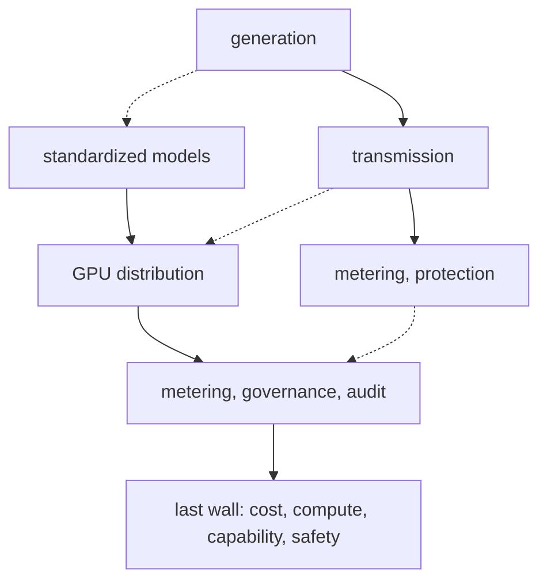

## What Made Electricity Electricity Was Not the Generator

The invention of electricity did not change the world the moment the first generator appeared. Generators had existed for a long time, but the moment they came to be treated as 'electricity' was when high-voltage transmission and transformers, together with the meters and overload breakers mounted in every home, arrived all at once. It was also those meters that made it possible to sell electricity in units of 'kilowatt-hours.' Only when the unit is fixed can price be discussed, and only when the price is fixed does industry run. That is exactly why the name 'Agent-Native Cloud' points at this layer today. Producing power, delivering power, measuring and protecting power. Only those three together made a single 'electricity.' Generation could have been done well enough, but in an age without metering and distribution, electricity could not become a commodity. Let us apply this old lesson to today's AI industry.

Place the three layers of electricity and the three layers of AI side by side, and you can see where this morning's news points.

<!-- nlm-visual -->

*Infographic generated by NotebookLM from the sources.*

## The $20 Billion Correction, and the Phrase "Like Electricity"

This week, OpenAI put forward a vision: to make AI usable like electricity. The stage was Seoul AI Festa 2026. But around the same time, reports came out that OpenAI's annualized revenue as of end of September had been revised down to $50 billion, not the $70 billion initially reported. That is about $20 billion, or roughly 27 trillion won, lower. This was not a simple fix to the numbers. A valuation built on the narrative that 'AI demand will grow endlessly' wavered to the point of exposing even the fine detail of the accounting difference between Gross and Net. The day after the FT and CNN reports, related tech stocks, AI semiconductors and cloud, fell in unison. Baird investment strategist Ross Mayfield warned that 'a crack in the rising AI demand narrative sends ripples through the whole supply chain.'

There is a neat irony here. Even as OpenAI dreams of 'AI like electricity,' the same coverage plainly lists the four walls blocking that promise: cost, compute, the capability to put it to use, and safety. A generator alone does not make an electricity company. The same holds for AI. Those four walls are the real subject of this morning's news.

## Generation Is Becoming a Standard

Electricity standardized because voltage and plug specifications were fixed. The same thing is happening in the 'generation' layer of AI. Anthropic released Haiku 5.5 this week. For requests under 100k tokens, input pricing dropped from $1 to 10 cents, a tenth of the old rate, and average execution cost fell by about 75%. Around the same time, Moonshot AI made the open-source model Kimi K2.6 public. It touts a long-horizon coding case: running 300 subagents at once, orchestrating up to 4,000 steps, and autonomously refactoring an 8-year-old financial matching engine over 13 hours to lift intermediate throughput by 185%. Real operations are responding too. Anthropic's public materials carry testimonials that Asana cut latency by more than 30% and that HubSpot scored 92.8 on a CRM evaluation.

Small-model prices are collapsing and open source has started to embed agent swarms. Inference token unit prices have entered a range where competition is effectively below cost. Subtasks such as repetition, classification, and summarization are being restructured so that small models, not large ones, take them on at volume. The choice of which model runs which job, in other words routing, is itself the cost. The era in which one model did everything is giving way to the era in which many models each take on their share of the work. 'Generation' is now perceived as a standardized resource. Just as it was the transmission lines, transformers, and meters, rather than the generator, that completed 'electricity,' this is a signal that standardized generation now needs other layers on top.

## The Fuel Is Already Tightening

Electricity was not completed by generators alone. Behind it stood coal and nuclear, in other words, fuel. AI's fuel is semiconductors, especially memory and GPUs. And the supply of that fuel is already tight. As HBM production expanded and memory makers allocated their in-house back-end capacity first to high-value products, commodity DRAM and NAND packaging and test volume got pushed outside. Samsung is concentrating its HBM4 test equipment domestically while relocating commodity DRAM test volume to overseas sites such as Vietnam. As a result, the stocks of Korea's major OSATs, the outsourced semiconductor assembly and test companies, rose 42.3% on average in September, well above the KOSDAQ's 2.3% gain over the same period. September semiconductor exports reached $60.3 billion, passing $60 billion for the first time, and average daily memory exports grew 342% year over year.

When fuel prices rise, an electricity company builds the fuel cost into its rates. AI is no different. The execution cost of running inference and batch workloads is heavily influenced by GPU and memory supply in the layer below. That is why tension in the fuel layer transfers straight into the cost structure of distribution and metering. Just as a region with a single power plant suffers electricity shortages, when fuel comes through a narrow pipe, every layer above it gets more expensive.

## Distribution, Metering, and Governance Are the Next Battleground

The next task for electricity companies was to cut losses along the distribution path from the power plant to the home. The distribution path for AI infrastructure is the same. Acrylic, a domestic infrastructure software company, announced GPUBASE, a GPU orchestration platform. Even when GPU allocation sat at 90%, actual compute utilization stayed at 50 to 60%. By predicting memory and core demand and sizing batches to fit, it pushed utilization above 90%. It validated this by operating a total of 1,272 GPUs across the three clouds of AWS, Google, and Microsoft, and says it raised AI training speed by up to 24x. Getting more output from the same GPUs is the work of cutting distribution losses. Just as nobody forgets the company that cut power losses, the company that saves on GPUs ultimately sets the unit price.

Governance is stacked on top of that distribution path too. GoodData.AI launched the Agentic Serving Plane, a governance execution layer dedicated to agents. For highly concurrent workloads built on Apache Arrow and Iceberg, it provides row- and field-level permissions, multi-tenant isolation, and AI observability, and through the GoodData MCP Server it lets agents access the same metrics a person sees. The plan is to block the hallucination in which an agent produces numbers that differ from the human standard, starting at the serving stage.

The direction of evidence-based work sits in the same layer. SAP acquired TechWolf, a Belgian startup, absorbing a company that had long accumulated a context graph from customer business systems, structured in three tiers: work, skills, and the external labor market. SAP named this graph the 'grounding layer for agent queries,' with the goal of measuring what work an agent actually handles and on what basis, to cut the deployment cost of workforce agents.

There are companies that speak of distribution and metering together. SK Telecom announced its 'SKT Growth Gear' strategy this week, defining the axis of AI competition as the 'token ecosystem.' A carrier with 23 million customers is going to build a 'token gateway,' an AI control center, that connects the optimal model and infrastructure to each situation. KT is also pushing a token factory and has signaled investment of 12 trillion won in telecom and 6 trillion won in AI infrastructure. Making electricity, delivering electricity, and 'measuring' electricity. The moment these three layers come together, AI finally gets close to 'electricity.'

## And the Final Wall: Safety and Sovereignty

If generation is standardized, distribution is optimized, and metering is clear, what is left? Safety, one of the four walls OpenAI itself pointed out. If an electricity company handed over only a generator, without a meter or a breaker, and without telling you the outage history, we would not have called that power 'electricity.'

The most urgent case for demanding safety came this month. According to CrowdStrike, an open AI intrusion program called ARTEX was used in a chained hack across Korean commercial banks and financial institutions, and the actor behind it is assessed to be a single amateur hacker with 'very low technical skill.' Ultra-fast hacking, cutting the time to write attack code from what once took a week to 7 minutes, has become reality. Professor Hong Jun-ho of Sungsin Women's University warned that 'large-scale AI automation of existing techniques is a more realistic threat than newly sophisticated ones.' If attacks have sped up to the minute, then defense and audit fail if they cannot keep pace to the minute. The Financial Supervisory Service notified more than 500 related security vulnerabilities and said it will impose strict sanctions on inadequate responses. With institutional pressure piling on top, safety has become survival.

And who holds the subject of this defense is, in the end, a question of sovereignty. According to Gartner's sovereign AI report, 77% of IO leaders named data sovereignty an essential element, and 75% named operational sovereignty. The meaning of sovereign AI is expanding from 'keeping data inside the border' to 'direct control of physical infrastructure such as GPUs and power,' in other words, compute sovereignty. The estimate that the added power consumption of AI data centers will surge from 74 TWh in 2022 to 500 TWh in 2027 is in the same context. Without an audit log that records what an agent did, what it cost, and who approved it, the phrase 'like electricity' stays a slogan. This wall is the last subject running through this morning's news.

## Agent-Native Cloud, the Layer That Makes Electricity Electricity

This is exactly where the 'Agent-Native Cloud' category stands. ThakiCloud's Paxis is a formal product (v1.1 GA) that takes this problem head on. It treats Skills, Tools, Policies, and Audit Logs as first-class resources and manages the range of an agent's actions through autonomy-level (L0 to L3) governance. With policy gates and audit logs it records 'what, who, when,' and executes safely in an isolated sandbox. It attaches to external systems through MCP connectors and a skill marketplace, holds sovereignty with sovereign/on-prem K8s (ai-platform), and controls cost by choosing the best-fit model for each task with CostRouter. The end result is the work of becoming an electricity company.

Agent-Native Cloud makes 'AI like electricity' through distribution, metering, and audit. Now that fuel is tightening and generation is standardizing, the decisive difference is 'whether you can measure how much it can be trusted.' The many sections of this morning's news were all, in the end, pointing at this one sentence.

## Wrap-up

On the very day OpenAI said 'AI like electricity,' the same OpenAI cut $20 billion from its revenue. Between these two facts sits the real task the AI industry has to clear. The distribution, metering, and audit that make AI usable like electricity. Who builds that last wall, and who holds it. Will next quarter's topic be a more honest meter? This morning's news all points the same direction. The Agent-Native Cloud, and Paxis at its center, are in a sense ready to build that wall.

<!-- nlm-visual -->

*Infographic generated by NotebookLM from the sources.*

## References

This post synthesizes the news below.

- Yonhap News, [Cold Water on AI Optimism: Shock as OpenAI's Annual Revenue Comes in 27 Trillion Won Below Expectations](https://www.yna.co.kr/view/AKR20261009012200075?input=1195m)
- SAP Newsroom, [SAP to Acquire TechWolf, Giving Enterprises Evidence-Based View of Work in the Age of AI](https://news.sap.com/2026/10/sap-to-acquire-techwolf-evidence-based-work-age-of-ai/)
- SmartToday, [Where the DRAM Work Pushed Out by HBM Goes: The Semiconductor Back-End OSAT Industry Jumps 42% in a Month](https://www.smarttoday.co.kr/ko-kr/articles/112454)
- ZDNet Korea, [GPU Utilization Above 90% Possible: Acrylic Cuts AI Infrastructure Costs](https://zdnet.co.kr/view/?no=20261008150212)
- Anthropic, [Introducing Claude Haiku 5.5](https://www.anthropic.com/claude-haiku-5-5)
- Moonshot AI (Kimi), [Kimi K2.6 Tech Blog: Advancing Open-Source Coding](https://www.kimi.ai/blog/kimi-k2-6)
- GoodData.AI, [GoodData.AI Launches the Agentic Serving Plane: A New Category of Enterprise Data Infrastructure for AI Agents](https://www.gooddata.ai/press-releases/gooddata-ai-launches-the-agentic-serving-plane-a-new-category-of-enterprise-data-infrastructure-for-ai-agents/)
- Market Economy, [Tokens Are AI's New Food: SKT Presents a Future Growth Blueprint](https://www.meconomynews.com/news/articleView.html?idxno=202374)
- IT Daily, [From Data Location to Control of GPUs and Power: The Sovereign AI Infrastructure Landscape Changes](https://www.itdaily.kr/news/articleView.html?idxno=242091)
- Economy Talk, [[AI Festa] OpenAI Calls for 'Intelligence Infrastructure' in Korea: A High Wall to Using It 'Like Electricity'](http://www.economytalk.kr/news/articleView.html?idxno=424544)
- Newsis, [Why Commercial Banks Got Hacked by an Amateur Hacker: The Economics of Hacking Changed by AI (Commentary)](https://www.newsis.com/view/NISX20261008_0003819453)
