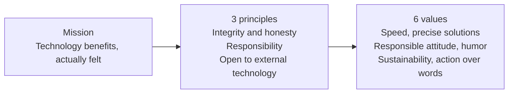

Thaki Cloud aims to contribute to society by enabling people to beneficially use the innovations brought by technology. As the company behind a Kubernetes-based AI/ML platform, we think candidates would rather check which principles we actually follow and which values we work by than read job posting copy. So this post lays out our mission, principles, and values, and points to the traces of them in our real work.

# 🎯 Mission

![Illustration of the core idea of [Thaki Cloud Life & Career] Mission, Principles, Values](/assets/images/mission-principles-values-hero.webp)
*A visual metaphor for the article's key idea.*

## 💛 We Love Our Customers

We strive to understand, anticipate, and exceed our customers' needs. Based on deep relationships, we provide practical solutions, and our mission **starts with empathy and is completed with continuous impact**.

## 😄 Enjoy the Process of Work

We believe that enjoying the journey is **the key to innovation and success**. A positive and pleasant culture stimulates creativity, encourages new challenges, and makes our team stronger.

## 🎯 Align Company Goals with Personal Growth

Our growth is achieved together. Every member's **personal and professional growth** should contribute to the company's success, and vice versa. This alignment **ensures purpose, motivation, and continuous value for all members**.

# 📌 Principles

## 🧭 Integrity and Honesty

We always act honestly and choose to do the right thing even when it's difficult. We value **long-term trust** over short-term results and maintain **transparency and integrity** in relationships with customers, partners, and colleagues.

## 💪 Responsibility

Every member takes **complete responsibility** for their actions and decisions. When problems arise, we don't avoid responsibility but step forward to solve them. The results we create reflect ourselves, and we have **pride and responsibility** for them.

## 🌍 Keep External Technology Open (Avoid NIH Syndrome)

Great technology exists outside of us too. We avoid the **"Not Invented Here"** attitude and actively embrace external ideas and solutions. What matters is not who created it, but **providing the best results to customers**.

# 🌟 Values

## ⚡ Speed

We move fast, learn fast, and improve fast. **Speed is competitiveness**, and we believe it's **better to act and adjust than to stop pursuing perfection**.

## 🧠 Precise and Swift Solutions

We clearly identify problems and solve them **accurately and swiftly**. Solving quickly doesn't mean doing it carelessly, but **identifying root causes and responding carefully**.

## 🙋 Responsible Attitude

We take **complete responsibility** for our work, decisions, and their consequences. Being a **trusted team member** means being someone who **contributes to the success of the entire team**, not just ourselves.

## 😂 Sense of Humor

We take our work seriously, but **don't take ourselves too seriously**. Humor makes us more human, connects the team, and helps us maintain resilience even in difficult moments.

## 🌱 Sustainability

We design systems, relationships, and habits to be **sustainable for the long term**. We prevent burnout and pursue **sustainable growth and choices** from a long-term perspective.

## 🔧 Action Over Words

We believe that **action is more important than words**. A culture that **shows results rather than fancy words** is how we work.

# 🔎 Where the values show up in our work

Values are only trustworthy when you can find them in actual work. A few traces you can follow in the technical blog we publish:

**Action over words.** In [our post on encoding domain knowledge as infrastructure](https://thakicloud.com/tech-blog/en/agentops/domain-knowledge-as-infrastructure/), we check the rules, skills, and unattended automations the company actually operates against measured numbers from its own repository.

**Keep external technology open.** We choose tools by the value they deliver to customers, not by where they come from. Open-source projects such as llama.cpp and Qwen are first-class topics in the blog, including how we verify every number against the model card and the original pull request before drawing a conclusion.

**Speed and precision.** They are not opposites. We share posts that read measured data carefully and separate what a number looks like from what it actually means, such as the reading that a record of a 111GB model running on a 24GB GPU is in fact a hierarchical memory design that treats 110GB of system RAM as one more tier.

**Responsibility and sharing.** We presented our xPU as a Service based Agentic AI platform at KCD Seoul 2025, and the talk materials and script are published as-is in the careers section ([KCD Seoul 2025](https://thakicloud.com/tech-blog/en/careers/conference-kcd-seoul-2025/)).

**Growth for the people we look for.** The careers section collects posts on what kind of people we hire and what growth we support, including the ten must-read books for backend and infrastructure engineers, the essential skills guide for ML engineers, and a career growth strategy beyond technical skills.

- [Backend and Infrastructure Engineer Hiring: Ten Must-Read Books](https://thakicloud.com/tech-blog/en/careers/backend-infrastructure-engineer-hiring-10-must-read-books/)
- [Essential Skills Guide for ML Engineers](https://thakicloud.com/tech-blog/en/careers/ml-engineer-essential-skills-guide/)
- [Career Growth Strategy Beyond Technical Skills](https://thakicloud.com/tech-blog/en/careers/beyond-technical-skills-career-growth-strategy-en/)

> If you would like to work with us, reach out at **info@thakicloud.co.kr**.
