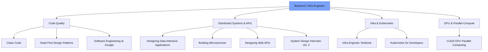

> **TL;DR**  
> **📚 Clean Code · Head First Design Patterns · Designing Data-Intensive Applications · Building Microservices · Designing Web APIs · System Design Interview Vol. 2 · Infrastructure Engineer's Textbook · Software Engineering at Google · Easy Kubernetes for Developers · CUDA-based GPU Parallel Processing**  
> If you can explain the *"content"* of **five or more** of these ten books, you're already ready to start a conversation with our team.

---

<!-- evolve-diagram -->
*Conceptual diagram*

## Why Talk About Hiring Criteria Through a 'Book List'?

We value **problem-solving attitude** and **learning depth** more than experience.  
The experience of reading a book to the end, applying it to practice, and even explaining it to colleagues proves sustainable competency in itself.  
That's why we consider the following ten books as **basic literacy for backend·infrastructure engineers**.

---

## 1. 《Clean Code》

* **Author**: Robert C. Martin  
* **Key Keywords**: Readability, Refactoring, Naming  
* **Why We Value It**  
  1. **Long-term Maintenance**: Even startups quickly develop legacy code. Clean code reduces costs.  
  2. **Team Communication**: Good naming and function division serve as documentation. Enables communication faster than words.  
  3. **Refactoring Habits**: The habit of making small improvements with test code enhances service stability.

---

## 2. 《Head First Design Patterns (2nd)》

* **Author**: Eric Freeman & Elisabeth Robson  
* **Key Keywords**: Object-oriented, SOLID, Reusability  
* **Why We Value It**  
  1. **Pattern Language**: Conversations like "Should we switch to the strategy pattern?" become possible, speeding up collaboration.  
  2. **Extensible Design**: When requirements grow, you can 'extend' code rather than 'overhaul' it.  
  3. **Visual Learning**: Pictures and interactive examples lower the learning curve.

---

## 3. 《Designing Data-Intensive Applications》

* **Author**: Martin Kleppmann  
* **Key Keywords**: Distributed Systems, CAP, Event Sourcing  
* **Why We Value It**  
  1. **Scale Perspective**: Enables evidence-based decisions like "Should we add some read latency to improve consistency?"  
  2. **Data Pipelines**: Understanding CDC·stream·batch boundary conditions.  
  3. **Trade-off Thinking**: Scientifically finding the balance point between performance·stability·complexity.

---

## 4. 《Building Microservices (2nd)》

* **Author**: Sam Newman  
* **Key Keywords**: Domain Decomposition, CI/CD, Observability  
* **Why We Value It**  
  1. **Domain-Driven Decomposition**: Making evidence-based judgments on 'when' to split monoliths.  
  2. **Observability**: Reducing failure recovery time through integrated logs·metrics·tracing.  
  3. **Team Topology**: Developing the perspective to design organizational and service structures together.

---

## 5. 《Designing Web APIs》

* **Author**: Brenda Jin, Saurabh Sahni & Amir Shevat  
* **Key Keywords**: REST, OpenAPI, DX  
* **Why We Value It**  
  1. **Contract-First**: OpenAPI-based design allows all client teams to run simultaneously.  
  2. **Versioning Strategy**: Exposing new features without breaking compatibility.  
  3. **DX**: Accelerating partner onboarding through automated documentation·sandbox·example code.

---

## 6. 《System Design Interview Vol. 2》

* **Author**: Alex Xu, Sahn Lam / **Translator**: Lee Byung-jun  
* **Key Keywords**: Large-scale System Design, Interviews, Trade-offs  
* **Why We Value It**  
  1. **Problem Decomposition**: Quickly structuring requirements with flowcharts·diagrams.  
  2. **Trade-off Communication**: Persuading CAP·PACELC choices through 'words'.  
  3. **Practical Interview Sense**: Training to immediately set priorities under constraints.

---

## 7. 《Infrastructure Engineer's Textbook》

* **Author**: Sano Yutaka / **Translator**: Kim Sung-jae  
* **Key Keywords**: Server, Network, Virtualization, Operations  
* **Why We Value It**  
  1. **Full-stack Infrastructure Understanding**: Physical·virtual·cloud layers come into view at a glance.  
  2. **Operations Optimization**: Systematic approach to incident response·root cause analysis (RCA).  
  3. **MSP Perspective**: Developing multi-tenant·SLA design sensibility.

---

## 8. 《Software Engineering at Google》

* **Author**: Titus Winters, Tom Manshreck, Hyrum Wright / **Translator**: 개앞맵시  
* **Key Keywords**: Large-scale Codebase, Review, Automation  
* **Why We Value It**  
  1. **Code Health**: Learning principles and cases of 'sustainable code'.  
  2. **Review Culture**: Presenting methods for practicing consensus-based quality management.  
  3. **Engineering Process**: Understanding the productivity tool philosophy that led from Borg → Kubernetes.

---

## 9. 《Easy Kubernetes for Developers》

* **Author**: William Denniss / **Translator**: Lee Jun  
* **Key Keywords**: Kubernetes, Deployment, Scalability  
* **Why We Value It**  
  1. **Practical Guide**: Kubernetes objects and YAML writing become 'immediately' familiar.  
  2. **Operations Automation**: Building stable services with rolling updates·health checks·HPA.  
  3. **Cloud-Native Thinking**: Naturally acquiring the concept of 'immutable infrastructure'.

---

## 10. 《CUDA-based GPU Parallel Processing》

* **Author**: Kim Deok-su  
* **Key Keywords**: CUDA, Parallel Programming, Optimization  
* **Why We Value It**  
  1. **Performance Sense**: Experiencing memory coalescing·thread warps through hand-coding.  
  2. **AI Infrastructure**: Directly resolving bottlenecks in large-scale model training·inference pipelines.  
  3. **GPU Architecture Understanding**: Depth that digs down to SM·Tensor Core level becomes competitive advantage.

---

## The People We're Looking For

| Must-Read Book | Your Proficiency | Practical Example |
|:------|:----------:|:----------|
| Clean Code | ✅ / ❌ | Experience proposing refactoring points in internal code reviews |
| Head First Design Patterns | ✅ / ❌ | PR records applying patterns like Strategy·Observer·Decorator |
| Designing Data-Intensive Apps | ✅ / ❌ | Kafka + CDC based pipeline design·operation |
| Building Microservices | ✅ / ❌ | Building deployment pipelines for 10+ services |
| Designing Web APIs | ✅ / ❌ | OpenAPI Spec based code generation·version management |
| System Design Interview Vol. 2 | ✅ / ❌ | Experience solving large-scale system design problems for interviews |
| Infrastructure Engineer's Textbook | ✅ / ❌ | Leading on-premises → cloud migration |
| Software Engineering at Google | ✅ / ❌ | Promoting large-scale refactoring with code review·automation tools |
| Easy Kubernetes for Developers | ✅ / ❌ | Helm·GitOps based Kubernetes operations |
| CUDA-based GPU Parallel Processing | ✅ / ❌ | 2× acceleration of model inference with custom CUDA kernels |

* If you can confidently fill **six or more boxes with '✅'** in the above table, please apply!  
* We'd love to hear about cases where you've **read deeply, coded by hand, and explained to colleagues** during the interview.

---

## Application Method & Inquiries

1. Please send your resume·portfolio·GitHub link to **info@thakicloud.co.kr**.  
2. If you have **cases where you applied what you learned from books to practice**, please attach them freely in any format.  

> If you're a **colleague who's serious about learning**, we always keep our doors open.  
> We hope the underlines in six or more books will tell us your story.  
> **Let's create better code and better services together!**

---

*Thank you for reading. If you'd like to share, just "Copy Link" and you're done!*

---

<!-- evolve-refs -->
## References

- [Designing Data-Intensive Applications](https://dataintensive.net/)
- [Software Engineering at Google (free online)](https://abseil.io/resources/swe-book)
- [Building Microservices, 2nd Edition](https://samnewman.io/books/building_microservices_2nd_edition/)
- [System Design Interview (ByteByteGo)](https://bytebytego.com/)
