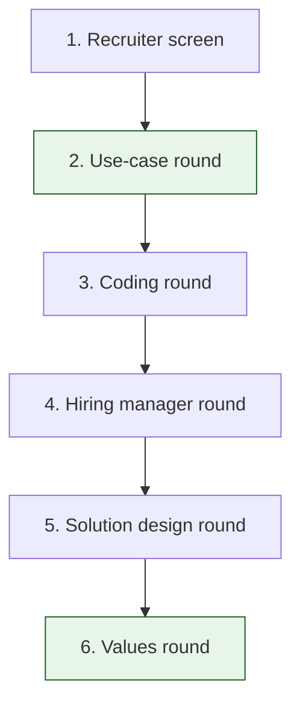

## Why read this

If you are a developer building a career as an AI infrastructure or deployment engineer, or a team lead who has to hire such people, read this guide. The bottom line up front: the 2026 Anthropic Forward Deployed Engineer (FDE) interview is not a traditional SWE loop. A 'use-case round' where you work Claude and MCP tools live forms one axis, and a 'values round' of equal weight to the technical stages is run by a non-technical interviewer. It is a concrete example of how the interview that evaluates "the engineer who deploys AI" has actually evolved.

## Overview

The 2026 Anthropic FDE interview guide posted by @avrldotdev (an image-based post, 225K views, 2,736 likes) has been circulating in the AI engineering community recently. The reason it is notable is not only that the FDE role itself is new, but that the interview structure is clearly different from the "solve an algorithm problem" coding test we know. The 2026 FDE guides from tryexponent, theforwarddeployed, and rungcode describe the same structure independently, so it is a picture corroborated across several sources rather than the bias of a single account.

FDE (Forward Deployed Engineer) is a founding-level role in the Applied AI organization, premised on a newer structure than the ordinary software engineer (SWE) loop. Because it means being "deployed" to the customer site to solve problems directly, a single interview has to compress technical skill as well as deployment, communication, and product sense.

## The six stages of the FDE interview

The interview the guide describes is composed of six stages.

Of the six, the guide singles out two as "the newest axes": the use-case round (2) and the values round (6). Those are the two stages highlighted in the diagram above.

**Use-case round = live Claude+MCP scenario.** Instead of solving a static problem set, you work a scenario that drives Claude and MCP (Model Context Protocol) tools in a live environment. Notably, it emphasizes reliability under long context. In practice, when you deploy an agent, the core skill is calling tools correctly, holding state, and handling failures across a long context; this round checks exactly that ability at the interview table.

**The coding round is an incremental exercise where constraints are added in stages.** It is CodeSignal-based, and rather than throwing all constraints at once, it adds them step by step. It is not "produce a perfect solution in one shot" but a way of seeing how you judge and extend each time a new constraint lands.

**The values round carries equal weight to the technical stages.** A non-technical interviewer runs it, with the same weighting as the technical rounds. Because FDEs go to the customer site, values, communication, and product sense are evaluated at the same level as technical skill. It makes clear this is not a loop where being good at code alone is enough.

The remaining recruiter screen, hiring manager, and solution design rounds are not very different from interviews at other companies, but the point of the structure is that these three frame the two axes highlighted above.

## What is different from the ordinary SWE loop

The core differences are two. First, the object of evaluation moves from "can you write code" to "can you deploy AI." The live Claude+MCP scenario is a device that measures, at the interview, the deployment-field skill that a static coding test cannot reproduce. Second, the technical half is only half of the whole. The moment the values round has equal weight, the interview stops being a pure technical assessment and becomes a holistic judgment of "can we put this person on a customer site."

The point the guides add in common is that FDE, as a founding-level role in the Applied AI org, has an interview loop that is not yet fully standardized and varies a lot by team. In other words, the structure below is a representative form at the 2026 mark, not a fixed answer for every team.

## Implications from a ThakiCloud view

This guide reaches ThakiCloud in three ways.

**Talent view.** AI deployment engineers compete for the same talent pool as platform engineers. The fact that the FDE interview has evolved toward "live tool use + incremental coding + equal-weight values" suggests our platform engineer interview question bank should be updated in the same direction. Static algorithm-only questions cannot measure AI deployment skill.

**Paxis view.** The 'live Claude+MCP production workflow' that the use-case round validates is exactly the area Paxis productizes through its skill harness and MCP connector. If we benchmark Paxis MCP connector scenarios against the use-case round's long-context reliability checklist, we can objectively measure "how well our platform carries what an FDE has to do in the field."

**Metis / Telox view.** It is reconfirmed that the bottleneck of enterprise AI adoption is not the model but 'FDE-type deployment talent.' When designing a PoC landing zone, how quickly you can stand up deployment people on site becomes a sales-side variable.

## Limitations and counterpoints

This is a summary of a single image-based guide cross-checked against three supporting sources. The source guide may reflect one team at one point in time, so it is hard to claim it represents all of Anthropic. Large team-to-team variance is itself a limitation the guide acknowledges. Also, the description that 'the use-case round is live Claude+MCP' is high-confidence because several sources independently describe the same structure, but this post does not guarantee the specific problem examples or grading criteria. For preparation, we recommend checking the source guide and the corroborating sources together.

## Takeaway

The direction the FDE interview shows is clear. The interview that evaluates the engineer who deploys AI has become a combined assessment of "coding + values," with live tool use (the use-case) at its center. Developers should make incremental coding, the live Claude+MCP scenario, and long-context reliability the axes of their preparation. Leads who own hiring should expand the question bank from static algorithm items toward "deployment scenarios that take constraints in stages." The sources to reference are the [tryexponent Anthropic FDE interview guide](https://www.tryexponent.com/guides/anthropic-forward-deployed-engineer-interview) and [TheForwardDeployed Anthropic interview](https://www.theforwarddeployed.io/interviews/anthropic).

---

*Source: summarized from @avrldotdev's 2026 Anthropic FDE interview guide (tweet image), cross-checked against the [tryexponent](https://www.tryexponent.com/guides/anthropic-forward-deployed-engineer-interview), [TheForwardDeployed](https://www.theforwarddeployed.io/interviews/anthropic), and rungcode 2026 FDE guides. The structure described here is the part independently corroborated across several sources; the primary source could not be re-fetched in this session, so it is cited via the corroborating sources.*