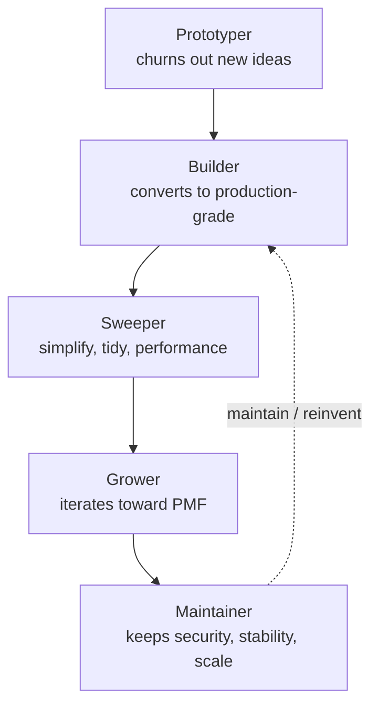
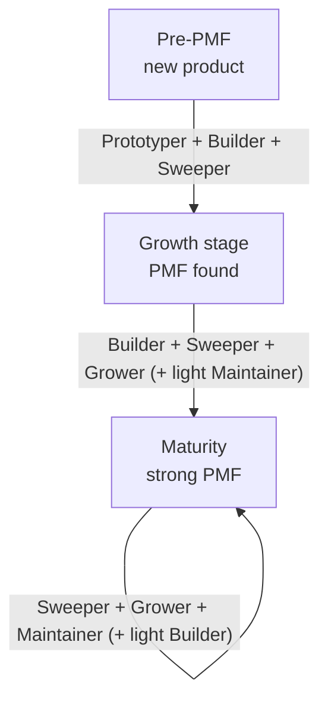

## Overview

Job titles are increasingly failing to describe the actual work. Designers shipping prototypes as code, engineers conducting user interviews, data scientists setting product direction -- none of this feels strange anymore. As AI tools absorb the mechanical layers of each discipline, the boundaries between engineering, product, design, and data analysis are melting together.

Boris Cherny, creator of Claude Code, offered an interesting observation about this shift. Looking at his own Claude Code team, he noticed five role archetypes cutting across job functions. The reason this observation matters is simple: it raises a hypothesis that future organizations may staff teams around combinations of these archetypes rather than around functional job categories.

This post unpacks what those five archetypes are, why they detach from formal job titles, and what combinations a team needs at different stages of product maturity. This is not a technical summary -- it is a culture essay asking how we should think about team composition and hiring. For organizations like ThakiCloud, where humans and agents work side by side, the question is particularly direct.

## The Five Role Archetypes

Cherny's archetypes are as follows. For each one, some notes on how it shows up in real teams.

**The Prototyper** generates entirely new ideas. This person produces a flood of concepts, most of which never ship. The value of this archetype lies not in a high success rate but in the density of imagination. Without someone who can open a new direction -- even if nine out of ten ideas get discarded -- an organization cannot push into new territory.

**The Builder** converts prototypes and ideas into production-grade products or infrastructure, quickly. This is the role that closes the distance between conception and launch. If the Prototyper is the sketch, the Builder is the one who turns that sketch into a building that actually stands.

**The Sweeper** tidies things up. Polishing messy UIs, simplifying code and systems, removing unused features, improving performance -- the Sweeper's job is subtraction, not addition. Deciding to unship a feature takes just as much courage as building one.

**The Grower** takes an existing product and iterates relentlessly to improve PMF. Rather than redesigning the whole board, this person raises conversion, reduces churn, and accumulates small improvements on top of what already exists.

**The Maintainer** owns mature systems. This archetype keeps security, stability, speed, and efficiency intact as a system scales. Not glamorous work, but without it a grown product collapses under its own weight.

## These Are Roles, Not Job Titles

The heart of this observation is not the list itself -- it is that these archetypes do not map to job functions. Cherny notes that across Anthropic, some designers fall into archetype 1 (Prototyper), others into archetype 2 (Builder), and still others into archetype 3 (Sweeper). The same is true for engineers, product managers, and data scientists.

Put differently, "we're hiring a designer" is a sentence that carries less and less information. Two designers can contribute to a team in completely different ways depending on whether they are the Prototyper type who opens new territory or the Sweeper type who refines and completes. A job title tells you what tools someone has learned; it does not tell you which moments they shine in.

Many people straddle two archetypes, and some span three. Someone who is both Prototyper and Builder is especially valuable in an early-stage startup. Someone who combines Sweeper and Maintainer becomes the backbone of a mature infrastructure team. Rather than fitting a person into a single box, it is more accurate to think about where they fall on the spectrum of these archetypes.

## Team Composition by Product Lifecycle

The real reason these archetypes are interesting is that they become a formula for staffing. Cherny argues that a healthy team needs a different archetype mix depending on product maturity.

A new product that has not yet found PMF needs people strong in Prototyper, Builder, and Sweeper (1 + 2 + 3). At this stage nobody knows what will work, so the capacity to build fast, discard fast, and keep changing direction is what counts. Filling this team with people who are primarily Maintainers means spending energy defending something that does not yet exist.

A growing product that has found PMF needs Builder, Sweeper, and Grower (2 + 3 + 4) plus a light Maintainer presence (5). Direction is established; the task now is to improve completeness and conversion while securing just enough stability to handle the expanding user base.

A mature product with strong PMF needs Sweeper, Grower, and Maintainer (3 + 4 + 5) with a sprinkling of Builder (2). The priority is keeping the system simple, improving it continuously, and protecting security and speed at scale -- with new builds only when genuinely necessary.

The practical implication of this formula is clear. When adding someone to the team, the first question should not be "do we need more engineers?" but "which archetype is missing for our current product stage?" Keep filling a mature product team with Prototypers and you will have no shortage of new ideas but nobody guarding the system. Fill a pre-PMF product team with only Maintainers and you will be in a defensive posture before there is anything worth defending.

## ThakiCloud's Take: Role Realignment in the Age of Agents

The observation that job roles are dissolving becomes sharper still in organizations where humans and agents work together. As AI agents absorb a significant share of mechanical build work, people naturally migrate toward the archetypes that are genuinely important at each product stage. The bottleneck shifts from the hands that type the code to the eye that judges which archetype is needed right now.

Paxis, ThakiCloud's Agent-Native Cloud, implements this realignment at the systems layer. Paxis treats Skills, Tools, Policies, and Audit Logs as first-class resources, selecting from over 960 skills using BM25 and executing them in isolated sandboxes. Just as Cherny describes recombining human roles to fit the product moment rather than a fixed title, Paxis dynamically assembles agent capabilities to match the task at hand rather than locking them into a fixed pipeline. A Prototyper pours out ideas, a Builder-role agent converts them to production code, and a Sweeper-role validation gate cleans up the result -- the same division of labor reproduced inside the skill harness.

On the infrastructure side, ThakiCloud's ai-platform takes on the Maintainer archetype's workload. Scheduling GPUs with Kueue, serving models with vLLM, and satisfying on-premises and sovereign requirements in a K8s-based multi-tenant environment -- this is precisely the Maintainer's job of protecting security, stability, and efficiency in a mature system. Customer organizations delegate this layer to the platform, which frees their own teams to concentrate more resources on the Prototyper and Grower ends of the spectrum.

This lens is also useful for hiring. ThakiCloud looks past the job title on a resume to ask where on the archetype spectrum a candidate actually sits. The person who fills the missing archetype for our current product stage creates the greatest leverage in the team. The question is not only "what can you do?" but "which moments are when you shine?"

## Limitations and Counterpoints

Before accepting this framework uncritically, the other side deserves a hearing. Ben Vinegar pushed back on this conversation, arguing that "people are just learning how software organizations work and mistakenly attributing the dynamics of team roles -- which have always existed -- to AI." That is a sharp counterpoint. The distinction between Prototyper and Maintainer existed long before AI, and the insight that different talent profiles are needed at different lifecycle stages is not a new one.

There are also limits to the classification itself. Like any attempt to sort people into five boxes, this framework risks oversimplifying individuals. In practice, one person moves across multiple archetypes from project to project, sometimes within a single day. Treating archetypes as fixed identities produces a harmful effect of the kind: "you're a Sweeper, so don't come to me with new ideas." This is precisely why Cherny himself emphasizes that many people move fluidly across archetypes.

Even so, the framework earns its value not from predictive power but from the language it provides. When a team can say "we're short on Growers right now" instead of the vague "we need another engineer," the conversation around hiring and team composition becomes far more concrete. The more AI strips away the mechanical layer of each role, the more what remains is judgment at the archetype level. Future product roles may end up shaped closer to these archetypes than to today's domain-specific job titles.

## Closing Thoughts

Job titles dissolving is not a crisis -- it is a restructuring. The five archetypes -- Prototyper, Builder, Sweeper, Grower, Maintainer -- show what remains when titles fall away. What remains is not a toolset but an essence: how a person contributes, and in which moments.

ThakiCloud is building an organization where humans and agents share these archetypes. The more agents take on repeatable build and maintenance work, the more humans focus on reading which archetype the product needs right now. That judgment is the rarest and most valuable capability in what comes next.

## Sources

- Boris Cherny, X(@bcherny), 2026-06-29: [Original tweet](https://x.com/bcherny/status/2071379474277613732)
- Ben Vinegar, X(@bentlegen): [Counterpoint](https://x.com/bentlegen/status/2071576459538567463)
