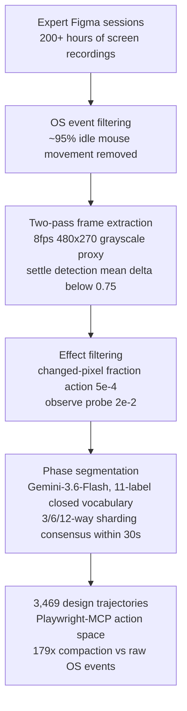

## Why read this

If you are an ML engineer building a computer-use agent that does design work in Figma, or looking for training data for one, this is the reference. FigmaTrace, open-sourced by Patronus AI on August 20, is the first computer-use dataset specialized for design: 200+ hours of expert screen recordings converted into 3,469 trajectories, released under CC-BY-4.0 so you can use it for commercial SFT as-is. The core conclusion up front: the value of this dataset is not the 3,469 trajectories themselves, but the phase-based segmentation method that turns screen recordings into trainable action sequences. In the paper's experiment, SFT on the same data cut by context length versus cut by design phase differs by 7.3 percentage points, and the phase-based cut wins.

## Overview

The data bottleneck in GUI agent research is well known. Web navigation datasets (Mind2Web, VideoGUI family) have volume, but almost no data captures the creative process of design work. Prior attempts reverse-engineered annotations from finished design files or converted HTML into Figma-compatible JSON for training. But reconstructing the process from the finished artifact drops the signal of why a designer chose that order and that element.

FigmaTrace attacks exactly that gap. Experts are recorded manipulating Figma at the OS level, and those raw events are processed into agent-training trajectories. In the dataset card's own words, the goal is to teach VLMs "the creative skills and decisions behind design work, not just the finished artifact."

This post walks through FigmaTrace's composition, the data pipeline, and the paper's benchmark results with the actual numbers, plus a ThakiCloud perspective on where it fits.

## What this dataset is

FigmaTrace is published at [PatronusAI/figmatrace](https://huggingface.co/datasets/PatronusAI/figmatrace) on Hugging Face. Size and composition:

- Raw data: 200+ hours of expert Figma screen recordings
- Trajectories: 3,469 (train 2,883 / test 586)
- Tasks: 126 long-horizon tasks across 8 designer workflow categories
- Action space: Playwright-MCP (`mouse_click`, `keyboard_type`, etc.)
- License: CC-BY-4.0, English, parquet format
- Download size: ~22 GB
- Companion artifacts: [paper PDF](https://cdn.patronus.ai/FigmaTrace.pdf), [SFT model](https://huggingface.co/PatronusAI/Qwen3.8-27B-Figmatrace-SFT), raw assets on Google Drive

The 8 workflow categories are pixel-perfect replication, responsive adaptation, theming with variables, sketch-to-Figma, flaw injection/repair, edge-content resilience, a11y remediation, and prototype wiring. Tasks like pixel-perfect replication are verifiable with clear result checks; theming and sketch-to-Figma are open-ended with no single answer. Mixing the two is by design.

### The data pipeline

The stages that turn raw screen recordings into trajectories are the identity of this dataset. Following the paper's Section 3, there are five.

The real numbers per stage:

**Action filtering.** About 95% of recorded OS-level events were idle mouse movement that changed nothing. The remaining actions are manually mapped to the Playwright-MCP action set, and in intervals where the screen changes without input (a render finishing, a plugin loading), `observe` probes are inserted every 2 seconds inside any gap longer than 4 seconds, making environment transitions first-class steps.

**Frame extraction.** Sessions run up to 4.5 hours, so extraction is two-pass. Pass one decodes the whole video at 8 fps, 480x270 grayscale. For each candidate at time t it fixes before = t-0.15s and after = the first frame in [t+0.2, t+2.0] where consecutive frames have a mean difference under 0.75 (the moment the screen settles). A fixed post-action offset does not work: menus settle in 0.25s on average while an image drop takes over a second. That pass found settle points for 5,717 of 5,718 candidates. Pass two extracts only those timestamps at full resolution.

**Effect filtering.** For each action, the changed fraction is the share of pixels whose max channel difference exceeds 6. Actions below 5e-4 are dropped as having no visible effect, while observe probes need 2e-2 to count as a scene change. This is the step that separates what the expert did from what actually changed the artifact.

**Phase segmentation.** Gemini-3.6-Flash labels the video with an 11-label closed vocabulary without seeing the action log: reference gathering, setup scaffolding, blocking layout, asset sourcing, content entry, styling typography, componentising, refinement polish, review qa, annotation handoff, navigation idle. The shard count the model returns has no principled value, so the pipeline runs 3-way, 6-way, and 12-way shardings and keeps only boundaries that at least two of them place within 30 seconds of each other.

Here is the interesting finding from the paper: segmentation quality was driven more by resolution than by the model. The strong model (Gemini-3.6-Flash) at low resolution scored Jaccard 0.244 and 21% dominant-skill agreement, while a weaker model used by prior work at full resolution scored 0.601 and 43%. At low resolution the panel and layer text is unreadable, so labels collapse to generic ones. The end result of the whole process: 179x compaction versus the raw OS events.

### Structure and schema

The actual schema, confirmed through the Hugging Face datasets-server API:

| Field | Type | Meaning |
|---|---|---|
| `session` | string | Source session identifier |
| `example_index` | int32 | Example index |
| `segment_id` | int32 | Segment within session |
| `dominant_skill` | string | Dominant skill label |
| `skills` | list[string] | Frequency-assigned skill labels |
| `phase` | string | Phase from the 11-label closed vocabulary |
| `n_steps` | int32 | Number of steps |
| `start_t` / `end_t` | float32 | Time span within the session |
| `n_actions` / `n_images` | int32 | Action and frame counts |
| `messages_json` | string | Conversational messages payload |
| `preview` | Image | Representative frame preview |
| `images` | list[Image] | Frame list |

Splits: train 2,883 examples (~18.5 GB), test 586 (~3.9 GB). Phase shares lead with componentising 21.6%, blocking layout 16.1%, refinement polish 14.8%. Structural assembly and final polish make up half of the workflow. Skill shares are dominated by structural craft 56.9% and visual perception 12.7%. Auto-layout and component hygiene are the body of Figma work.

The data producers are subject-matter experts contracted through Upwork with 2+ years of Figma experience, aged 18+, vetted on a starter task before the main recordings.

## Actual experiment results

The paper's team SFT'd four VLMs on FigmaTrace (Qwen3.6-35B-A3B, Qwen3.8-27B, Gemma4-31B, Muse-Glimmer-30B), using ms-swift, sampling 92,472 actions from 35 sessions of 47.6 hours of work. The trajectories carry no pre-annotated reasoning chains, so the models were trained without reasoning, while the closed-model comparisons ran at high reasoning effort.

Evaluation benchmarks: GUI-Odyssey, AndroidControl, Mind2Web (vp800/vp1000), VideoGUI (directed/undirected). Mostly out-of-domain environments, which tests whether a model trained on design data also gains on general GUI navigation. Table 2 of the paper, step-wise accuracy (%), reproduced:

| Model | GUI-Odyssey | AndroidControl | Mind2Web vp800 | vp1000 | VideoGUI dir | undir |
|---|---|---|---|---|---|---|
| Random baseline | 0.6 | 21.8 | 1.1 | 0.9 | 0.6 | 0.6 |
| Claude-Opus-5 | 47.3 | 87.3 | 100.0 | 75.3 | 71.3 | 40.7 |
| GPT-5.6-Sol | 44.0 | 83.2 | 91.3 | 69.7 | 77.7 | 29.6 |
| Qwen3.6-35B-A3B | 29.0 | 36.8 | 38.2 | 30.7 | 47.0 | 10.1 |
| Muse-Glimmer-30B | 29.3 | 59.3 | 64.7 | 65.3 | 64.7 | 28.7 |
| Gemma4-31B | 43.3 | 87.3 | 68.0 | 64.0 | 63.0 | 24.0 |
| Qwen3.8-27B | 44.0 | 82.7 | 69.3 | 65.3 | 65.3 | 26.0 |
| Qwen3.6-35B-A3B + SFT | 51.1 | 83.2 | 65.2 | 63.7 | 70.4 | 15.9 |
| Muse-Glimmer-30B + SFT | 53.2 | 84.5 | 70.2 | 70.1 | 73.0 | 32.8 |
| Gemma4-31B + SFT | 45.2 | 96.1 | 69.1 | 66.0 | 67.0 | 23.3 |
| **Qwen3.8-27B + SFT** | **53.7** | **99.1** | 70.7 | 68.7 | 71.3 | 19.3 |

Three points worth reading.

**First, a 27B open model beats closed models on real cells.** Qwen3.8-27B + SFT scores 53.7 on GUI-Odyssey versus Claude-Opus-5's 47.3 (6.4 pp), and 99.1 versus 87.3 on AndroidControl (11.8 pp). It also tops the four open SFT models on Mind2Web vp800 and VideoGUI directed. This is a pattern repeating across several OOD environments, not a single-benchmark fluke.

**Second, the largest single gain is 46 percentage points.** The abstract's "up to 46%" is Qwen3.6-35B-A3B on AndroidControl: 36.8 base to 83.2 after SFT, +46.4 pp. The same dataset produces very different gains depending on where the base model starts.

**Third, the in-domain result is included.** On the ScreenSpot-Pro Creative split, Qwen3.8-27B went from 29.3% base to 36.7% after SFT, +7.4 pp. Precision on clicking design-target elements itself went up.

### The phase-segmentation ablation

Same Qwen3.8-27B, same data: phase-based SFT versus maximum-length SFT, paper Table 3.

| Benchmark | Base | Phase SFT | Length SFT |
|---|---|---|---|
| GUI-Odyssey | 44.0 | **53.7** | 40.0 |
| AndroidControl | 82.7 | **99.1** | 67.3 |
| Mind2Web vp800 | 69.3 | **70.7** | 69.3 |
| Mind2Web vp1000 | 65.3 | 68.7 | **70.0** |
| VideoGUI undirected | 26.0 | 19.3 | 21.3 |
| VideoGUI directed | 65.3 | **71.3** | 70.0 |
| Mean | 58.8 | **63.8** | 56.3 |

The phase-based mean of 63.8 is 7.5 pp above the length-based 56.3, and 5.0 pp above base (58.8). The paper reports the gap as 7.3 pp absolute. Note AndroidControl: length SFT scores 67.3, below the base model's 82.7. Cutting long trajectories by length only slices mid-action, where the intent becomes unclear. Cutting at phase boundaries teaches skill-unit behavior, which is the paper's reading. The most damaged rows in AndroidControl are those that open mid-action ("Continue the work" stubs) or are undirected references to on-page coordinates.

### Why it goes up and where it leaks

The paper's RQ3 inspects by hand every item where SFT converted a base failure into a success, and finds three patterns.

1. **Element selection accuracy.** Two-thirds of the GUI-Odyssey gains are cases where the base model picked an entirely different UI element. The base median error of about 457 px converges to within about 15 px after SFT. By category, Media is +22 pp and Social +17 pp. The corrections concentrate on small targets at the bottom of the frame: share icons, video cards, chat inputs.
2. **Coordinate normalization.** The base model often emitted raw pixel coordinates instead of the norm-1000 coordinates it was post-trained on. For example, (800, 212) lands exactly on the share icon in pixel space but is 360 px off when read as norm-1000. In tall frames, raw y > 1000 overflows the viewport entirely. This happened on 10 of the 150 analyzed GUI-Odyssey items for the base model, and on zero for SFT.
3. **Decisiveness.** Every AndroidControl gain comes from an item where the base model emitted no coordinates or picked a totally wrong element. SFT always answers, and when it corrects the element choice it lands at an average of about 11 px.

The reverse inspection, items where SFT converted a base success into a failure, shows two patterns too. One is **repetition**: on Android app flows, SFT predicts essentially the same pixel two steps in a row ((331, 989) then (331, 988)) where the ground truth advances down the list. The paper reads this as an artifact of noisy actions that leaked through preprocessing. The other is **screen-center focus**, where targets in the browser chrome get abandoned in favor of content in the middle of the frame. The dataset card states both limitations explicitly.

## ThakiCloud product implications

FigmaTrace connects to both of ThakiCloud's product lines in two ways: it extends computer-use data into the design domain, and it publishes a methodology for processing long-horizon workflow data.

**Paxis lens.** Upstream of the enterprise workflows Paxis automates sits design work. Figma files are the source of product UI, and a design change moves the entire downstream dev, QA, and release flow. The design computer agent FigmaTrace demonstrates is not simple navigation but a workflow type that understands the process, which is the training data for the scenario where design ops joins Paxis's workflow automation scope. The dataset's design of learning from "the process, not the artifact" is the same philosophy as Paxis treating agent execution data (trajectories) as first-class resources.

**ai-platform (Maxis/Metis) lens.** The SFT recipe itself is a canonical experiment on the GPU stack we operate: ms-swift with context parallelization, a 27B VLM, 92,000 actions. The base model, Qwen3.8-27B, is the same model family that ThakiCloud's serving engines run. The dataset (~22 GB) and the base model (27B) fit inside a single-node experiment. But what matters here is not the model size or the data volume. It is the methodology. The same 92,472 actions cut by length score below base, while cut by phase they gain 7 pp. That is a reminder for the Maxis fine-tuning pipeline: when you ingest long-horizon execution data, "where you cut" is a primary variable of data quality. FigmaTrace's 11-label closed vocabulary and the 3-way/6-way/12-way consensus sharding are a reproducible method for defining that cut point.

## Limitations and counterarguments

The dataset and the paper both state their limitations, and the numbers contain cracks.

- **No reasoning chains.** Trajectories carry no pre-annotated reasoning, so training reasoning-trace models requires further annotation. The paper trained without reasoning and did not isolate how that choice affected performance.
- **SFT does not win every cell.** On VideoGUI undirected (open-ended navigation without direction), Qwen3.8-27B dropped from 26.0 base to 19.3 after SFT, and Gemma4-31B slid from 24.0 to 23.3. Qwen3.6-35B-A3B rose from 10.1 to 15.9 in the same cell, but from a much lower start. Where design data helps and where it leaks depends on the base model and the task type.
- **Noisy action leakage.** Repetition-click artifacts and screen-center bias are the results of noise that passed preprocessing. Models trained on this data can repeat similar behaviors, as the card states.
- **Scale.** 126 tasks, 3,469 trajectories, English-only, a single app (Figma). Compared with web-scale GUI datasets this is small, and the app diversity is zero. The OOD gains appear in environments that are still on the narrow axis of GUI navigation.
- **Sourcing of expertise.** SMEs were contracted through Upwork, and open-ended task results reflect individual preferences by design. Whose "expert standard" this is is not specified.

## Summary

One-line summary of FigmaTrace: the first public attempt to convert the design process into computer-use training data, and it proved the value in the conversion method (phase segmentation).

Three takeaways for practitioners. If you are planning a design-agent training run, CC-BY-4.0 plus a public SFT recipe (ms-swift, 92k actions, four base models) makes the cost of data sourcing and replication far lower than prior entries into the computer-use domain. If you handle long-horizon execution data, remember the ablation result first: cut by meaning units, not by length (+7.3 pp). And the fact that a 27B open model plus domain SFT beats closed frontier models on specific GUI axes adds one more line to the cost calculation for on-prem agent builds. FigmaTrace is a dataset you can cite as the evidence for that line.

## Sources

- [PatronusAI/figmatrace (Hugging Face dataset)](https://huggingface.co/datasets/PatronusAI/figmatrace) (CC-BY-4.0, parquet, train 2,883 / test 586)
- [FigmaTrace: Capturing Creative Nuances in Human Figma Design Workflows (paper PDF)](https://cdn.patronus.ai/FigmaTrace.pdf) (Deshpande, Fujinuma, Markiewicz, Bansal, Jain, Saban, Maheshwari, Kannappan. Patronus AI, 2026)
- [PatronusAI/Qwen3.8-27B-Figmatrace-SFT (SFT model)](https://huggingface.co/PatronusAI/Qwen3.8-27B-Figmatrace-SFT) (base Qwen/Qwen3.8-27B, CC-BY-4.0)
- Announcement tweet: [@anandnk24 (Anand Kannappan, co-founder and CEO of Patronus AI)](https://x.com/anandnk24/status/2090499988833107978)
- Raw assets: [Google Drive](https://drive.google.com/drive/folders/1d7NQxjiAzALu3odUQSxbT6eO9czm96Oy?usp=drive_link)